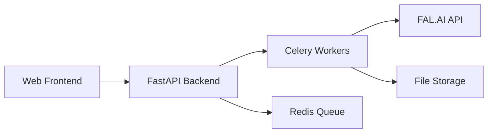

# Getting Started

> **Last Updated**: 2025-01-11  
> **Status**: Active  
> **Version**: 1.0

Welcome to image2model! This section provides everything you need to understand the project and get up and running.

## 📋 In This Section

### Core Documentation

- **[Product Requirements Document](./3d-image-prd.md)** - Complete PRD with vision, requirements, and technical specifications
- **[Data Flow Architecture](./image2model-data-flow.md)** - Comprehensive system data flow from upload to download

### Coming Soon

- **Quick Start Guide** - Get running in 5 minutes
- **Architecture Overview** - High-level system design and components
- **Technology Stack** - Overview of frameworks and tools used

## 🎯 Quick Overview

### What is image2model?

image2model is an AI-powered web application that transforms 2D images into 3D models using advanced generative AI. Users simply upload photos, and our system processes them through the FAL.AI Tripo3D API to generate downloadable 3D models.

### Key Features

- **Batch Processing**: Upload up to 25 images at once
- **Real-time Progress**: Live updates via Server-Sent Events
- **Configurable Quality**: Control model detail with face limit settings
- **Multiple Formats**: Download generated models in GLB format
- **No Account Required**: Simple, anonymous usage for MVP

### System Architecture

## 🚀 Getting Started Path

### For Developers

1. **Read the PRD** - Understand the vision and requirements
2. **Review Data Flow** - See how the system works end-to-end
3. **Set Up Locally** - Follow the [development setup guide](../06-development/setup/local-development.md)
4. **Choose Your Path**:
   - Frontend? Head to [Frontend Documentation](../02-frontend/)
   - Backend? Check out [Backend Documentation](../03-backend/)
   - DevOps? Visit [Deployment Guide](../04-deployment/)

### For AI Agents

- Start with the [Data Flow Architecture](./image2model-data-flow.md) to understand system interactions
- Review component-specific documentation in frontend/backend sections
- Check [API Reference](../03-backend/api-reference/) for endpoint details

## 📊 Project Status

### Current State (MVP)

- ✅ Core upload/process/download flow
- ✅ Real-time progress updates
- ✅ Batch processing support
- ✅ Basic error handling

### Planned Features

- 🔄 User authentication
- 🔄 Job history
- 🔄 Cloud storage integration
- 🔄 Advanced model parameters
- 🔄 3D preview in browser

## 🔗 Key Resources

### Internal Documentation

- [Frontend Architecture](../02-frontend/architecture/)
- [Backend API Reference](../03-backend/api-reference/)
- [Deployment Guide](../04-deployment/)

### External Resources

- [FAL.AI Documentation](https://fal.ai/models/tripo3d/tripo/v2.5/image-to-3d/api)
- [Project Repository](https://github.com/your-org/image2model)

## 💡 Tips for Success

### Best Practices

1. **Start Simple**: Get the basic flow working before adding features
2. **Test Often**: Use the test images in `tests/fixtures/`
3. **Monitor Logs**: Check both frontend console and backend logs
4. **Handle Errors**: Always implement proper error handling

### Common Gotchas

- API keys must be configured in `.env`
- File size limits are enforced (10MB per file)
- SSE connections require proper CORS configuration
- Redis must be running for background tasks

## 🤝 Getting Help

- Check the [Troubleshooting Guide](../07-reference/troubleshooting/common-errors.md)
- Review the [FAQ](../07-reference/troubleshooting/faq.md)
- Search existing documentation
- Open an issue if you find bugs

---

**Next Steps**: Ready to dive deeper? Check out the [Quick Start Guide](./quick-start.md) or jump into the [Architecture Overview](./architecture-overview.md).

*This section is actively maintained. Found an issue? Please submit a PR!*