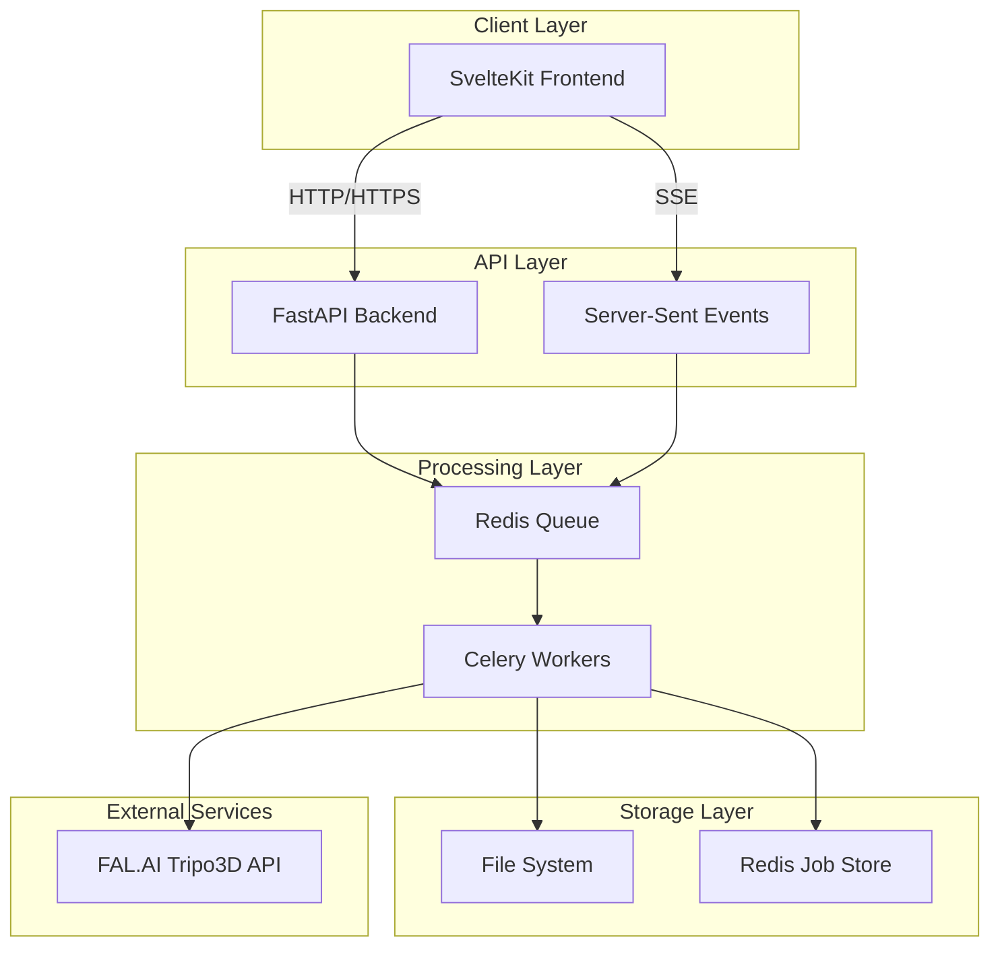

# Architecture Overview

> **Last Updated**: 2025-01-11  
> **Status**: Complete  
> **Version**: 1.0  
> **Changelog**:
> - 1.0 (2025-01-11): Initial architecture documentation created from data flow

## Overview

This document provides a comprehensive overview of the image2model system architecture, including component design, data flow patterns, and technical implementation details. The architecture is designed for scalability, reliability, and real-time user feedback.

## Table of Contents

- [System Architecture](#system-architecture)
- [Core Components](#core-components)
- [Data Flow](#data-flow)
- [API Design](#api-design)
- [Technology Stack](#technology-stack)
- [Security Architecture](#security-architecture)
- [Deployment Architecture](#deployment-architecture)
- [Performance Considerations](#performance-considerations)
- [Related Documentation](#related-documentation)

## System Architecture

### High-Level Design



### Architecture Principles

1. **Separation of Concerns**: Clear boundaries between presentation, business logic, and data layers
2. **Asynchronous Processing**: Background jobs for time-consuming operations
3. **Event-Driven Updates**: Real-time progress via Server-Sent Events
4. **Stateless API**: RESTful design with no server-side session state
5. **Scalable Workers**: Horizontal scaling of processing capacity

## Core Components

### Frontend (SvelteKit)

**Purpose**: Provide responsive, interactive user interface

**Key Features**:
- Server-side rendering for SEO and performance
- Progressive enhancement
- Real-time updates via SSE
- Drag-and-drop file uploads
- Responsive design

**Technology**: SvelteKit, TypeScript, Tailwind CSS

### Backend API (FastAPI)

**Purpose**: Handle HTTP requests, manage business logic, coordinate services

**Key Features**:
- Async request handling
- Automatic API documentation
- Request validation via Pydantic
- CORS configuration
- File upload handling

**Technology**: FastAPI, Python 3.10+, Pydantic

### Task Queue (Celery + Redis)

**Purpose**: Manage asynchronous job processing

**Key Features**:
- Distributed task execution
- Progress tracking
- Retry logic for failed tasks
- Priority queuing
- Result backend

**Technology**: Celery, Redis, Python

### File Storage

**Purpose**: Temporary storage for uploaded images and generated models

**Key Features**:
- Secure file handling
- Automatic cleanup
- Path traversal protection
- Content type validation

**Technology**: Local filesystem (MVP), S3-compatible storage (future)

## Data Flow

The application follows a three-phase process:
1. **Upload Phase**: User uploads images through the web interface
2. **Processing Phase**: Backend processes images through FAL.AI to generate 3D models
3. **Results Phase**: User downloads generated 3D model files

### Detailed Data Flow Diagram

```mermaid
flowchart TB
    subgraph "Frontend Pages"
        Upload["/upload page"]
        Processing["/processing page"]
        Results["Results view (in processing page)"]
    end

    subgraph "Frontend API Service"
        API["api.js service"]
        SSE["EventSource (SSE)"]
    end

    subgraph "Backend API Endpoints"
        UploadAPI["POST /api/v1/upload/"]
        StatusSSE["GET /api/v1/status/tasks/{task_id}/stream"]
        StatusAPI["GET /api/v1/status/tasks/{task_id}"]
        JobProgress["GET /api/v1/status/jobs/{job_id}/progress"]
        ListFiles["GET /api/v1/download/{job_id}/all"]
        DownloadFile["GET /api/v1/download/{job_id}/{filename}"]
        DirectDownload["GET /api/v1/download/direct/{filename}"]
    end

    subgraph "Backend Services"
        Celery["Celery Worker"]
        Redis["Redis (Task Queue)"]
        JobStore["Job Store (Redis)"]
        FileSystem["File System"]
        FAL["FAL.AI Tripo3D API"]
    end

    subgraph "Error Handling"
        FileValidation["File Validation Error"]
        ProcessingError["Processing Error"]
        NetworkError["Network Error"]
        AuthError["Auth Error"]
    end

    %% Upload Flow
    Upload -->|"1. Select files + face limit"| API
    API -->|"2. FormData with files[]"| UploadAPI
    API -->|"2a. Single file upload"| UploadImageAPI
    
    UploadAPI -->|"3. Validate files"| FileValidation
    FileValidation -->|"Invalid"| Upload
    FileValidation -->|"Valid"| FileSystem
    
    UploadAPI -->|"4. Create Celery task"| Celery
    Celery -->|"5. Queue task"| Redis
    
    UploadAPI -->|"6. Return task_id, job_id"| API
    API -->|"7. Navigate with taskId"| Processing

    %% Processing Flow
    Processing -->|"8. Create SSE connection"| SSE
    SSE -->|"9. Subscribe to updates"| StatusSSE
    
    StatusSSE -->|"10. Poll task status"| Redis
    Redis -->|"11. Task state updates"| StatusSSE
    
    Celery -->|"12. Process images"| FAL
    FAL -->|"13. Generate 3D models"| FAL
    FAL -->|"14. Return model URLs"| Celery
    
    Celery -->|"15. Update progress"| Redis
    Celery -->|"16. Store results"| JobStore
    
    StatusSSE -->|"17. Stream progress events"| SSE
    SSE -->|"18. Update UI progress"| Processing
    
    %% Completion & Results Flow
    StatusSSE -->|"19. task_completed event"| SSE
    SSE -->|"20. Trigger completion"| Processing
    Processing -->|"21. Fetch files"| API
    API -->|"22. GET request"| ListFiles
    
    ListFiles -->|"23. Check JobStore"| JobStore
    JobStore -->|"24. Return FAL.AI URLs"| ListFiles
    ListFiles -->|"24a. Fallback to filesystem"| FileSystem
    
    ListFiles -->|"25. Return file list"| API
    API -->|"26. Display results"| Results
    
    %% Download Flow
    Results -->|"27. Click download"| API
    API -->|"28. Direct FAL.AI URL"| FAL
    API -->|"28a. Local download"| DownloadFile
    DownloadFile --> FileSystem
    
    %% Error Flows
    Celery -->|"Task failure"| ProcessingError
    ProcessingError --> Redis
    StatusSSE -->|"task_failed event"| SSE
    SSE -->|"Show error"| Processing
    
    FAL -->|"API error"| NetworkError
    NetworkError --> Celery
    
    UploadAPI -->|"Auth check"| AuthError
    AuthError -->|"403 Forbidden"| Upload

    %% Styling
    classDef frontend fill:#e3f2fd,stroke:#1976d2,stroke-width:2px
    classDef backend fill:#fff3e0,stroke:#f57c00,stroke-width:2px
    classDef external fill:#f3e5f5,stroke:#7b1fa2,stroke-width:2px
    classDef error fill:#ffebee,stroke:#c62828,stroke-width:2px
    classDef storage fill:#e8f5e9,stroke:#388e3c,stroke-width:2px
    
    class Upload,Processing,Results,API,SSE frontend
    class UploadAPI,UploadImageAPI,StatusSSE,StatusAPI,JobProgress,ListFiles,DownloadFile,DirectDownload,Celery backend
    class FAL external
    class FileValidation,ProcessingError,NetworkError,AuthError error
    class Redis,JobStore,FileSystem storage
```



## API Design

### RESTful Endpoints

The API follows RESTful principles with clear resource-based URLs and appropriate HTTP methods.

| Resource | Method | Endpoint | Purpose |
|----------|---------|----------|---------|
| Upload | POST | `/api/v1/upload/` | Batch upload images |
| Task Status | GET | `/api/v1/status/tasks/{task_id}` | Get task status |
| Task Stream | GET | `/api/v1/status/tasks/{task_id}/stream` | SSE progress stream |
| Job Progress | GET | `/api/v1/status/jobs/{job_id}/progress` | Job-level progress |
| Downloads | GET | `/api/v1/download/{job_id}/all` | List downloadable files |
| Download | GET | `/api/v1/download/{job_id}/{filename}` | Download specific file |

### Request/Response Patterns

**Upload Request**:
```http
POST /api/v1/upload/
Content-Type: multipart/form-data

face_limit: 10000
files: [image1.jpg, image2.png, ...]
```

**Upload Response**:
```json
{
  "task_id": "550e8400-e29b-41d4-a716-446655440000",
  "job_id": "job_123456",
  "message": "Processing 5 files"
}
```

**SSE Progress Events**:
```
event: progress
data: {"current": 2, "total": 5, "status": "processing", "message": "Processing image2.jpg"}

event: task_completed
data: {"job_id": "job_123456", "successful": 5, "failed": 0}
```

## Technology Stack

### Frontend Technologies
- **Framework**: SvelteKit 2.0
- **Language**: TypeScript
- **Styling**: Tailwind CSS
- **Build Tool**: Vite
- **Package Manager**: npm

### Backend Technologies
- **Framework**: FastAPI
- **Language**: Python 3.10+
- **Task Queue**: Celery
- **Message Broker**: Redis
- **ASGI Server**: Uvicorn

### Infrastructure
- **Container**: Docker & Docker Compose
- **Reverse Proxy**: Nginx
- **Process Manager**: Supervisor (production)

### External Services
- **3D Generation**: FAL.AI Tripo3D API
- **Monitoring**: Application logs (future: OpenTelemetry)

## Security Architecture

### Authentication & Authorization
- API key-based authentication (MVP)
- Environment variable for API keys
- Future: JWT tokens for user sessions

### Input Validation
- File type validation (JPEG, PNG only)
- File size limits (10MB per file)
- Filename sanitization
- Path traversal prevention

### Data Protection
- HTTPS in production
- Secure headers (HSTS, CSP, etc.)
- CORS configuration for SSE
- No sensitive data in logs

## Deployment Architecture

### Development Environment
```yaml
services:
  frontend:
    - Port: 5173
    - Hot reload enabled
  backend:
    - Port: 8000
    - Auto-reload enabled
  redis:
    - Port: 6379
  celery:
    - Concurrency: 4
```

### Production Environment
```yaml
services:
  nginx:
    - Port: 80/443
    - SSL termination
    - Load balancing
  frontend:
    - Multiple instances
    - Static asset caching
  backend:
    - Gunicorn with Uvicorn workers
    - Horizontal scaling
  celery:
    - Multiple worker nodes
    - Autoscaling based on queue depth
```

## Performance Considerations

### Frontend Performance
- Server-side rendering for initial load
- Lazy loading for images
- Code splitting by route
- Optimized bundle size

### Backend Performance
- Async request handling
- Connection pooling
- Redis caching for job results
- Efficient file streaming

### Scalability Patterns
- Horizontal scaling of workers
- Queue-based load leveling
- Stateless API design
- CDN for static assets (future)

## Best Practices

### ✅ DO
- Use type hints in Python code
- Implement proper error handling
- Log meaningful events
- Write tests for critical paths
- Document API changes

### ❌ DON'T
- Store sensitive data in code
- Block the event loop
- Ignore error boundaries
- Skip input validation
- Bypass security checks

## Troubleshooting

### Common Issues

#### Issue: SSE connection drops frequently
**Cause**: Proxy timeout or network interruption
**Solution**: Configure proxy timeouts, implement reconnection logic

#### Issue: File uploads fail silently
**Cause**: File size exceeds limit or invalid type
**Solution**: Check client and server validation, review error logs

## Related Documentation

- [Quick Start Guide](./quick-start.md) - Get up and running quickly
- [Product Requirements](./3d-image-mvp-prd.md) - Business context
- [API Reference](../03-backend/api-reference/) - Detailed endpoint docs
- [Deployment Guide](../04-deployment/) - Production setup