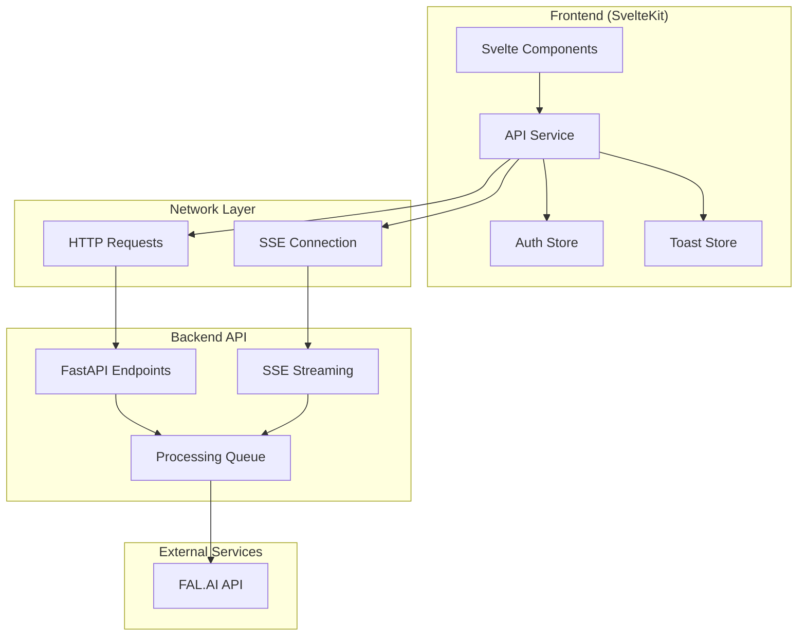

# API Service

> **Last Updated**: 2025-01-11  
> **Status**: Complete  
> **Version**: 1.0

## Overview

The API Service is the central hub for all backend communication in the image2model SvelteKit application. It provides a unified interface for file uploads, processing status tracking via Server-Sent Events (SSE), and result downloads. This service handles authentication, error management, and includes retry logic for resilient operations.

## Table of Contents

- [Key Concepts](#key-concepts)
- [Architecture](#architecture)
- [Implementation](#implementation)
- [Usage Examples](#usage-examples)
- [API Reference](#api-reference)
- [Best Practices](#best-practices)
- [Troubleshooting](#troubleshooting)
- [Related Documentation](#related-documentation)

## Key Concepts

**API Service**: A singleton class that manages all HTTP requests to the backend API, including authentication, error handling, and response processing.

**Server-Sent Events (SSE)**: A web technology that allows the server to push real-time updates to the client over a single HTTP connection.

**Batch Processing**: The ability to upload multiple files simultaneously and track their collective processing status.

**Retry Logic**: Automatic retry mechanism with exponential backoff for failed API requests.

**External URL Detection**: Identifies when resources are hosted on external services (like FAL.AI) versus local backend.

## Architecture

### System Design



### File Structure

```
frontend-svelte/src/lib/
├── services/
│   └── api.js          # Main API service implementation
└── stores/
    ├── auth.js         # API key management
    └── toast.js        # User notifications
```

## Implementation

### Technical Details

The API service is implemented as a JavaScript class with the following key features:

1. **Singleton Pattern**: A single instance is created and exported for use across the application
2. **Environment Configuration**: Uses environment variables for API base URL with localhost fallback
3. **Authentication**: Bearer token authentication using API keys from the auth store
4. **Error Handling**: Centralized error processing with detailed error messages
5. **Timeout Management**: Default 60-second timeout for standard requests

### Configuration

| Option | Type | Default | Description |
|--------|------|---------|-------------|
| `API_BASE` | string | `http://localhost:8000/api/v1` | Base URL for API endpoints |
| `DEFAULT_TIMEOUT` | number | `60000` | Request timeout in milliseconds |
| `API_KEY` | string | `null` | Authentication token set via environment or auth store |

## Usage Examples

### Basic Usage

```javascript
// File: src/routes/upload/+page.svelte
import api from '$lib/services/api';
import { apiKey } from '$lib/stores/auth';

// Ensure API key is set
api.setApiKey($apiKey);

// Upload files
const files = [file1, file2, file3];
const result = await api.uploadBatch(files, 10000); // 10k face limit

if (result.success) {
  console.log('Batch ID:', result.batchId);
  console.log('Task ID:', result.taskId);
}
```

### Advanced Usage

```javascript
// File: src/routes/processing/+page.svelte
import api from '$lib/services/api';

// Create SSE connection for real-time updates
const stream = api.createProgressStream(taskId, {
  onProgress: (data) => {
    console.log('Progress:', data.progress, '%');
    updateProgressBar(data.progress);
  },
  onComplete: async (data) => {
    console.log('Processing complete!');
    // Fetch completed files
    const files = await api.getJobFiles(data.job_id);
    displayResults(files);
  },
  onError: (error) => {
    console.error('Processing failed:', error);
    showErrorMessage(error);
  }
});

// Clean up when component is destroyed
onDestroy(() => {
  stream.close();
});
```

### Retry Logic Example

```javascript
// File: src/lib/services/api-utils.js
// Using the built-in retry mechanism
const result = await api.retryOperation(
  async () => api.uploadBatch(files, faceLimit),
  3,    // max retries
  1000  // initial backoff in ms
);

// The retry operation will:
// 1st attempt: immediate
// 2nd attempt: wait 1 second
// 3rd attempt: wait 2 seconds (exponential backoff)
```

## API Reference

### Methods

#### `constructor(apiKey = null)`

**Description**: Creates a new API service instance

**Parameters**:
- `apiKey` (string): Optional. Initial API key for authentication

**Example**:
```javascript
const apiService = new APIService('your-api-key');
```

#### `setApiKey(apiKey)`

**Description**: Updates the API key after initialization

**Parameters**:
- `apiKey` (string): The authentication token

**Returns**: void

**Example**:
```javascript
api.setApiKey(newApiKey);
```

#### `uploadBatch(files, faceLimit = null)`

**Description**: Uploads multiple files for 3D model generation

**Parameters**:
- `files` (Array): Array of File objects or file wrapper objects
- `faceLimit` (number|null): Optional. Maximum faces for generated models. Pass null for auto-detection

**Returns**: Object - Upload result with success status and identifiers
```javascript
{
  success: boolean,
  batchId: string,
  taskId: string,
  jobId: string,
  fileCount: number,
  error?: string  // Only present if success is false
}
```

**Example**:
```javascript
const result = await api.uploadBatch([file1, file2], 5000);
if (result.success) {
  navigate(`/processing?taskId=${result.taskId}`);
}
```

#### `createProgressStream(taskId, callbacks)`

**Description**: Establishes SSE connection for real-time processing updates

**Parameters**:
- `taskId` (string): The task identifier from upload
- `callbacks` (Object): Event handlers
  - `onProgress`: Function called with progress updates
  - `onComplete`: Function called when processing completes
  - `onError`: Function called on errors
  - `onFileUpdate`: Function called for individual file updates
  - `onTaskUpdate`: Function called for any task state change

**Returns**: Object - Stream control object
```javascript
{
  close: Function,      // Close the SSE connection
  readyState: Function, // Get connection state
  eventSource: EventSource // Raw EventSource object
}
```

**Example**:
```javascript
const stream = api.createProgressStream(taskId, {
  onProgress: (data) => updateUI(data),
  onComplete: (data) => showResults(data),
  onError: (error) => handleError(error)
});
```

#### `getJobFiles(jobId)`

**Description**: Retrieves list of processed files for a completed job

**Parameters**:
- `jobId` (string): The job identifier

**Returns**: Object - File list response
```javascript
{
  success: boolean,
  files: Array<{
    filename: string,
    name: string,
    size: number,
    downloadUrl: string,
    mimeType: string,
    createdTime: string,
    rendered_image: { url: string } | null
  }>,
  totalFiles: number,
  jobId: string,
  error?: string
}
```

#### `getJobStatus(taskId)`

**Description**: Gets current status of a processing task (non-streaming)

**Parameters**:
- `taskId` (string): The task identifier

**Returns**: Object - Current task status

#### `retryOperation(operation, maxRetries = 3, backoffMs = 1000)`

**Description**: Executes an operation with automatic retry on failure

**Parameters**:
- `operation` (Function): Async function to execute
- `maxRetries` (number): Maximum retry attempts
- `backoffMs` (number): Initial backoff duration

**Returns**: Promise - Result of the operation

## Best Practices

### ✅ DO

- Always set the API key before making requests
- Use the retry mechanism for critical operations
- Clean up SSE connections in component lifecycle
- Handle both success and error cases explicitly
- Store task IDs in session storage for page refreshes

### ❌ DON'T

- Don't create multiple API service instances
- Don't forget to close SSE connections
- Don't ignore error responses
- Don't hardcode API URLs in components
- Don't store API keys in component state

## Troubleshooting

### Common Issues

#### Issue: "API key is required but not set"

**Cause**: The API service doesn't have an authentication token

**Solution**:
```javascript
// Ensure API key is loaded from auth store
import { apiKey } from '$lib/stores/auth';
import api from '$lib/services/api';

// In your component
$: if ($apiKey && api.API_KEY !== $apiKey) {
  api.setApiKey($apiKey);
}
```

#### Issue: SSE connection closes immediately

**Cause**: Authentication issues or invalid task ID

**Solution**:
```javascript
// Verify task ID exists and connection handling
if (!taskId) {
  console.error('No task ID provided');
  return;
}

const stream = api.createProgressStream(taskId, {
  onError: (error) => {
    console.error('SSE Error:', error);
    // Implement reconnection logic if needed
  }
});
```

#### Issue: File uploads timeout

**Cause**: Large files or slow connection

**Solution**:
```javascript
// For large uploads, consider increasing timeout
const customApi = new APIService();
customApi.DEFAULT_TIMEOUT = 120000; // 2 minutes

// Or use chunked uploads for very large files
```

## Related Documentation

- [SSE Handling](./sse-handling.md) - Detailed Server-Sent Events implementation
- [Error Handling](./error-handling.md) - Comprehensive error management patterns
- [Auth Store](../stores/auth-store.md) - API key management
- [API Reference](../../03-backend/api-reference/endpoints.md) - Backend API documentation