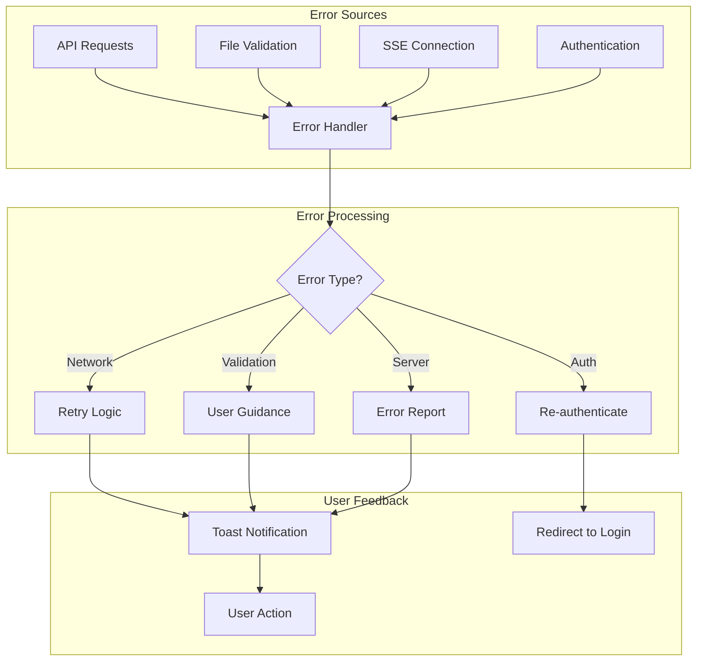
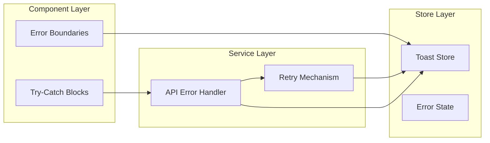

# Error Handling

> **Last Updated**: 2025-07-12  
> **Status**: Complete  
> **Version**: 1.1

## Overview

Error handling in the image2model frontend ensures a robust user experience by gracefully managing API failures, network issues, and validation errors. This document covers error patterns, recovery strategies, and user feedback mechanisms implemented throughout the SvelteKit application. Proper error handling is crucial for maintaining user trust and providing clear guidance when issues occur.

## Table of Contents

- [Key Concepts](#key-concepts)
- [Architecture](#architecture)
- [Implementation](#implementation)
- [Usage Examples](#usage-examples)
- [API Reference](#api-reference)
- [Best Practices](#best-practices)
- [Troubleshooting](#troubleshooting)
- [Related Documentation](#related-documentation)

## Key Concepts

**Error Categories**: Different types of errors requiring specific handling approaches (validation, network, server, authentication).

**Toast Notifications**: Non-blocking user feedback system for displaying error messages and other notifications.

**Retry Logic**: Automatic retry mechanisms with exponential backoff for transient failures.

**Error Recovery**: Strategies for recovering from errors without losing user data or progress.

**User Feedback**: Clear, actionable error messages that help users understand and resolve issues.

## Architecture

### Error Flow



### Error Handling Layers



## Implementation

### Technical Details

Error handling is implemented at multiple levels:

1. **API Service Level**: Centralized error processing in `handleApiError()`
2. **Component Level**: Try-catch blocks and error state management
3. **Global Level**: Toast notifications for user feedback
4. **Network Level**: Retry logic for transient failures

### Configuration

| Error Type | Retry | User Message | Recovery Action |
|------------|-------|--------------|-----------------|
| Network Timeout | Yes (3x) | "Connection timed out. Retrying..." | Automatic retry |
| 401 Unauthorized | No | "Session expired. Please refresh." | Reload page |
| 413 Payload Too Large | No | "Files too large. Maximum 10MB per file." | Remove large files |
| 429 Rate Limited | Yes (with backoff) | "Too many requests. Please wait." | Exponential backoff |
| 500 Server Error | Yes (1x) | "Server error. Please try again." | Single retry |

## Usage Examples

### Basic Usage

```javascript
// File: frontend-svelte/src/routes/upload/+page.svelte
import api from '$lib/services/api';
import { toast } from '$lib/stores/toast';

async function uploadFiles(files) {
  try {
    const result = await api.uploadBatch(files, faceLimit);
    
    if (result.success) {
      toast.success('Upload successful!');
      return result;
    } else {
      // API returned error response
      throw new Error(result.error || 'Upload failed');
    }
  } catch (error) {
    // Network or other errors
    console.error('Upload error:', error);
    toast.error(`Failed to upload: ${error.message}`);
    return null;
  }
}
```

### Advanced Usage

```javascript
// File: frontend-svelte/src/lib/services/error-handler.js
class ErrorHandler {
  constructor() {
    this.errorCounts = new Map();
    this.maxRetries = 3;
  }
  
  async handleApiCall(operation, options = {}) {
    const {
      retries = this.maxRetries,
      backoff = 1000,
      onError = null,
      errorMessage = 'Operation failed'
    } = options;
    
    let lastError;
    let attempt = 0;
    
    while (attempt < retries) {
      try {
        // Clear any previous errors
        this.clearError(operation.name);
        
        // Execute the operation
        const result = await operation();
        
        // Success - return result
        return result;
        
      } catch (error) {
        lastError = error;
        attempt++;
        
        // Log the error
        console.error(`Attempt ${attempt} failed:`, error);
        
        // Check if error is retryable
        if (!this.isRetryable(error)) {
          break;
        }
        
        // Custom error handler
        if (onError) {
          const shouldContinue = await onError(error, attempt);
          if (!shouldContinue) break;
        }
        
        // Wait before retry (exponential backoff)
        if (attempt < retries) {
          await this.wait(backoff * Math.pow(2, attempt - 1));
        }
      }
    }
    
    // All attempts failed
    this.recordError(operation.name, lastError);
    throw new Error(`${errorMessage}: ${lastError.message}`);
  }
  
  isRetryable(error) {
    // Network errors are retryable
    if (error.name === 'NetworkError' || error.code === 'ECONNREFUSED') {
      return true;
    }
    
    // Specific HTTP status codes
    const status = error.status || error.response?.status;
    if (status) {
      // Retry on server errors and rate limits
      return status >= 500 || status === 429;
    }
    
    // Timeout errors
    if (error.name === 'AbortError' || error.code === 'ETIMEDOUT') {
      return true;
    }
    
    return false;
  }
  
  wait(ms) {
    return new Promise(resolve => setTimeout(resolve, ms));
  }
  
  recordError(operation, error) {
    const count = (this.errorCounts.get(operation) || 0) + 1;
    this.errorCounts.set(operation, count);
    
    // Track persistent errors
    if (count >= 3) {
      console.error(`Operation ${operation} has failed ${count} times`);
      // Could send to error tracking service
    }
  }
  
  clearError(operation) {
    this.errorCounts.delete(operation);
  }
}

export default new ErrorHandler();
```

### File Validation Example

```javascript
// File: frontend-svelte/src/lib/utils/file-validator.js
import { toast } from '$lib/stores/toast';

export class FileValidator {
  static MAX_FILE_SIZE = 10 * 1024 * 1024; // 10MB
  static ALLOWED_TYPES = ['image/jpeg', 'image/jpg', 'image/png'];
  static MAX_FILES = 25;
  
  static validateFiles(files, existingCount = 0) {
    const errors = [];
    const validFiles = [];
    
    for (const file of files) {
      try {
        this.validateFile(file, existingCount + validFiles.length);
        validFiles.push(file);
      } catch (error) {
        errors.push({
          file: file.name,
          error: error.message
        });
      }
    }
    
    // Report errors to user
    if (errors.length > 0) {
      this.reportErrors(errors);
    }
    
    return {
      valid: validFiles,
      errors: errors,
      hasErrors: errors.length > 0
    };
  }
  
  static validateFile(file, currentCount) {
    // Check file type
    if (!this.ALLOWED_TYPES.includes(file.type)) {
      throw new Error(`Invalid file type. Only JPG and PNG files are allowed.`);
    }
    
    // Check file size
    if (file.size > this.MAX_FILE_SIZE) {
      const sizeMB = (file.size / (1024 * 1024)).toFixed(1);
      throw new Error(`File too large (${sizeMB}MB). Maximum size is 10MB.`);
    }
    
    // Check total count
    if (currentCount >= this.MAX_FILES) {
      throw new Error(`Maximum ${this.MAX_FILES} files allowed.`);
    }
    
    // Additional validation could go here
    // - Check image dimensions
    // - Verify file content matches type
    // - Check for corrupted files
  }
  
  static reportErrors(errors) {
    // Group errors by type
    const errorGroups = errors.reduce((groups, { file, error }) => {
      if (!groups[error]) {
        groups[error] = [];
      }
      groups[error].push(file);
      return groups;
    }, {});
    
    // Show grouped error messages
    Object.entries(errorGroups).forEach(([error, files]) => {
      if (files.length === 1) {
        toast.error(`${files[0]}: ${error}`);
      } else {
        toast.error(`${files.length} files: ${error}`);
      }
    });
  }
}
```

### SSE Error Handling Example

```javascript
// File: frontend-svelte/src/lib/components/ProgressTracker.svelte
<script>
import api from '$lib/services/api';
import { toast } from '$lib/stores/toast';

export let taskId;

let connectionLost = false;
let reconnectAttempts = 0;
let stream = null;

function connectWithErrorHandling() {
  try {
    stream = api.createProgressStream(taskId, {
      onProgress: handleProgress,
      onComplete: handleComplete,
      onError: handleSSEError,
      onTaskUpdate: (type, data) => {
        // Reset error state on successful communication
        connectionLost = false;
        reconnectAttempts = 0;
      }
    });
    
    // Monitor connection state
    checkConnectionHealth();
    
  } catch (error) {
    handleConnectionError(error);
  }
}

function handleSSEError(error) {
  console.error('SSE Error:', error);
  connectionLost = true;
  
  // Different handling based on error type
  if (error.includes('Connection lost')) {
    handleConnectionLoss();
  } else if (error.includes('Authentication')) {
    handleAuthError();
  } else {
    handleGenericError(error);
  }
}

function handleConnectionLoss() {
  reconnectAttempts++;
  
  if (reconnectAttempts <= 3) {
    toast.warning(`Connection lost. Reconnecting... (${reconnectAttempts}/3)`);
    
    // Exponential backoff reconnection
    setTimeout(() => {
      connectWithErrorHandling();
    }, Math.pow(2, reconnectAttempts) * 1000);
    
  } else {
    toast.error('Unable to maintain connection. Please refresh the page.');
    showManualRefreshButton = true;
  }
}

function handleAuthError() {
  toast.error('Authentication failed. Please refresh the page to continue.');
  // Could trigger re-authentication flow
}

function handleGenericError(error) {
  toast.error(`Processing error: ${error}`);
  
  // Offer alternative actions
  showErrorRecoveryOptions = true;
}

function checkConnectionHealth() {
  // Periodic health checks
  const healthInterval = setInterval(() => {
    if (stream && stream.readyState() === EventSource.CLOSED) {
      clearInterval(healthInterval);
      if (!connectionLost) {
        handleConnectionLoss();
      }
    }
  }, 5000);
}

// Cleanup
onDestroy(() => {
  if (stream) {
    stream.close();
  }
});
</script>
```

## API Reference

### Error Response Format

All API errors follow this structure:

```javascript
{
  error: string,      // Human-readable error message
  detail: string,     // Technical details (optional)
  code: string,       // Error code for programmatic handling
  status: number,     // HTTP status code
  timestamp: string,  // When the error occurred
  request_id: string  // For tracking with backend logs
}
```

### Toast Store Methods

#### `toast.error(message, duration)`

**Description**: Shows error notification

**Parameters**:
- `message` (string): Error message to display
- `duration` (number): Optional. Duration in ms (default: 8000)

**Example**:
```javascript
toast.error('Upload failed. Please try again.', 10000);
```

#### `toast.warning(message, duration)`

**Description**: Shows warning notification

**Parameters**:
- `message` (string): Warning message
- `duration` (number): Optional. Duration in ms (default: 5000)

#### `toast.info(message, duration)`

**Description**: Shows informational notification

**Parameters**:
- `message` (string): Info message
- `duration` (number): Optional. Duration in ms (default: 5000)

#### `toast.success(message, duration)`

**Description**: Shows success notification

**Parameters**:
- `message` (string): Success message
- `duration` (number): Optional. Duration in ms (default: 5000)

## Best Practices

### ✅ DO

- Provide clear, actionable error messages
- Log errors for debugging while showing user-friendly messages
- Implement retry logic for transient failures
- Validate inputs before API calls to prevent errors
- Track error patterns for improving UX
- Clean up resources (connections, listeners) on errors

### ❌ DON'T

- Don't expose technical details to users
- Don't retry non-retryable errors (like validation failures)
- Don't ignore errors or show generic messages
- Don't let errors cascade without handling
- Don't retry indefinitely without user control
- Don't lose user data due to errors

## Troubleshooting

### Common Issues

#### Issue: Users see "undefined" in error messages

**Cause**: Improper error property access

**Solution**:
```javascript
// Safe error message extraction
function getErrorMessage(error) {
  return error?.message || 
         error?.error || 
         error?.detail || 
         'An unexpected error occurred';
}

toast.error(getErrorMessage(error));
```

#### Issue: Retry logic causes infinite loops

**Cause**: Not tracking retry attempts properly

**Solution**:
```javascript
// Implement retry limit
const retryWithLimit = async (fn, maxRetries = 3) => {
  let retries = 0;
  
  while (retries < maxRetries) {
    try {
      return await fn();
    } catch (error) {
      retries++;
      if (retries >= maxRetries || !isRetryable(error)) {
        throw error;
      }
      await wait(Math.pow(2, retries) * 1000);
    }
  }
};
```

#### Issue: Lost form data after errors

**Cause**: Not preserving state during error handling

**Solution**:
```javascript
// Preserve user input
let formData = { ...initialData };

async function submitForm() {
  try {
    // Save current state
    formData = { ...getFormValues() };
    
    const result = await api.submit(formData);
    // Success handling
    
  } catch (error) {
    // Error occurred but formData is preserved
    toast.error('Submission failed. Your data has been saved.');
    // Form still shows user's input
  }
}
```

## Related Documentation

- [API Service](./api-service.md) - Main API error handling implementation
- [Toast Store](../stores/toast-store.md) - Notification system
- [Form Validation](../components/form-validation.md) - Input validation patterns
- [Backend Errors](../../03-backend/api-reference/error-codes.md) - Backend error code reference