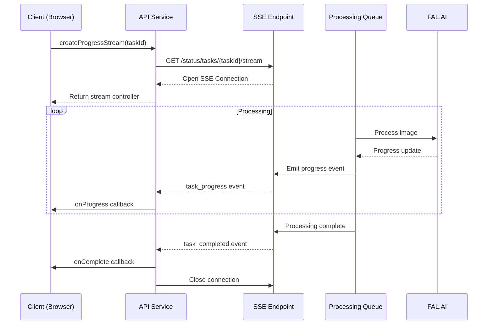
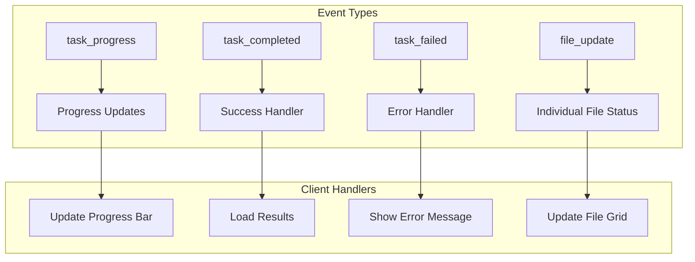

# SSE Handling

> **Last Updated**: 2025-01-11  
> **Status**: Complete  
> **Version**: 1.0

## Overview

Server-Sent Events (SSE) provide real-time, unidirectional communication from the backend to the frontend in image2model. This document covers how SSE is implemented for tracking 3D model processing progress, handling various event types, and managing connection lifecycle. SSE enables users to see live updates as their images are transformed into 3D models.

## Table of Contents

- [Key Concepts](#key-concepts)
- [Architecture](#architecture)
- [Implementation](#implementation)
- [Usage Examples](#usage-examples)
- [API Reference](#api-reference)
- [Best Practices](#best-practices)
- [Troubleshooting](#troubleshooting)
- [Related Documentation](#related-documentation)

## Key Concepts

**Server-Sent Events (SSE)**: A web standard that allows servers to push data to web pages over HTTP. Unlike WebSockets, SSE is unidirectional (server to client only).

**Event Stream**: A long-lived HTTP connection that remains open, allowing the server to send multiple events over time.

**Event Types**: Named categories of events that can be handled separately (e.g., `task_progress`, `task_completed`, `task_failed`).

**Automatic Reconnection**: Built-in browser feature that automatically reconnects if the connection is lost.

**Event Source**: The browser's EventSource API that manages the SSE connection.

## Architecture

### System Design



### Event Flow



## Implementation

### Technical Details

The SSE implementation consists of three main components:

1. **API Service Method**: `createProgressStream()` establishes and manages the connection
2. **Event Listeners**: Specific handlers for different event types
3. **Connection Management**: Lifecycle control and error handling

### Configuration

SSE connections in image2model use these settings:

| Setting | Value | Description |
|---------|-------|-------------|
| Endpoint | `/api/v1/status/tasks/{taskId}/stream` | SSE streaming endpoint |
| Reconnect | Automatic | Browser handles reconnection |
| Timeout | None | Connection stays open until closed |
| Auth | Via URL | API key may need to be in query params |

## Usage Examples

### Basic Usage

```javascript
// File: src/routes/processing/+page.svelte
import api from '$lib/services/api';
import { onDestroy } from 'svelte';

let eventSource = null;
let progress = 0;

// Connect to SSE stream
function connectToSSE(taskId) {
  const stream = api.createProgressStream(taskId, {
    onProgress: (data) => {
      progress = data.progress || 0;
      console.log(`Processing: ${progress}%`);
    },
    onComplete: (data) => {
      console.log('Processing complete!', data);
      // Navigate to results or fetch completed files
    },
    onError: (error) => {
      console.error('Processing failed:', error);
    }
  });
  
  eventSource = stream;
}

// Cleanup on component destroy
onDestroy(() => {
  if (eventSource) {
    eventSource.close();
  }
});
```

### Advanced Usage

```javascript
// File: src/lib/components/ProcessingTracker.svelte
import api from '$lib/services/api';
import { toast } from '$lib/stores/toast';

export let taskId;

let files = [];
let overallProgress = 0;
let currentFile = null;
let stream = null;

// Comprehensive SSE handling
function startTracking() {
  stream = api.createProgressStream(taskId, {
    onProgress: handleProgress,
    onFileUpdate: handleFileUpdate,
    onComplete: handleCompletion,
    onError: handleError,
    onTaskUpdate: handleTaskUpdate
  });
}

function handleProgress(data) {
  // Update overall progress
  overallProgress = Math.round(data.progress || 0);
  
  // Extract file counts
  const totalFiles = data.total_files || data.total || 0;
  const completedFiles = data.current || 0;
  
  // Update file states
  updateFileStates(completedFiles, totalFiles, data.message);
}

function handleFileUpdate(data) {
  // Handle individual file progress
  const fileIndex = files.findIndex(f => f.id === data.file_id);
  if (fileIndex !== -1) {
    files[fileIndex] = {
      ...files[fileIndex],
      status: data.status,
      progress: data.progress,
      message: data.message
    };
  }
}

function handleCompletion(data) {
  toast.success('All files processed successfully!');
  
  // Mark all files as completed
  files = files.map(f => ({
    ...f,
    status: 'completed',
    progress: 100
  }));
  
  // Close the stream
  if (stream) {
    stream.close();
  }
  
  // Trigger results loading
  loadResults(data.job_id);
}

function handleError(error) {
  toast.error(`Processing error: ${error}`);
  
  // Implement retry logic
  retryCount++;
  if (retryCount < MAX_RETRIES) {
    setTimeout(() => startTracking(), RETRY_DELAY);
  }
}

function handleTaskUpdate(type, data) {
  // Generic handler for any task update
  console.log(`Task update: ${type}`, data);
  
  switch(type) {
    case 'progress':
      updateProgressUI(data);
      break;
    case 'completed':
      showSuccessUI(data);
      break;
    case 'failed':
      showErrorUI(data);
      break;
  }
}
```

### Error Recovery Example

```javascript
// File: src/lib/services/sse-manager.js
class SSEManager {
  constructor() {
    this.connections = new Map();
    this.retryAttempts = new Map();
  }
  
  connect(taskId, callbacks) {
    // Check for existing connection
    if (this.connections.has(taskId)) {
      this.disconnect(taskId);
    }
    
    const stream = api.createProgressStream(taskId, {
      ...callbacks,
      onError: (error) => {
        // Custom error handling with retry
        this.handleError(taskId, error, callbacks);
      }
    });
    
    this.connections.set(taskId, stream);
    this.retryAttempts.set(taskId, 0);
    
    return stream;
  }
  
  handleError(taskId, error, callbacks) {
    const attempts = this.retryAttempts.get(taskId) || 0;
    
    if (attempts < 3) {
      console.log(`Retrying connection for ${taskId}, attempt ${attempts + 1}`);
      this.retryAttempts.set(taskId, attempts + 1);
      
      // Exponential backoff
      setTimeout(() => {
        this.connect(taskId, callbacks);
      }, Math.pow(2, attempts) * 1000);
    } else {
      // Max retries reached
      if (callbacks.onError) {
        callbacks.onError('Connection failed after 3 attempts');
      }
    }
  }
  
  disconnect(taskId) {
    const stream = this.connections.get(taskId);
    if (stream) {
      stream.close();
      this.connections.delete(taskId);
      this.retryAttempts.delete(taskId);
    }
  }
  
  disconnectAll() {
    this.connections.forEach((stream, taskId) => {
      this.disconnect(taskId);
    });
  }
}

export default new SSEManager();
```

## API Reference

### Event Types

#### `task_progress`

**Description**: Periodic updates on processing progress

**Data Structure**:
```javascript
{
  progress: number,      // 0-100 percentage
  current: number,       // Current file being processed
  total: number,         // Total files in batch
  total_files: number,   // Alternative total count
  message: string,       // Human-readable status
  task_id: string        // Task identifier
}
```

#### `task_completed`

**Description**: Final event when all processing is complete

**Data Structure**:
```javascript
{
  task_id: string,
  job_id: string,        // Job ID for fetching results
  result: {
    job_id: string,
    total_files: number,
    processing_time: number
  }
}
```

#### `task_failed`

**Description**: Error event when processing fails

**Data Structure**:
```javascript
{
  task_id: string,
  error: string,         // Error message
  details: object        // Additional error information
}
```

#### `file_update`

**Description**: Individual file processing updates

**Data Structure**:
```javascript
{
  file_id: string,
  filename: string,
  status: string,        // 'pending', 'processing', 'completed', 'failed'
  progress: number,
  message: string
}
```

### Stream Controller Methods

#### `close()`

**Description**: Closes the SSE connection

**Example**:
```javascript
const stream = api.createProgressStream(taskId, callbacks);
// Later...
stream.close();
```

#### `readyState()`

**Description**: Returns the current connection state

**Returns**: number - EventSource ready state
- 0: CONNECTING
- 1: OPEN
- 2: CLOSED

**Example**:
```javascript
if (stream.readyState() === EventSource.OPEN) {
  console.log('Connection is active');
}
```

## Best Practices

### ✅ DO

- Always close SSE connections when components unmount
- Implement proper error handling with user feedback
- Store stream references for lifecycle management
- Use structured event handlers for different event types
- Monitor connection state for debugging

### ❌ DON'T

- Don't create multiple connections for the same task
- Don't ignore connection errors
- Don't forget to handle all event types
- Don't rely on SSE for bidirectional communication
- Don't leave connections open indefinitely

## Troubleshooting

### Common Issues

#### Issue: SSE connection keeps reconnecting

**Cause**: Server closing connection or network issues

**Solution**:
```javascript
// Monitor reconnection attempts
let reconnectCount = 0;
const stream = api.createProgressStream(taskId, {
  onError: (error) => {
    reconnectCount++;
    if (reconnectCount > 5) {
      toast.error('Connection unstable. Please refresh the page.');
      stream.close();
    }
  }
});
```

#### Issue: No events received after connection

**Cause**: Authentication issues or invalid task ID

**Solution**:
```javascript
// Verify task exists before connecting
const status = await api.getJobStatus(taskId);
if (status.success) {
  const stream = api.createProgressStream(taskId, callbacks);
} else {
  toast.error('Invalid task ID');
}
```

#### Issue: Events arrive out of order

**Cause**: Network latency or server processing delays

**Solution**:
```javascript
// Use event sequence numbers if available
let lastSequence = 0;
const stream = api.createProgressStream(taskId, {
  onProgress: (data) => {
    if (data.sequence && data.sequence <= lastSequence) {
      return; // Skip out-of-order event
    }
    lastSequence = data.sequence || lastSequence;
    updateProgress(data);
  }
});
```

#### Issue: Memory leaks from unclosed connections

**Cause**: Not properly cleaning up event listeners

**Solution**:
```javascript
// Use Svelte lifecycle hooks
import { onMount, onDestroy } from 'svelte';

let stream;

onMount(() => {
  stream = api.createProgressStream(taskId, callbacks);
});

onDestroy(() => {
  if (stream) {
    stream.close();
    stream = null;
  }
});
```

## Related Documentation

- [API Service](./api-service.md) - Main API service implementation
- [Error Handling](./error-handling.md) - Error management patterns
- [Processing Page](../components/processing-page.md) - SSE usage in processing UI
- [Backend SSE](../../03-backend/api-reference/sse-endpoints.md) - Server-side SSE implementation