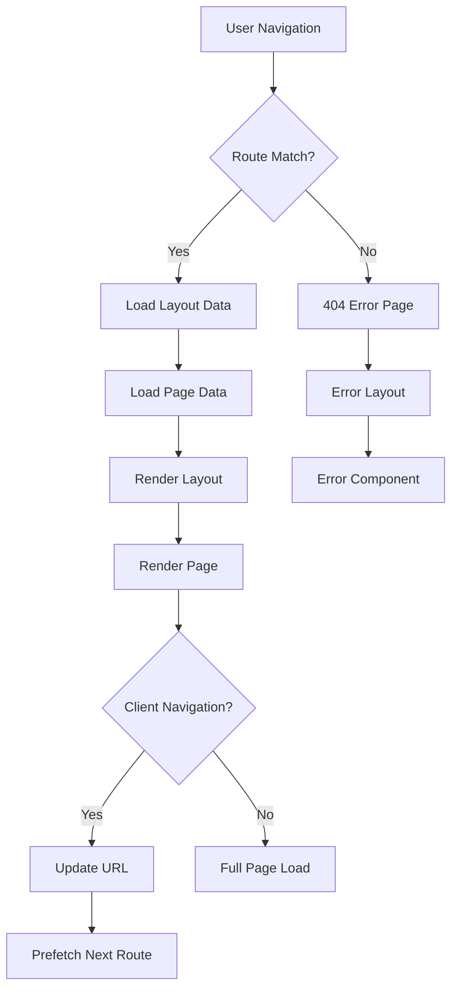

# SvelteKit Routing Patterns

> **Last Updated**: 2025-07-11  
> **Status**: Complete  
> **Version**: 1.0

## Overview

This document details the routing patterns and navigation architecture used in the image2model SvelteKit application. It covers file-based routing, dynamic routes, layouts, navigation flows, and best practices for building a seamless user experience across the 3D model generation workflow.

## Table of Contents

- [Key Concepts](#key-concepts)
- [Architecture](#architecture)
- [Implementation](#implementation)
- [Usage Examples](#usage-examples)
- [API Reference](#api-reference)
- [Best Practices](#best-practices)
- [Troubleshooting](#troubleshooting)
- [Related Documentation](#related-documentation)

## Key Concepts

**File-based Routing**: Routes are defined by the file structure in the `src/routes` directory, where each `+page.svelte` file represents a route.

**Layouts**: Shared UI and logic that wraps page content, cascading through the route hierarchy.

**Load Functions**: Server and client-side functions that fetch data before rendering components.

**Navigation**: Programmatic and declarative navigation using SvelteKit's navigation APIs.

**Route Parameters**: Dynamic segments in URLs that capture values for use in components.

## Architecture

### Routing Flow Diagram



### Route Structure

```
frontend-svelte/src/routes/
├── +layout.server.js     # Root server data loader
├── +layout.svelte        # Root layout wrapper
├── +page.svelte          # Homepage (/)
├── +error.svelte         # Error boundary
├── upload/
│   └── +page.svelte      # Upload page (/upload)
├── processing/
│   ├── +page.js          # Client-side data loader
│   └── +page.svelte      # Processing page (/processing)
├── health/
│   └── +server.js        # API endpoint (/health)
├── test-api/
│   └── +page.svelte      # API testing page
├── test-upload/
│   └── +page.svelte      # Upload testing page
└── dev/
    ├── +page.svelte      # Dev tools index
    ├── components/       # Component showcase
    │   ├── buttons/
    │   │   └── +page.svelte
    │   ├── cards/
    │   │   └── +page.svelte
    │   ├── forms/
    │   │   └── +page.svelte
    │   ├── icons/
    │   │   └── +page.svelte
    │   ├── loading/
    │   │   └── +page.svelte
    │   └── toasts/
    │       └── +page.svelte
    ├── edge-cases/
    │   └── +page.svelte
    ├── empty-states/
    │   └── +page.svelte
    ├── error-states/
    │   └── +page.svelte
    ├── processing-active/
    │   └── +page.svelte
    ├── results/
    │   └── +page.svelte
    ├── test-scenarios/
    │   ├── edge-cases/
    │   │   └── +page.svelte
    │   ├── empty-states/
    │   │   └── +page.svelte
    │   └── error-states/
    │       └── +page.svelte
    └── upload-with-files/
        └── +page.svelte
```

## Implementation

### Technical Details

#### Basic Route Definition

Each route is defined by a `+page.svelte` file:

```javascript
// File: frontend-svelte/src/routes/about/+page.svelte
<script>
  import { page } from '$app/stores';
  
  // Access current route info
  $: currentPath = $page.url.pathname;
</script>

<h1>About Page</h1>
<p>Current path: {currentPath}</p>
```

#### Layout System

Layouts wrap page content and cascade through the directory structure:

```javascript
// File: frontend-svelte/src/routes/+layout.svelte
<script>
  import '../app-core.css';
  import { page } from '$app/stores';
  import { onMount } from 'svelte';
  import Toast from '$lib/components/Toast.svelte';
  import api from '$lib/services/api.js';
  import { apiKey } from '$lib/stores/auth.js';
  
  export let data; // From +layout.server.js
  
  // Set API key immediately when data is available
  $: if (data?.apiKey) {
    api.setApiKey(data.apiKey);
    apiKey.set(data.apiKey);
  }
</script>

<!-- All pages render here -->
<slot />

<!-- Global components -->
<Toast />
```

#### Server-Side Data Loading

Load data on the server before rendering:

```javascript
// File: frontend-svelte/src/routes/+layout.server.js
export function load({ url, locals }) {
  // Access API key from locals (set by hooks.server.js)
  return {
    url: url.pathname,
    apiKey: locals.apiKey
  };
}

// File: frontend-svelte/src/hooks.server.js
import { env } from '$env/dynamic/private';

export async function handle({ event, resolve }) {
  // Get API key from runtime environment
  const API_KEY = env.API_KEY || process.env.API_KEY;
  
  // Make API key available to all routes via locals
  event.locals.apiKey = API_KEY;
  
  if (!API_KEY) {
    console.error('API_KEY not found in environment variables');
    throw new Error('API_KEY environment variable is required');
  }
  
  const response = await resolve(event);
  
  // Add security headers
  response.headers.set('X-Frame-Options', 'DENY');
  response.headers.set('X-Content-Type-Options', 'nosniff');
  // ... additional security headers
  
  return response;
}
```

#### Client-Side Data Loading

Load data on the client for dynamic content:

```javascript
// File: src/routes/processing/+page.js
import { browser } from '$app/environment';

export async function load({ url }) {
  const taskId = url.searchParams.get('taskId');
  
  if (!taskId) {
    return {
      error: 'No task ID provided'
    };
  }
  
  return {
    taskId,
    // Initial data for immediate render
    status: 'initializing'
  };
}
```

### Navigation Patterns

#### Programmatic Navigation

```javascript
// File: src/routes/upload/+page.svelte
<script>
  import { goto } from '$app/navigation';
  import api from '$lib/services/api.js';
  
  async function handleUpload(files) {
    const result = await api.uploadBatch(files);
    
    if (result.success) {
      // Navigate to processing page
      await goto(`/processing?taskId=${result.taskId}`);
    }
  }
</script>
```

#### Link Prefetching

```svelte
<!-- Prefetch on hover -->
<a href="/about" data-sveltekit-preload-data="hover">
  About
</a>

<!-- Prefetch immediately -->
<a href="/features" data-sveltekit-preload-data="eager">
  Features
</a>

<!-- Disable prefetching -->
<a href="/large-page" data-sveltekit-preload-data="off">
  Large Page
</a>
```

#### Client-Side Error Handling

The application uses hooks.client.js for error handling:

```javascript
// File: frontend-svelte/src/hooks.client.js
import { errorHandler, ErrorTypes, ErrorSeverity } from '$lib/utils/error-handler.js';

export function handleError({ error, event, status, message }) {
  // Determine severity based on status code
  let severity = ErrorSeverity.MEDIUM;
  if (status >= 500) severity = ErrorSeverity.CRITICAL;
  else if (status >= 400) severity = ErrorSeverity.HIGH;
  
  // Log the error with our error handler
  errorHandler.logError({
    type: ErrorTypes.GENERAL,
    severity,
    message: message || error?.message || 'Unknown error',
    // ... additional error details
  });
  
  // Return a safe error message for the user
  return {
    message: import.meta.env.DEV 
      ? (message || error?.message || 'An unexpected error occurred')
      : 'An unexpected error occurred. Please try again.',
    code: error?.code ?? 'UNKNOWN'
  };
}
```

### API Routes

Server-only endpoints using `+server.js`:

```javascript
// File: src/routes/health/+server.js
import { json } from '@sveltejs/kit';

export async function GET() {
  return json({
    status: 'healthy',
    timestamp: new Date().toISOString(),
    version: '1.0.0'
  });
}

export async function POST({ request }) {
  const data = await request.json();
  // Process data
  return json({ success: true });
}
```

### Error Handling

Global error page for route errors:

```svelte
<!-- File: src/routes/+error.svelte -->
<script>
  import { page } from '$app/stores';
  import Navbar from '$lib/components/Navbar.svelte';
  import Footer from '$lib/components/Footer.svelte';
</script>

<Navbar />

<main class="error-page">
  <div class="container">
    <h1>{$page.status}</h1>
    <p>{$page.error?.message || 'An error occurred'}</p>
    
    {#if $page.status === 404}
      <p>The page you're looking for doesn't exist.</p>
      <a href="/" class="btn btn-primary">Go Home</a>
    {:else}
      <p>Something went wrong. Please try again.</p>
      <button on:click={() => location.reload()}>
        Reload Page
      </button>
    {/if}
  </div>
</main>

<Footer />
```

## Usage Examples

### Basic Navigation Flow

```javascript
// File: src/routes/+page.svelte (Homepage)
<script>
  import Button from '$lib/components/Button.svelte';
</script>

<Button href="/upload" variant="primary">
  Start Creating
</Button>

<!-- Navigation with query params -->
<a href="/processing?taskId=123&debug=true">
  View Processing
</a>
```

### Query Parameters

The application uses query parameters for passing data between routes:

```javascript
// File: frontend-svelte/src/routes/processing/+page.js
export async function load({ url }) {
  const taskId = url.searchParams.get('taskId');
  
  if (!taskId) {
    return {
      error: 'No task ID provided'
    };
  }
  
  return {
    taskId,
    // Initial data for immediate render
    status: 'initializing'
  };
}

// Usage in component
<script>
  export let data;
  
  $: taskId = data.taskId;
  $: if (data.error) {
    // Handle missing taskId
  }
</script>
```

### Protected Routes

Since the application uses API key authentication set through environment variables, route protection is handled at the API level. The frontend ensures API key availability through the `hooks.server.js` file:

```javascript
// File: frontend-svelte/src/hooks.server.js
export async function handle({ event, resolve }) {
  const API_KEY = env.API_KEY || process.env.API_KEY;
  
  if (!API_KEY) {
    console.error('API_KEY not found in environment variables');
    throw new Error('API_KEY environment variable is required');
  }
  
  event.locals.apiKey = API_KEY;
  // ... rest of handler
}
```

### Navigation Flow Example

Here's how the application handles the typical user flow:

```javascript
// File: frontend-svelte/src/routes/upload/+page.svelte
<script>
  import { goto } from '$app/navigation';
  import api from '$lib/services/api.js';
  
  async function handleUpload(files) {
    try {
      const result = await api.uploadBatch(files);
      
      if (result.success) {
        // Navigate to processing page with task ID
        await goto(`/processing?taskId=${result.taskId}`);
      }
    } catch (error) {
      // Handle error
    }
  }
</script>
```

## API Reference

### Navigation Functions

#### `goto(url, options)`

Navigate programmatically to a URL.

**Parameters**:
- `url` (string): Target URL
- `options` (object): Navigation options
  - `replaceState` (boolean): Replace history entry
  - `noScroll` (boolean): Prevent scroll to top
  - `keepFocus` (boolean): Maintain focus
  - `state` (object): History state data

**Example**:
```javascript
import { goto } from '$app/navigation';

// Simple navigation
await goto('/upload');

// With options
await goto('/processing?id=123', {
  replaceState: true,
  state: { from: 'upload' }
});
```

#### `invalidate(url)`

Re-run load functions for a route.

**Example**:
```javascript
import { invalidate } from '$app/navigation';

// Refresh current page data
await invalidate('.');

// Refresh specific dependency
await invalidate('app:user');
```

### Route Stores

#### `$page`

Current page information.

```javascript
import { page } from '$app/stores';

// Access in component
$: console.log({
  url: $page.url,
  params: $page.params,
  route: $page.route,
  status: $page.status,
  error: $page.error
});
```

#### `$navigating`

Navigation state during transitions.

```javascript
import { navigating } from '$app/stores';

{#if $navigating}
  <div class="loading-indicator">
    Navigating to {$navigating.to}...
  </div>
{/if}
```

## Best Practices

### ✅ DO

- **Use semantic URLs**: `/models/create` not `/new-model`
- **Implement loading states**: Show feedback during navigation
- **Handle errors gracefully**: Provide fallbacks and error pages
- **Prefetch critical routes**: Improve perceived performance
- **Use layouts effectively**: Share common UI and logic

### ❌ DON'T

- **Hardcode URLs**: Use relative paths or constants
- **Block navigation unnecessarily**: Only for critical actions
- **Ignore accessibility**: Announce route changes to screen readers
- **Create deep nesting**: Keep route hierarchy shallow
- **Mix concerns**: Separate API routes from page routes

## Troubleshooting

### Common Issues

#### Issue: Navigation not working

**Cause**: Using regular anchors instead of SvelteKit navigation

**Solution**:
```svelte
<!-- ❌ WRONG: Full page reload -->
<a href="/about" onclick="location.href='/about'">About</a>

<!-- ✅ CORRECT: Client-side navigation -->
<a href="/about">About</a>
```

#### Issue: Data not updating on navigation

**Cause**: Load function dependencies not tracked

**Solution**:
```javascript
// Mark URL as dependency
export async function load({ url, depends }) {
  depends('app:list');
  
  const filter = url.searchParams.get('filter');
  return {
    items: await fetchItems(filter)
  };
}

// Invalidate when needed
import { invalidate } from '$app/navigation';
await invalidate('app:list');
```

#### Issue: Route parameters not accessible

**Cause**: Trying to access params in wrong context

**Solution**:
```javascript
// ✅ In load function
export async function load({ params }) {
  return {
    id: params.id
  };
}

// ✅ In component with data
<script>
  export let data;
  $: id = data.id;
</script>
```

## Related Documentation

- [SvelteKit Structure](./svelte-structure.md) - Application architecture
- [State Management](./state-management.md) - Managing application state
- [API Integration](../integrations/backend-api.md) - Backend communication
- [Testing Guide](../../04-testing/overview.md) - Testing strategies