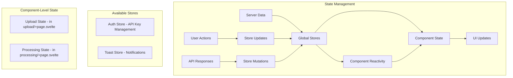

# State Management in SvelteKit

> **Last Updated**: 2025-07-11  
> **Status**: Complete  
> **Version**: 1.0

## Overview

This document explains the state management patterns and data flow architecture in the image2model SvelteKit application. It covers Svelte stores, reactive patterns, component communication, and best practices for managing application state across the 3D model generation workflow.

## Table of Contents

- [Key Concepts](#key-concepts)
- [Architecture](#architecture)
- [Implementation](#implementation)
- [Usage Examples](#usage-examples)
- [API Reference](#api-reference)
- [Best Practices](#best-practices)
- [Troubleshooting](#troubleshooting)
- [Related Documentation](#related-documentation)

## Key Concepts

**Svelte Stores**: Reactive containers for values that can be subscribed to by multiple components.

**Reactive Statements**: Declarations that automatically re-run when their dependencies change, marked with `$:`.

**Store Contracts**: Objects with a `subscribe` method that follows the store protocol.

**Derived Stores**: Stores that calculate their value based on other stores.

**Context API**: Mechanism for passing data down the component tree without props.

## Architecture

### State Flow Diagram



### Store Architecture

```
frontend-svelte/src/lib/stores/
├── auth.js          # Authentication state (API key management)
└── toast.js         # Toast notifications system
```

**Note**: Additional application state is managed at the component level using Svelte's built-in reactivity. Complex states like upload workflow and processing status are handled within their respective page components rather than global stores.

## Implementation

### Technical Details

#### Basic Store Pattern

The application uses writable stores for mutable state:

```javascript
// File: src/lib/stores/auth.js
import { writable } from 'svelte/store';

// Create writable store
export const apiKey = writable(null);

// Helper function to check auth state
export function hasApiKey() {
  let hasKey = false;
  apiKey.subscribe(value => {
    hasKey = !!value;
  })();
  return hasKey;
}

// Custom store with methods
export function createAuthStore() {
  const { subscribe, set, update } = writable({
    apiKey: null,
    user: null,
    isAuthenticated: false
  });
  
  return {
    subscribe,
    login: (apiKey, user) => {
      set({
        apiKey,
        user,
        isAuthenticated: true
      });
    },
    logout: () => {
      set({
        apiKey: null,
        user: null,
        isAuthenticated: false
      });
    }
  };
}
```

#### Toast Notification Store

Complex store with queue management:

```javascript
// File: src/lib/stores/toast.js
import { writable } from 'svelte/store';

export const TOAST_TYPES = {
  SUCCESS: 'success',
  ERROR: 'error',
  WARNING: 'warning',
  INFO: 'info'
};

function createToastStore() {
  const { subscribe, update } = writable([]);
  
  let nextId = 1;
  
  function add(message, type = TOAST_TYPES.INFO, duration = 5000) {
    const id = nextId++;
    const toast = {
      id,
      message,
      type,
      timestamp: Date.now()
    };
    
    update(toasts => [...toasts, toast]);
    
    // Auto-remove after duration
    if (duration > 0) {
      setTimeout(() => {
        remove(id);
      }, duration);
    }
    
    return id;
  }
  
  function remove(id) {
    update(toasts => toasts.filter(t => t.id !== id));
  }
  
  function clear() {
    update(() => []);
  }
  
  return {
    subscribe,
    success: (message, duration) => add(message, TOAST_TYPES.SUCCESS, duration),
    error: (message, duration) => add(message, TOAST_TYPES.ERROR, duration || 8000),
    warning: (message, duration) => add(message, TOAST_TYPES.WARNING, duration),
    info: (message, duration) => add(message, TOAST_TYPES.INFO, duration),
    remove,
    clear
  };
}

export const toast = createToastStore();
```

#### Component-Level State Management

Instead of global stores for every feature, the application uses component-level state for features like upload and processing. This approach keeps state close to where it's used and simplifies the architecture.

Example of managing upload state within a component:

```javascript
// Example pattern used in frontend-svelte/src/routes/upload/+page.svelte
<script>
  import { writable, derived } from 'svelte/store';
  
  // Local state for upload functionality
  let files = [];
  let uploadStatus = 'idle'; // idle, uploading, success, error
  let settings = {
    faceLimit: 'auto',
    quality: 'high'
  };
  
  // Reactive statements for derived values
  $: isValid = files.length > 0 && files.length <= 10;
  $: totalSize = files.reduce((sum, file) => sum + file.size, 0);
  $: totalSizeMB = (totalSize / 1024 / 1024).toFixed(2);
  
  function addFiles(newFiles) {
    files = [...files, ...newFiles];
  }
  
  function removeFile(index) {
    files = files.filter((_, i) => i !== index);
  }
  
  async function handleUpload() {
    uploadStatus = 'uploading';
    try {
      const result = await api.uploadBatch(files, settings.faceLimit);
      uploadStatus = 'success';
      // Navigate to processing
    } catch (error) {
      uploadStatus = 'error';
    }
  }
</script>
```

#### Real-time Updates with Server-Sent Events

The processing page manages SSE connections for real-time updates:

```javascript
// Example pattern used in frontend-svelte/src/routes/processing/+page.svelte
<script>
  import { onMount, onDestroy } from 'svelte';
  import api from '$lib/services/api.js';
  
  export let data; // Contains taskId from +page.js
  
  let progress = 0;
  let stage = 'initializing';
  let eventSource;
  
  onMount(() => {
    // Create SSE connection through API service
    eventSource = api.createProgressStream(data.taskId, {
      onProgress: (event) => {
        progress = event.progress || 0;
        stage = event.stage;
      },
      onComplete: (result) => {
        // Handle completion
      },
      onError: (error) => {
        // Handle error
      }
    });
  });
  
  onDestroy(() => {
    // Clean up SSE connection
    if (eventSource) {
      eventSource.close();
    }
  });
</script>
```

### Reactive Patterns

#### Component Reactivity

Using reactive statements in components with available stores:

```svelte
<!-- Example pattern demonstrating reactivity with auth and toast stores -->
<script>
  import { apiKey } from '$lib/stores/auth.js';
  import { toast } from '$lib/stores/toast.js';
  
  // Local component state
  let files = [];
  let uploadStatus = 'idle';
  
  // Subscribe to auth store with $ prefix
  $: hasAuth = !!$apiKey;
  
  // Reactive derived values
  $: fileCount = files.length;
  $: totalSize = files.reduce((sum, file) => sum + file.size, 0);
  $: totalSizeMB = (totalSize / 1024 / 1024).toFixed(2);
  $: canUpload = hasAuth && files.length > 0 && uploadStatus !== 'uploading';
  
  // Reactive side effects
  $: if (fileCount > 10) {
    toast.warning('Maximum 10 files allowed');
  }
  
  $: if (!hasAuth) {
    toast.error('API key not configured');
  }
  
  // Reactive class bindings
  $: uploadButtonClass = canUpload ? 'btn-primary' : 'btn-disabled';
</script>

<div class="upload-summary">
  <p>{fileCount} files selected ({totalSizeMB} MB)</p>
  <button 
    class="btn {uploadButtonClass}"
    disabled={!canUpload}
    on:click={handleUpload}
  >
    Upload Files
  </button>
</div>
```

#### Store Composition

Since the application uses minimal global stores, composition typically happens at the component level:

```javascript
// Example of combining stores with component state
<script>
  import { derived } from 'svelte/store';
  import { apiKey } from '$lib/stores/auth.js';
  
  // Component state
  let files = [];
  let isProcessing = false;
  
  // Create a derived value from store and local state
  const canProceed = derived(
    apiKey,
    $apiKey => {
      return {
        hasAuth: !!$apiKey,
        hasFiles: files.length > 0,
        isReady: !!$apiKey && files.length > 0 && !isProcessing
      };
    }
  );
  
  // Use in template
  $: readyState = $canProceed;
</script>
```

### Context API Usage

Passing stores through context:

```svelte
<!-- File: src/routes/workflow/+layout.svelte -->
<script>
  import { setContext } from 'svelte';
  import { writable } from 'svelte/store';
  
  // Create workflow context
  const workflow = writable({
    step: 1,
    data: {}
  });
  
  setContext('workflow', workflow);
</script>

<slot />

<!-- File: src/routes/workflow/step1/+page.svelte -->
<script>
  import { getContext } from 'svelte';
  
  const workflow = getContext('workflow');
  
  function nextStep() {
    workflow.update(w => ({
      ...w,
      step: w.step + 1,
      data: { ...w.data, step1Complete: true }
    }));
  }
</script>
```

## Usage Examples

### Basic Store Usage

```svelte
<script>
  import { apiKey } from '$lib/stores/auth.js';
  import { onMount } from 'svelte';
  
  // Direct subscription
  let currentApiKey;
  const unsubscribe = apiKey.subscribe(value => {
    currentApiKey = value;
  });
  
  // Auto-subscription with $
  $: isAuthenticated = !!$apiKey;
  
  // Update store
  function updateApiKey(newKey) {
    apiKey.set(newKey);
  }
  
  // Cleanup
  onDestroy(() => {
    unsubscribe();
  });
</script>

{#if isAuthenticated}
  <p>Authenticated with key: {$apiKey}</p>
{:else}
  <p>Please authenticate</p>
{/if}
```

### Complex State Management Pattern

For complex features, the application follows a pattern of encapsulating state within components or creating local stores when needed:

```javascript
// Example pattern for managing complex state in a component
<script>
  import { writable, derived, get } from 'svelte/store';
  import api from '$lib/services/api.js';
  import { toast } from '$lib/stores/toast.js';
  
  // Create local stores for complex state
  const createLocalStore = () => {
    const files = writable([]);
    const settings = writable({
      faceLimit: 'auto',
      quality: 'high'
    });
    const status = writable('idle');
    const results = writable(null);
    const progress = writable(0);
    
    // Derived stores for computed values
    const canProcess = derived(
      [files, status],
      ([$files, $status]) => 
        $files.length > 0 && $status === 'idle'
    );
    
    // Actions
    async function process() {
      status.set('processing');
      progress.set(0);
      
      try {
        const currentFiles = get(files);
        const currentSettings = get(settings);
        
        // Upload and process
        const result = await api.uploadBatch(
          currentFiles,
          currentSettings.faceLimit
        );
        
        results.set(result);
        status.set('complete');
        toast.success('Processing complete!');
      } catch (error) {
        status.set('error');
        toast.error(error.message);
        throw error;
      }
    }
    
    function reset() {
      files.set([]);
      settings.set({
        faceLimit: 'auto',
        quality: 'high'
      });
      status.set('idle');
      results.set(null);
      progress.set(0);
    }
    
    return {
      files,
      settings,
      status,
      results,
      progress,
      canProcess,
      process,
      reset
    };
  };
  
  // Initialize local store
  const store = createLocalStore();
  
  // Destructure for easier access
  const { files, settings, status, canProcess, process, reset } = store;
</script>
```

### Store Persistence

```javascript
// File: src/lib/stores/persistent.js
import { writable } from 'svelte/store';
import { browser } from '$app/environment';

export function persistentStore(key, initialValue) {
  // Load from localStorage if available
  const stored = browser && localStorage.getItem(key);
  const initial = stored ? JSON.parse(stored) : initialValue;
  
  const store = writable(initial);
  
  // Subscribe to changes and persist
  if (browser) {
    store.subscribe(value => {
      localStorage.setItem(key, JSON.stringify(value));
    });
  }
  
  return store;
}

// Usage
export const preferences = persistentStore('app-preferences', {
  theme: 'light',
  language: 'en',
  notifications: true
});
```

## API Reference

### Svelte Store Methods

#### `writable(value)`

Creates a writable store.

```javascript
const count = writable(0);
count.set(5);
count.update(n => n + 1);
```

#### `readable(value, start)`

Creates a read-only store.

```javascript
const time = readable(new Date(), (set) => {
  const interval = setInterval(() => {
    set(new Date());
  }, 1000);
  
  return () => clearInterval(interval);
});
```

#### `derived(stores, fn)`

Creates a store derived from other stores.

```javascript
const doubled = derived(count, $count => $count * 2);
const sum = derived(
  [a, b, c],
  ([$a, $b, $c]) => $a + $b + $c
);
```

#### `get(store)`

Gets current value without subscribing.

```javascript
import { get } from 'svelte/store';
const currentValue = get(myStore);
```

### Custom Store Contract

```javascript
// Minimal store contract
const customStore = {
  subscribe: (callback) => {
    // Call callback with current value
    callback(currentValue);
    
    // Return unsubscribe function
    return () => {
      // Cleanup
    };
  }
};
```

## Best Practices

### ✅ DO

- **Keep stores focused**: One concern per store
- **Use derived stores**: For computed values
- **Clean up subscriptions**: Prevent memory leaks
- **Use $ syntax**: For automatic subscriptions in components
- **Document store shape**: Include TypeScript/JSDoc types

### ❌ DON'T

- **Mutate store values directly**: Always use set/update
- **Create circular dependencies**: Between derived stores
- **Store components**: Only store serializable data
- **Overuse global state**: Prefer component state when possible
- **Forget error handling**: In async store operations

## Troubleshooting

### Common Issues

#### Issue: Store updates not reflecting in UI

**Cause**: Direct mutation instead of using store methods

**Solution**:
```javascript
// ❌ WRONG: Direct mutation
$myStore.items.push(newItem);

// ✅ CORRECT: Using update
myStore.update(state => ({
  ...state,
  items: [...state.items, newItem]
}));
```

#### Issue: Memory leaks from subscriptions

**Cause**: Not unsubscribing from stores

**Solution**:
```javascript
// Manual subscription needs cleanup
onMount(() => {
  const unsubscribe = myStore.subscribe(value => {
    // Handle value
  });
  
  return () => {
    unsubscribe();
  };
});

// Or use $ syntax for automatic cleanup
$: storeValue = $myStore;
```

#### Issue: Derived store not updating

**Cause**: Dependencies not properly tracked

**Solution**:
```javascript
// ❌ WRONG: External dependency
let multiplier = 2;
const doubled = derived(count, $count => $count * multiplier);

// ✅ CORRECT: All dependencies in stores
const multiplier = writable(2);
const doubled = derived(
  [count, multiplier],
  ([$count, $multiplier]) => $count * $multiplier
);
```

## Related Documentation

- [SvelteKit Structure](./svelte-structure.md) - Application architecture
- [Routing Patterns](./routing-patterns.md) - Navigation and routing
- [Component Library](../components/overview.md) - Component documentation
- [Testing Guide](../../04-testing/overview.md) - Testing strategies