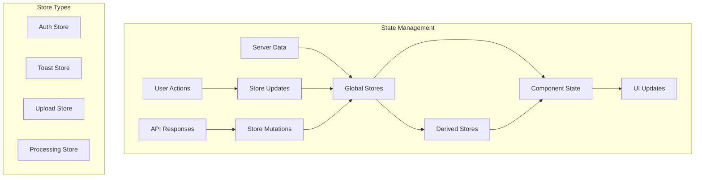

# State Management in SvelteKit

> **Last Updated**: 2025-07-11  
> **Status**: Complete  
> **Version**: 1.0

## Overview

This document explains the state management patterns and data flow architecture in the image2model SvelteKit application. It covers Svelte stores, reactive patterns, component communication, and best practices for managing application state across the 3D model generation workflow.

## Table of Contents

- [Key Concepts](#key-concepts)
- [Architecture](#architecture)
- [Implementation](#implementation)
- [Usage Examples](#usage-examples)
- [API Reference](#api-reference)
- [Best Practices](#best-practices)
- [Troubleshooting](#troubleshooting)
- [Related Documentation](#related-documentation)

## Key Concepts

**Svelte Stores**: Reactive containers for values that can be subscribed to by multiple components.

**Reactive Statements**: Declarations that automatically re-run when their dependencies change, marked with `$:`.

**Store Contracts**: Objects with a `subscribe` method that follows the store protocol.

**Derived Stores**: Stores that calculate their value based on other stores.

**Context API**: Mechanism for passing data down the component tree without props.

## Architecture

### State Flow Diagram



### Store Architecture

```
src/lib/stores/
├── auth.js          # Authentication state
├── toast.js         # Toast notifications
├── upload.js        # Upload workflow state
├── processing.js    # Processing status
└── index.js         # Store exports
```

## Implementation

### Technical Details

#### Basic Store Pattern

The application uses writable stores for mutable state:

```javascript
// File: src/lib/stores/auth.js
import { writable } from 'svelte/store';

// Create writable store
export const apiKey = writable(null);

// Helper function to check auth state
export function hasApiKey() {
  let hasKey = false;
  apiKey.subscribe(value => {
    hasKey = !!value;
  })();
  return hasKey;
}

// Custom store with methods
export function createAuthStore() {
  const { subscribe, set, update } = writable({
    apiKey: null,
    user: null,
    isAuthenticated: false
  });
  
  return {
    subscribe,
    login: (apiKey, user) => {
      set({
        apiKey,
        user,
        isAuthenticated: true
      });
    },
    logout: () => {
      set({
        apiKey: null,
        user: null,
        isAuthenticated: false
      });
    }
  };
}
```

#### Toast Notification Store

Complex store with queue management:

```javascript
// File: src/lib/stores/toast.js
import { writable } from 'svelte/store';

export const TOAST_TYPES = {
  SUCCESS: 'success',
  ERROR: 'error',
  WARNING: 'warning',
  INFO: 'info'
};

function createToastStore() {
  const { subscribe, update } = writable([]);
  
  let nextId = 1;
  
  function add(message, type = TOAST_TYPES.INFO, duration = 5000) {
    const id = nextId++;
    const toast = {
      id,
      message,
      type,
      timestamp: Date.now()
    };
    
    update(toasts => [...toasts, toast]);
    
    // Auto-remove after duration
    if (duration > 0) {
      setTimeout(() => {
        remove(id);
      }, duration);
    }
    
    return id;
  }
  
  function remove(id) {
    update(toasts => toasts.filter(t => t.id !== id));
  }
  
  function clear() {
    update(() => []);
  }
  
  return {
    subscribe,
    success: (message, duration) => add(message, TOAST_TYPES.SUCCESS, duration),
    error: (message, duration) => add(message, TOAST_TYPES.ERROR, duration || 8000),
    warning: (message, duration) => add(message, TOAST_TYPES.WARNING, duration),
    info: (message, duration) => add(message, TOAST_TYPES.INFO, duration),
    remove,
    clear
  };
}

export const toast = createToastStore();
```

#### Upload State Management

Managing complex upload workflow:

```javascript
// File: src/lib/stores/upload.js
import { writable, derived } from 'svelte/store';

function createUploadStore() {
  const files = writable([]);
  const settings = writable({
    faceLimit: 'auto',
    quality: 'high'
  });
  const status = writable('idle'); // idle, uploading, success, error
  
  // Derived store for validation
  const isValid = derived(
    files,
    $files => $files.length > 0 && $files.length <= 10
  );
  
  // Derived store for total size
  const totalSize = derived(
    files,
    $files => $files.reduce((sum, file) => sum + file.size, 0)
  );
  
  return {
    files: {
      subscribe: files.subscribe,
      add: (newFiles) => {
        files.update(current => [...current, ...newFiles]);
      },
      remove: (index) => {
        files.update(current => current.filter((_, i) => i !== index));
      },
      clear: () => files.set([])
    },
    settings: {
      subscribe: settings.subscribe,
      update: (newSettings) => {
        settings.update(current => ({ ...current, ...newSettings }));
      }
    },
    status: {
      subscribe: status.subscribe,
      set: status.set
    },
    isValid,
    totalSize
  };
}

export const uploadStore = createUploadStore();
```

#### Processing State with SSE

Real-time state updates via Server-Sent Events:

```javascript
// File: src/lib/stores/processing.js
import { writable, readable } from 'svelte/store';
import api from '$lib/services/api.js';

export function createProcessingStore(taskId) {
  const progress = writable({
    percentage: 0,
    stage: 'initializing',
    message: ''
  });
  
  const files = writable([]);
  const errors = writable([]);
  
  // Readable store for SSE connection
  const connection = readable(null, (set) => {
    const eventSource = api.createProgressStream(taskId, {
      onProgress: (data) => {
        progress.set({
          percentage: data.progress || 0,
          stage: data.stage,
          message: data.message
        });
      },
      onFileUpdate: (file) => {
        files.update(current => {
          const index = current.findIndex(f => f.id === file.id);
          if (index >= 0) {
            current[index] = file;
          } else {
            current.push(file);
          }
          return [...current];
        });
      },
      onError: (error) => {
        errors.update(current => [...current, error]);
      }
    });
    
    set(eventSource);
    
    // Cleanup on unsubscribe
    return () => {
      eventSource.close();
    };
  });
  
  return {
    progress,
    files,
    errors,
    connection
  };
}
```

### Reactive Patterns

#### Component Reactivity

Using reactive statements in components:

```svelte
<!-- File: src/routes/upload/+page.svelte -->
<script>
  import { uploadStore } from '$lib/stores/upload.js';
  import { toast } from '$lib/stores/toast.js';
  
  // Subscribe to store with $ prefix
  $: fileCount = $uploadStore.files.length;
  $: totalSizeMB = ($uploadStore.totalSize / 1024 / 1024).toFixed(2);
  $: canUpload = $uploadStore.isValid && $uploadStore.status !== 'uploading';
  
  // Reactive side effects
  $: if (fileCount > 10) {
    toast.warning('Maximum 10 files allowed');
  }
  
  // Reactive class bindings
  $: uploadButtonClass = canUpload ? 'btn-primary' : 'btn-disabled';
</script>

<div class="upload-summary">
  <p>{fileCount} files selected ({totalSizeMB} MB)</p>
  <button 
    class="btn {uploadButtonClass}"
    disabled={!canUpload}
    on:click={handleUpload}
  >
    Upload Files
  </button>
</div>
```

#### Store Composition

Combining multiple stores:

```javascript
// File: src/lib/stores/app.js
import { derived } from 'svelte/store';
import { apiKey } from './auth.js';
import { uploadStore } from './upload.js';

// Derive app readiness from multiple stores
export const appReady = derived(
  [apiKey, uploadStore.files],
  ([$apiKey, $files]) => {
    return {
      hasAuth: !!$apiKey,
      hasFiles: $files.length > 0,
      canProceed: !!$apiKey && $files.length > 0
    };
  }
);
```

### Context API Usage

Passing stores through context:

```svelte
<!-- File: src/routes/workflow/+layout.svelte -->
<script>
  import { setContext } from 'svelte';
  import { writable } from 'svelte/store';
  
  // Create workflow context
  const workflow = writable({
    step: 1,
    data: {}
  });
  
  setContext('workflow', workflow);
</script>

<slot />

<!-- File: src/routes/workflow/step1/+page.svelte -->
<script>
  import { getContext } from 'svelte';
  
  const workflow = getContext('workflow');
  
  function nextStep() {
    workflow.update(w => ({
      ...w,
      step: w.step + 1,
      data: { ...w.data, step1Complete: true }
    }));
  }
</script>
```

## Usage Examples

### Basic Store Usage

```svelte
<script>
  import { apiKey } from '$lib/stores/auth.js';
  import { onMount } from 'svelte';
  
  // Direct subscription
  let currentApiKey;
  const unsubscribe = apiKey.subscribe(value => {
    currentApiKey = value;
  });
  
  // Auto-subscription with $
  $: isAuthenticated = !!$apiKey;
  
  // Update store
  function updateApiKey(newKey) {
    apiKey.set(newKey);
  }
  
  // Cleanup
  onDestroy(() => {
    unsubscribe();
  });
</script>

{#if isAuthenticated}
  <p>Authenticated with key: {$apiKey}</p>
{:else}
  <p>Please authenticate</p>
{/if}
```

### Complex State Management

```javascript
// File: src/lib/stores/model-generation.js
import { writable, derived, get } from 'svelte/store';

export function createModelGenerationStore() {
  // Individual state slices
  const images = writable([]);
  const settings = writable({
    quality: 'high',
    format: 'glb',
    optimization: true
  });
  const status = writable('idle');
  const results = writable(null);
  
  // Computed values
  const canGenerate = derived(
    [images, status],
    ([$images, $status]) => 
      $images.length > 0 && $status === 'idle'
  );
  
  const progress = writable(0);
  
  // Actions
  async function generate() {
    status.set('generating');
    progress.set(0);
    
    try {
      const currentImages = get(images);
      const currentSettings = get(settings);
      
      // Simulate progress
      const interval = setInterval(() => {
        progress.update(p => Math.min(p + 10, 90));
      }, 1000);
      
      // API call
      const result = await api.generateModel(
        currentImages,
        currentSettings
      );
      
      clearInterval(interval);
      progress.set(100);
      results.set(result);
      status.set('complete');
    } catch (error) {
      status.set('error');
      throw error;
    }
  }
  
  function reset() {
    images.set([]);
    settings.set({
      quality: 'high',
      format: 'glb',
      optimization: true
    });
    status.set('idle');
    results.set(null);
    progress.set(0);
  }
  
  return {
    images,
    settings,
    status,
    results,
    progress,
    canGenerate,
    generate,
    reset
  };
}
```

### Store Persistence

```javascript
// File: src/lib/stores/persistent.js
import { writable } from 'svelte/store';
import { browser } from '$app/environment';

export function persistentStore(key, initialValue) {
  // Load from localStorage if available
  const stored = browser && localStorage.getItem(key);
  const initial = stored ? JSON.parse(stored) : initialValue;
  
  const store = writable(initial);
  
  // Subscribe to changes and persist
  if (browser) {
    store.subscribe(value => {
      localStorage.setItem(key, JSON.stringify(value));
    });
  }
  
  return store;
}

// Usage
export const preferences = persistentStore('app-preferences', {
  theme: 'light',
  language: 'en',
  notifications: true
});
```

## API Reference

### Svelte Store Methods

#### `writable(value)`

Creates a writable store.

```javascript
const count = writable(0);
count.set(5);
count.update(n => n + 1);
```

#### `readable(value, start)`

Creates a read-only store.

```javascript
const time = readable(new Date(), (set) => {
  const interval = setInterval(() => {
    set(new Date());
  }, 1000);
  
  return () => clearInterval(interval);
});
```

#### `derived(stores, fn)`

Creates a store derived from other stores.

```javascript
const doubled = derived(count, $count => $count * 2);
const sum = derived(
  [a, b, c],
  ([$a, $b, $c]) => $a + $b + $c
);
```

#### `get(store)`

Gets current value without subscribing.

```javascript
import { get } from 'svelte/store';
const currentValue = get(myStore);
```

### Custom Store Contract

```javascript
// Minimal store contract
const customStore = {
  subscribe: (callback) => {
    // Call callback with current value
    callback(currentValue);
    
    // Return unsubscribe function
    return () => {
      // Cleanup
    };
  }
};
```

## Best Practices

### ✅ DO

- **Keep stores focused**: One concern per store
- **Use derived stores**: For computed values
- **Clean up subscriptions**: Prevent memory leaks
- **Use $ syntax**: For automatic subscriptions in components
- **Document store shape**: Include TypeScript/JSDoc types

### ❌ DON'T

- **Mutate store values directly**: Always use set/update
- **Create circular dependencies**: Between derived stores
- **Store components**: Only store serializable data
- **Overuse global state**: Prefer component state when possible
- **Forget error handling**: In async store operations

## Troubleshooting

### Common Issues

#### Issue: Store updates not reflecting in UI

**Cause**: Direct mutation instead of using store methods

**Solution**:
```javascript
// ❌ WRONG: Direct mutation
$myStore.items.push(newItem);

// ✅ CORRECT: Using update
myStore.update(state => ({
  ...state,
  items: [...state.items, newItem]
}));
```

#### Issue: Memory leaks from subscriptions

**Cause**: Not unsubscribing from stores

**Solution**:
```javascript
// Manual subscription needs cleanup
onMount(() => {
  const unsubscribe = myStore.subscribe(value => {
    // Handle value
  });
  
  return () => {
    unsubscribe();
  };
});

// Or use $ syntax for automatic cleanup
$: storeValue = $myStore;
```

#### Issue: Derived store not updating

**Cause**: Dependencies not properly tracked

**Solution**:
```javascript
// ❌ WRONG: External dependency
let multiplier = 2;
const doubled = derived(count, $count => $count * multiplier);

// ✅ CORRECT: All dependencies in stores
const multiplier = writable(2);
const doubled = derived(
  [count, multiplier],
  ([$count, $multiplier]) => $count * $multiplier
);
```

## Related Documentation

- [SvelteKit Structure](./svelte-structure.md) - Application architecture
- [Routing Patterns](./routing-patterns.md) - Navigation and routing
- [Component Patterns](../components/patterns.md) - Component design
- [Testing Stores](../../04-testing/store-testing.md) - Testing strategies