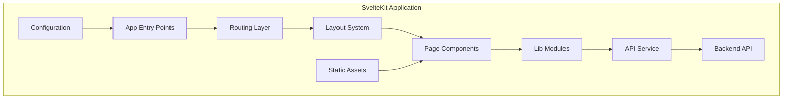

# SvelteKit Application Structure

> **Last Updated**: 2025-07-11  
> **Status**: Complete  
> **Version**: 1.0

## Overview

This document provides a comprehensive overview of the SvelteKit 2.0 application structure for the image2model frontend. It explains the organization of files, directories, and the architectural patterns used to build a scalable and maintainable 3D model generation interface.

## Table of Contents

- [Key Concepts](#key-concepts)
- [Architecture](#architecture)
- [Implementation](#implementation)
- [Usage Examples](#usage-examples)
- [API Reference](#api-reference)
- [Best Practices](#best-practices)
- [Troubleshooting](#troubleshooting)
- [Related Documentation](#related-documentation)

## Key Concepts

**SvelteKit**: A full-stack framework for building web applications with Svelte, providing routing, server-side rendering, and build optimizations.

**Routes**: File-based routing system where each `+page.svelte` file represents a route in the application.

**Layouts**: Shared UI components and logic that wrap around page content, defined in `+layout.svelte` files.

**Server-Side Rendering (SSR)**: Pre-rendering pages on the server for better SEO and initial load performance.

**Load Functions**: Special functions that run before a component is rendered to fetch and prepare data.

## Architecture

### System Design



### File Structure

```
frontend-svelte/
├── src/
│   ├── app.html                # HTML template
│   ├── app.css                 # Global styles
│   ├── app-core.css            # Core CSS imports
│   ├── hooks.client.js         # Client-side hooks
│   ├── hooks.server.js         # Server-side hooks
│   ├── lib/                    # Shared modules
│   │   ├── actions/            # Svelte actions
│   │   ├── components/         # Reusable components
│   │   ├── services/           # API services
│   │   ├── stores/             # Svelte stores
│   │   └── utils/              # Utility functions
│   └── routes/                 # Page routes
│       ├── +layout.server.js   # Server layout data
│       ├── +layout.svelte      # Root layout
│       ├── +page.svelte        # Homepage
│       ├── +error.svelte       # Error page
│       ├── upload/             # Upload page
│       ├── processing/         # Processing page
│       └── dev/                # Development tools
├── static/                     # Static assets
│   ├── assets/                 # Images and media
│   ├── css/                    # Static CSS files
│   ├── js/                     # Static JS files
│   └── favicon.svg            # Favicon
├── tests/                      # Test suites
│   ├── e2e/                    # Playwright tests
│   └── unit/                   # Vitest tests
├── svelte.config.js            # SvelteKit config
├── vite.config.js              # Vite bundler config
└── package.json                # Dependencies
```

## Implementation

### Technical Details

#### Application Entry Points

The application starts with several key files:

```javascript
// File: src/app.html
<!DOCTYPE html>
<html lang="en">
<head>
    <meta charset="utf-8" />
    <link rel="icon" href="%sveltekit.assets%/favicon.svg" />
    <meta name="viewport" content="width=device-width, initial-scale=1" />
    %sveltekit.head%
</head>
<body data-sveltekit-preload-data="hover">
    <div style="display: contents">%sveltekit.body%</div>
</body>
</html>
```

#### Configuration

The SvelteKit configuration uses the Node adapter for deployment:

```javascript
// File: svelte.config.js
import adapter from '@sveltejs/adapter-node';

const config = {
  kit: {
    adapter: adapter({
      out: 'build',
      precompress: false
    }),
    csrf: {
      checkOrigin: true
    }
  }
};

export default config;
```

#### Root Layout

The root layout manages global state and styles:

```javascript
// File: src/routes/+layout.svelte
<script>
  import '../app-core.css';
  import { page } from '$app/stores';
  import { onMount } from 'svelte';
  import Toast from '$lib/components/Toast.svelte';
  import api from '$lib/services/api.js';
  import { apiKey } from '$lib/stores/auth.js';
  
  export let data;
  
  // Set API key immediately when data is available
  $: if (data?.apiKey) {
    api.setApiKey(data.apiKey);
    apiKey.set(data.apiKey);
  }
</script>

<slot />
<Toast />
```

### Module Organization

#### Components (`$lib/components/`)

Reusable UI components following Single File Component pattern:

```
components/
├── Navbar.svelte         # Navigation bar
├── Footer.svelte         # Site footer
├── Button.svelte         # Button component
├── Toast.svelte          # Toast notifications
├── ProgressIndicator.svelte  # Progress UI
├── ModelCard.svelte      # 3D model display
├── ImageGrid.svelte      # Image gallery
├── Hero.svelte           # Hero section
├── Icon.svelte           # Icon wrapper
├── ErrorBoundary.svelte  # Error handling
└── Breadcrumb.svelte     # Navigation breadcrumb
```

#### Services (`$lib/services/`)

API communication layer:

```javascript
// File: src/lib/services/api.js
class APIService {
  constructor(apiKey = null) {
    this.API_BASE = import.meta.env.PUBLIC_API_URL || 'http://localhost:8000/api/v1';
    this.DEFAULT_TIMEOUT = 60000;
    this.API_KEY = apiKey;
  }

  async uploadBatch(files, faceLimit = null) {
    const formData = new FormData();
    files.forEach((fileObj) => {
      const file = fileObj.file || fileObj;
      formData.append('files', file);
    });
    // ... implementation
  }
}
```

#### Stores (`$lib/stores/`)

Global state management:

```javascript
// File: src/lib/stores/auth.js
import { writable } from 'svelte/store';

export const apiKey = writable(null);

export function hasApiKey() {
  let hasKey = false;
  apiKey.subscribe(value => {
    hasKey = !!value;
  })();
  return hasKey;
}
```

#### Actions (`$lib/actions/`)

DOM manipulation and animations:

```javascript
// File: src/lib/actions/animations.js
export function scrollReveal(node, options = {}) {
  // Intersection Observer for scroll animations
  const observer = new IntersectionObserver((entries) => {
    entries.forEach(entry => {
      if (entry.isIntersecting) {
        node.classList.add('visible');
      }
    });
  });
  
  observer.observe(node);
  
  return {
    destroy() {
      observer.disconnect();
    }
  };
}
```

## Usage Examples

### Basic Page Creation

```javascript
// File: src/routes/new-page/+page.svelte
<script>
  import { onMount } from 'svelte';
  import Button from '$lib/components/Button.svelte';
  
  let data = null;
  
  onMount(async () => {
    // Initialize page
  });
</script>

<h1>New Page</h1>
<Button>Click me</Button>
```

### Using Load Functions

```javascript
// File: src/routes/+layout.server.js
export async function load({ cookies }) {
  const apiKey = process.env.PUBLIC_API_KEY;
  
  return {
    apiKey
  };
}
```

### Component with Props

```javascript
// File: src/lib/components/CustomComponent.svelte
<script>
  export let title = '';
  export let description = '';
  export let variant = 'default';
</script>

<div class="component {variant}">
  <h2>{title}</h2>
  <p>{description}</p>
</div>

<style>
  .component {
    padding: 1rem;
  }
  
  .default {
    background: white;
  }
  
  .primary {
    background: var(--primary-color);
  }
</style>
```

## API Reference

### Page Routes

#### Homepage (`/`)
- **File**: `src/routes/+page.svelte`
- **Purpose**: Landing page with features and examples
- **Components**: Hero, Features, Examples sections

#### Upload Page (`/upload`)
- **File**: `src/routes/upload/+page.svelte`
- **Purpose**: Image upload interface
- **Features**: Drag-and-drop, batch upload, face limit settings

#### Processing Page (`/processing`)
- **File**: `src/routes/processing/+page.svelte`
- **Purpose**: Real-time processing status
- **Features**: Progress tracking, SSE updates

#### Development Tools (`/dev/*`)
- **Location**: `src/routes/dev/`
- **Purpose**: Component showcase and testing
- **Routes**: Components, edge cases, test scenarios

### Configuration Options

| Option | Type | Default | Description |
|--------|------|---------|-------------|
| `adapter` | Object | `adapter-node` | Build adapter configuration |
| `csrf.checkOrigin` | Boolean | `true` | CSRF protection |
| `precompress` | Boolean | `false` | Pre-compression of assets |

## Best Practices

### ✅ DO

- **Use file-based routing**: Leverage SvelteKit's routing system
- **Implement proper error boundaries**: Handle errors gracefully
- **Optimize for SSR**: Ensure components work server-side
- **Use TypeScript/JSDoc**: Add type annotations for better DX
- **Follow component naming**: PascalCase for components

### ❌ DON'T

- **Access window directly**: Use `browser` check from `$app/environment`
- **Store sensitive data client-side**: Use server-side sessions
- **Import large libraries globally**: Use dynamic imports
- **Ignore accessibility**: Always include ARIA labels

## Troubleshooting

### Common Issues

#### Issue: "window is not defined" error

**Cause**: Accessing browser APIs during SSR

**Solution**:
```javascript
import { browser } from '$app/environment';

if (browser) {
  // Browser-only code
  window.addEventListener('resize', handleResize);
}
```

#### Issue: Styles not applying

**Cause**: CSS scoping in Svelte components

**Solution**:
```svelte
<style>
  /* Scoped to component */
  .my-class { }
  
  /* Global styles */
  :global(.global-class) { }
</style>
```

## Related Documentation

- [Routing Patterns](./routing-patterns.md) - Deep dive into routing
- [State Management](./state-management.md) - Store patterns and data flow
- [Component Library](../components/README.md) - Component documentation
- [Testing Guide](../../04-testing/frontend-testing.md) - Testing strategies