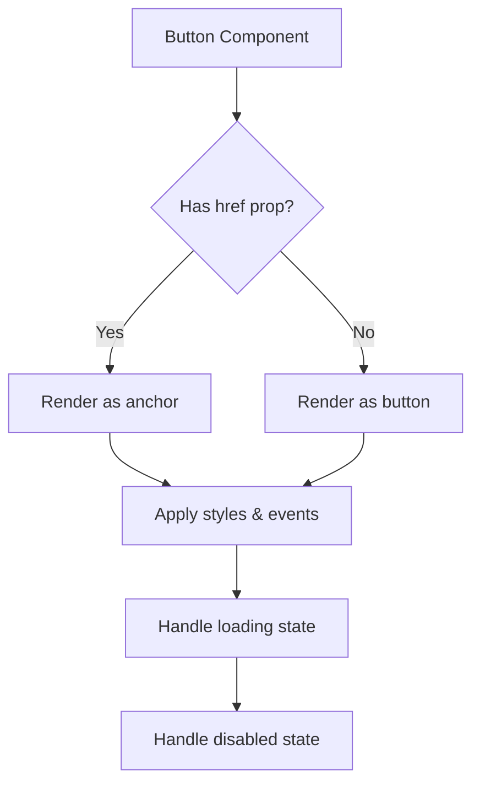

# Button Component System

> **Last Updated**: 2025-01-11  
> **Status**: Complete  
> **Version**: 1.0

## Overview

The Button component is the primary interactive element in the image2model application. It provides a flexible, accessible, and visually consistent way to handle user actions. This document covers all button variants, states, usage patterns, and implementation details.

## Table of Contents

- [Key Concepts](#key-concepts)
- [Architecture](#architecture)
- [Implementation](#implementation)
- [Usage Examples](#usage-examples)
- [API Reference](#api-reference)
- [Visual Variants](#visual-variants)
- [Accessibility](#accessibility)
- [Best Practices](#best-practices)
- [Troubleshooting](#troubleshooting)
- [Related Documentation](#related-documentation)

## Key Concepts

**Button Variant**: Visual style that communicates the button's importance and function (primary, secondary, ghost).

**Button State**: Interactive states including default, hover, active, disabled, and loading.

**Button Size**: Predefined sizes for different contexts (small, medium, large).

**Polymorphic Component**: Can render as either a `<button>` or `<a>` element based on props.

## Architecture

### Component Design



### File Structure

```
src/lib/components/
├── Button.svelte         # Main button component
└── Button.test.js       # Component tests
```

## Implementation

### Technical Details

The Button component uses Svelte's reactive declarations and event dispatching:

```svelte
<script>
  import { createEventDispatcher } from 'svelte';
  
  // Props with JSDoc annotations
  export let variant = 'primary';
  export let size = 'md';
  export let disabled = false;
  export let loading = false;
  
  const dispatch = createEventDispatcher();
  
  // Reactive class generation
  $: classes = [
    'btn',
    `btn-${variant}`,
    `btn-${size}`,
    fullWidth && 'btn-full',
    (disabled || loading) && 'btn-disabled',
    'hover-lift',
    className
  ].filter(Boolean).join(' ');
</script>
```

### Configuration

| Option | Type | Default | Description |
|--------|------|---------|-------------|
| `variant` | `string` | `'primary'` | Visual style: primary, secondary, ghost, ghost-light |
| `size` | `string` | `'md'` | Button size: sm, md, lg |
| `disabled` | `boolean` | `false` | Disable interaction |
| `type` | `string` | `'button'` | HTML button type |
| `href` | `string\|null` | `null` | Render as link if provided |
| `fullWidth` | `boolean` | `false` | Take full container width |
| `loading` | `boolean` | `false` | Show loading spinner |

## Usage Examples

### Basic Usage

```svelte
<!-- File: src/routes/example.svelte -->
<script>
  import Button from '$lib/components/Button.svelte';
</script>

<!-- Simple button -->
<Button>Click me</Button>

<!-- With click handler -->
<Button on:click={() => console.log('Clicked!')}>
  Action Button
</Button>
```

### Advanced Usage

```svelte
<!-- File: src/routes/upload/+page.svelte -->
<script>
  import Button from '$lib/components/Button.svelte';
  import { toast } from '$lib/stores/toast';
  
  let isSubmitting = false;
  
  async function handleSubmit() {
    isSubmitting = true;
    try {
      await api.uploadFiles();
      toast.success('Files uploaded!');
    } catch (error) {
      toast.error('Upload failed');
    } finally {
      isSubmitting = false;
    }
  }
</script>

<!-- Submit button with loading state -->
<Button 
  variant="primary"
  size="lg"
  loading={isSubmitting}
  disabled={!canSubmit}
  on:click={handleSubmit}
>
  {isSubmitting ? 'Uploading...' : 'Upload Files'}
</Button>

<!-- Link styled as button -->
<Button href="/dashboard" variant="secondary">
  Go to Dashboard
</Button>

<!-- Full width ghost button -->
<Button 
  variant="ghost"
  fullWidth
  on:click={clearAll}
>
  Clear All
</Button>
```

### Complete Example

```svelte
<!-- File: src/components/ActionBar.svelte -->
<script>
  import Button from '$lib/components/Button.svelte';
  import Icon from '$lib/components/Icon.svelte';
  
  export let onSave;
  export let onCancel;
  export let isSaving = false;
</script>

<div class="action-bar">
  <!-- Primary action with icon -->
  <Button
    variant="primary"
    size="lg"
    loading={isSaving}
    on:click={onSave}
    class="save-button"
  >
    <Icon slot="icon" name="check" size={20} />
    {isSaving ? 'Saving...' : 'Save Changes'}
  </Button>
  
  <!-- Secondary action -->
  <Button
    variant="ghost"
    size="lg"
    disabled={isSaving}
    on:click={onCancel}
  >
    Cancel
  </Button>
</div>
```

## API Reference

### Props

#### `variant`

**Type**: `'primary' | 'secondary' | 'ghost' | 'ghost-light'`  
**Default**: `'primary'`  
**Description**: Determines the visual style of the button.

- `primary`: Blue gradient background, white text, for main actions
- `secondary`: Gray background, dark text, for secondary actions
- `ghost`: Transparent with border, for tertiary actions
- `ghost-light`: Transparent with light border, for dark backgrounds

#### `size`

**Type**: `'sm' | 'md' | 'lg'`  
**Default**: `'md'`  
**Description**: Controls button dimensions and text size.

- `sm`: 0.5rem vertical, 1rem horizontal padding, 0.875rem font
- `md`: 0.75rem vertical, 1.5rem horizontal padding, 1rem font
- `lg`: 1rem vertical, 2rem horizontal padding, 1.125rem font

#### `loading`

**Type**: `boolean`  
**Default**: `false`  
**Description**: Shows loading spinner and disables interaction.

**Example**:
```svelte
<Button loading={isProcessing}>
  {isProcessing ? 'Processing...' : 'Process'}
</Button>
```

### Events

#### `on:click`

**Description**: Fired when button is clicked (unless disabled or loading)

**Example**:
```svelte
<Button on:click={(e) => handleClick(e)}>
  Click Handler
</Button>
```

### Slots

#### Default Slot

Button text content.

#### `icon` Slot

Icon content, positioned before text.

**Example**:
```svelte
<Button>
  <Icon slot="icon" name="download" />
  Download File
</Button>
```

## Visual Variants

### Primary Button

```css
/* Blue gradient background */
.btn-primary {
  background: linear-gradient(135deg, #2196f3 0%, #1976d2 100%);
  color: white;
  box-shadow: 0 4px 14px 0 rgba(33, 150, 243, 0.25);
}
```

**Usage**: Main actions like "Submit", "Save", "Generate"

**Accessibility**: 4.5:1 contrast ratio on white background

### Secondary Button

```css
/* Gray background */
.btn-secondary {
  background: #f3f4f6;
  color: #1a202c;
  border: 1px solid #e5e7eb;
}
```

**Usage**: Alternative actions like "Cancel", "Back"

**Accessibility**: 12.1:1 contrast ratio

### Ghost Button

```css
/* Transparent with border */
.btn-ghost {
  background: transparent;
  color: #4b5563;
  border: 1px solid #e5e7eb;
}
```

**Usage**: Less prominent actions, toolbar buttons

**Accessibility**: 4.8:1 contrast ratio

### Ghost Light Button

```css
/* For dark backgrounds */
.btn-ghost-light {
  background: transparent;
  color: white;
  border: 1px solid rgba(255, 255, 255, 0.3);
}
```

**Usage**: Buttons on dark hero sections or images

**Accessibility**: Ensure dark background provides sufficient contrast

## Accessibility

### WCAG Compliance

All button variants meet WCAG 2.1 AA standards:

| Variant | Text Color | Background | Contrast Ratio | Compliance |
|---------|------------|------------|----------------|------------|
| Primary | #FFFFFF | #2196F3 | 4.5:1 | AA ✓ |
| Secondary | #1A202C | #F3F4F6 | 12.1:1 | AAA ✓ |
| Ghost | #4B5563 | transparent | 4.8:1 | AA ✓ |
| Ghost Light | #FFFFFF | transparent | Depends on bg | Check bg |

### Keyboard Support

- **Tab**: Navigate to button
- **Space/Enter**: Activate button
- **Disabled state**: Removed from tab order

### Screen Reader Support

```svelte
<!-- Good: Descriptive text -->
<Button on:click={deleteItem}>
  Delete Item
</Button>

<!-- Better: Additional context with aria-label -->
<Button 
  on:click={() => deleteItem(item.id)}
  aria-label={`Delete ${item.name}`}
>
  Delete
</Button>
```

### Focus Indicators

```css
.btn:focus {
  outline: none;
  box-shadow: 0 0 0 3px rgba(33, 150, 243, 0.3);
}
```

Focus ring provides 3:1 contrast ratio against all backgrounds.

## Best Practices

### ✅ DO

- Use primary variant for one main action per view
- Provide descriptive button text
- Show loading state during async operations
- Disable buttons when action is unavailable
- Use appropriate size for context
- Test with keyboard navigation

### ❌ DON'T

- Use multiple primary buttons in same section
- Rely on color alone to convey meaning
- Use generic text like "Click here"
- Forget loading states for async actions
- Make buttons too small on mobile
- Disable without clear reason

### Button Text Guidelines

```svelte
<!-- ❌ BAD: Vague -->
<Button>Submit</Button>

<!-- ✅ GOOD: Specific -->
<Button>Upload Images</Button>

<!-- ❌ BAD: Too long -->
<Button>Click here to upload your images to generate 3D models</Button>

<!-- ✅ GOOD: Concise -->
<Button>Generate 3D Models</Button>
```

## Troubleshooting

### Common Issues

#### Issue: Button not responding to clicks

**Cause**: Button is disabled or loading

**Solution**:
```svelte
<!-- Check both states -->
<Button 
  disabled={!isValid || isProcessing}
  loading={isProcessing}
  on:click={handleClick}
>
  Submit
</Button>
```

#### Issue: Styles not applying correctly

**Cause**: CSS specificity conflicts

**Solution**:
```svelte
<!-- Use the class prop for custom styles -->
<Button class="custom-button" variant="primary">
  Custom Styled
</Button>

<style>
  :global(.custom-button) {
    /* Your custom styles */
  }
</style>
```

#### Issue: Loading spinner not centered

**Cause**: Flex container issues

**Solution**: Button uses `display: inline-flex` with proper alignment:
```css
.btn {
  display: inline-flex;
  align-items: center;
  justify-content: center;
  gap: 0.5rem;
}
```

## Related Documentation

- [Component Library](./component-library.md) - Complete component inventory
- [Icon System](./icon-system.md) - Icon component usage
- [Form Components](./form-components.md) - Form integration patterns
- [Accessibility Guidelines](../../../brand/guidelines/accessibility.md) - WCAG compliance
- [Color System](../../../brand/guidelines/color-usage.md) - Brand colors