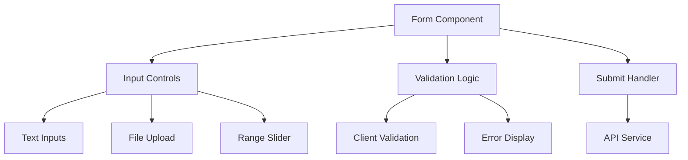

# Form Patterns Documentation

> **Last Updated**: 2025-07-12  
> **Status**: Complete  
> **Version**: 1.1
> **Note**: This document covers form patterns and implementations. The application currently uses native HTML form elements rather than custom form components.

## Overview

The image2model application uses a combination of native HTML form elements and custom UI components to create accessible, user-friendly forms. This document covers form patterns, input handling, validation, and file upload implementations used throughout the application.

## Table of Contents

- [Key Concepts](#key-concepts)
- [Architecture](#architecture)
- [Form Patterns](#form-patterns)
- [File Upload System](#file-upload-system)
- [Form Controls](#form-controls)
- [Validation](#validation)
- [Accessibility](#accessibility)
- [Best Practices](#best-practices)
- [Troubleshooting](#troubleshooting)
- [Related Documentation](#related-documentation)

## Key Concepts

**Form State**: Reactive state management for form data and validation status.

**Progressive Enhancement**: Forms work without JavaScript and enhance with it.

**Validation**: Client-side validation with accessible error messaging.

**File Handling**: Drag-and-drop file uploads with preview and validation.

**Accessibility**: ARIA labels, error associations, and keyboard navigation.

## Architecture

### Form Structure



### File Organization

```
src/
├── routes/
│   └── upload/
│       └── +page.svelte      # Main upload form
├── lib/
│   ├── components/
│   │   └── ImageGrid.svelte  # File preview grid
│   └── services/
│       └── api.js            # Form submission logic
```

## Form Patterns

### Basic Form Structure

```svelte
<!-- File: src/routes/upload/+page.svelte -->
<form on:submit={handleSubmit}>
  <!-- File Upload Zone -->
  <div class="upload-zone-wrapper">
    <label class="upload-area">
      <input 
        type="file" 
        multiple 
        accept=".jpg,.jpeg,.png"
        on:change={handleFileSelect}
        class="file-input"
      >
      <!-- Visual upload area -->
    </label>
  </div>

  <!-- Form Controls -->
  <div class="form-controls">
    <!-- Controls here -->
  </div>

  <!-- Submit Actions -->
  <div class="form-actions">
    <Button type="submit" disabled={!canSubmit}>
      Submit
    </Button>
  </div>
</form>
```

### Form State Management

```svelte
<script>
  // Form state
  let files = [];
  let faceLimit = 10000;
  let isAuto = true;
  let uploading = false;
  
  // Derived state
  $: canGenerate = files.length > 0 && !uploading;
  $: fileCount = files.length;
  
  // Validation constants
  const MAX_FILES = 25;
  const MAX_FILE_SIZE = 10 * 1024 * 1024; // 10MB
  const ALLOWED_TYPES = ['image/jpeg', 'image/jpg', 'image/png'];
</script>
```

## File Upload System

### Upload Component Implementation

```svelte
<!-- File upload area with drag and drop -->
<label 
  class="upload-area {dragActive ? 'drag-over' : ''}"
  on:dragover={handleDragOver}
  on:dragleave={handleDragLeave}
  on:drop={handleDrop}
  on:dragenter|preventDefault
>
  <input 
    bind:this={fileInput}
    type="file" 
    multiple 
    accept=".jpg,.jpeg,.png" 
    on:change={handleFileSelect}
    class="file-input"
  >
  <div class="upload-content">
    <svg class="upload-icon" viewBox="0 0 20 20" fill="currentColor">
      <!-- Upload icon SVG -->
    </svg>
    <h3 class="upload-title">Drop images here or click to browse</h3>
    <p class="upload-info">
      Supports JPEG, PNG • Max 10MB per file • Up to 25 images
    </p>
  </div>
</label>
```

### File Validation

```javascript
function processFiles(newFiles) {
  const validFiles = [];
  const errors = [];
  
  newFiles.forEach(file => {
    // Validate file type
    if (!ALLOWED_TYPES.includes(file.type)) {
      errors.push(`${file.name}: Invalid file type. Only JPG and PNG allowed.`);
      return;
    }
    
    // Validate file size
    if (file.size > MAX_FILE_SIZE) {
      errors.push(`${file.name}: File too large. Maximum size is 10MB.`);
      return;
    }
    
    // Check total file count
    if (files.length + validFiles.length >= MAX_FILES) {
      errors.push(`Maximum ${MAX_FILES} files allowed.`);
      return;
    }
    
    // Create preview URL
    const url = URL.createObjectURL(file);
    objectUrls.push(url);
    
    validFiles.push({
      id: Date.now() + Math.random(),
      file,
      name: file.name,
      size: file.size,
      url,
      uploading: false,
      progress: 0
    });
  });
  
  // Update files array
  files = [...files, ...validFiles];
  
  // Show errors if any
  if (errors.length > 0) {
    errors.forEach(error => toast.error(error));
  }
}
```

### Drag and Drop Handlers

```javascript
function handleDragOver(e) {
  e.preventDefault();
  e.stopPropagation();
  dragActive = true;
}

function handleDragLeave(e) {
  e.preventDefault();
  e.stopPropagation();
  if (e.currentTarget.contains(e.relatedTarget)) return;
  dragActive = false;
}

function handleDrop(e) {
  e.preventDefault();
  e.stopPropagation();
  dragActive = false;
  
  const droppedFiles = Array.from(e.dataTransfer.files);
  processFiles(droppedFiles);
}
```

## Form Controls

### Range Slider Control

```svelte
<!-- Face limit control with presets -->
<div class="face-limit-control">
  <label for="faceLimit" class="face-limit-label">
    Face Limit Control
  </label>
  <div class="face-limit-value">{faceLimitDisplay}</div>
  <input 
    type="range" 
    id="faceLimit"
    class="face-limit-slider" 
    min="1000" 
    max="50000" 
    step="1000" 
    bind:value={faceLimit}
    aria-label="Face limit: {faceLimitDisplay}"
    aria-valuemin="1000"
    aria-valuemax="50000"
    aria-valuenow={faceLimit}
  >
  <div class="face-limit-presets">
    <button 
      type="button" 
      class="preset-btn" 
      class:active={faceLimit === 5000}
      on:click={() => setFaceLimit(5000)}
      aria-pressed={faceLimit === 5000}
    >
      Low
    </button>
    <!-- More preset buttons -->
  </div>
</div>
```

### Slider Component (Enhanced Range Control)

The `Slider` component provides a reusable, accessible range input that follows the design system guidelines and offers enhanced functionality over native range inputs.

```svelte
<script>
  import Slider from '$lib/components/Slider.svelte';
  
  let value = 50;
  let temperature = 0.7;
  
  // Handle value changes
  function handleSliderChange(event) {
    console.log('New value:', event.detail.value);
  }
</script>

<!-- Basic slider -->
<Slider
  bind:value
  min={0}
  max={100}
  step={1}
  label="Progress"
  description="Adjust the progress value"
/>

<!-- Slider with presets -->
<Slider
  bind:value={temperature}
  min={0}
  max={1}
  step={0.1}
  label="Temperature"
  description="Controls randomness in generation"
  presets={[
    { value: 0, label: 'Precise' },
    { value: 0.5, label: 'Balanced' },
    { value: 0.7, label: 'Creative' },
    { value: 1, label: 'Random' }
  ]}
  on:change={handleSliderChange}
/>

<!-- Slider with custom display -->
<Slider
  bind:value={faceLimit}
  min={1000}
  max={50000}
  step={1000}
  label="Face Limit"
  description="Controls model detail level"
  valueFormatter={(val) => val.toLocaleString()}
  displayValue={isAuto ? 'Auto' : null}
/>
```

#### Component Props

| Prop | Type | Default | Description |
|------|------|---------|-------------|
| `value` | number | 0 | Current value |
| `min` | number | 0 | Minimum value |
| `max` | number | 100 | Maximum value |
| `step` | number | 1 | Step increment |
| `label` | string | '' | Label text |
| `description` | string | '' | Helper text below slider |
| `displayValue` | string\|null | null | Override display value |
| `presets` | Array | [] | Preset buttons [{value, label}] |
| `disabled` | boolean | false | Disable interaction |
| `showValue` | boolean | true | Show/hide value display |
| `valueFormatter` | function | (val) => val.toLocaleString() | Format display value |

#### Events

- `change`: Fired when value changes with `{detail: {value}}`

#### Styling

The Slider component uses CSS custom properties from the design system:

```css
/* Brand colors used */
--brand-bright-cyan: #5DADE2;    /* Primary slider color */
--brand-sky-blue: #3498DB;       /* Hover state */
--brand-light-gray: #ECF0F1;     /* Track background */
--brand-dark-charcoal: #3A424A;  /* Label text */
--blue-100: #D6EAF8;             /* Value badge background */
```

#### Accessibility Features

- Full keyboard navigation (arrow keys, home/end)
- ARIA attributes for screen readers
- Focus states and visual feedback
- Proper label associations
- Value announcements

### Advanced Options Panel

```svelte
<!-- Collapsible options panel -->
<div class="advanced-options">
  <button 
    type="button" 
    class="options-toggle" 
    class:active={optionsExpanded}
    on:click={toggleOptions}
    aria-expanded={optionsExpanded}
    aria-controls="advanced-options-content"
  >
    <div class="options-toggle-text">
      <Icon name="cog" />
      <span>Advanced Settings</span>
    </div>
    <Icon name="chevron-down" class="options-toggle-icon" />
  </button>
  
  {#if optionsExpanded}
    <div 
      id="advanced-options-content"
      class="options-content active"
    >
      <!-- Option controls -->
    </div>
  {/if}
</div>
```

## Validation

### Client-Side Validation

```javascript
// File type validation
const ALLOWED_TYPES = ['image/jpeg', 'image/jpg', 'image/png'];

function validateFileType(file) {
  if (!ALLOWED_TYPES.includes(file.type)) {
    return {
      valid: false,
      error: 'Invalid file type. Only JPG and PNG allowed.'
    };
  }
  return { valid: true };
}

// File size validation
const MAX_FILE_SIZE = 10 * 1024 * 1024; // 10MB

function validateFileSize(file) {
  if (file.size > MAX_FILE_SIZE) {
    return {
      valid: false,
      error: 'File too large. Maximum size is 10MB.'
    };
  }
  return { valid: true };
}

// Form submission validation
function validateForm() {
  if (files.length === 0) {
    toast.error('Please select at least one image');
    return false;
  }
  
  if (!$apiKey) {
    toast.error('Application is still loading. Please try again.');
    return false;
  }
  
  return true;
}
```

### Error Display

```svelte
<!-- Inline validation messages -->
{#if errors.length > 0}
  <div class="error-messages" role="alert">
    {#each errors as error}
      <p class="error-message">
        <Icon name="error" size={16} />
        {error}
      </p>
    {/each}
  </div>
{/if}

<!-- Toast notifications for errors -->
<script>
  import { toast } from '$lib/stores/toast';
  
  function showError(message) {
    toast.error(message);
  }
</script>
```

## Form Submission

### Submit Handler Pattern

```javascript
async function handleSubmit(e) {
  e.preventDefault();
  
  // Validate form
  if (!validateForm()) {
    return;
  }
  
  uploading = true;
  
  try {
    // Store file info in session
    if (browser) {
      const fileNames = files.map(f => f.name);
      sessionStorage.setItem('processingFiles', JSON.stringify({
        files: fileNames,
        taskId: null
      }));
    }
    
    // Submit with retry logic
    const result = await api.uploadBatch(
      files, 
      isAuto ? null : faceLimit
    );
    
    if (result.success) {
      toast.success('Files uploaded successfully!');
      
      // Navigate to next step
      const taskId = result.taskId || result.batchId;
      if (taskId && browser) {
        await goto(`/processing?taskId=${taskId}`);
      }
    } else {
      throw new Error(result.error || 'Upload failed');
    }
  } catch (error) {
    toast.error(`Failed to upload: ${error.message}`);
  } finally {
    uploading = false;
  }
}
```

## Accessibility

### Form Labels

```svelte
<!-- Explicit label association -->
<label for="faceLimit">Face Limit Control</label>
<input id="faceLimit" type="range" />

<!-- Label wrapping -->
<label>
  <input type="checkbox" />
  <span>Enable advanced options</span>
</label>

<!-- ARIA labels for complex controls -->
<button 
  aria-label="Remove {file.name} from upload queue"
  on:click={() => removeFile(file.id)}
>
  <Icon name="x" />
</button>
```

### Error Associations

```svelte
<!-- Associate errors with inputs -->
<input 
  id="file-input"
  type="file"
  aria-describedby="file-input-error"
  aria-invalid={hasError}
/>
{#if hasError}
  <p id="file-input-error" class="error-text">
    {errorMessage}
  </p>
{/if}
```

### Keyboard Navigation

- **Tab**: Navigate between form controls
- **Space**: Toggle checkboxes, activate buttons
- **Enter**: Submit forms, activate buttons
- **Arrow keys**: Navigate radio groups and sliders
- **Escape**: Close modals or cancel operations

### Screen Reader Announcements

```svelte
<!-- Live region for dynamic updates -->
<div aria-live="polite" aria-atomic="true" class="sr-only">
  {#if uploading}
    Uploading {fileCount} files...
  {:else if uploadComplete}
    Upload complete. {fileCount} files uploaded successfully.
  {/if}
</div>
```

## Best Practices

### ✅ DO

- Provide clear, descriptive labels for all inputs
- Show validation errors immediately and clearly
- Use appropriate input types (file, range, etc.)
- Implement both mouse and keyboard interactions
- Show loading states during async operations
- Clean up object URLs to prevent memory leaks

### ❌ DON'T

- Auto-submit forms without user action
- Hide important information in placeholders
- Disable form submission without clear feedback
- Use color alone to indicate errors
- Forget to handle edge cases (no files, network errors)
- Leave file size limits unclear

### Form Design Guidelines

```svelte
<!-- ❌ BAD: Unclear limits -->
<input type="file" multiple />

<!-- ✅ GOOD: Clear constraints -->
<label class="upload-area">
  <input 
    type="file" 
    multiple 
    accept=".jpg,.jpeg,.png"
    aria-describedby="file-help"
  />
  <p id="file-help">
    Supports JPEG, PNG • Max 10MB per file • Up to 25 images
  </p>
</label>
```

## Troubleshooting

### Common Issues

#### Issue: Files not uploading

**Cause**: API key not loaded or network issues

**Solution**:
```javascript
// Check API key before submission
if (!$apiKey || !api.API_KEY) {
  toast.error('Application is still loading. Please try again.');
  return;
}
```

#### Issue: Drag and drop not working

**Cause**: Event propagation issues

**Solution**:
```javascript
// Prevent default and stop propagation
function handleDragOver(e) {
  e.preventDefault();
  e.stopPropagation();
  // Handle drag
}
```

#### Issue: Memory leaks from file previews

**Cause**: Object URLs not cleaned up

**Solution**:
```javascript
// Track and cleanup URLs
let objectUrls = [];

onMount(() => {
  return () => {
    // Cleanup on destroy
    objectUrls.forEach(url => URL.revokeObjectURL(url));
  };
});
```

## Related Documentation

- [Component Library](./component-library.md) - All UI components
- [Button System](./button-system.md) - Button component details
- [Image Grid Component](./component-library.md#imagegrid-component) - File preview component
- [Toast Component](./component-library.md#toast-component) - User feedback system
- [API Integration](../../03-backend/api/endpoints/upload.md) - Backend integration
- [Accessibility Guidelines](../../../brand/guidelines/accessibility.md) - WCAG compliance