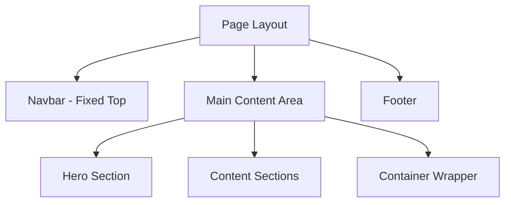

# Layout Components Documentation

> **Last Updated**: 2025-01-11  
> **Status**: Complete  
> **Version**: 1.0

## Overview

Layout components provide the structural foundation for the image2model application. These components ensure consistent navigation, content organization, and responsive behavior across all pages. This document covers the Navbar, Footer, Hero, and Container components that form the application's layout system.

## Table of Contents

- [Key Concepts](#key-concepts)
- [Architecture](#architecture)
- [Component Details](#component-details)
- [Usage Examples](#usage-examples)
- [Responsive Design](#responsive-design)
- [Accessibility](#accessibility)
- [Best Practices](#best-practices)
- [Troubleshooting](#troubleshooting)
- [Related Documentation](#related-documentation)

## Key Concepts

**Fixed Navigation**: Sticky navbar that remains accessible while scrolling.

**Responsive Layout**: Mobile-first design that adapts to all screen sizes.

**Content Sections**: Structured page sections with consistent spacing and styling.

**Visual Hierarchy**: Clear separation between navigation, content, and footer areas.

**Backdrop Effects**: Blur and transparency effects for modern UI aesthetics.

## Architecture

### Layout Structure



### File Structure

```
src/lib/components/
├── Navbar.svelte         # Top navigation
├── Footer.svelte         # Site footer
├── Hero.svelte          # Page headers
└── Container.svelte     # Content wrapper
```

### CSS Architecture

```
static/css/
├── variables.css        # CSS custom properties
├── components.css       # Component styles
└── layout.css          # Layout utilities
```

## Component Details

### Navbar Component

**Purpose**: Primary navigation with responsive mobile menu and brand identity.

**Location**: `src/lib/components/Navbar.svelte`

#### Props

| Prop | Type | Default | Description |
|------|------|---------|-------------|
| `variant` | `'default' \| 'landing'` | `'default'` | Navigation style variant |

#### Features

1. **Fixed Positioning**
   ```css
   .navbar {
     position: fixed;
     top: 0;
     width: 100%;
     z-index: 1000;
   }
   ```

2. **Backdrop Blur**
   ```css
   .navbar {
     background: rgba(26, 32, 44, 0.95);
     backdrop-filter: blur(10px);
   }
   ```

3. **Mobile Menu**
   ```svelte
   <button 
     class="navbar-toggle" 
     class:active={mobileMenuActive}
     on:click={toggleMobileMenu}
     aria-label="Toggle navigation"
   >
     <span class="navbar-toggle-bar"></span>
     <span class="navbar-toggle-bar"></span>
     <span class="navbar-toggle-bar"></span>
   </button>
   ```

#### Implementation Example

```svelte
<!-- Default navbar for app pages -->
<Navbar />

<!-- Landing page variant with smooth scroll -->
<Navbar variant="landing" />
```

### Footer Component

**Purpose**: Consistent site-wide footer with branding and navigation links.

**Location**: `src/lib/components/Footer.svelte`

#### Structure

```svelte
<footer class="site-footer">
  <div class="footer-container">
    <div class="footer-content">
      <!-- Brand section -->
      <div class="footer-brand">
        
        <p class="footer-tagline">
          Making 3D content creation accessible to everyone!
        </p>
      </div>
      
      <!-- Quick links -->
      <div class="footer-links">
        <ul class="footer-list">
          <li><a href="/#features">Features</a></li>
          <li><a href="/#pricing">Pricing</a></li>
          <li><a href="/#contact">Contact</a></li>
        </ul>
      </div>
    </div>
    
    <!-- Copyright -->
    <div class="footer-bottom">
      <p class="footer-text">© 2025 image2model. All rights reserved.</p>
    </div>
  </div>
</footer>
```

#### Styling

```css
.site-footer {
  background-color: #1a202c;
  color: white;
  padding: 3rem 0 1.5rem;
  margin-top: 5rem;
}

.footer-container {
  max-width: 1200px;
  margin: 0 auto;
  padding: 0 1rem;
}
```

### Hero Component

**Purpose**: Page header sections with gradient backgrounds and flexible content slots.

**Location**: `src/lib/components/Hero.svelte`

#### Props

| Prop | Type | Default | Description |
|------|------|---------|-------------|
| `title` | `string` | required | Main heading text |
| `subtitle` | `string` | optional | Supporting description |

#### Slots

- `content`: Additional content below title/subtitle

#### Usage

```svelte
<Hero 
  title="Upload Your Images"
  subtitle="Transform photos into professional 3D models in minutes"
>
  <div slot="content" class="hero-actions">
    <ProgressIndicator currentStep={1} />
  </div>
</Hero>
```

#### Gradient Background

```css
.hero {
  background: linear-gradient(135deg, #1a2332 0%, #2c3e50 100%);
  color: white;
  padding: 120px 0 80px; /* Account for fixed navbar */
}
```

### Container Component Pattern

While not a separate component, the container pattern is used throughout:

```css
.container {
  max-width: 1200px;
  margin: 0 auto;
  padding: 0 1rem;
}

/* Responsive widths */
@media (min-width: 640px) {
  .container { padding: 0 1.5rem; }
}

@media (min-width: 1024px) {
  .container { padding: 0 2rem; }
}
```

## Usage Examples

### Basic Page Layout

```svelte
<!-- File: src/routes/example/+page.svelte -->
<script>
  import Navbar from '$lib/components/Navbar.svelte';
  import Footer from '$lib/components/Footer.svelte';
  import Hero from '$lib/components/Hero.svelte';
</script>

<!-- Fixed Navigation -->
<Navbar />

<!-- Hero Section -->
<Hero title="Page Title" subtitle="Brief description">
  <div slot="content">
    <!-- Optional hero content -->
  </div>
</Hero>

<!-- Main Content -->
<main>
  <section class="content-section">
    <div class="container">
      <!-- Page content -->
    </div>
  </section>
</main>

<!-- Footer -->
<Footer />
```

### Landing Page Layout

```svelte
<!-- File: src/routes/+page.svelte -->
<script>
  import Navbar from '$lib/components/Navbar.svelte';
  import Footer from '$lib/components/Footer.svelte';
</script>

<!-- Landing navbar with smooth scroll -->
<Navbar variant="landing" />

<!-- Full-width hero -->
<section class="hero-landing">
  <div class="container">
    <h1 class="hero-title">Transform Images to 3D Models</h1>
    <p class="hero-subtitle">AI-powered 3D generation</p>
  </div>
</section>

<!-- Content sections -->
<main>
  <section id="features" class="section">
    <div class="container">
      <!-- Features content -->
    </div>
  </section>
  
  <section id="how-it-works" class="section">
    <div class="container">
      <!-- Process explanation -->
    </div>
  </section>
</main>

<Footer />
```

### Nested Layout with Breadcrumbs

```svelte
<!-- File: src/routes/upload/+page.svelte -->
<script>
  import Navbar from '$lib/components/Navbar.svelte';
  import Breadcrumb from '$lib/components/Breadcrumb.svelte';
  import Hero from '$lib/components/Hero.svelte';
  import Footer from '$lib/components/Footer.svelte';
</script>

<Navbar />

<!-- Breadcrumb navigation -->
<Breadcrumb 
  items={[
    { label: 'Home', href: '/' },
    { label: 'Upload', current: true },
    { label: 'Processing' },
    { label: 'Results' }
  ]}
/>

<Hero title="Upload Your Images">
  <div slot="content">
    <ProgressIndicator currentStep={1} />
  </div>
</Hero>

<main>
  <!-- Upload form content -->
</main>

<Footer />
```

## Responsive Design

### Breakpoint System

```css
/* Mobile First Breakpoints */
--screen-sm: 640px;   /* Small tablets */
--screen-md: 768px;   /* Tablets */
--screen-lg: 1024px;  /* Desktop */
--screen-xl: 1280px;  /* Large desktop */
```

### Navbar Responsive Behavior

```css
/* Desktop Navigation */
@media (min-width: 768px) {
  .navbar-menu {
    display: flex;
    position: static;
    transform: none;
    opacity: 1;
  }
  
  .navbar-toggle {
    display: none;
  }
}

/* Mobile Navigation */
@media (max-width: 767px) {
  .navbar-menu {
    position: absolute;
    top: 70px;
    left: 0;
    right: 0;
    background: rgba(26, 32, 44, 0.98);
    flex-direction: column;
    transform: translateY(-100%);
    opacity: 0;
    transition: all 0.3s ease;
  }
  
  .navbar-menu.active {
    transform: translateY(0);
    opacity: 1;
  }
}
```

### Footer Responsive Layout

```css
/* Desktop Footer */
@media (min-width: 768px) {
  .footer-content {
    display: flex;
    justify-content: space-between;
    align-items: flex-start;
  }
}

/* Mobile Footer */
@media (max-width: 767px) {
  .footer-content {
    flex-direction: column;
    gap: 2rem;
  }
  
  .footer-list {
    flex-direction: column;
    gap: 1rem;
  }
}
```

## Accessibility

### Navigation Accessibility

```svelte
<!-- Mobile menu toggle -->
<button 
  class="navbar-toggle"
  aria-label="Toggle navigation"
  aria-expanded={mobileMenuActive}
  aria-controls="navbar-menu"
>
  <!-- Icon bars -->
</button>

<ul 
  id="navbar-menu"
  class="navbar-menu"
  role="navigation"
  aria-label="Main navigation"
>
  <!-- Menu items -->
</ul>
```

### Skip Links

```svelte
<!-- Skip to main content -->
<a href="#main-content" class="skip-link">
  Skip to main content
</a>

<style>
  .skip-link {
    position: absolute;
    top: -40px;
    left: 0;
    background: #000;
    color: #fff;
    padding: 8px;
    text-decoration: none;
    z-index: 100;
  }
  
  .skip-link:focus {
    top: 0;
  }
</style>
```

### Landmark Roles

```svelte
<nav role="navigation" aria-label="Main">
  <!-- Navbar content -->
</nav>

<main role="main" id="main-content">
  <!-- Page content -->
</main>

<footer role="contentinfo">
  <!-- Footer content -->
</footer>
```

### Color Contrast

All layout components meet WCAG 2.1 AA standards:

| Component | Text | Background | Ratio | Compliance |
|-----------|------|------------|-------|------------|
| Navbar | #FFFFFF | #1A202C | 12.1:1 | AAA ✓ |
| Footer | #CBD5E0 | #1A202C | 8.5:1 | AAA ✓ |
| Hero | #FFFFFF | #1A2332 | 11.8:1 | AAA ✓ |

## Best Practices

### ✅ DO

- Keep navigation consistent across all pages
- Use semantic HTML elements
- Provide clear visual hierarchy
- Test responsive behavior at all breakpoints
- Include proper ARIA labels
- Maintain consistent spacing with containers

### ❌ DON'T

- Change navbar height between pages
- Use fixed widths that break responsive design
- Forget to account for navbar height in content
- Override container padding inconsistently
- Remove focus indicators
- Use too many nested containers

### Layout Patterns

```svelte
<!-- ✅ GOOD: Consistent section structure -->
<section class="feature-section">
  <div class="container">
    <h2>Section Title</h2>
    <div class="content">
      <!-- Content -->
    </div>
  </div>
</section>

<!-- ❌ BAD: Inconsistent structure -->
<section>
  <div style="max-width: 1000px; margin: auto;">
    <!-- Different container pattern -->
  </div>
</section>
```

## Troubleshooting

### Common Issues

#### Issue: Content hidden behind fixed navbar

**Cause**: Insufficient top padding on content

**Solution**:
```css
/* Account for navbar height */
.hero {
  padding-top: 120px; /* 70px navbar + 50px spacing */
}

main {
  padding-top: 90px; /* When no hero section */
}
```

#### Issue: Mobile menu not closing

**Cause**: Missing click handlers or state management

**Solution**:
```svelte
function closeMobileMenu() {
  mobileMenuActive = false;
}

// Close on link click
<a href="/page" on:click={closeMobileMenu}>
  Link
</a>
```

#### Issue: Footer overlapping content

**Cause**: Insufficient margin on main content

**Solution**:
```css
main {
  min-height: calc(100vh - 70px - 200px); /* Full height minus navbar and footer */
  margin-bottom: 5rem; /* Space before footer */
}
```

## Related Documentation

- [Component Library](./component-library.md) - All UI components
- [CSS Architecture](../styling/css-architecture.md) - Styling system
- [Responsive Design](../design/responsive-design.md) - Breakpoint system
- [Navigation Patterns](../patterns/navigation.md) - Navigation UX
- [Accessibility Guidelines](../../../brand/guidelines/accessibility.md) - WCAG compliance