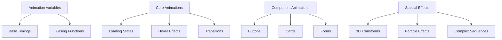

# Animation System

> **Last Updated**: 2025-07-11  
> **Status**: Complete  
> **Version**: 1.0

## Overview

The image2model animation system provides a comprehensive set of motion design patterns and utilities. This document covers animation principles, timing functions, common patterns, and implementation details for creating smooth, performant animations throughout the application.

## Table of Contents

- [Key Concepts](#key-concepts)
- [Architecture](#architecture)
- [Implementation](#implementation)
- [Usage Examples](#usage-examples)
- [API Reference](#api-reference)
- [Best Practices](#best-practices)
- [Troubleshooting](#troubleshooting)
- [Related Documentation](#related-documentation)

## Key Concepts

**Performance-First**: All animations use GPU-accelerated properties (transform, opacity) to ensure smooth 60fps performance.

**Purposeful Motion**: Every animation serves a functional purpose - providing feedback, guiding attention, or indicating state changes.

**Consistent Timing**: Standardized duration and easing functions create a cohesive feel across all interactions.

**Progressive Enhancement**: Animations enhance the experience but aren't required for functionality.

## Architecture

### Animation System Structure



### File Organization

```
frontend-svelte/static/css/
├── animation-utilities.css    # Utility classes for common animations
├── animations.css            # Core animation keyframes
├── loading-animations.css    # Loading and progress animations
├── button-animations.css     # Button interaction animations
├── card-animations.css       # Card hover and reveal effects
├── form-animations.css       # Form field interactions
└── special-effects.css       # Advanced visual effects
```

## Implementation

### Animation Timing Variables

```css
/* Transition Durations */
--transition-fast: 150ms;      /* Quick interactions */
--transition-base: 300ms;      /* Standard transitions */
--transition-slow: 500ms;      /* Deliberate animations */
--transition-slower: 1000ms;   /* Long sequences */

/* Easing Functions */
--ease-in: cubic-bezier(0.4, 0, 1, 1);
--ease-out: cubic-bezier(0, 0, 0.2, 1);
--ease-in-out: cubic-bezier(0.4, 0, 0.2, 1);
--ease-bounce: cubic-bezier(0.68, -0.55, 0.265, 1.55);
```

### Core Animation Keyframes

```css
/* Spin Animation */
@keyframes spin {
  to { transform: rotate(360deg); }
}

/* Pulse Animation */
@keyframes pulse {
  0%, 100% { opacity: 1; }
  50% { opacity: .5; }
}

/* Bounce Animation */
@keyframes bounce {
  0%, 100% { 
    transform: translateY(-25%);
    animation-timing-function: cubic-bezier(0.8, 0, 1, 1);
  }
  50% { 
    transform: none;
    animation-timing-function: cubic-bezier(0, 0, 0.2, 1);
  }
}

/* Fade In Animation */
@keyframes fadeIn {
  from { opacity: 0; }
  to { opacity: 1; }
}

/* Slide In Animations */
@keyframes slideInUp {
  from {
    transform: translateY(100%);
    opacity: 0;
  }
  to {
    transform: translateY(0);
    opacity: 1;
  }
}

@keyframes slideInDown {
  from {
    transform: translateY(-100%);
    opacity: 0;
  }
  to {
    transform: translateY(0);
    opacity: 1;
  }
}

/* Scale Animation */
@keyframes scaleIn {
  from {
    transform: scale(0.9);
    opacity: 0;
  }
  to {
    transform: scale(1);
    opacity: 1;
  }
}
```

### Loading Animations

```css
/* Spinning Loader */
.animate-spin {
  animation: spin 1s linear infinite;
}

/* Pulsing Loader */
.animate-pulse {
  animation: pulse 2s cubic-bezier(0.4, 0, 0.6, 1) infinite;
}

/* Bouncing Dots */
.loading-dots span {
  animation: bounce 1.4s infinite ease-in-out both;
}

.loading-dots span:nth-child(1) {
  animation-delay: -0.32s;
}

.loading-dots span:nth-child(2) {
  animation-delay: -0.16s;
}

/* Progress Bar */
.progress-bar {
  position: relative;
  overflow: hidden;
}

.progress-bar::after {
  content: '';
  position: absolute;
  top: 0;
  left: 0;
  bottom: 0;
  right: 0;
  background: linear-gradient(
    90deg,
    transparent,
    rgba(255, 255, 255, 0.3),
    transparent
  );
  transform: translateX(-100%);
  animation: shimmer 2s infinite;
}

@keyframes shimmer {
  100% {
    transform: translateX(100%);
  }
}
```

### Button Animations

```css
/* Scale on Hover */
.btn-scale {
  transition: transform var(--transition-fast) var(--ease-out);
}

.btn-scale:hover {
  transform: scale(1.05);
}

.btn-scale:active {
  transform: scale(0.95);
}

/* Lift Effect */
.btn-lift {
  transition: all var(--transition-base) var(--ease-out);
  box-shadow: 0 2px 4px rgba(0, 0, 0, 0.1);
}

.btn-lift:hover {
  transform: translateY(-2px);
  box-shadow: 0 4px 8px rgba(0, 0, 0, 0.15);
}

/* Ripple Effect */
.btn-ripple {
  position: relative;
  overflow: hidden;
}

.btn-ripple::before {
  content: '';
  position: absolute;
  top: 50%;
  left: 50%;
  width: 0;
  height: 0;
  border-radius: 50%;
  background: rgba(255, 255, 255, 0.5);
  transform: translate(-50%, -50%);
  transition: width 0.6s, height 0.6s;
}

.btn-ripple:active::before {
  width: 300px;
  height: 300px;
}
```

### Card Animations

```css
/* 3D Flip Card */
.card-flip {
  perspective: 1000px;
}

.card-flip-inner {
  transition: transform 0.6s;
  transform-style: preserve-3d;
}

.card-flip:hover .card-flip-inner {
  transform: rotateY(180deg);
}

/* Tilt Effect */
.card-tilt {
  transition: transform var(--transition-base) var(--ease-out);
  transform-style: preserve-3d;
}

.card-tilt:hover {
  transform: perspective(1000px) rotateX(10deg) rotateY(-10deg);
}

/* Reveal Content */
.card-reveal {
  position: relative;
  overflow: hidden;
}

.card-reveal-content {
  position: absolute;
  bottom: 0;
  left: 0;
  right: 0;
  background: linear-gradient(to top, rgba(0,0,0,0.8), transparent);
  transform: translateY(100%);
  transition: transform var(--transition-base) var(--ease-out);
}

.card-reveal:hover .card-reveal-content {
  transform: translateY(0);
}
```

### Form Animations

```css
/* Floating Label */
.form-floating {
  position: relative;
}

.form-floating label {
  position: absolute;
  top: 0.75rem;
  left: 0.75rem;
  transition: all var(--transition-base) var(--ease-out);
  pointer-events: none;
}

.form-floating input:focus ~ label,
.form-floating input:not(:placeholder-shown) ~ label {
  top: -0.5rem;
  left: 0.5rem;
  font-size: 0.75rem;
  background: white;
  padding: 0 0.25rem;
  color: var(--color-primary);
}

/* Input Focus Effect */
.input-focus {
  position: relative;
  border: 2px solid transparent;
  transition: border-color var(--transition-base) var(--ease-out);
}

.input-focus::after {
  content: '';
  position: absolute;
  bottom: -2px;
  left: 0;
  right: 0;
  height: 2px;
  background: var(--color-primary);
  transform: scaleX(0);
  transition: transform var(--transition-base) var(--ease-out);
}

.input-focus:focus {
  border-color: var(--color-primary);
}

.input-focus:focus::after {
  transform: scaleX(1);
}
```

### Special Effects

```css
/* Glitch Effect */
@keyframes glitch {
  0%, 100% {
    text-shadow: 
      0.05em 0 0 rgba(255, 0, 0, 0.75),
      -0.05em -0.025em 0 rgba(0, 255, 0, 0.75),
      0.025em 0.05em 0 rgba(0, 0, 255, 0.75);
  }
  14% {
    text-shadow: 
      0.05em 0 0 rgba(255, 0, 0, 0.75),
      -0.05em -0.025em 0 rgba(0, 255, 0, 0.75),
      0.025em 0.05em 0 rgba(0, 0, 255, 0.75);
  }
  15% {
    text-shadow: 
      -0.05em -0.025em 0 rgba(255, 0, 0, 0.75),
      0.025em 0.025em 0 rgba(0, 255, 0, 0.75),
      -0.05em -0.05em 0 rgba(0, 0, 255, 0.75);
  }
}

/* Particle Float */
@keyframes float {
  0%, 100% {
    transform: translateY(0) translateX(0) rotate(0deg);
  }
  33% {
    transform: translateY(-100px) translateX(-50px) rotate(120deg);
  }
  66% {
    transform: translateY(-50px) translateX(50px) rotate(240deg);
  }
}

/* Morphing Shape */
@keyframes morph {
  0% {
    border-radius: 5px;
    transform: rotate(0deg);
  }
  50% {
    border-radius: 50%;
    transform: rotate(180deg) scale(1.5);
  }
  100% {
    border-radius: 5px;
    transform: rotate(360deg);
  }
}
```

## Usage Examples

### Basic Usage

```html
<!-- Simple hover animation -->
<button class="btn animate-scale-on-hover">
  Hover Me
</button>

<!-- Loading spinner -->
<div class="animate-spin">
  <svg><!-- spinner icon --></svg>
</div>

<!-- Fade in on page load -->
<div class="animate-fadeIn">
  <h1>Welcome</h1>
</div>
```

### Advanced Usage

```html
<!-- Staggered animation sequence -->
<div class="card-grid">
  <div class="card animate-slideInUp" style="animation-delay: 0.1s">Card 1</div>
  <div class="card animate-slideInUp" style="animation-delay: 0.2s">Card 2</div>
  <div class="card animate-slideInUp" style="animation-delay: 0.3s">Card 3</div>
</div>

<!-- Complex button with multiple effects -->
<button class="btn btn-primary btn-lift btn-ripple">
  <span class="btn-text">Click Me</span>
  <span class="btn-icon animate-bounce">→</span>
</button>

<!-- 3D card flip -->
<div class="card-flip">
  <div class="card-flip-inner">
    <div class="card-flip-front">
      <h3>Front Side</h3>
    </div>
    <div class="card-flip-back">
      <h3>Back Side</h3>
    </div>
  </div>
</div>
```

## API Reference

### Animation Utility Classes

#### Basic Animations
- `.animate-spin` - Continuous rotation
- `.animate-pulse` - Pulsing opacity
- `.animate-bounce` - Bouncing motion
- `.animate-fadeIn` - Fade in from transparent
- `.animate-slideInUp` - Slide in from bottom
- `.animate-slideInDown` - Slide in from top
- `.animate-scaleIn` - Scale in from smaller size

#### Hover Animations
- `.animate-scale-on-hover` - Scale up on hover
- `.animate-lift-on-hover` - Lift with shadow
- `.animate-glow-on-hover` - Add glow effect
- `.animate-shake-on-hover` - Shake animation

#### Transition Utilities
- `.transition-all` - Transition all properties
- `.transition-none` - Disable transitions
- `.transition-fast` - 150ms duration
- `.transition-base` - 300ms duration
- `.transition-slow` - 500ms duration

## Best Practices

### ✅ DO

- **Use transform and opacity** for best performance
- **Add will-change** for complex animations
- **Test on low-end devices** to ensure smooth playback
- **Provide reduced motion alternatives** for accessibility
- **Use animation delays** for staggered effects
- **Keep animations under 500ms** for responsiveness
- **Use easing functions** for natural motion

### ❌ DON'T

- **Don't animate layout properties** (width, height, top, left)
- **Don't overuse animations** - less is more
- **Don't create infinite loops** without user control
- **Don't ignore accessibility** preferences
- **Don't use animations for critical functionality**
- **Don't chain too many animations** together
- **Don't forget fallbacks** for older browsers

## Troubleshooting

### Common Issues

#### Issue: Janky or stuttering animations

**Cause**: Animating expensive properties or too many elements

**Solution**:
```css
/* Use transform instead of position */
/* ❌ Bad */
.move {
  position: relative;
  transition: left 0.3s;
}
.move:hover {
  left: 10px;
}

/* ✅ Good */
.move {
  transition: transform 0.3s;
}
.move:hover {
  transform: translateX(10px);
}

/* Add will-change for complex animations */
.complex-animation {
  will-change: transform, opacity;
}
```

#### Issue: Animations not respecting user preferences

**Cause**: Not checking prefers-reduced-motion

**Solution**:
```css
/* Respect reduced motion preference */
@media (prefers-reduced-motion: reduce) {
  * {
    animation-duration: 0.01ms !important;
    animation-iteration-count: 1 !important;
    transition-duration: 0.01ms !important;
  }
}

/* Alternative static styles */
@media (prefers-reduced-motion: reduce) {
  .animate-bounce {
    animation: none;
    transform: none;
  }
}
```

#### Issue: Animation timing feels wrong

**Cause**: Linear easing or inappropriate duration

**Solution**:
```css
/* Use appropriate easing functions */
.natural-motion {
  /* For enter animations */
  transition: all 0.3s cubic-bezier(0, 0, 0.2, 1);
  
  /* For exit animations */
  transition: all 0.2s cubic-bezier(0.4, 0, 1, 1);
  
  /* For bounce effects */
  transition: all 0.5s cubic-bezier(0.68, -0.55, 0.265, 1.55);
}
```

## Related Documentation

- [CSS Architecture](./css-architecture.md) - Overall CSS structure
- [Performance Guide](../performance.md) - Animation performance tips
- [Accessibility](../../accessibility.md) - Motion accessibility
- [Component Library](../components/README.md) - Animated components