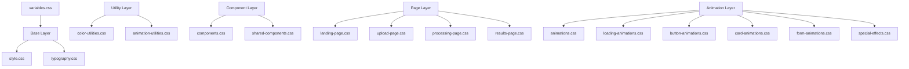

# CSS Architecture

> **Last Updated**: 2025-01-11  
> **Status**: Complete  
> **Version**: 1.0

## Overview

This document describes the CSS architecture and methodology used in the image2model frontend-svelte application. It explains the file structure, naming conventions, and design principles that ensure maintainable and scalable styles across the application.

## Table of Contents

- [Key Concepts](#key-concepts)
- [Architecture](#architecture)
- [Implementation](#implementation)
- [Usage Examples](#usage-examples)
- [API Reference](#api-reference)
- [Best Practices](#best-practices)
- [Troubleshooting](#troubleshooting)
- [Related Documentation](#related-documentation)

## Key Concepts

**CSS Custom Properties**: Native CSS variables that enable dynamic theming and consistent design tokens across the application.

**Utility-First Approach**: Small, single-purpose classes that can be composed to build complex designs without writing custom CSS.

**Component CSS**: Isolated styles for specific UI components that encapsulate their visual behavior.

**Animation Utilities**: Reusable animation classes that provide consistent motion design throughout the application.

## Architecture

### System Design



### File Structure

```
frontend-svelte/static/css/
├── variables.css              # CSS custom properties and design tokens
├── style.css                  # Base styles and resets
├── typography.css             # Font system and text styles
├── color-utilities.css        # Color utility classes
├── animation-utilities.css    # Animation utility classes
├── components.css             # Component-specific styles
├── shared-components.css      # Shared component patterns
├── animations.css             # Core animation definitions
├── loading-animations.css     # Loading state animations
├── button-animations.css      # Button interaction animations
├── card-animations.css        # Card hover and transition effects
├── form-animations.css        # Form interaction animations
├── special-effects.css        # Advanced visual effects
├── landing-page.css           # Landing page specific styles
├── upload-page.css            # Upload page specific styles
├── processing-page.css        # Processing page specific styles
└── results-page.css           # Results page specific styles
```

## Implementation

### Technical Details

#### 1. CSS Loading Order

The CSS files are loaded in a specific order to ensure proper cascade and specificity:

```html
<!-- Base layer -->
<link rel="stylesheet" href="/css/variables.css">
<link rel="stylesheet" href="/css/style.css">
<link rel="stylesheet" href="/css/typography.css">

<!-- Utility layer -->
<link rel="stylesheet" href="/css/color-utilities.css">
<link rel="stylesheet" href="/css/animation-utilities.css">

<!-- Component layer -->
<link rel="stylesheet" href="/css/components.css">
<link rel="stylesheet" href="/css/shared-components.css">

<!-- Animation layer -->
<link rel="stylesheet" href="/css/animations.css">
<link rel="stylesheet" href="/css/loading-animations.css">
<link rel="stylesheet" href="/css/button-animations.css">
<link rel="stylesheet" href="/css/card-animations.css">
<link rel="stylesheet" href="/css/form-animations.css">
<link rel="stylesheet" href="/css/special-effects.css">

<!-- Page-specific styles (loaded on demand) -->
<link rel="stylesheet" href="/css/landing-page.css">
```

#### 2. CSS Custom Properties Strategy

All design tokens are defined as CSS custom properties in `variables.css`:

- **Brand Colors**: Direct mapping from brand guidelines
- **Semantic Colors**: Purpose-based color assignments
- **Spacing Scale**: Consistent spacing system
- **Typography Scale**: Font sizes and line heights
- **Animation Timings**: Transition durations and easings
- **Breakpoints**: Responsive design breakpoints

#### 3. Naming Conventions

**BEM-inspired Naming**: We use a modified BEM approach for component classes:
- Block: `.component-name`
- Element: `.component-name__element`
- Modifier: `.component-name--modifier`

**Utility Classes**: Follow a consistent pattern:
- Color: `.text-{color}`, `.bg-{color}`
- Spacing: `.p-{size}`, `.m-{size}`
- Animation: `.animate-{name}`

### Configuration

| File | Purpose | Key Variables |
|------|---------|---------------|
| `variables.css` | Design tokens | `--brand-*`, `--color-*`, `--space-*` |
| `style.css` | Base styles | Reset, box-sizing, body defaults |
| `typography.css` | Text styles | `.h1` to `.h6`, `.text-*` |
| `color-utilities.css` | Color classes | `.text-*`, `.bg-*`, `.border-*` |
| `animation-utilities.css` | Motion classes | `.animate-*`, `.transition-*` |

## Usage Examples

### Basic Usage

```html
<!-- File: src/components/Button.svelte -->
<!-- Using utility classes for a button -->
<button class="btn btn-primary animate-scale-on-hover">
  Click me
</button>

<!-- Using semantic color variables -->
<div class="bg-primary text-white p-4 rounded-lg">
  <h2 class="h2 mb-2">Welcome</h2>
  <p class="text-body">This uses our design system.</p>
</div>
```

### Advanced Usage

```css
/* File: src/components/CustomCard.svelte */
/* Creating a custom component using design tokens */
<style>
  .custom-card {
    background: var(--bg-primary);
    border: 1px solid var(--border-color);
    border-radius: var(--radius-lg);
    padding: var(--space-6);
    box-shadow: var(--shadow-md);
    transition: all var(--transition-base) var(--ease-out);
  }
  
  .custom-card:hover {
    transform: translateY(-2px);
    box-shadow: var(--shadow-lg);
    border-color: var(--brand-bright-cyan);
  }
</style>

<div class="custom-card">
  <!-- Card content -->
</div>
```

## API Reference

### Methods

#### CSS Utility Classes

**Color Utilities**:
- `.text-{color}`: Apply text color
- `.bg-{color}`: Apply background color
- `.border-{color}`: Apply border color

**Available colors**: primary, secondary, success, warning, error, info, white, black, gray-{100-900}, blue-{100-900}, red-{100-900}

**Example**:
```html
<div class="bg-blue-500 text-white p-4">
  Blue background with white text
</div>
```

#### Animation Utilities

**Hover Animations**:
- `.animate-scale-on-hover`: Scale element on hover
- `.animate-lift-on-hover`: Lift element with shadow on hover
- `.animate-glow-on-hover`: Add glow effect on hover

**Loading Animations**:
- `.animate-spin`: Continuous rotation
- `.animate-pulse`: Pulsing opacity
- `.animate-bounce`: Bouncing motion

**Example**:
```html
<button class="btn animate-scale-on-hover">
  Hover me
</button>

<div class="animate-spin">
  <svg><!-- Loading spinner --></svg>
</div>
```

## Best Practices

### ✅ DO

- **Use CSS custom properties** for all colors, spacing, and timing values
- **Compose utility classes** before writing custom CSS
- **Follow the naming conventions** for consistency
- **Keep specificity low** by avoiding deep nesting
- **Use semantic color names** (primary, secondary) over literal colors (blue, red)
- **Test responsive behavior** at all breakpoints
- **Leverage existing animations** before creating new ones

### ❌ DON'T

- **Don't use inline styles** except for truly dynamic values
- **Don't use `!important`** unless absolutely necessary
- **Don't create one-off utility classes** - add them to the utility files
- **Don't use hard-coded colors** - always use CSS variables
- **Don't mix naming conventions** within the same component
- **Don't create deeply nested selectors** (max 3 levels)
- **Don't override framework classes** - create new ones instead

## Troubleshooting

### Common Issues

#### Issue: Styles not applying in production

**Cause**: CSS files not properly imported or build process issue

**Solution**:
```bash
# Ensure all CSS files are in static/css/
# Check the app.html file includes the base CSS files
# Rebuild the application
npm run build
```

#### Issue: CSS variable not working

**Cause**: Variable not defined or typo in variable name

**Solution**:
```css
/* Check variables.css for the correct variable name */
/* Use browser DevTools to inspect computed styles */
/* Ensure variable is defined before use */
.element {
  /* ❌ Wrong */
  color: var(--bran-primary);
  
  /* ✅ Correct */
  color: var(--brand-primary);
}
```

#### Issue: Animation performance issues

**Cause**: Animating expensive properties or too many elements

**Solution**:
```css
/* ❌ Avoid animating layout properties */
.bad-animation {
  transition: width 0.3s, height 0.3s;
}

/* ✅ Use transform and opacity */
.good-animation {
  transition: transform 0.3s, opacity 0.3s;
  will-change: transform;
}
```

## Related Documentation

- [Theming System](./theming.md) - Color system and theme implementation
- [Animation System](./animation-system.md) - Animation patterns and utilities
- [Responsive Design](./responsive-design.md) - Breakpoints and mobile patterns
- [Typography](./typography.md) - Font system and text styles
- [Spacing System](./spacing-system.md) - Spacing scale and layout utilities