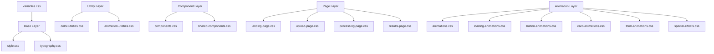

# CSS Architecture

> **Last Updated**: 2025-07-11  
> **Status**: Complete  
> **Version**: 1.0

## Overview

This document describes the CSS architecture and methodology used in the image2model frontend-svelte application. It explains the file structure, naming conventions, and design principles that ensure maintainable and scalable styles across the application.

## Table of Contents

- [Key Concepts](#key-concepts)
- [Architecture](#architecture)
- [Implementation](#implementation)
- [Usage Examples](#usage-examples)
- [API Reference](#api-reference)
- [Best Practices](#best-practices)
- [Troubleshooting](#troubleshooting)
- [Related Documentation](#related-documentation)

## Key Concepts

**CSS Custom Properties**: Native CSS variables that enable dynamic theming and consistent design tokens across the application.

**Utility-First Approach**: Small, single-purpose classes that can be composed to build complex designs without writing custom CSS.

**Component CSS**: Isolated styles for specific UI components that encapsulate their visual behavior.

**Animation Utilities**: Reusable animation classes that provide consistent motion design throughout the application.

## Architecture

### System Design



### File Structure

```
frontend-svelte/static/css/
├── variables.css              # CSS custom properties and design tokens
├── style.css                  # Base styles and resets
├── typography.css             # Font system and text styles
├── color-utilities.css        # Color utility classes
├── animation-utilities.css    # Animation utility classes
├── components.css             # Component-specific styles
├── shared-components.css      # Shared component patterns
├── animations.css             # Core animation definitions
├── loading-animations.css     # Loading state animations
├── button-animations.css      # Button interaction animations
├── card-animations.css        # Card hover and transition effects
├── form-animations.css        # Form interaction animations
├── special-effects.css        # Advanced visual effects
├── landing-page.css           # Landing page specific styles
├── upload-page.css            # Upload page specific styles
├── processing-page.css        # Processing page specific styles
└── results-page.css           # Results page specific styles
```

## Implementation

### Technical Details

#### 1. CSS Loading Order

The CSS files are imported via app.css and app-core.css:

```css
/* From app.css - All styles loaded in order */
@import '/css/variables.css';          /* Design tokens */
@import '/css/style.css';              /* Base styles and resets */
@import '/css/components.css';         /* Component styles */
@import '/css/shared-components.css';  /* Shared patterns */
@import '/css/typography.css';         /* Font system */
@import '/css/animations.css';         /* Core animations */
@import '/css/animation-utilities.css'; /* Animation utilities */
@import '/css/button-animations.css';  /* Button effects */
@import '/css/card-animations.css';    /* Card effects */
@import '/css/color-utilities.css';    /* Color utilities */
@import '/css/form-animations.css';    /* Form effects */
@import '/css/loading-animations.css'; /* Loading states */
@import '/css/special-effects.css';    /* Advanced effects */
@import '/css/landing-page.css';       /* Landing page */
@import '/css/upload-page.css';        /* Upload page */
@import '/css/processing-page.css';    /* Processing page */
@import '/css/results-page.css';       /* Results page */
```

#### 2. CSS Custom Properties Strategy

Design tokens are split across multiple files:

**variables.css**:
- **Brand Colors**: Direct mapping from brand guidelines
- **Semantic Colors**: Purpose-based color assignments  
- **Basic Spacing**: Simple 6-level system (xs to 2xl)
- **Shadows**: Box shadow definitions
- **Border Radius**: Radius scale
- **Transitions**: Basic transition timings

**typography.css**:
- **Font Families**: System and mono font stacks
- **Font Weights**: Light to black (300-900)
- **Font Sizes**: xs to 9xl scale
- **Line Heights**: Leading scale
- **Letter Spacing**: Tracking scale

**animations.css**:
- **Timing Functions**: Advanced easing curves
- **Animation Durations**: Micro to xl timings
- **Keyframes**: All animation definitions

Note: Responsive breakpoints are hard-coded values, not CSS variables

#### 3. Naming Conventions

**BEM-inspired Naming**: We use a modified BEM approach for component classes:
- Block: `.component-name`
- Element: `.component-name__element`
- Modifier: `.component-name--modifier`

**Utility Classes**: Follow a consistent pattern:
- Color: `.text-{color}`, `.bg-{color}`
- Spacing: `.p-{size}`, `.m-{size}`
- Animation: `.animate-{name}`

### Configuration

| File | Purpose | Key Contents |
|------|---------|---------------|
| `variables.css` | Design tokens | `--brand-*`, `--color-*`, `--spacing-*`, `--transition-*` |
| `style.css` | Base styles | Reset, imports, component overrides |
| `typography.css` | Font system | `--font-*`, `--text-*`, heading styles |
| `color-utilities.css` | Color classes | `.text-*`, `.bg-*`, `.border-*` utilities |
| `animation-utilities.css` | Motion classes | `.animate-*` utility classes |
| `animations.css` | Keyframes | `@keyframes`, timing functions |

## Usage Examples

### Basic Usage

```html
<!-- File: src/components/Button.svelte -->
<!-- Using utility classes for a button -->
<button class="btn btn-primary animate-scale-on-hover">
  Click me
</button>

<!-- Using semantic color variables -->
<div class="bg-primary text-white p-4 rounded-lg">
  <h2 class="h2 mb-2">Welcome</h2>
  <p class="text-body">This uses our design system.</p>
</div>
```

### Advanced Usage

```css
/* File: src/components/CustomCard.svelte */
/* Creating a custom component using design tokens */
<style>
  .custom-card {
    background: var(--bg-primary);
    border: 1px solid var(--border-color);
    border-radius: var(--radius-lg);
    padding: var(--space-6);
    box-shadow: var(--shadow-md);
    transition: all var(--transition-base) var(--ease-out);
  }
  
  .custom-card:hover {
    transform: translateY(-2px);
    box-shadow: var(--shadow-lg);
    border-color: var(--brand-bright-cyan);
  }
</style>

<div class="custom-card">
  <!-- Card content -->
</div>
```

## API Reference

### Methods

#### CSS Utility Classes

**Color Utilities**:
- `.text-{color}`: Apply text color
- `.bg-{color}`: Apply background color
- `.border-{color}`: Apply border color

**Theme colors**: primary, secondary, muted (use semantic variables)
**Brand colors**: brand-primary, brand-secondary, etc.
**Status colors**: success, warning, error, info
**Shades**: blue-{100-900}, red-{100-900}, yellow-{100-900}, orange-{100-900}, gray-{100-900}

**Example**:
```html
<div class="bg-blue-500 text-white p-4">
  Blue background with white text
</div>
```

#### Animation Utilities

**Hover Animations**:
- `.animate-scale-on-hover`: Scale element on hover
- `.animate-lift-on-hover`: Lift element with shadow on hover
- `.animate-glow-on-hover`: Add glow effect on hover

**Loading Animations**:
- `.animate-rotate`: Continuous rotation
- `.animate-scale-pulse`: Pulsing scale effect
- `.animate-bounce`: Bouncing motion
- `.low-poly-spinner`: Geometric spinner

**Example**:
```html
<button class="btn animate-scale-on-hover">
  Hover me
</button>

<div class="animate-spin">
  <svg><!-- Loading spinner --></svg>
</div>
```

## Best Practices

### ✅ DO

- **Use CSS custom properties** for all colors, spacing, and timing values
- **Compose utility classes** before writing custom CSS
- **Follow the naming conventions** for consistency
- **Keep specificity low** by avoiding deep nesting
- **Use semantic color names** (primary, secondary) over literal colors (blue, red)
- **Test responsive behavior** at all breakpoints
- **Leverage existing animations** before creating new ones

### ❌ DON'T

- **Don't use inline styles** except for truly dynamic values
- **Don't use `!important`** unless absolutely necessary
- **Don't create one-off utility classes** - add them to the utility files
- **Don't use hard-coded colors** - always use CSS variables
- **Don't mix naming conventions** within the same component
- **Don't create deeply nested selectors** (max 3 levels)
- **Don't override framework classes** - create new ones instead

## Troubleshooting

### Common Issues

#### Issue: Styles not applying in production

**Cause**: CSS files not properly imported or build process issue

**Solution**:
```bash
# Ensure all CSS files are in static/css/
# Check the app.html file includes the base CSS files
# Rebuild the application
npm run build
```

#### Issue: CSS variable not working

**Cause**: Variable not defined or typo in variable name

**Solution**:
```css
/* Check variables.css for the correct variable name */
/* Use browser DevTools to inspect computed styles */
/* Ensure variable is defined before use */
.element {
  /* ❌ Wrong */
  color: var(--bran-primary);
  
  /* ✅ Correct */
  color: var(--brand-primary);
}
```

#### Issue: Animation performance issues

**Cause**: Animating expensive properties or too many elements

**Solution**:
```css
/* ❌ Avoid animating layout properties */
.bad-animation {
  transition: width 0.3s, height 0.3s;
}

/* ✅ Use transform and opacity */
.good-animation {
  transition: transform 0.3s, opacity 0.3s;
  will-change: transform;
}
```

## Related Documentation

- [Theming System](./theming.md) - Color system and theme implementation
- [Animation System](./animation-system.md) - Animation patterns and utilities
- [Responsive Design](./responsive-design.md) - Breakpoints and mobile patterns
- [Typography](./typography.md) - Font system and text styles
- [Spacing System](./spacing-system.md) - Spacing scale and layout utilities