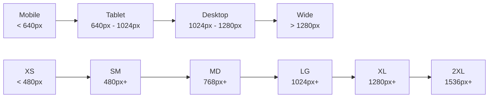

# Responsive Design

> **Last Updated**: 2025-07-11  
> **Status**: Complete  
> **Version**: 1.0

## Overview

The image2model responsive design system ensures a consistent and optimized experience across all device sizes. This document covers breakpoints, responsive patterns, mobile-first methodology, and implementation strategies for building adaptive interfaces.

## Table of Contents

- [Key Concepts](#key-concepts)
- [Architecture](#architecture)
- [Implementation](#implementation)
- [Usage Examples](#usage-examples)
- [API Reference](#api-reference)
- [Best Practices](#best-practices)
- [Troubleshooting](#troubleshooting)
- [Related Documentation](#related-documentation)

## Key Concepts

**Mobile-First Approach**: Start with mobile layouts and progressively enhance for larger screens, ensuring performance on constrained devices.

**Fluid Typography**: Type scales smoothly between breakpoints using CSS clamp() for optimal readability at any screen size.

**Flexible Grid System**: Content adapts using CSS Grid and Flexbox, avoiding rigid frameworks for maximum flexibility.

**Touch-Friendly Interfaces**: Interactive elements are sized and spaced appropriately for touch input on mobile devices.

## Architecture

### Breakpoint System



### Responsive Strategy

```
┌─────────────────────────────────────────────────┐
│                  Mobile First                    │
│                                                  │
│  1. Base styles for mobile (320px min)          │
│  2. Enhance at each breakpoint                  │
│  3. Max container width at 1200px               │
│  4. Fluid scaling between breakpoints           │
│                                                  │
└─────────────────────────────────────────────────┘
```

## Implementation

### Breakpoint Variables

```css
/* Responsive Breakpoints from brand/developer-reference.md */
:root {
  /* Screen sizes */
  --screen-xs: 480px;
  --screen-sm: 640px;
  --screen-md: 768px;
  --screen-lg: 1024px;
  --screen-xl: 1280px;
  --screen-2xl: 1536px;
  
  /* Container max widths */
  --container-sm: 640px;
  --container-md: 768px;
  --container-lg: 1024px;
  --container-xl: 1200px;
}

/* Media Query Mixins (PostCSS) */
@custom-media --xs-up (min-width: 480px);
@custom-media --sm-up (min-width: 640px);
@custom-media --md-up (min-width: 768px);
@custom-media --lg-up (min-width: 1024px);
@custom-media --xl-up (min-width: 1280px);
@custom-media --2xl-up (min-width: 1536px);

/* Media Query Usage */
@media (min-width: 640px) { /* sm */ }
@media (min-width: 768px) { /* md */ }
@media (min-width: 1024px) { /* lg */ }
@media (min-width: 1280px) { /* xl */ }
```

### Container System

```css
/* Responsive Container */
.container {
  width: 100%;
  margin: 0 auto;
  padding: 0 1rem;
}

@media (min-width: 640px) {
  .container {
    max-width: 640px;
    padding: 0 1.5rem;
  }
}

@media (min-width: 768px) {
  .container {
    max-width: 768px;
  }
}

@media (min-width: 1024px) {
  .container {
    max-width: 1024px;
    padding: 0 2rem;
  }
}

@media (min-width: 1280px) {
  .container {
    max-width: 1200px;
  }
}

/* Full-width Container */
.container-fluid {
  width: 100%;
  padding: 0 1rem;
}

/* Narrow Container */
.container-narrow {
  max-width: 800px;
  margin: 0 auto;
}
```

### Fluid Typography

```css
/* Responsive Type Scale */
:root {
  /* Fluid font sizes using clamp() */
  --text-xs: clamp(0.75rem, 0.7rem + 0.25vw, 0.875rem);
  --text-sm: clamp(0.875rem, 0.8rem + 0.375vw, 1rem);
  --text-base: clamp(1rem, 0.9rem + 0.5vw, 1.125rem);
  --text-lg: clamp(1.125rem, 1rem + 0.625vw, 1.25rem);
  --text-xl: clamp(1.25rem, 1.1rem + 0.75vw, 1.5rem);
  --text-2xl: clamp(1.5rem, 1.3rem + 1vw, 2rem);
  --text-3xl: clamp(1.875rem, 1.5rem + 1.875vw, 2.5rem);
  --text-4xl: clamp(2.25rem, 1.75rem + 2.5vw, 3.5rem);
  --text-5xl: clamp(3rem, 2rem + 5vw, 4.5rem);
}

/* Heading Responsive Sizes */
.h1 {
  font-size: var(--text-4xl);
  line-height: 1.1;
}

.h2 {
  font-size: var(--text-3xl);
  line-height: 1.2;
}

.h3 {
  font-size: var(--text-2xl);
  line-height: 1.3;
}

/* Body Text */
.text-body {
  font-size: var(--text-base);
  line-height: 1.6;
}

@media (min-width: 768px) {
  .text-body {
    line-height: 1.7;
  }
}
```

### Grid System

```css
/* Responsive Grid */
.grid {
  display: grid;
  gap: 1rem;
  grid-template-columns: 1fr;
}

/* Two columns on tablet */
@media (min-width: 768px) {
  .grid-md-2 {
    grid-template-columns: repeat(2, 1fr);
  }
}

/* Three columns on desktop */
@media (min-width: 1024px) {
  .grid-lg-3 {
    grid-template-columns: repeat(3, 1fr);
  }
}

/* Four columns on wide screens */
@media (min-width: 1280px) {
  .grid-xl-4 {
    grid-template-columns: repeat(4, 1fr);
  }
}

/* Auto-fit Grid */
.grid-auto {
  display: grid;
  gap: 1rem;
  grid-template-columns: repeat(auto-fit, minmax(250px, 1fr));
}

/* Responsive Flexbox */
.flex-responsive {
  display: flex;
  flex-direction: column;
  gap: 1rem;
}

@media (min-width: 768px) {
  .flex-responsive {
    flex-direction: row;
  }
}
```

### Responsive Spacing

```css
/* Mobile-first spacing utilities */
.p-responsive {
  padding: 1rem;
}

@media (min-width: 768px) {
  .p-responsive {
    padding: 1.5rem;
  }
}

@media (min-width: 1024px) {
  .p-responsive {
    padding: 2rem;
  }
}

/* Responsive margins */
.section-spacing {
  margin-top: 2rem;
  margin-bottom: 2rem;
}

@media (min-width: 768px) {
  .section-spacing {
    margin-top: 3rem;
    margin-bottom: 3rem;
  }
}

@media (min-width: 1024px) {
  .section-spacing {
    margin-top: 4rem;
    margin-bottom: 4rem;
  }
}
```

### Touch-Friendly Components

```css
/* Minimum touch target size: 44x44px */
.touch-target {
  min-height: 44px;
  min-width: 44px;
  display: inline-flex;
  align-items: center;
  justify-content: center;
}

/* Mobile button sizing */
.btn-mobile {
  padding: 0.75rem 1.5rem;
  font-size: 1rem;
  min-height: 48px;
}

/* Responsive navigation */
.nav-mobile {
  position: fixed;
  top: 0;
  left: -100%;
  width: 80%;
  max-width: 300px;
  height: 100vh;
  background: var(--bg-primary);
  transition: left 0.3s ease;
  z-index: 1000;
}

.nav-mobile.active {
  left: 0;
}

@media (min-width: 1024px) {
  .nav-mobile {
    position: static;
    width: auto;
    max-width: none;
    height: auto;
    background: transparent;
  }
}
```

### Responsive Images

```css
/* Responsive image defaults */
img {
  max-width: 100%;
  height: auto;
  display: block;
}

/* Art direction with picture element */
picture img {
  width: 100%;
  height: auto;
  object-fit: cover;
}

/* Responsive background images */
.hero-bg {
  background-image: url('/images/hero-mobile.jpg');
  background-size: cover;
  background-position: center;
}

@media (min-width: 768px) {
  .hero-bg {
    background-image: url('/images/hero-tablet.jpg');
  }
}

@media (min-width: 1024px) {
  .hero-bg {
    background-image: url('/images/hero-desktop.jpg');
  }
}
```

### Responsive Tables

```css
/* Mobile-first table */
.table-responsive {
  width: 100%;
  overflow-x: auto;
  -webkit-overflow-scrolling: touch;
}

/* Stack table on mobile */
@media (max-width: 767px) {
  .table-stack thead {
    display: none;
  }
  
  .table-stack tr {
    display: block;
    margin-bottom: 1rem;
    border: 1px solid var(--border-color);
    border-radius: var(--radius-md);
  }
  
  .table-stack td {
    display: block;
    text-align: right;
    padding-left: 50%;
    position: relative;
  }
  
  .table-stack td:before {
    content: attr(data-label);
    position: absolute;
    left: 1rem;
    text-align: left;
    font-weight: 600;
  }
}
```

## Usage Examples

### Basic Usage

```html
<!-- Responsive container -->
<div class="container">
  <h1 class="h1">Responsive Heading</h1>
  <p class="text-body">This content adapts to screen size.</p>
</div>

<!-- Responsive grid -->
<div class="grid grid-md-2 grid-lg-3">
  <div class="card">Card 1</div>
  <div class="card">Card 2</div>
  <div class="card">Card 3</div>
</div>

<!-- Mobile-first spacing -->
<section class="section-spacing p-responsive">
  <h2>Responsive Section</h2>
</section>
```

### Advanced Usage

```html
<!-- Responsive navigation pattern -->
<nav class="nav-wrapper">
  <!-- Mobile menu button -->
  <button class="nav-toggle touch-target lg:hidden" aria-label="Menu">
    <svg><!-- hamburger icon --></svg>
  </button>
  
  <!-- Navigation items -->
  <ul class="nav-mobile lg:flex lg:gap-4">
    <li><a href="#" class="nav-link touch-target">Home</a></li>
    <li><a href="#" class="nav-link touch-target">About</a></li>
    <li><a href="#" class="nav-link touch-target">Contact</a></li>
  </ul>
</nav>

<!-- Art-directed images -->
<picture>
  <source media="(min-width: 1024px)" 
          srcset="/images/hero-desktop.webp" 
          type="image/webp">
  <source media="(min-width: 768px)" 
          srcset="/images/hero-tablet.webp" 
          type="image/webp">
  <source srcset="/images/hero-mobile.webp" 
          type="image/webp">
  
</picture>

<!-- Responsive component with custom breakpoints -->
<div class="feature-card">
  <style>
    .feature-card {
      display: grid;
      gap: 1rem;
    }
    
    @media (min-width: 600px) and (max-width: 900px) {
      .feature-card {
        grid-template-columns: 1fr 2fr;
      }
    }
    
    @media (min-width: 901px) {
      .feature-card {
        grid-template-columns: 1fr 1fr 1fr;
      }
    }
  </style>
  <!-- Content -->
</div>
```

## API Reference

### Responsive Utility Classes

#### Display Utilities
```css
.hidden        /* Hidden on all screens */
.sm:block      /* Block on sm and up */
.md:flex       /* Flex on md and up */
.lg:grid       /* Grid on lg and up */
.xl:hidden     /* Hidden on xl and up */
```

#### Grid Utilities
```css
.grid          /* Base grid container */
.grid-md-2     /* 2 columns on md and up */
.grid-lg-3     /* 3 columns on lg and up */
.grid-xl-4     /* 4 columns on xl and up */
.grid-auto     /* Auto-fit responsive grid */
```

#### Spacing Utilities
```css
.p-responsive  /* Responsive padding */
.m-responsive  /* Responsive margin */
.gap-responsive /* Responsive gap */
```

## Best Practices

### ✅ DO

- **Start mobile-first** and enhance progressively
- **Use relative units** (rem, em, %) over pixels
- **Test on real devices** not just browser DevTools
- **Optimize images** for each breakpoint
- **Use CSS Grid and Flexbox** for layouts
- **Ensure touch targets** are at least 44x44px
- **Test with different zoom levels** (up to 200%)

### ❌ DON'T

- **Don't use fixed widths** on containers
- **Don't hide important content** on mobile
- **Don't rely on hover** for mobile interactions
- **Don't use tiny fonts** on mobile (min 16px)
- **Don't create separate mobile sites**
- **Don't forget landscape orientation**
- **Don't ignore performance** on mobile networks

## Troubleshooting

### Common Issues

#### Issue: Layout breaks at specific screen sizes

**Cause**: Content doesn't fit between breakpoints

**Solution**:
```css
/* Add intermediate breakpoints if needed */
@media (min-width: 900px) and (max-width: 1023px) {
  .problem-component {
    /* Specific adjustments */
  }
}

/* Or use fluid sizing */
.flexible-component {
  width: clamp(300px, 50vw, 600px);
}
```

#### Issue: Text too small on mobile

**Cause**: Fixed font sizes or viewport scaling issues

**Solution**:
```html
<!-- Ensure viewport meta tag is correct -->
<meta name="viewport" content="width=device-width, initial-scale=1">

<!-- Use fluid typography -->
<style>
  body {
    font-size: clamp(16px, 4vw, 18px);
  }
</style>
```

#### Issue: Images loading slowly on mobile

**Cause**: Loading desktop-sized images on mobile

**Solution**:
```html
<!-- Use responsive images -->


<!-- Or use picture element for art direction -->
<picture>
  <source media="(max-width: 640px)" srcset="mobile.jpg">
  <source media="(max-width: 1024px)" srcset="tablet.jpg">
  
</picture>
```

## Related Documentation

- [CSS Architecture](./css-architecture.md) - CSS structure and methodology
- [Typography](./typography.md) - Responsive type system
- [Performance Guide](../performance.md) - Mobile performance optimization
- [Accessibility](../../accessibility.md) - Mobile accessibility considerations