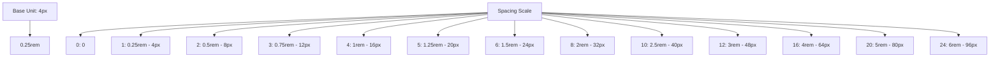

# Spacing System

> **Last Updated**: 2025-01-11  
> **Status**: Complete  
> **Version**: 1.0

## Overview

The image2model spacing system provides a consistent and scalable approach to layout spacing, margins, and padding. This document covers the spacing scale, utility classes, layout patterns, and implementation strategies for maintaining visual rhythm throughout the application.

## Table of Contents

- [Key Concepts](#key-concepts)
- [Architecture](#architecture)
- [Implementation](#implementation)
- [Usage Examples](#usage-examples)
- [API Reference](#api-reference)
- [Best Practices](#best-practices)
- [Troubleshooting](#troubleshooting)
- [Related Documentation](#related-documentation)

## Key Concepts

**8-Point Grid**: All spacing values are based on multiples of 8px (0.5rem) for visual consistency and alignment.

**Spacing Scale**: A harmonious progression of spacing values that creates predictable visual rhythm.

**Composite Spacing**: Combines multiple spacing utilities for complex layouts without custom CSS.

**Responsive Spacing**: Spacing adapts to screen size for optimal density on different devices.

## Architecture

### Spacing Scale Structure



### Spacing Categories

```
┌─────────────────────────────────────────────────┐
│                 Spacing Types                    │
├─────────────────────────────────────────────────┤
│ Padding (p)    │ Internal element spacing       │
│ Margin (m)     │ External element spacing       │
│ Gap (gap)      │ Flexbox/Grid spacing          │
│ Space (space)  │ Between elements              │
└─────────────────────────────────────────────────┘
```

## Implementation

### Spacing Scale Variables

```css
/* Spacing Scale from variables.css */
:root {
  --spacing-xs: 0.25rem;  /* 4px */
  --spacing-sm: 0.5rem;   /* 8px */
  --spacing-md: 1rem;     /* 16px */
  --spacing-lg: 1.5rem;   /* 24px */
  --spacing-xl: 2rem;     /* 32px */
  --spacing-2xl: 3rem;    /* 48px */
}

/* Note: The actual implementation uses a simpler 6-level spacing scale
   rather than the extensive 0-64 scale. This provides sufficient 
   flexibility while maintaining simplicity. */
```

### Padding Utilities

```css
/* All sides - Using actual spacing variables */
.p-xs { padding: var(--spacing-xs); }    /* 4px */
.p-sm { padding: var(--spacing-sm); }    /* 8px */
.p-md { padding: var(--spacing-md); }    /* 16px */
.p-lg { padding: var(--spacing-lg); }    /* 24px */
.p-xl { padding: var(--spacing-xl); }    /* 32px */
.p-2xl { padding: var(--spacing-2xl); }  /* 48px */

/* Horizontal padding */
.px-xs { padding-left: var(--spacing-xs); padding-right: var(--spacing-xs); }
.px-sm { padding-left: var(--spacing-sm); padding-right: var(--spacing-sm); }
.px-md { padding-left: var(--spacing-md); padding-right: var(--spacing-md); }
.px-lg { padding-left: var(--spacing-lg); padding-right: var(--spacing-lg); }
.px-xl { padding-left: var(--spacing-xl); padding-right: var(--spacing-xl); }
.px-2xl { padding-left: var(--spacing-2xl); padding-right: var(--spacing-2xl); }

/* Vertical padding */
.py-0 { padding-top: var(--space-0); padding-bottom: var(--space-0); }
.py-1 { padding-top: var(--space-1); padding-bottom: var(--space-1); }
.py-2 { padding-top: var(--space-2); padding-bottom: var(--space-2); }
.py-3 { padding-top: var(--space-3); padding-bottom: var(--space-3); }
.py-4 { padding-top: var(--space-4); padding-bottom: var(--space-4); }
.py-5 { padding-top: var(--space-5); padding-bottom: var(--space-5); }
.py-6 { padding-top: var(--space-6); padding-bottom: var(--space-6); }
.py-8 { padding-top: var(--space-8); padding-bottom: var(--space-8); }

/* Individual sides */
.pt-{0-16} { padding-top: var(--space-{0-16}); }
.pr-{0-16} { padding-right: var(--space-{0-16}); }
.pb-{0-16} { padding-bottom: var(--space-{0-16}); }
.pl-{0-16} { padding-left: var(--space-{0-16}); }
```

### Margin Utilities

```css
/* All sides */
.m-0 { margin: var(--space-0); }
.m-1 { margin: var(--space-1); }
.m-2 { margin: var(--space-2); }
.m-3 { margin: var(--space-3); }
.m-4 { margin: var(--space-4); }
.m-5 { margin: var(--space-5); }
.m-6 { margin: var(--space-6); }
.m-8 { margin: var(--space-8); }
.m-auto { margin: auto; }

/* Horizontal margin */
.mx-0 { margin-left: var(--space-0); margin-right: var(--space-0); }
.mx-1 { margin-left: var(--space-1); margin-right: var(--space-1); }
.mx-2 { margin-left: var(--space-2); margin-right: var(--space-2); }
.mx-3 { margin-left: var(--space-3); margin-right: var(--space-3); }
.mx-4 { margin-left: var(--space-4); margin-right: var(--space-4); }
.mx-auto { margin-left: auto; margin-right: auto; }

/* Vertical margin */
.my-0 { margin-top: var(--space-0); margin-bottom: var(--space-0); }
.my-1 { margin-top: var(--space-1); margin-bottom: var(--space-1); }
.my-2 { margin-top: var(--space-2); margin-bottom: var(--space-2); }
.my-3 { margin-top: var(--space-3); margin-bottom: var(--space-3); }
.my-4 { margin-top: var(--space-4); margin-bottom: var(--space-4); }
.my-5 { margin-top: var(--space-5); margin-bottom: var(--space-5); }
.my-6 { margin-top: var(--space-6); margin-bottom: var(--space-6); }
.my-8 { margin-top: var(--space-8); margin-bottom: var(--space-8); }

/* Individual sides */
.mt-{0-16} { margin-top: var(--space-{0-16}); }
.mr-{0-16} { margin-right: var(--space-{0-16}); }
.mb-{0-16} { margin-bottom: var(--space-{0-16}); }
.ml-{0-16} { margin-left: var(--space-{0-16}); }

/* Negative margins */
.-mt-{1-12} { margin-top: var(--space-n{1-12}); }
.-mr-{1-12} { margin-right: var(--space-n{1-12}); }
.-mb-{1-12} { margin-bottom: var(--space-n{1-12}); }
.-ml-{1-12} { margin-left: var(--space-n{1-12}); }
```

### Gap Utilities (Flexbox & Grid)

```css
/* Gap for flexbox and grid */
.gap-0 { gap: var(--space-0); }
.gap-1 { gap: var(--space-1); }
.gap-2 { gap: var(--space-2); }
.gap-3 { gap: var(--space-3); }
.gap-4 { gap: var(--space-4); }
.gap-5 { gap: var(--space-5); }
.gap-6 { gap: var(--space-6); }
.gap-8 { gap: var(--space-8); }
.gap-10 { gap: var(--space-10); }
.gap-12 { gap: var(--space-12); }

/* Column gap */
.gap-x-0 { column-gap: var(--space-0); }
.gap-x-1 { column-gap: var(--space-1); }
.gap-x-2 { column-gap: var(--space-2); }
.gap-x-3 { column-gap: var(--space-3); }
.gap-x-4 { column-gap: var(--space-4); }
.gap-x-5 { column-gap: var(--space-5); }
.gap-x-6 { column-gap: var(--space-6); }
.gap-x-8 { column-gap: var(--space-8); }

/* Row gap */
.gap-y-0 { row-gap: var(--space-0); }
.gap-y-1 { row-gap: var(--space-1); }
.gap-y-2 { row-gap: var(--space-2); }
.gap-y-3 { row-gap: var(--space-3); }
.gap-y-4 { row-gap: var(--space-4); }
.gap-y-5 { row-gap: var(--space-5); }
.gap-y-6 { row-gap: var(--space-6); }
.gap-y-8 { row-gap: var(--space-8); }
```

### Layout Spacing Patterns

```css
/* Section spacing */
.section {
  padding-top: var(--spacing-xl);
  padding-bottom: var(--spacing-xl);
}

@media (min-width: 768px) {
  .section {
    padding-top: var(--spacing-2xl);
    padding-bottom: var(--spacing-2xl);
  }
}

@media (min-width: 1024px) {
  .section {
    padding-top: calc(var(--spacing-2xl) * 1.5);
    padding-bottom: calc(var(--spacing-2xl) * 1.5);
  }
}

/* Container spacing */
.container {
  padding-left: var(--spacing-md);
  padding-right: var(--spacing-md);
}

@media (min-width: 768px) {
  .container {
    padding-left: var(--spacing-lg);
    padding-right: var(--spacing-lg);
  }
}

@media (min-width: 1024px) {
  .container {
    padding-left: var(--spacing-xl);
    padding-right: var(--spacing-xl);
  }
}

/* Card spacing */
.card {
  padding: var(--space-4);
}

.card-compact {
  padding: var(--space-3);
}

.card-spacious {
  padding: var(--space-6);
}

@media (min-width: 768px) {
  .card {
    padding: var(--space-6);
  }
  
  .card-spacious {
    padding: var(--space-8);
  }
}

/* Stack spacing (vertical rhythm) */
.stack > * + * {
  margin-top: var(--space-4);
}

.stack-sm > * + * {
  margin-top: var(--space-2);
}

.stack-lg > * + * {
  margin-top: var(--space-6);
}

/* Inline spacing (horizontal rhythm) */
.inline > * + * {
  margin-left: var(--space-4);
}

.inline-sm > * + * {
  margin-left: var(--space-2);
}

.inline-lg > * + * {
  margin-left: var(--space-6);
}
```

### Responsive Spacing

```css
/* Responsive padding utilities */
@media (min-width: 640px) {
  .sm\:p-0 { padding: var(--space-0); }
  .sm\:p-1 { padding: var(--space-1); }
  .sm\:p-2 { padding: var(--space-2); }
  .sm\:p-3 { padding: var(--space-3); }
  .sm\:p-4 { padding: var(--space-4); }
  .sm\:p-5 { padding: var(--space-5); }
  .sm\:p-6 { padding: var(--space-6); }
  .sm\:p-8 { padding: var(--space-8); }
}

@media (min-width: 768px) {
  .md\:p-0 { padding: var(--space-0); }
  .md\:p-1 { padding: var(--space-1); }
  .md\:p-2 { padding: var(--space-2); }
  .md\:p-3 { padding: var(--space-3); }
  .md\:p-4 { padding: var(--space-4); }
  .md\:p-5 { padding: var(--space-5); }
  .md\:p-6 { padding: var(--space-6); }
  .md\:p-8 { padding: var(--space-8); }
}

@media (min-width: 1024px) {
  .lg\:p-0 { padding: var(--space-0); }
  .lg\:p-1 { padding: var(--space-1); }
  .lg\:p-2 { padding: var(--space-2); }
  .lg\:p-3 { padding: var(--space-3); }
  .lg\:p-4 { padding: var(--space-4); }
  .lg\:p-5 { padding: var(--space-5); }
  .lg\:p-6 { padding: var(--space-6); }
  .lg\:p-8 { padding: var(--space-8); }
}

/* Responsive margin utilities follow same pattern */
/* Responsive gap utilities follow same pattern */
```

### Space Between Utilities

```css
/* Flexbox space between */
.space-x-0 > * + * { margin-left: var(--space-0); }
.space-x-1 > * + * { margin-left: var(--space-1); }
.space-x-2 > * + * { margin-left: var(--space-2); }
.space-x-3 > * + * { margin-left: var(--space-3); }
.space-x-4 > * + * { margin-left: var(--space-4); }
.space-x-5 > * + * { margin-left: var(--space-5); }
.space-x-6 > * + * { margin-left: var(--space-6); }
.space-x-8 > * + * { margin-left: var(--space-8); }

.space-y-0 > * + * { margin-top: var(--space-0); }
.space-y-1 > * + * { margin-top: var(--space-1); }
.space-y-2 > * + * { margin-top: var(--space-2); }
.space-y-3 > * + * { margin-top: var(--space-3); }
.space-y-4 > * + * { margin-top: var(--space-4); }
.space-y-5 > * + * { margin-top: var(--space-5); }
.space-y-6 > * + * { margin-top: var(--space-6); }
.space-y-8 > * + * { margin-top: var(--space-8); }

/* Reverse for RTL support */
[dir="rtl"] .space-x-1 > * + * { 
  margin-left: 0; 
  margin-right: var(--space-1); 
}
```

## Usage Examples

### Basic Usage

```html
<!-- Simple padding and margin -->
<div class="p-4 m-2">
  Content with 16px padding and 8px margin
</div>

<!-- Directional spacing -->
<div class="px-6 py-4 mt-8">
  Horizontal padding 24px, vertical padding 16px, top margin 32px
</div>

<!-- Using gap for flexbox -->
<div class="flex gap-4">
  <div>Item 1</div>
  <div>Item 2</div>
  <div>Item 3</div>
</div>
```

### Advanced Usage

```html
<!-- Responsive spacing -->
<section class="p-4 md:p-6 lg:p-8">
  <div class="container mx-auto">
    <h2 class="mb-4 md:mb-6 lg:mb-8">Responsive Section</h2>
    <div class="grid gap-4 md:gap-6 lg:gap-8">
      <div class="card">Card 1</div>
      <div class="card">Card 2</div>
    </div>
  </div>
</section>

<!-- Complex layout with consistent spacing -->
<div class="section">
  <div class="container mx-auto">
    <!-- Header area -->
    <header class="mb-12">
      <h1 class="mb-4">Page Title</h1>
      <p class="lead">Introductory text</p>
    </header>
    
    <!-- Content grid -->
    <div class="grid grid-cols-1 md:grid-cols-2 lg:grid-cols-3 gap-6">
      <article class="card space-y-4">
        <h3>Article Title</h3>
        <p>Article content...</p>
        <a href="#" class="mt-auto">Read more</a>
      </article>
      <!-- More articles... -->
    </div>
    
    <!-- CTA section -->
    <div class="mt-16 text-center">
      <h2 class="mb-4">Ready to start?</h2>
      <div class="space-x-4">
        <button class="btn btn-primary">Get Started</button>
        <button class="btn btn-secondary">Learn More</button>
      </div>
    </div>
  </div>
</div>

<!-- Negative margin for overlapping elements -->
<div class="relative">
  <div class="bg-blue-500 p-8">
    Background section
  </div>
  <div class="card -mt-4 mx-4">
    Overlapping card
  </div>
</div>
```

## API Reference

### Spacing Utilities

#### Padding Classes
- `.p-{xs|sm|md|lg|xl|2xl}` - All sides
- `.px-{xs|sm|md|lg|xl|2xl}` - Horizontal (left & right)
- `.py-{xs|sm|md|lg|xl|2xl}` - Vertical (top & bottom)
- `.pt-{xs|sm|md|lg|xl|2xl}` - Top only
- `.pr-{xs|sm|md|lg|xl|2xl}` - Right only
- `.pb-{xs|sm|md|lg|xl|2xl}` - Bottom only
- `.pl-{xs|sm|md|lg|xl|2xl}` - Left only

#### Margin Classes
- `.m-{0-64}` - All sides
- `.mx-{0-64}` - Horizontal (left & right)
- `.my-{0-64}` - Vertical (top & bottom)
- `.mt-{0-64}` - Top only
- `.mr-{0-64}` - Right only
- `.mb-{0-64}` - Bottom only
- `.ml-{0-64}` - Left only
- `.-m{t|r|b|l}-{1-12}` - Negative margins

#### Gap Classes
- `.gap-{0-64}` - All directions
- `.gap-x-{0-64}` - Column gap
- `.gap-y-{0-64}` - Row gap

#### Space Between Classes
- `.space-x-{0-64}` - Horizontal space between children
- `.space-y-{0-64}` - Vertical space between children

## Best Practices

### ✅ DO

- **Use the spacing scale consistently** to maintain visual rhythm
- **Combine utilities** rather than writing custom spacing CSS
- **Use gap for flexbox/grid** instead of margins on children
- **Apply responsive spacing** for different screen densities
- **Use negative margins sparingly** and purposefully
- **Test spacing on real devices** to ensure touch targets
- **Document custom spacing patterns** when needed

### ❌ DON'T

- **Don't use arbitrary spacing values** outside the scale
- **Don't mix spacing systems** (rem vs px)
- **Don't use excessive padding** on mobile
- **Don't forget horizontal scroll** with negative margins
- **Don't nest spacing utilities** unnecessarily
- **Don't use margins on flex children** when gap works
- **Don't ignore spacing in RTL layouts**

## Troubleshooting

### Common Issues

#### Issue: Inconsistent spacing between elements

**Cause**: Mixing margin approaches or collapsing margins

**Solution**:
```css
/* Use consistent approach */
/* ❌ Inconsistent */
.parent > :first-child { margin-top: 0; }
.parent > :last-child { margin-bottom: 0; }
.parent > * { margin: 1rem 0; }

/* ✅ Consistent with gap */
.parent {
  display: flex;
  flex-direction: column;
  gap: var(--space-4);
}

/* ✅ Or consistent with space utilities */
<div class="space-y-4">
  <div>Item 1</div>
  <div>Item 2</div>
</div>
```

#### Issue: Horizontal scroll on mobile

**Cause**: Negative margins or padding extending beyond viewport

**Solution**:
```css
/* Add overflow control */
body {
  overflow-x: hidden;
}

/* Or contain the element */
.container-with-negative-margin {
  overflow: hidden;
}

/* Or use padding instead of negative margin */
.hero {
  padding: 0 var(--space-4);
  margin: 0 calc(-1 * var(--space-4));
}
```

#### Issue: Touch targets too close together

**Cause**: Insufficient spacing between interactive elements

**Solution**:
```css
/* Ensure minimum spacing */
.button-group {
  display: flex;
  gap: var(--space-3); /* min 12px */
}

/* Or use padding for larger hit areas */
.touch-button {
  padding: var(--space-3) var(--space-4);
  min-height: 44px;
  min-width: 44px;
}
```

## Related Documentation

- [CSS Architecture](./css-architecture.md) - Overall CSS structure
- [Responsive Design](./responsive-design.md) - Responsive spacing
- [Layout Patterns](../components/layout.md) - Common layouts
- [Accessibility](../../accessibility.md) - Touch target guidelines