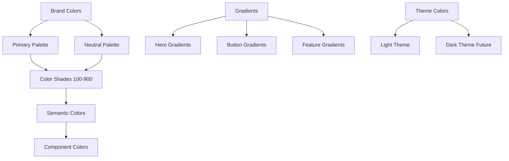

# Theming System

> **Last Updated**: 2025-07-11  
> **Status**: Complete  
> **Version**: 1.0

## Overview

The image2model theming system provides a comprehensive color palette and theming infrastructure based on the blue theme primary design. This document covers the complete color system migrated from the brand guidelines, including all color values, gradients, semantic mappings, and implementation details.

## Table of Contents

- [Key Concepts](#key-concepts)
- [Architecture](#architecture)
- [Implementation](#implementation)
- [Usage Examples](#usage-examples)
- [API Reference](#api-reference)
- [Best Practices](#best-practices)
- [Troubleshooting](#troubleshooting)
- [Related Documentation](#related-documentation)

## Key Concepts

**Blue Theme Primary**: The application uses a blue-based color scheme as the primary design system, with bright cyan (#5DADE2) and sky blue (#3498DB) as the main brand colors.

**CSS Custom Properties**: All colors are defined as CSS variables for dynamic theming and consistent application across components.

**Semantic Color Mapping**: Colors are assigned semantic names based on their purpose (primary, secondary, success, error) rather than their appearance.

**Gradient System**: Predefined gradients for buttons, backgrounds, and decorative elements following the brand guidelines.

## Architecture

### Color System Structure



### Complete Color Values

#### Primary Brand Colors

```css
/* Blue Theme - Primary Design System */
--brand-bright-cyan: #5DADE2;    /* PRIMARY - Main brand accent */
--brand-sky-blue: #3498DB;       /* SECONDARY - Support color */
--brand-dark-charcoal: #3A424A;  /* Text and UI elements */
--brand-vibrant-red: #E74C3C;    /* Errors and critical alerts only */
--brand-sunset-orange: #E67E22;  /* Small accents only - NEVER backgrounds */
--brand-golden-yellow: #F39C12;  /* Small accents only - NEVER backgrounds */
```

#### Neutral Palette

```css
--brand-white: #FFFFFF;
--brand-light-gray: #ECF0F1;
--brand-silver-gray: #BDC3C7;
--brand-medium-gray: #95A5A6;
--brand-dark-gray: #7F8C8D;
--brand-black: #000000;
```

#### Complete Color Shades (100-900)

```css
/* Blue Shades - Primary Theme */
--blue-100: #D6EAF8;
--blue-200: #AED6F1;
--blue-300: #85C1E9;
--blue-400: #5DADE2;  /* Bright Cyan */
--blue-500: #3498DB;  /* Sky Blue - Base */
--blue-600: #2E86C1;
--blue-700: #2874A6;
--blue-800: #21618C;
--blue-900: #1B4F72;

/* Red Shades - Errors/Alerts */
--red-100: #FADBD8;
--red-200: #F5B7B1;
--red-300: #F1948A;
--red-400: #EC7063;
--red-500: #E74C3C;  /* Vibrant Red - Base */
--red-600: #CB4335;
--red-700: #A93226;
--red-800: #922B21;
--red-900: #7B241C;

/* Yellow Shades - Warnings/Accents */
--yellow-100: #FCF3CF;
--yellow-200: #F9E79F;
--yellow-300: #F7DC6F;
--yellow-400: #F4D03F;
--yellow-500: #F39C12;  /* Golden Yellow - Base */
--yellow-600: #D68910;
--yellow-700: #B9770E;
--yellow-800: #9C640C;
--yellow-900: #7E5109;

/* Orange Shades - Small Accents Only */
--orange-100: #FAE5D3;
--orange-200: #F5CBA7;
--orange-300: #F0B27A;
--orange-400: #EB984E;
--orange-500: #E67E22;  /* Sunset Orange - Base */
--orange-600: #CA6F1E;
--orange-700: #AF601A;
--orange-800: #935116;
--orange-900: #784212;

/* Gray Shades - UI Elements */
--gray-100: #FDFEFE;
--gray-200: #FBFCFC;
--gray-300: #F7F9F9;
--gray-400: #ECF0F1;  /* Light Gray */
--gray-500: #BDC3C7;  /* Silver Gray */
--gray-600: #95A5A6;  /* Medium Gray */
--gray-700: #7F8C8D;  /* Dark Gray */
--gray-800: #566573;
--gray-900: #3A424A;  /* Dark Charcoal */
```

#### Semantic Colors

```css
/* Semantic Color Mapping */
--color-primary: #5DADE2;      /* Bright Cyan */
--color-secondary: #3498DB;    /* Sky Blue */
--color-accent: #5DADE2;       /* Bright Cyan */
--color-success: #27AE60;      /* Green */
--color-warning: #F39C12;      /* Golden Yellow */
--color-error: #E74C3C;        /* Vibrant Red */
--color-info: #3498DB;         /* Sky Blue */
```

#### Theme-Specific Colors

```css
/* Hero Section Colors */
--hero-bg-start: #1a2332;
--hero-bg-end: #2c3e50;
--hero-text: #FFFFFF;

/* Button Colors - Actual Implementation */
--button-primary-bg: linear-gradient(135deg, #3498db 0%, #2874a6 100%);
--button-primary-text: #FFFFFF;
--button-primary-hover: #2874a6;
--button-secondary-bg: #34495e;
--button-secondary-text: #FFFFFF;
--button-secondary-hover: #2c3e50;

/* Feature Colors */
--feature-card-bg: #FFFFFF;
--feature-card-border: #e1e8ed;
--feature-card-hover-border: #5DADE2;
--feature-icon-gradient-start: #5DADE2;
--feature-icon-gradient-end: #3498DB;

/* Section Colors */
--section-light-bg: #f8f9fa;
--section-dark-bg: #1a2332;
--section-text: #2c3e50;
--section-text-light: #FFFFFF;
```

## Implementation

### Gradient Definitions

```css
/* Primary Gradients from brand/guidelines/gradients.css */

/* Cool Ocean - Primary Hero Gradient */
.gradient-cool-ocean {
  background: linear-gradient(135deg, #1a2332 0%, #2c3e50 100%);
}

/* Blue Theme Gradients */
.gradient-blue-hero {
  background: linear-gradient(135deg, #1a2332 0%, #2c3e50 100%);
}

.gradient-blue-medium {
  background: linear-gradient(135deg, #5DADE2 0%, #3498DB 100%);
}

.gradient-blue-light {
  background: linear-gradient(135deg, #85C1E9 0%, #5DADE2 100%);
}

.gradient-blue-dark {
  background: linear-gradient(135deg, #2874A6 0%, #1B4F72 100%);
}

/* Overlay Gradients */
.gradient-overlay-dark {
  background: linear-gradient(180deg, rgba(58, 66, 74, 0) 0%, rgba(58, 66, 74, 0.8) 100%);
}

.gradient-overlay-light {
  background: linear-gradient(180deg, rgba(255, 255, 255, 0.9) 0%, rgba(255, 255, 255, 0) 100%);
}

/* Text Gradients */
.gradient-text-blue {
  background: linear-gradient(135deg, #5DADE2 0%, #3498DB 100%);
  -webkit-background-clip: text;
  -webkit-text-fill-color: transparent;
  background-clip: text;
}

/* Border Gradients */
.gradient-border {
  position: relative;
  background: #FFFFFF;
  padding: 3px;
}

.gradient-border::before {
  content: "";
  position: absolute;
  top: 0;
  left: 0;
  right: 0;
  bottom: 0;
  border-radius: inherit;
  padding: 2px;
  background: linear-gradient(135deg, #5DADE2, #3498DB);
  -webkit-mask: linear-gradient(#fff 0 0) content-box, linear-gradient(#fff 0 0);
  -webkit-mask-composite: xor;
  mask: linear-gradient(#fff 0 0) content-box, linear-gradient(#fff 0 0);
  mask-composite: exclude;
}
```

### Color Usage Guidelines

#### Primary Colors - Blue Theme

**Bright Cyan (#5DADE2) - PRIMARY**
- Usage: Primary buttons, call-to-action elements, main brand accents
- Context: Main brand color for all primary interactions
- Avoid: On light blue backgrounds, small text sizes

**Sky Blue (#3498DB) - SECONDARY**
- Usage: Secondary buttons, hover states, gradient combinations
- Context: Support color for depth and variation
- Avoid: On cyan backgrounds without sufficient contrast

**Dark Charcoal (#3A424A)**
- Usage: Primary text, headers, dark UI elements
- Context: Professional, stable elements that need high contrast
- Avoid: On dark backgrounds, small text sizes

#### Warning Colors - Limited Use

**Vibrant Red (#E74C3C)**
- Usage: Error states, critical alerts only
- Context: Warnings, errors, destructive actions
- Avoid: Primary actions, large areas, main CTAs

**Sunset Orange (#E67E22)**
- Usage: Icons, borders, small accent elements only
- Context: Warmth, creativity, innovation
- Avoid: NEVER use as background color, error messages, critical alerts
- Note: Too harsh for large areas - use only for small accents

**Golden Yellow (#F39C12)**
- Usage: Icons, small highlights, accent borders only
- Context: Optimism, energy, accomplishment
- Avoid: NEVER use as background color, on white backgrounds without borders
- Note: Too harsh for large areas - use only for small accents

### Accessibility - Contrast Ratios

#### High Contrast (AAA Compliant)
| Foreground | Background | Ratio | Usage |
|------------|------------|-------|--------|
| #3A424A (Dark Charcoal) | #FFFFFF (White) | 12.1:1 | Primary text |
| #FFFFFF (White) | #3A424A (Dark Charcoal) | 12.1:1 | Inverted UI |
| #3A424A (Dark Charcoal) | #ECF0F1 (Light Gray) | 10.2:1 | Secondary surfaces |

#### Standard Contrast (AA Compliant)
| Foreground | Background | Ratio | Usage |
|------------|------------|-------|--------|
| #E74C3C (Vibrant Red) | #FFFFFF (White) | 4.5:1 | CTAs, alerts |
| #3498DB (Sky Blue) | #FFFFFF (White) | 4.7:1 | Links, info |
| #E67E22 (Sunset Orange) | #FFFFFF (White) | 3.2:1 | Large text only |
| #3A424A (Dark Charcoal) | #BDC3C7 (Silver Gray) | 4.8:1 | Subtle elements |

#### Non-Compliant Combinations (Avoid for Text)
| Foreground | Background | Ratio | Alternative Use |
|------------|------------|-------|-----------------|
| #F39C12 (Golden Yellow) | #FFFFFF (White) | 2.1:1 | Icons with borders only |
| #5DADE2 (Bright Cyan) | #FFFFFF (White) | 2.4:1 | Decorative elements only |
| #BDC3C7 (Silver Gray) | #ECF0F1 (Light Gray) | 1.7:1 | Backgrounds only |

## Usage Examples

### Basic Usage

```html
<!-- Using brand colors directly -->
<div class="bg-brand-bright-cyan text-white p-4">
  Primary brand color background
</div>

<!-- Using semantic colors -->
<button class="bg-primary text-white">
  Primary Action
</button>

<!-- Using color shades -->
<div class="bg-blue-100 border-blue-500 text-blue-900">
  Blue themed component
</div>
```

### Advanced Usage

```css
/* Creating a custom themed component */
.themed-card {
  /* Use CSS variables for theming */
  background: var(--bg-primary);
  border: 1px solid var(--border-color);
  color: var(--text-primary);
  
  /* Apply brand gradient on hover */
  position: relative;
  overflow: hidden;
}

.themed-card::before {
  content: '';
  position: absolute;
  top: 0;
  left: 0;
  right: 0;
  bottom: 0;
  background: linear-gradient(135deg, var(--brand-bright-cyan), var(--brand-sky-blue));
  opacity: 0;
  transition: opacity 0.3s ease;
}

.themed-card:hover::before {
  opacity: 0.1;
}

/* Button implementation from style.css */
.btn-primary {
  /* Variables define solid color but style.css overrides with gradient */
  background: linear-gradient(135deg, #3498db 0%, #2874a6 100%);
  color: var(--brand-white);
  /* Additional properties from style.css */
  padding: var(--spacing-sm) var(--spacing-lg);
  border-radius: var(--radius-md);
  font-weight: var(--font-medium);
  transition: all var(--transition-normal);
  position: relative;
  overflow: hidden;
}

/* Note on Dark Mode: 
   Dark mode infrastructure exists in variables.css with .dark-mode 
   and .light-mode classes, but the actual dark color variables 
   (--dark-bg-primary, etc.) are referenced but not yet defined. */
```

## API Reference

### Color Utility Classes

#### Text Colors
```css
.text-primary    { color: var(--brand-bright-cyan); }
.text-secondary  { color: var(--brand-sky-blue); }
.text-success    { color: var(--color-success); }
.text-warning    { color: var(--color-warning); }
.text-error      { color: var(--color-error); }
.text-info       { color: var(--color-info); }

/* Shade variations */
.text-blue-{100-900}
.text-red-{100-900}
.text-yellow-{100-900}
.text-orange-{100-900}
.text-gray-{100-900}
```

#### Background Colors
```css
.bg-primary    { background-color: var(--brand-bright-cyan); }
.bg-secondary  { background-color: var(--brand-sky-blue); }
.bg-success    { background-color: var(--color-success); }
.bg-warning    { background-color: var(--color-warning); }
.bg-error      { background-color: var(--color-error); }
.bg-info       { background-color: var(--color-info); }

/* Shade variations */
.bg-blue-{100-900}
.bg-red-{100-900}
.bg-yellow-{100-900}
.bg-orange-{100-900}
.bg-gray-{100-900}
```

#### Gradient Classes
```css
.gradient-cool-ocean    /* Hero sections */
.gradient-blue-hero     /* Dark blue gradient */
.gradient-blue-medium   /* Icon/feature gradient */
.gradient-blue-light    /* Subtle gradient */
.gradient-blue-dark     /* Strong gradient */
.gradient-text-blue     /* Text gradient effect */
.gradient-border        /* Gradient border effect */
```

## Best Practices

### ✅ DO

- **Use semantic color names** (primary, secondary) in components
- **Apply the blue theme consistently** as the primary design
- **Test color combinations** for accessibility compliance
- **Use gradients for visual interest** on key elements
- **Limit orange and yellow** to small accent elements only
- **Maintain high contrast** for text readability
- **Use CSS variables** for all color values

### ❌ DON'T

- **Don't use hex values directly** - always use CSS variables
- **Don't use orange/yellow as backgrounds** - too harsh for large areas
- **Don't mix warm and cool colors** without purpose
- **Don't create low-contrast combinations** for text
- **Don't override semantic meanings** (e.g., using red for success)
- **Don't use colors alone** to convey information
- **Don't ignore the brand guidelines** when choosing colors

## Troubleshooting

### Common Issues

#### Issue: Colors look different than expected

**Cause**: Monitor calibration or color space differences

**Solution**:
```css
/* Ensure consistent color rendering */
body {
  color-profile: sRGB;
  rendering-intent: relative-colorimetric;
}

/* Test in multiple browsers and devices */
```

#### Issue: Gradient not displaying correctly

**Cause**: Browser compatibility or syntax issues

**Solution**:
```css
/* Use vendor prefixes for compatibility */
.gradient {
  background: #3498db; /* Fallback */
  background: -webkit-linear-gradient(135deg, #3498db 0%, #2874a6 100%);
  background: linear-gradient(135deg, #3498db 0%, #2874a6 100%);
}
```

#### Issue: Poor contrast in certain themes

**Cause**: Insufficient contrast ratio for accessibility

**Solution**:
```css
/* Always test with contrast checkers */
/* Provide high-contrast alternatives */
@media (prefers-contrast: high) {
  :root {
    --text-primary: #000000;
    --bg-primary: #FFFFFF;
  }
}
```

## Related Documentation

- [CSS Architecture](./css-architecture.md) - Overall CSS structure
- [Color Usage Guidelines](/brand/guidelines/color-usage.md) - Detailed usage rules
- [Accessibility Guidelines](/brand/guidelines/accessibility.md) - Contrast requirements
- [Visual Style Guide](./visual-style-guide.md) - Complete visual system