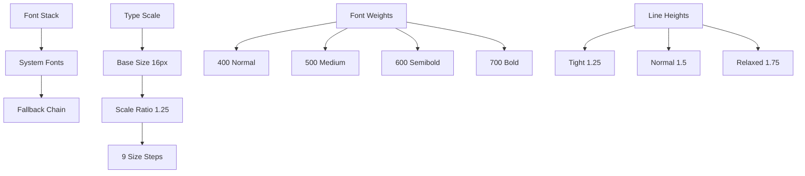

# Typography

> **Last Updated**: 2025-07-11  
> **Status**: Complete  
> **Version**: 1.0

## Overview

The image2model typography system provides a comprehensive type scale, font hierarchy, and text styling utilities. This document covers font selection, type scales, responsive typography, and implementation patterns for consistent and readable text across the application.

## Table of Contents

- [Key Concepts](#key-concepts)
- [Architecture](#architecture)
- [Implementation](#implementation)
- [Usage Examples](#usage-examples)
- [API Reference](#api-reference)
- [Best Practices](#best-practices)
- [Troubleshooting](#troubleshooting)
- [Related Documentation](#related-documentation)

## Key Concepts

**System Font Stack**: Uses native system fonts for optimal performance and platform consistency, avoiding external font dependencies.

**Modular Scale**: Typography sizes follow a harmonious scale based on mathematical ratios for visual rhythm and hierarchy.

**Fluid Typography**: Text scales smoothly between breakpoints using CSS clamp() for optimal readability at any screen size.

**Accessibility First**: All type choices prioritize readability with appropriate line heights, contrast ratios, and size minimums.

## Architecture

### Typography System Structure



### Type Scale Visualization

```
5xl (3rem)      ━━━━━━━━━━━━━━━━━━━━━━━━━━━━━━━━━━━━
4xl (2.25rem)   ━━━━━━━━━━━━━━━━━━━━━━━━━━━━
3xl (1.875rem)  ━━━━━━━━━━━━━━━━━━━━
2xl (1.5rem)    ━━━━━━━━━━━━━━━━
xl (1.25rem)    ━━━━━━━━━━━━
lg (1.125rem)   ━━━━━━━━━
base (1rem)     ━━━━━━
sm (0.875rem)   ━━━━
xs (0.75rem)    ━━
```

## Implementation

### Font Stack Definition

```css
/* System Font Stack from brand/developer-reference.md */
:root {
  --font-sans: -apple-system, BlinkMacSystemFont, 'Segoe UI', Roboto, 
               'Helvetica Neue', Arial, sans-serif, 'Apple Color Emoji', 
               'Segoe UI Emoji', 'Segoe UI Symbol';
  
  --font-mono: 'SF Mono', Monaco, 'Cascadia Code', 'Roboto Mono', 
               Consolas, 'Courier New', monospace;
}

/* Base typography */
body {
  font-family: var(--font-sans);
  font-size: 16px;
  line-height: 1.5;
  font-weight: 400;
  color: var(--text-primary);
  text-rendering: optimizeLegibility;
  -webkit-font-smoothing: antialiased;
  -moz-osx-font-smoothing: grayscale;
}

/* Code blocks */
code, pre {
  font-family: var(--font-mono);
  font-size: 0.875em;
}
```

### Type Scale Variables

```css
/* Font Size Scale - Desktop */
:root {
  --text-xs: 0.75rem;    /* 12px */
  --text-sm: 0.875rem;   /* 14px */
  --text-base: 1rem;     /* 16px */
  --text-lg: 1.125rem;   /* 18px */
  --text-xl: 1.25rem;    /* 20px */
  --text-2xl: 1.5rem;    /* 24px */
  --text-3xl: 1.875rem;  /* 30px */
  --text-4xl: 2.25rem;   /* 36px */
  --text-5xl: 3rem;      /* 48px */
}

/* Fluid Typography with clamp() */
:root {
  --text-xs: clamp(0.75rem, 0.7rem + 0.25vw, 0.875rem);
  --text-sm: clamp(0.875rem, 0.8rem + 0.375vw, 1rem);
  --text-base: clamp(1rem, 0.9rem + 0.5vw, 1.125rem);
  --text-lg: clamp(1.125rem, 1rem + 0.625vw, 1.25rem);
  --text-xl: clamp(1.25rem, 1.1rem + 0.75vw, 1.5rem);
  --text-2xl: clamp(1.5rem, 1.3rem + 1vw, 2rem);
  --text-3xl: clamp(1.875rem, 1.5rem + 1.875vw, 2.5rem);
  --text-4xl: clamp(2.25rem, 1.75rem + 2.5vw, 3.5rem);
  --text-5xl: clamp(3rem, 2rem + 5vw, 4.5rem);
}

/* Line Height Scale */
:root {
  --leading-none: 1;
  --leading-tight: 1.25;
  --leading-snug: 1.375;
  --leading-normal: 1.5;
  --leading-relaxed: 1.625;
  --leading-loose: 1.75;
  --leading-extra: 2;
}

/* Font Weight Scale */
:root {
  --font-normal: 400;
  --font-medium: 500;
  --font-semibold: 600;
  --font-bold: 700;
}

/* Letter Spacing */
:root {
  --tracking-tighter: -0.05em;
  --tracking-tight: -0.025em;
  --tracking-normal: 0;
  --tracking-wide: 0.025em;
  --tracking-wider: 0.05em;
  --tracking-widest: 0.1em;
}
```

### Heading Styles

```css
/* Heading Base Styles */
h1, h2, h3, h4, h5, h6,
.h1, .h2, .h3, .h4, .h5, .h6 {
  font-weight: var(--font-semibold);
  color: var(--heading-color, var(--text-primary));
  margin-top: 0;
  margin-bottom: 0.5em;
}

/* Heading Sizes */
.h1, h1 {
  font-size: var(--text-4xl);
  line-height: var(--leading-tight);
  letter-spacing: var(--tracking-tight);
  font-weight: var(--font-bold);
}

.h2, h2 {
  font-size: var(--text-3xl);
  line-height: var(--leading-tight);
  letter-spacing: var(--tracking-tight);
}

.h3, h3 {
  font-size: var(--text-2xl);
  line-height: var(--leading-snug);
}

.h4, h4 {
  font-size: var(--text-xl);
  line-height: var(--leading-snug);
}

.h5, h5 {
  font-size: var(--text-lg);
  line-height: var(--leading-normal);
}

.h6, h6 {
  font-size: var(--text-base);
  line-height: var(--leading-normal);
  font-weight: var(--font-bold);
}

/* Display Headings */
.display-1 {
  font-size: var(--text-5xl);
  line-height: var(--leading-none);
  font-weight: var(--font-bold);
  letter-spacing: var(--tracking-tighter);
}

.display-2 {
  font-size: var(--text-4xl);
  line-height: var(--leading-tight);
  font-weight: var(--font-bold);
  letter-spacing: var(--tracking-tight);
}
```

### Body Text Styles

```css
/* Paragraph Styles */
p {
  margin-top: 0;
  margin-bottom: 1rem;
  line-height: var(--leading-relaxed);
}

/* Lead Paragraph */
.lead {
  font-size: var(--text-xl);
  line-height: var(--leading-relaxed);
  font-weight: var(--font-normal);
  color: var(--text-secondary);
}

/* Small Text */
.text-sm {
  font-size: var(--text-sm);
  line-height: var(--leading-normal);
}

.text-xs {
  font-size: var(--text-xs);
  line-height: var(--leading-normal);
}

/* Large Text */
.text-lg {
  font-size: var(--text-lg);
  line-height: var(--leading-relaxed);
}

/* Text Weights */
.font-normal { font-weight: var(--font-normal); }
.font-medium { font-weight: var(--font-medium); }
.font-semibold { font-weight: var(--font-semibold); }
.font-bold { font-weight: var(--font-bold); }

/* Text Alignment */
.text-left { text-align: left; }
.text-center { text-align: center; }
.text-right { text-align: right; }
.text-justify { text-align: justify; }

/* Text Transform */
.uppercase { text-transform: uppercase; }
.lowercase { text-transform: lowercase; }
.capitalize { text-transform: capitalize; }
.normal-case { text-transform: none; }
```

### Special Text Styles

```css
/* Links */
a {
  color: var(--link-color, var(--color-primary));
  text-decoration: underline;
  text-underline-offset: 0.2em;
  transition: color var(--transition-fast) ease;
}

a:hover {
  color: var(--link-hover-color, var(--color-primary-dark));
}

a:focus-visible {
  outline: 2px solid var(--color-primary);
  outline-offset: 2px;
  border-radius: 2px;
}

/* Blockquotes */
blockquote {
  margin: 2rem 0;
  padding-left: 1.5rem;
  border-left: 4px solid var(--color-primary);
  font-style: italic;
  color: var(--text-secondary);
}

blockquote cite {
  display: block;
  margin-top: 0.5rem;
  font-size: var(--text-sm);
  font-style: normal;
  color: var(--text-tertiary);
}

/* Code */
code {
  padding: 0.125rem 0.25rem;
  font-size: 0.875em;
  color: var(--code-color);
  background-color: var(--code-bg);
  border-radius: var(--radius-sm);
}

pre {
  overflow-x: auto;
  padding: 1rem;
  background-color: var(--code-bg);
  border-radius: var(--radius-md);
}

pre code {
  padding: 0;
  background-color: transparent;
}

/* Lists */
ul, ol {
  margin-top: 0;
  margin-bottom: 1rem;
  padding-left: 1.5rem;
}

li {
  margin-bottom: 0.25rem;
}

/* Emphasis */
em {
  font-style: italic;
}

strong {
  font-weight: var(--font-bold);
}

mark {
  background-color: var(--highlight-bg);
  color: var(--highlight-color);
  padding: 0.125rem 0.25rem;
}
```

### Responsive Typography

```css
/* Mobile-First Typography */
@media (max-width: 640px) {
  /* Reduce heading sizes on mobile */
  .h1, h1 { font-size: var(--text-3xl); }
  .h2, h2 { font-size: var(--text-2xl); }
  .h3, h3 { font-size: var(--text-xl); }
  
  /* Adjust line heights for mobile */
  p { line-height: var(--leading-normal); }
}

/* Tablet and up */
@media (min-width: 768px) {
  /* Increase body text size */
  body { font-size: 18px; }
  
  /* Wider measure for readability */
  .prose {
    max-width: 65ch;
  }
}

/* Print styles */
@media print {
  body {
    font-size: 12pt;
    line-height: 1.5;
  }
  
  h1, h2, h3 {
    page-break-after: avoid;
  }
  
  p {
    orphans: 3;
    widows: 3;
  }
}
```

## Usage Examples

### Basic Usage

```html
<!-- Headings -->
<h1 class="h1">Main Page Title</h1>
<h2 class="h2">Section Heading</h2>
<h3 class="h3">Subsection Title</h3>

<!-- Body text -->
<p class="lead">
  This is a lead paragraph with larger, more prominent text.
</p>

<p>
  Regular paragraph text with optimal line height for readability.
  <strong>Bold text</strong> and <em>italic text</em> for emphasis.
</p>

<!-- Small text -->
<p class="text-sm text-secondary">
  Supporting text in a smaller size.
</p>
```

### Advanced Usage

```html
<!-- Display heading with gradient -->
<h1 class="display-1 gradient-text-blue">
  Transform Your Images
</h1>

<!-- Responsive heading sizes -->
<h2 class="text-2xl md:text-3xl lg:text-4xl">
  Scales with screen size
</h2>

<!-- Custom typography component -->
<article class="prose">
  <h2>Article Title</h2>
  <p class="lead">
    An introductory paragraph that sets the tone for the article.
  </p>
  
  <p>
    Body text with optimal measure (line length) for readability. 
    The prose class limits width to approximately 65 characters.
  </p>
  
  <blockquote>
    "A well-designed typography system is invisible to the reader 
    but essential to the reading experience."
    <cite>— Typography Expert</cite>
  </blockquote>
  
  <h3>Subheading</h3>
  <ul>
    <li>Bullet points maintain consistent spacing</li>
    <li>And use the same font stack</li>
  </ul>
</article>

<!-- Animated text -->
<span class="animated-text">
  <style>
    @keyframes typewriter {
      from { width: 0; }
      to { width: 100%; }
    }
    
    .animated-text {
      overflow: hidden;
      white-space: nowrap;
      animation: typewriter 3s steps(40) 1s forwards;
    }
  </style>
  Typing animation effect
</span>
```

## API Reference

### Typography Classes

#### Size Classes
```css
.text-xs     /* 0.75rem */
.text-sm     /* 0.875rem */
.text-base   /* 1rem */
.text-lg     /* 1.125rem */
.text-xl     /* 1.25rem */
.text-2xl    /* 1.5rem */
.text-3xl    /* 1.875rem */
.text-4xl    /* 2.25rem */
.text-5xl    /* 3rem */
```

#### Weight Classes
```css
.font-normal    /* 400 */
.font-medium    /* 500 */
.font-semibold  /* 600 */
.font-bold      /* 700 */
```

#### Line Height Classes
```css
.leading-none     /* 1 */
.leading-tight    /* 1.25 */
.leading-snug     /* 1.375 */
.leading-normal   /* 1.5 */
.leading-relaxed  /* 1.625 */
.leading-loose    /* 1.75 */
```

#### Text Transform Classes
```css
.uppercase    /* text-transform: uppercase */
.lowercase    /* text-transform: lowercase */
.capitalize   /* text-transform: capitalize */
.normal-case  /* text-transform: none */
```

#### Letter Spacing Classes
```css
.tracking-tighter  /* -0.05em */
.tracking-tight    /* -0.025em */
.tracking-normal   /* 0 */
.tracking-wide     /* 0.025em */
.tracking-wider    /* 0.05em */
.tracking-widest   /* 0.1em */
```

## Best Practices

### ✅ DO

- **Use the type scale consistently** throughout the application
- **Maintain readable line lengths** (45-75 characters)
- **Ensure sufficient line height** for body text (1.5-1.75)
- **Test readability** at different screen sizes
- **Use semantic HTML** (h1-h6) for headings
- **Limit font weights** to 3-4 for consistency
- **Consider FOUT/FOIT** when using web fonts

### ❌ DON'T

- **Don't use too many font sizes** in one layout
- **Don't set body text below 16px** on mobile
- **Don't use light weights** on small text
- **Don't justify text** on narrow columns
- **Don't use all caps** for long passages
- **Don't mix too many fonts** (stick to 1-2 families)
- **Don't ignore contrast ratios** for text color

## Troubleshooting

### Common Issues

#### Issue: Text looks different across browsers

**Cause**: Font rendering differences between operating systems

**Solution**:
```css
/* Consistent font rendering */
body {
  -webkit-font-smoothing: antialiased;
  -moz-osx-font-smoothing: grayscale;
  text-rendering: optimizeLegibility;
}

/* Test with common system fonts */
```

#### Issue: Line lengths too long on wide screens

**Cause**: No maximum width constraint on text containers

**Solution**:
```css
/* Optimal reading measure */
.prose {
  max-width: 65ch; /* ~65 characters */
}

.container-reading {
  max-width: 720px;
  margin: 0 auto;
}
```

#### Issue: Headings break awkwardly

**Cause**: No control over line breaks in headings

**Solution**:
```css
/* Prevent orphans in headings */
h1, h2, h3 {
  text-wrap: balance; /* CSS Text 4 */
}

/* Or use manual breaks */
.heading-balanced {
  max-width: 20ch; /* Forces earlier wrap */
}
```

## Related Documentation

- [CSS Architecture](./css-architecture.md) - CSS structure
- [Responsive Design](./responsive-design.md) - Responsive typography
- [Accessibility](../../accessibility.md) - Text accessibility
- [Brand Voice](./visual-style-guide.md) - Writing guidelines

## Important Note

All typography variables and styles are defined in `/frontend-svelte/static/css/typography.css`, not in variables.css. This includes font families, sizes, weights, line heights, and letter spacing values.