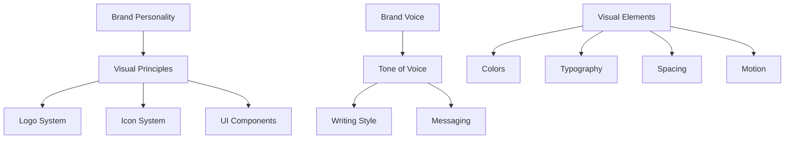

# Visual Style Guide

> **Last Updated**: 2025-01-11  
> **Status**: Complete  
> **Version**: 1.0

## Overview

The image2model visual style guide combines brand personality, visual guidelines, icon specifications, and logo usage to create a cohesive design language. This document serves as the definitive reference for maintaining visual consistency across all touchpoints of the application.

## Table of Contents

- [Key Concepts](#key-concepts)
- [Architecture](#architecture)
- [Implementation](#implementation)
- [Usage Examples](#usage-examples)
- [API Reference](#api-reference)
- [Best Practices](#best-practices)
- [Troubleshooting](#troubleshooting)
- [Related Documentation](#related-documentation)

## Key Concepts

**Brand Personality**: Innovative, Accessible, Reliable, and Empowering - these core attributes guide all visual and communication decisions.

**Geometric Foundation**: The polygonal, faceted style of the logo extends throughout the visual system, especially in icon design.

**Professional Yet Approachable**: Visual elements balance technical sophistication with user-friendly accessibility.

**Consistency Across Touchpoints**: Unified visual language from logo to icons to UI components.

## Architecture

### Visual System Hierarchy



## Implementation

### Brand Personality & Voice

#### Core Attributes

**Innovative**
- Pushing boundaries in AI and image processing
- Early adopter of cutting-edge technology
- Creative problem-solving approach

**Accessible**
- Making complex technology simple
- User-friendly interfaces
- Clear, jargon-free communication

**Reliable**
- Consistent performance
- Trustworthy results
- Professional service

**Empowering**
- Enabling creators and developers
- Providing powerful tools
- Supporting user success

#### Voice Characteristics

**Professional yet Approachable**
- ✅ "Transform your images into production-ready models"
- ❌ "Convert pictures to 3D stuff"

**Clear and Concise**
- ✅ "Upload, process, download - it's that simple"
- ❌ "Utilize our platform to facilitate the transformation of visual assets"

**Confident but Humble**
- ✅ "Powered by advanced AI technology"
- ❌ "The world's greatest AI platform"

**Helpful and Supportive**
- ✅ "Need help? We're here to guide you"
- ❌ "Figure it out yourself with our docs"

### Writing Guidelines

#### Headlines
- Action-oriented: Start with verbs
- Benefit-focused: Highlight user value
- Concise: 5-8 words maximum

**Examples**:
- ✅ "Transform Images Into 3D Models"
- ✅ "Create Stunning Models Instantly"
- ❌ "Our Platform Converts Images"
- ❌ "Image to Model Conversion Service"

#### Body Copy
- Short sentences: 15-20 words average
- Active voice: Subject performs the action
- User-focused: "You" not "Users"
- Scannable: Use bullet points and subheadings

#### Call-to-Actions (CTAs)
- Direct: Clear action words
- Urgent: Create momentum
- Personal: Speak to the user

**Examples**:
- ✅ "Start Creating Now"
- ✅ "Transform Your First Image"
- ❌ "Submit"
- ❌ "Click Here"

### Icon Style System

#### Design Principles

**Geometric Foundation**
Icons reflect the polygonal, faceted style of the logo:
- Use angular shapes and triangular facets
- Maintain consistent stroke weights
- Apply geometric construction methods

**Visual Consistency**
- Style: Outlined with geometric fills
- Weight: 2px stroke at 24x24px base size
- Corners: 2px radius for outer shapes
- Angles: Prefer 45°, 90°, 135° angles

#### Icon Grid System

**Base Grid: 24x24px**
```
┌─────────────────────────┐
│  ┌─────────────────┐   │ <- 2px padding
│  │                 │   │
│  │   ┌─────────┐   │   │ <- 20x20px live area
│  │   │         │   │   │
│  │   │  ICON   │   │   │ <- 16x16px content
│  │   │         │   │   │
│  │   └─────────┘   │   │
│  │                 │   │
│  └─────────────────┘   │
└─────────────────────────┘
```

**Scaling Sizes**
- Small: 16x16px (1.5px stroke)
- Medium: 24x24px (2px stroke) - Default
- Large: 32x32px (2.5px stroke)
- XLarge: 48x48px (3px stroke)

#### Icon Categories

**Navigation Icons**
- Simple, recognizable shapes
- Clear directional indicators
- Examples: Home (geometric house), Menu (three polygonal bars)

**Action Icons**
- Bold, clear actions
- Include motion indicators
- Examples: Upload (upward arrow), Transform (rotating polygons)

**Status Icons**
- Clear state indication
- Use color meaningfully
- Examples: Success (faceted checkmark), Error (geometric X)

**File Type Icons**
- Distinctive shapes per type
- Consistent fold/corner style
- Examples: Image (geometric landscape), 3D Model (wireframe cube)

#### Icon Implementation

```css
/* Base icon styles */
.icon {
  width: 24px;
  height: 24px;
  transition: all 0.2s ease;
}

/* Size variants */
.icon-sm { width: 16px; height: 16px; }
.icon-lg { width: 32px; height: 32px; }
.icon-xl { width: 48px; height: 48px; }

/* State variants */
.icon:hover { transform: scale(1.1); }
.icon:active { transform: scale(0.95); }

/* Icon colors */
.icon-default {
  stroke: #3A424A; /* Dark Charcoal */
  fill: none;
}

.icon-hover {
  stroke: #3498DB; /* Sky Blue */
  fill: rgba(52, 152, 219, 0.1);
}

.icon-active {
  stroke: #E74C3C; /* Vibrant Red */
  fill: rgba(231, 76, 60, 0.15);
}
```

### Logo Usage Guidelines

#### Logo Variations

**Primary Logo**
- Format: Square with rounded corners
- Use: Default logo for all applications
- File: `logo-original.png`

**Logo Versions**
1. Full Color: Use on light backgrounds
2. Monochrome Dark: Use on light backgrounds when color isn't available
3. Monochrome Light: Use on dark backgrounds
4. Knockout: White version for dark backgrounds

#### Spacing and Clear Space

**Minimum Clear Space**
- X = 1/4 of logo height
- Clear space = X on all sides

```
┌─────────────────────────┐
│          X              │
│    ┌─────────────┐      │
│  X │    LOGO     │ X    │
│    └─────────────┘      │
│          X              │
└─────────────────────────┘
```

**Minimum Sizes**
- Digital: 48px × 48px minimum
- Print: 0.5" × 0.5" minimum
- Favicon: 16px × 16px (simplified version)

#### Placement Guidelines

**Recommended Positions**
1. Top Left: Navigation bars, headers
2. Center: Splash screens, loading states
3. Bottom: Footer, watermarks

**Alignment**
- Always align to visual center, not mathematical center
- Account for rounded corners in spacing calculations
- Maintain equal padding when in containers

### UI Component Visual Standards

#### Cards
```css
.card {
  background: #FFFFFF;
  border-radius: 0.5rem;
  box-shadow: 0 2px 8px rgba(0, 0, 0, 0.1);
  padding: 1.5rem;
  transition: all 0.3s ease;
}

.card:hover {
  box-shadow: 0 4px 12px rgba(0, 0, 0, 0.15);
  transform: translateY(-2px);
  border-color: var(--brand-bright-cyan);
}
```

#### Buttons
```css
.btn-primary {
  background: linear-gradient(135deg, #3498db 0%, #2874a6 100%);
  color: #FFFFFF;
  padding: 0.75rem 1.5rem;
  border-radius: 0.25rem;
  font-weight: 500;
  transition: all 0.3s ease;
}

.btn-secondary {
  background: #34495e;
  color: #FFFFFF;
}
```

#### Forms
```css
.input {
  border: 1px solid #BDC3C7;
  border-radius: 0.25rem;
  padding: 0.5rem 1rem;
  transition: border-color 0.3s ease;
}

.input:focus {
  border-color: #3498DB;
  outline: none;
}
```

### Content Tone Guidelines

#### Messaging Framework

**Elevator Pitch**
"image2model transforms your images into production-ready 3D models using advanced AI, making 3D content creation accessible to everyone."

**Value Propositions**
1. Speed: "From image to model in minutes, not hours"
2. Quality: "Professional-grade results every time"
3. Simplicity: "No 3D expertise required"
4. Reliability: "Consistent, predictable outcomes"

#### Context-Specific Voice

**Error Messages**
- Apologetic but helpful: "Oops! That didn't work. Try uploading a clearer image."
- Not: "Error 404: Invalid input detected"

**Success Messages**
- Celebratory but professional: "Awesome! Your model is ready"
- Not: "Process completed successfully"

**Loading States**
- Informative and patient: "Creating magic... This usually takes 30 seconds"
- Not: "Processing..."

**Empty States**
- Encouraging and actionable: "Ready to create? Upload your first image"
- Not: "No data available"

## Usage Examples

### Basic Usage

```html
<!-- Logo implementation -->
<header class="navbar">
  
</header>

<!-- Icon usage -->
<button class="btn btn-primary">
  <svg class="icon icon-sm">
    <use xlink:href="#icon-upload"></use>
  </svg>
  Upload Image
</button>

<!-- Brand voice in UI copy -->
<section class="hero">
  <h1 class="display-1">Transform Your Images Into 3D Models</h1>
  <p class="lead">Upload, process, download - it's that simple</p>
  <button class="btn btn-primary btn-lg">Start Creating Now</button>
</section>
```

### Advanced Usage

```html
<!-- Complex icon with states -->
<div class="upload-area">
  <style>
    .upload-icon {
      width: 48px;
      height: 48px;
      stroke: var(--brand-dark-charcoal);
      fill: none;
      transition: all 0.3s ease;
    }
    
    .upload-area:hover .upload-icon {
      stroke: var(--brand-sky-blue);
      transform: translateY(-4px);
    }
    
    .upload-area.active .upload-icon {
      stroke: var(--brand-bright-cyan);
      fill: rgba(93, 173, 226, 0.1);
    }
  </style>
  
  <svg class="upload-icon" viewBox="0 0 48 48">
    <!-- Geometric upload icon with faceted design -->
    <polygon points="24,8 32,20 28,20 28,32 20,32 20,20 16,20" 
             stroke-width="2"/>
    <path d="M 8,36 L 40,36 L 40,40 L 8,40 Z" 
          stroke-width="2"/>
  </svg>
  
  <h3>Drop your image here</h3>
  <p>or click to browse</p>
</div>

<!-- Brand personality in messaging -->
<div class="feature-card">
  <div class="icon-wrapper gradient-blue-medium">
    <svg class="icon icon-lg"><!-- AI icon --></svg>
  </div>
  <h3>Powered by AI</h3>
  <p>
    Our advanced AI technology transforms your images 
    into professional 3D models with incredible accuracy.
  </p>
</div>
```

## API Reference

### CSS Classes

#### Icon Classes
```css
.icon           /* Base icon style */
.icon-sm        /* 16x16px */
.icon-lg        /* 32x32px */
.icon-xl        /* 48x48px */
.icon-default   /* Default color */
.icon-primary   /* Primary brand color */
.icon-spin      /* Rotating animation */
```

#### Logo Classes
```css
.logo           /* Base logo style */
.logo-sm        /* Small variant */
.logo-lg        /* Large variant */
.nav-logo       /* Navigation bar logo */
.footer-logo    /* Footer logo */
```

#### Brand Voice Classes
```css
.text-hero      /* Hero section text */
.text-feature   /* Feature descriptions */
.text-cta       /* Call-to-action text */
.text-help      /* Help and support text */
```

## Best Practices

### ✅ DO

- **Maintain geometric consistency** in all icon designs
- **Use brand voice** consistently across all copy
- **Follow logo clear space** requirements
- **Test icon readability** at all sizes
- **Apply brand personality** to all interactions
- **Keep messaging concise** and action-oriented
- **Use approved color combinations** from brand guidelines

### ❌ DON'T

- **Don't stretch or distort** the logo
- **Don't create off-brand icons** without geometric style
- **Don't use technical jargon** in user-facing copy
- **Don't mix voice styles** within the same context
- **Don't place logo on busy backgrounds**
- **Don't ignore minimum sizes** for logo and icons
- **Don't use passive voice** in CTAs and headlines

## Troubleshooting

### Common Issues

#### Issue: Icons look inconsistent

**Cause**: Not following the geometric grid or stroke weight guidelines

**Solution**:
```svg
<!-- Ensure consistent construction -->
<svg viewBox="0 0 24 24" class="icon">
  <!-- Use 2px stroke at 24x24 -->
  <path stroke-width="2" stroke="currentColor" fill="none"
        d="M 4,4 L 20,4 L 20,20 L 4,20 Z"/>
  <!-- Maintain 45° angles -->
  <path stroke-width="2" 
        d="M 4,4 L 12,12 L 20,4"/>
</svg>
```

#### Issue: Brand voice sounds inconsistent

**Cause**: Multiple writers without guidelines or mixing formal/casual tones

**Solution**:
```javascript
// Create a voice checklist
const voiceChecklist = {
  isActionOriented: true,      // Starts with verb?
  isConcise: true,             // Under 20 words?
  isUserFocused: true,         // Uses "you"?
  isPositive: true,            // Encouraging tone?
  avoidsjargon: true           // Clear to non-technical users?
};

// Good example
const goodCopy = {
  headline: "Transform Your Images",
  body: "Upload any image and watch as our AI creates a detailed 3D model.",
  cta: "Start Creating"
};

// Bad example
const badCopy = {
  headline: "Image Processing Platform",
  body: "Our system utilizes neural networks for photogrammetric reconstruction.",
  cta: "Submit"
};
```

#### Issue: Logo appears blurry

**Cause**: Using wrong format or size for the context

**Solution**:
```html
<!-- Use SVG for scalability when possible -->


<!-- Or provide multiple resolutions -->

```

## Related Documentation

- [Brand Voice Guidelines](/brand/guidelines/brand-voice.md) - Complete voice guide
- [Icon Style Guidelines](/brand/guidelines/icon-style.md) - Detailed icon specs
- [Logo Usage Guidelines](/brand/guidelines/logo-usage.md) - Logo requirements
- [Color System](./theming.md) - Color implementation
- [Typography](./typography.md) - Text styling
- [Component Library](../components/README.md) - UI components