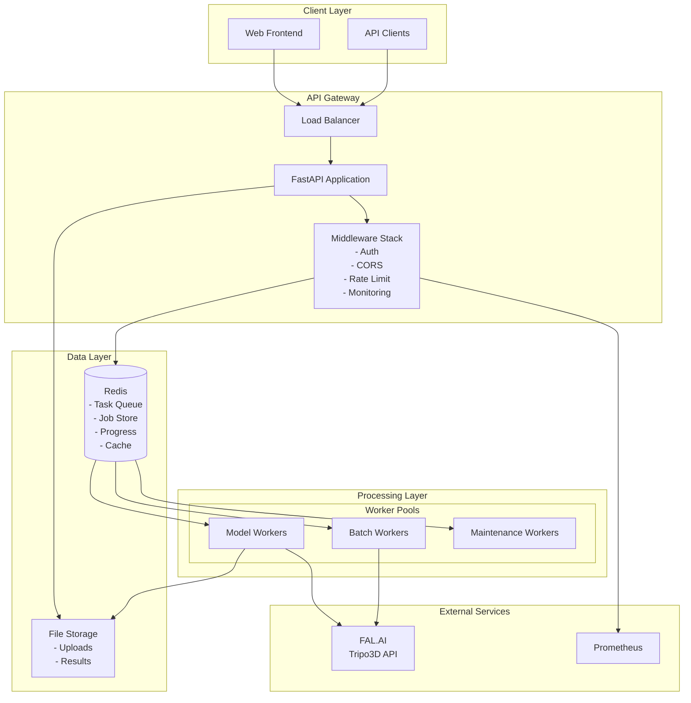

# Backend Documentation

> **Last Updated**: 2025-07-12  
> **Status**: Active  
> **Version**: 1.0

Comprehensive documentation for the Image2Model FastAPI backend, Celery workers, and service integrations.

## 📋 In This Section

### API Reference

- **[Endpoints Reference](./api-reference/endpoints.md)** - Complete API endpoint documentation
- **[Authentication Guide](./api-reference/authentication.md)** - API key authentication system
- **[Error Codes](./api-reference/error-codes.md)** - Error response formats and handling
- **[Rate Limiting](./api-reference/rate-limiting.md)** - Rate limit policies and best practices

### Architecture

- **[System Design](./architecture/system-design.md)** - Overall architecture and design principles
- **[Core Components](./architecture/components.md)** - Component overview and relationships
- **[Data Flow](./architecture/data-flow.md)** - Request lifecycle and data processing
- **[Scalability](./architecture/scalability.md)** - Scaling strategies and performance

### Security

- **[Authentication & Authorization](./security/authentication.md)** - Security implementation details
- **[Best Practices](./security/best-practices.md)** - Security measures and guidelines
- **[Vulnerabilities](./security/vulnerabilities.md)** - Known issues and mitigation strategies
- **[Compliance](./security/compliance.md)** - GDPR, privacy, and regulatory compliance

### Services

- **[FAL.AI Integration](./services/fal-integration.md)** - 3D model generation service
- **[Background Tasks](./services/background-tasks.md)** - Celery architecture and task processing
- **[Monitoring](./services/monitoring.md)** - Logging, metrics, and observability
- **[Redis Usage](./services/redis-usage.md)** - Data structures and caching patterns

## 🎯 Quick Overview

### Technology Stack

- **Framework**: FastAPI (Python 3.11+)
- **Task Queue**: Celery 5.x with Redis broker
- **3D Generation**: FAL.AI Tripo3D v2.5 API
- **Caching/Storage**: Redis 7.x
- **Monitoring**: Prometheus + Grafana
- **API Docs**: OpenAPI 3.0/Swagger
- **Validation**: Pydantic v2
- **Testing**: Pytest with async support

### Key Features

- **Async Architecture**: High-performance async/await throughout
- **Distributed Processing**: Parallel batch processing with Celery
- **Real-time Updates**: Server-Sent Events (SSE) for live progress
- **Comprehensive Monitoring**: Structured logging and Prometheus metrics
- **Robust Error Handling**: Retry mechanisms and circuit breakers
- **Type Safety**: Full type hints and Pydantic validation
- **Security First**: API key auth, rate limiting, input validation

### System Architecture



## 🚀 Getting Started

### Prerequisites

- Python 3.11+
- Redis 7.x server
- Docker & Docker Compose
- FAL.AI API key
- Virtual environment tool (venv/conda)

### Quick Start

```bash
# Clone the repository
git clone <repository-url>
cd image2model/backend

# Set up virtual environment
python -m venv venv
source venv/bin/activate  # or `venv\Scripts\activate` on Windows

# Install dependencies
pip install -r requirements.txt

# Set environment variables
cp .env.example .env
# Edit .env with your configuration:
# - FAL_KEY=your_fal_api_key
# - API_KEY=your_api_key
# - ADMIN_API_KEY=your_admin_key

# Start Redis with Docker
docker compose up -d redis

# Run database migrations (if applicable)
# python -m alembic upgrade head

# Start the FastAPI server
uvicorn app.main:app --reload --host 0.0.0.0 --port 8000

# In another terminal, start Celery worker
celery -A app.core.celery_app worker --loglevel=info -Q model_generation,batch_processing

# Optional: Start Flower for monitoring
celery -A app.core.celery_app flower --port=5555
```

## 📊 Core Concepts

### Project Structure

```
backend/
├── app/
│   ├── api/
│   │   ├── endpoints/      # Route handlers
│   │   │   ├── upload.py   # Batch upload endpoints
│   │   │   ├── models.py   # Model generation
│   │   │   ├── status.py   # Job status & SSE
│   │   │   ├── download.py # File retrieval
│   │   │   ├── admin.py    # Admin operations
│   │   │   └── health.py   # Health checks
│   │   └── api.py          # Main router
│   ├── core/
│   │   ├── config.py       # Pydantic settings
│   │   ├── celery_app.py   # Celery configuration
│   │   ├── job_store.py    # Redis job management
│   │   ├── session_store.py # Session tracking
│   │   ├── monitoring.py   # Prometheus metrics
│   │   └── exceptions.py   # Custom exceptions
│   ├── middleware/
│   │   ├── auth.py         # API key authentication
│   │   └── rate_limit.py   # Rate limiting
│   ├── models/             # Pydantic models
│   ├── workers/
│   │   ├── tasks.py        # Celery tasks
│   │   ├── fal_client.py   # FAL.AI integration
│   │   └── cleanup.py      # Maintenance tasks
│   └── main.py             # FastAPI application
├── tests/                  # Test suites
├── logs/                   # Application logs
├── uploads/                # Temporary uploads
└── docker-compose.yml      # Service orchestration
```

### Request Processing Flow

1. **Client Request** → Load Balancer → FastAPI
2. **Authentication** → API key validation
3. **Rate Limiting** → Check request limits
4. **Validation** → Pydantic model validation
5. **File Upload** → Store in uploads directory
6. **Job Creation** → Create job in Redis
7. **Task Dispatch** → Send to Celery queue
8. **Worker Processing** → FAL.AI API call
9. **Progress Updates** → Redis pub/sub → SSE
10. **Result Storage** → Store model URL in Redis
11. **Client Download** → Redirect to FAL.AI CDN

### Task Processing

```python
# Batch processing with Celery chord
from celery import group, chord

# Create parallel tasks for each file
file_tasks = group(
    generate_single_model.s(job_id, file)
    for file in files
)

# Execute with callback
job = chord(file_tasks)(finalize_batch.s(job_id))
```

## 🔧 API Endpoints

### Health Check

```
GET /api/v1/health
- Basic health check

GET /api/v1/health/ready
- Kubernetes readiness probe with dependency checks
```

### Upload API

```
POST /api/v1/upload/batch
- Accept: multipart/form-data
- Files: up to 25 images (max 10MB each)
- Formats: JPG, JPEG, PNG
- Returns: {job_id, session_id, files[], status}
- Auth: Required
```

### Model Generation

```
POST /api/v1/models/generate-single
- Generate 3D model from uploaded image
- Body: {job_id, file_id, face_limit}
- Returns: {job_id, file_id, model_task_id, status}
- Auth: Required
```

### Status API

```
GET /api/v1/status/{job_id}
- Get batch job status
- Returns: {job_id, status, progress, files[]}
- Auth: Optional

GET /api/v1/status/stream/{job_id}
- Server-Sent Events for real-time updates
- Events: progress, log, completed, error
- Auth: Optional
```

### Download API

```
GET /api/v1/download/{job_id}/{file_id}/model
- Download or redirect to 3D model
- Returns: 302 redirect to FAL.AI CDN or file download
- Auth: Optional (required for ownership)

GET /api/v1/download/{job_id}/all
- Download all models as ZIP
- Returns: application/zip
- Auth: Optional
```

### Admin API

```
GET /api/v1/admin/system-info
- System resource information
- Auth: Admin required

POST /api/v1/admin/cleanup
- Manual cleanup trigger
- Body: {older_than_hours}
- Auth: Admin required
```

## 🔐 Security

### Authentication

- **Bearer Token**: API key in Authorization header
- **Format**: `Authorization: Bearer {API_KEY}`
- **Two Levels**: Regular users and admin access
- **Session Management**: Redis-based job ownership tracking

### Rate Limiting

- **Default Limits**: 60/minute, 1000/hour per API key
- **Endpoint Specific**: Upload endpoints have lower limits
- **Implementation**: SlowAPI with Redis backend
- **Headers**: X-RateLimit-Limit, X-RateLimit-Remaining, X-RateLimit-Reset

### Input Validation

- **File Validation**: MIME type and extension checking
- **Size Limits**: 10MB per file, 25 files per batch
- **Path Security**: Sanitized filenames, no directory traversal
- **Job ID Format**: Alphanumeric with underscores/hyphens only

### Security Headers

- X-Content-Type-Options: nosniff
- X-Frame-Options: DENY
- Strict-Transport-Security (HSTS)
- CORS configured per environment

## 📡 Real-time Features

### Server-Sent Events (SSE)

Real-time progress updates for batch processing:

```python
@router.get("/status/stream/{job_id}")
async def stream_status(job_id: str):
    async def event_generator():
        while True:
            # Get progress from Redis pub/sub
            progress = await get_progress(job_id)
            
            # Send SSE event
            yield f"data: {json.dumps(progress)}\n\n"
            
            if progress["status"] in ["completed", "failed"]:
                break
                
            await asyncio.sleep(0.5)
    
    return EventSourceResponse(event_generator())
```

### Progress Tracking

- **Granular Updates**: Per-file progress percentage
- **Log Streaming**: Real-time processing logs
- **Event Types**: progress, log, completed, error
- **Redis Pub/Sub**: Distributed event broadcasting

## 🧪 Testing

### Test Structure

```
tests/
├── unit/              # Unit tests
├── integration/       # API integration tests
│   ├── test_api_endpoints.py
│   ├── test_sse_progress.py
│   └── test_sse_streaming.py
├── load/              # Performance tests
└── fixtures/          # Test data
```

### Running Tests

```bash
# All tests
pytest

# Unit tests only
pytest tests/unit/

# Integration tests
pytest tests/integration/

# With coverage
pytest --cov=app --cov-report=html

# Load testing
locust -f tests/load/test_performance.py --host=http://localhost:8000
```

### Test Configuration

```python
# Test with mock FAL.AI client
pytest --mock-fal

# Test with real services
pytest --integration
```

## 🔗 Key Resources

### Internal Documentation

- [API Interactive Docs](http://localhost:8000/docs)
- [API ReDoc](http://localhost:8000/redoc)
- [Prometheus Metrics](http://localhost:8000/metrics)
- [Flower Dashboard](http://localhost:5555)

### External Resources

- [FastAPI Documentation](https://fastapi.tiangolo.com/)
- [Celery Documentation](https://docs.celeryq.dev/)
- [FAL.AI API Docs](https://fal.ai/docs)
- [Redis Documentation](https://redis.io/docs/)

## 💡 Best Practices

### Performance

- **Async First**: Use async/await for all I/O operations
- **Connection Pooling**: Redis and HTTP connection reuse
- **Batch Processing**: Process multiple files in parallel
- **Caching Strategy**: Cache FAL.AI results and status
- **Progress Tracking**: Atomic Redis operations

### Error Handling

- **Custom Exceptions**: Hierarchical exception structure
- **Retry Logic**: Exponential backoff for transient failures
- **Error Codes**: Consistent error code system
- **Correlation IDs**: Track requests across services
- **Graceful Degradation**: Fallback mechanisms

### Code Quality

- **Type Safety**: 100% type hints with mypy
- **Documentation**: Docstrings and inline comments
- **Code Style**: Black formatter, isort, flake8
- **Testing**: >80% test coverage target
- **CI/CD**: Automated testing and deployment

### Monitoring

- **Structured Logging**: JSON logs with context
- **Metrics Collection**: Prometheus metrics
- **Distributed Tracing**: OpenTelemetry ready
- **Health Checks**: Liveness and readiness probes
- **Performance Tracking**: Request and task duration

## 🐛 Troubleshooting

### Common Issues

| Issue | Cause | Solution |
|-------|-------|----------|
| Celery tasks not processing | Redis connection issue | Check Redis connectivity and credentials |
| CORS errors | Origin not whitelisted | Add origin to ALLOWED_ORIGINS |
| File upload fails | Size limit exceeded | Check MAX_UPLOAD_SIZE setting |
| SSE disconnects | Proxy timeout | Configure proxy keep-alive settings |
| Rate limit errors | Too many requests | Implement request queuing |
| FAL.AI timeouts | Large model generation | Increase task timeout settings |

### Debug Commands

```bash
# Check Celery workers
celery -A app.core.celery_app inspect active

# Monitor Redis
redis-cli monitor

# View task queue
celery -A app.core.celery_app inspect reserved

# Check application logs
tail -f logs/app.log | jq '.'

# Test FAL.AI connectivity
python -m app.workers.fal_client test
```

### Environment Variables

```bash
# Required
FAL_KEY=your_fal_api_key
API_KEY=your_api_key
REDIS_HOST=localhost
REDIS_PORT=6379

# Optional
ADMIN_API_KEY=admin_key
ENVIRONMENT=development
LOG_LEVEL=INFO
SENTRY_DSN=your_sentry_dsn
```

---

**Next Steps**: 
- 📚 Review the [API Reference](./api-reference/endpoints.md) for detailed endpoint documentation
- 🏗️ Explore the [System Architecture](./architecture/system-design.md) for design insights
- 🔒 Check [Security Best Practices](./security/best-practices.md) for secure deployment
- 🚀 See the [Deployment Guide](../04-deployment/) for production setup

*Backend documentation v1.0 - For the latest updates, check the repository.*