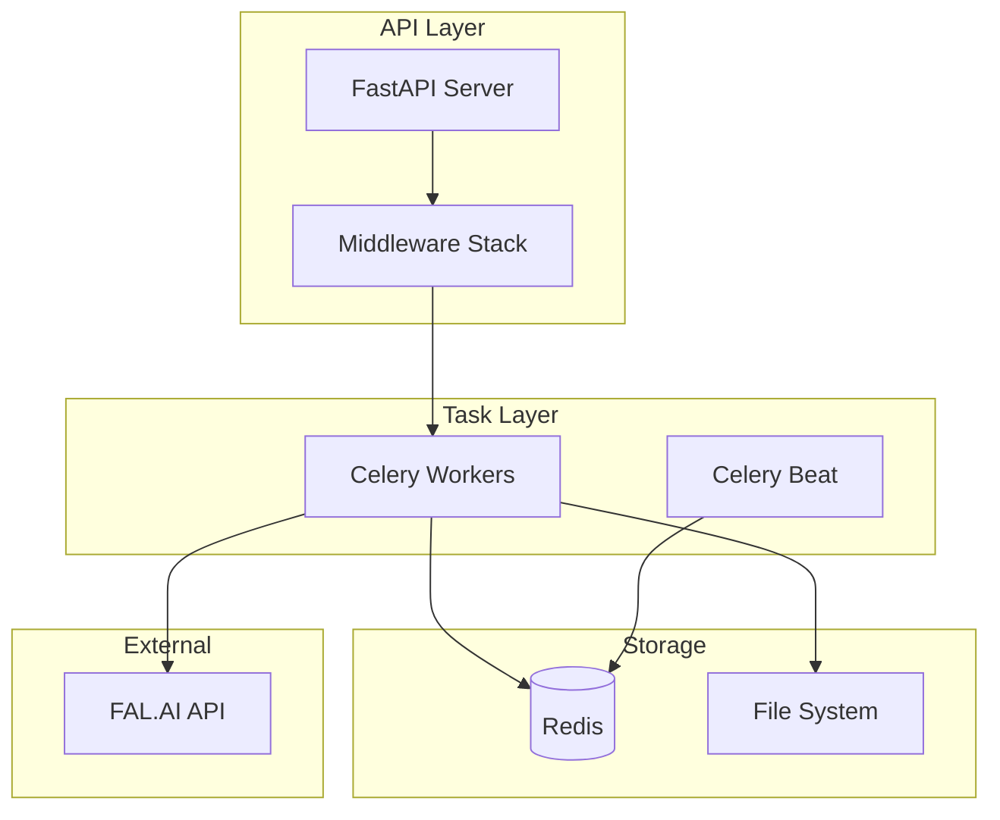

# Backend Documentation

> **Last Updated**: 2025-01-11  
> **Status**: Planned  
> **Version**: 0.1

Comprehensive documentation for the image2model FastAPI backend and worker services.

## 📋 In This Section

### Architecture

- **[FastAPI Structure](./architecture/fastapi-structure.md)** *(coming soon)* - Application organization
- **[Celery Workers](./architecture/celery-workers.md)** *(coming soon)* - Task queue architecture
- **[Redis Patterns](./architecture/redis-patterns.md)** *(coming soon)* - Caching and job storage

### API Reference

- **[Endpoints Overview](./api-reference/endpoints-overview.md)** *(coming soon)* - Complete API catalog
- **[Upload Endpoints](./api-reference/upload-endpoints.md)** *(coming soon)* - File upload APIs
- **[Status Endpoints](./api-reference/status-endpoints.md)** *(coming soon)* - Progress and SSE APIs
- **[Download Endpoints](./api-reference/download-endpoints.md)** *(coming soon)* - File retrieval APIs

### Services

- **[FAL.AI Integration](./services/fal-integration.md)** *(coming soon)* - 3D model generation
- **[Job Processing](./services/job-processing.md)** *(coming soon)* - Job lifecycle management
- **[File Handling](./services/file-handling.md)** *(coming soon)* - Upload/download patterns

### Security

- **[Authentication](./security/authentication.md)** *(coming soon)* - API key system
- **[Rate Limiting](./security/rate-limiting.md)** *(coming soon)* - Request throttling
- **[CORS Configuration](./security/cors-configuration.md)** *(coming soon)* - Cross-origin setup

## 🎯 Quick Overview

### Technology Stack

- **Framework**: FastAPI (Python 3.11+)
- **Task Queue**: Celery with Redis
- **API Docs**: OpenAPI/Swagger
- **Validation**: Pydantic
- **Testing**: Pytest

### Key Features

- **Async Support**: High-performance async endpoints
- **Auto Documentation**: Interactive API docs
- **Type Safety**: Full type hints throughout
- **Background Tasks**: Celery for long-running jobs
- **Real-time Updates**: SSE for progress streaming

### System Architecture



## 🚀 Getting Started

### Prerequisites

- Python 3.11+
- Redis server
- Virtual environment tool
- FAL.AI API key

### Quick Start

```bash
# Set up virtual environment
python -m venv venv
source venv/bin/activate  # or `venv\Scripts\activate` on Windows

# Install dependencies
pip install -r requirements.txt

# Set environment variables
cp .env.example .env
# Edit .env with your configuration

# Run the server
uvicorn app.main:app --reload

# In another terminal, run Celery worker
celery -A app.core.celery_app worker --loglevel=info
```

## 📊 Core Concepts

### API Structure

```
app/
├── api/
│   ├── endpoints/      # Route handlers
│   └── api.py         # Router configuration
├── core/
│   ├── config.py      # Settings
│   ├── celery_app.py  # Celery setup
│   └── security.py    # Auth utilities
├── models/            # Pydantic models
├── workers/           # Celery tasks
└── main.py           # FastAPI app
```

### Request Flow

1. **Request arrives** at FastAPI endpoint
2. **Middleware** handles auth, CORS, rate limiting
3. **Endpoint** validates input with Pydantic
4. **Service** processes business logic
5. **Response** returned (or task queued)

### Background Jobs

```python
# Queueing a task
from app.workers.tasks import process_images

task = process_images.delay(file_paths, options)
task_id = task.id
```

## 🔧 API Endpoints

### Upload API

```
POST /api/v1/upload/
- Accepts: multipart/form-data
- Files: up to 25 images
- Returns: task_id, job_id
```

### Status API

```
GET /api/v1/status/tasks/{task_id}/stream
- Returns: SSE stream
- Events: progress, completed, failed

GET /api/v1/status/tasks/{task_id}
- Returns: Current task status
```

### Download API

```
GET /api/v1/download/{job_id}/all
- Returns: List of available files

GET /api/v1/download/{job_id}/{filename}
- Returns: File download
```

## 🔐 Security

### Authentication

- API key in Authorization header
- Format: `Bearer {API_KEY}`
- Keys stored in environment variables

### Rate Limiting

- Default: 100 requests/minute
- Configurable per endpoint
- Redis-backed counter

### Input Validation

- File type validation
- Size limits enforced
- Path traversal protection

## 📡 Real-time Features

### Server-Sent Events

Used for real-time progress updates:

```python
async def stream_progress(task_id: str):
    while True:
        status = get_task_status(task_id)
        yield f"data: {json.dumps(status)}\n\n"
        if status["state"] in ["SUCCESS", "FAILURE"]:
            break
        await asyncio.sleep(1)
```

### WebSocket Support

Planned for future bidirectional communication.

## 🧪 Testing

### Unit Tests

```bash
pytest tests/unit/
```

### Integration Tests

```bash
pytest tests/integration/
```

### Load Tests

```bash
locust -f tests/load/locustfile.py
```

## 🔗 Key Resources

### Internal Documentation

- [API OpenAPI Spec](http://localhost:8000/docs)
- [Frontend Integration](../02-frontend/api-integration/)
- [Deployment Guide](../04-deployment/)

### External Resources

- [FastAPI Documentation](https://fastapi.tiangolo.com/)
- [Celery Documentation](https://docs.celeryproject.org/)
- [FAL.AI API Docs](https://fal.ai/docs)

## 💡 Best Practices

### Performance

- Use async endpoints where possible
- Implement caching strategies
- Optimize database queries
- Monitor task queue health

### Error Handling

- Consistent error response format
- Proper HTTP status codes
- Detailed error logging
- Graceful degradation

### Code Quality

- Type hints throughout
- Docstrings for all functions
- Follow PEP 8 style guide
- Comprehensive test coverage

## 🐛 Troubleshooting

### Common Issues

- **Celery not picking up tasks**: Check Redis connection
- **CORS errors**: Verify allowed origins
- **File upload fails**: Check size limits
- **SSE disconnects**: Review timeout settings

### Debugging Tools

- FastAPI interactive docs
- Celery Flower for monitoring
- Redis CLI for queue inspection
- Python debugger (pdb)

---

**Next Steps**: Explore the [API Reference](./api-reference/endpoints-overview.md) or learn about [Architecture](./architecture/fastapi-structure.md).

*This documentation is planned for development. Check back for updates!*