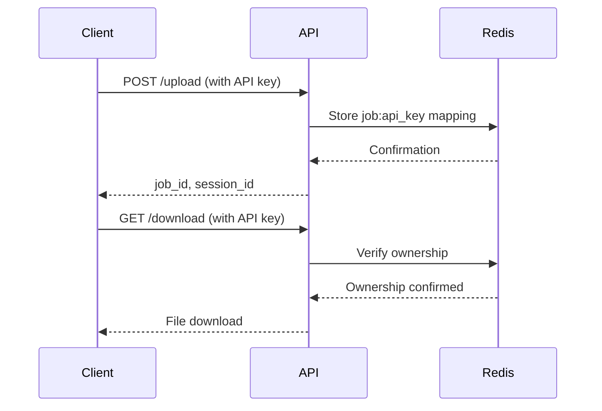

# Authentication Guide

## Overview

The Image2Model API uses API key authentication to secure endpoints and track usage. The system supports two levels of access: regular users and administrators.

## Authentication Methods

### Bearer Token Authentication

All authenticated requests must include an API key in the Authorization header using the Bearer scheme:

```http
Authorization: Bearer YOUR_API_KEY
```

### Example Request

```bash
curl -X GET \
  https://api.image2model.com/api/v1/status/job_123 \
  -H "Authorization: Bearer your_api_key_here"
```

## Access Levels

### Regular Access
- **Endpoints**: All standard endpoints (upload, status, download)
- **Environment Variable**: `API_KEY`
- **Usage**: General 3D model generation operations

### Admin Access
- **Endpoints**: Admin endpoints (/admin/*, /logs/*)
- **Environment Variable**: `ADMIN_API_KEY`
- **Usage**: System monitoring, maintenance, and log access

## Implementation Details

### Dependency Injection

The API uses FastAPI's dependency injection for authentication:

```python
from app.middleware.auth import RequireAuth, RequireAdminAuth

# Regular endpoint
@router.get("/status/{job_id}", dependencies=[RequireAuth])
async def get_status(job_id: str):
    pass

# Admin endpoint
@router.get("/admin/system-info", dependencies=[RequireAdminAuth])
async def get_system_info():
    pass
```

### Optional Authentication

Some endpoints support optional authentication for enhanced features:

```python
from app.middleware.auth import OptionalAuth

@router.get("/download/{job_id}/{filename}")
async def download_model(
    job_id: str,
    filename: str,
    api_key: Optional[str] = OptionalAuth
):
    # If api_key provided, verify ownership and access control
    # If no api_key, provide limited functionality
    pass
```

**Endpoints with Optional Authentication:**
- `/api/v1/download/{job_id}/{filename}` - Enhanced access control with API key

## Session Management

### Job Ownership

When an authenticated user creates a job, the system:
1. Associates the job with their API key
2. Stores the relationship in Redis with 24-hour TTL
3. Validates ownership on subsequent requests

### Session Flow



## Development Mode

In development mode (when no API_KEY is configured and ENVIRONMENT != "production"):
- Authentication is bypassed for regular endpoints
- All endpoints are accessible without API keys
- Admin endpoints still require ADMIN_API_KEY
- Useful for local development and testing

```python
# Enable dev mode by not setting API_KEY in non-production environment
export ENVIRONMENT="development"
# API_KEY not set or empty
export API_KEY=""
```

## Security Considerations

### API Key Storage
- Store API keys securely using environment variables
- Never commit API keys to version control
- Rotate keys regularly

### HTTPS Required
- Always use HTTPS in production
- API keys sent over HTTP can be intercepted

### Rate Limiting
- API keys are subject to rate limiting
- Default: 60 requests/minute, 1000 requests/hour
- Rate limits apply per API key

## Error Responses

### Missing Authentication

```json
{
  "error": true,
  "error_code": "AUTHENTICATION_REQUIRED",
  "message": "API key required"
}
```

**HTTP Status**: 500 Internal Server Error (if API key not configured in production)

### Invalid API Key

```json
{
  "error": true,
  "error_code": "INVALID_API_KEY",
  "message": "Invalid API key"
}
```

**HTTP Status**: 403 Forbidden

### Insufficient Permissions

```json
{
  "error": true,
  "error_code": "INSUFFICIENT_PERMISSIONS",
  "message": "Invalid admin API key"
}
```

**HTTP Status**: 403 Forbidden

## Best Practices

### Client Implementation

1. **Secure Storage**: Store API keys in environment variables or secure vaults
2. **Error Handling**: Implement retry logic for 401/403 errors
3. **Key Rotation**: Support key rotation without service interruption

### Request Signing (Future Enhancement)

For additional security, consider implementing request signing:

```python
# Future implementation
timestamp = str(int(time.time()))
signature = hmac.new(
    api_secret.encode(),
    f"{method}{path}{timestamp}".encode(),
    hashlib.sha256
).hexdigest()

headers = {
    "Authorization": f"Bearer {api_key}",
    "X-Timestamp": timestamp,
    "X-Signature": signature
}
```

## Testing Authentication

### Using cURL

```bash
# Test regular endpoint
curl -X GET http://localhost:8000/api/v1/health/ready \
  -H "Authorization: Bearer test_api_key"

# Test admin endpoint
curl -X GET http://localhost:8000/api/v1/admin/system-info \
  -H "Authorization: Bearer test_admin_key"
```

### Using Python

```python
import requests

headers = {
    "Authorization": "Bearer your_api_key_here"
}

response = requests.get(
    "http://localhost:8000/api/v1/status/job_123",
    headers=headers
)

if response.status_code == 401:
    print("Authentication required")
elif response.status_code == 403:
    print("Invalid API key")
else:
    print(response.json())
```

## Monitoring and Auditing

### Access Logging

All authenticated requests are logged with:
- API key hash (not the actual key)
- Request timestamp
- Endpoint accessed
- Response status

### Failed Authentication

Failed authentication attempts are tracked:
- Multiple failures may trigger rate limiting
- Patterns analyzed for security threats
- Alerts sent for suspicious activity