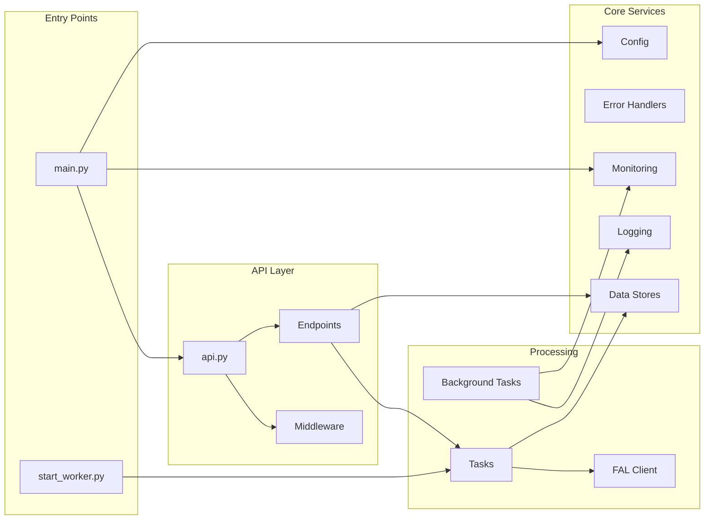
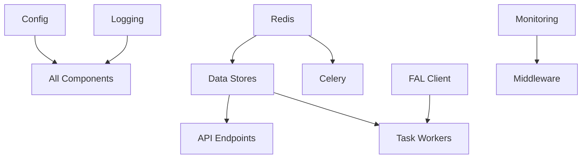

# Core Components and Relationships

## Component Overview

The Image2Model backend consists of several interconnected components that work together to provide a robust 3D model generation service.

## Component Architecture



## Core Components

### 1. Application Entry Point (`main.py`)

**Purpose**: Initialize and configure the FastAPI application

**Key Responsibilities:**
- Application lifecycle management
- Global exception handling
- Middleware configuration
- Background task initialization

**Implementation:**
```python
class Application:
    def __init__(self):
        self.app = FastAPI(
            title="Image to 3D Model API",
            lifespan=self.lifespan
        )
        self.setup_middleware()
        self.setup_routes()
        self.setup_error_handlers()
    
    async def lifespan(self, app: FastAPI):
        # Startup
        await self.startup()
        yield
        # Shutdown
        await self.shutdown()
```

### 2. Configuration Management (`core/config.py`)

**Purpose**: Centralized configuration using Pydantic settings

**Key Features:**
- Environment variable loading
- Type validation
- Default values
- Computed properties

**Configuration Structure:**
```python
class Settings(BaseSettings):
    # API Configuration
    API_KEY: Optional[str] = None
    ADMIN_API_KEY: Optional[str] = None
    
    # Redis Configuration
    REDIS_HOST: str = "localhost"
    REDIS_PORT: int = 6379
    
    # FAL.AI Configuration
    FAL_KEY: Optional[str] = None
    FAL_MODEL_ENDPOINT: str = "tripo3d/tripo/v2.5/image-to-3d"
    
    # Application Settings
    UPLOAD_DIR: Path = Path("./uploads")
    RESULTS_DIR: Path = Path("./results")
    MAX_UPLOAD_SIZE: int = 10 * 1024 * 1024
    
    class Config:
        env_file = ".env"
        case_sensitive = True
```

### 3. API Router (`api/api.py`)

**Purpose**: Aggregate and organize all API endpoints

**Structure:**
```python
api_router = APIRouter()

# Include all endpoint routers
api_router.include_router(health.router, tags=["health"])
api_router.include_router(upload.router, tags=["upload"])
api_router.include_router(models.router, tags=["models"])
api_router.include_router(status.router, tags=["status"])
api_router.include_router(download.router, tags=["download"])
api_router.include_router(admin.router, tags=["admin"])
api_router.include_router(logs.router, tags=["logs"])
```

### 4. Data Stores

#### JobStore (`core/job_store.py`)

**Purpose**: Manage FAL.AI job results in Redis

**Key Methods:**
```python
class JobStore:
    def __init__(self, redis_client):
        self.redis = redis_client
        self.ttl = 86400  # 24 hours
    
    async def store_result(self, job_id: str, file_id: str, result: dict):
        key = f"job:{job_id}:file:{file_id}"
        await self.redis.setex(key, self.ttl, json.dumps(result))
    
    async def get_result(self, job_id: str, file_id: str) -> Optional[dict]:
        key = f"job:{job_id}:file:{file_id}"
        data = await self.redis.get(key)
        return json.loads(data) if data else None
```

#### SessionStore (`core/session_store.py`)

**Purpose**: Track job ownership by API key

**Key Methods:**
```python
class SessionStore:
    async def create_session(self, job_id: str, api_key: str):
        key = f"session:{job_id}"
        await self.redis.setex(key, self.ttl, api_key)
    
    async def verify_ownership(self, job_id: str, api_key: str) -> bool:
        stored_key = await self.redis.get(f"session:{job_id}")
        return stored_key == api_key
```

#### ProgressTracker (`core/progress_tracker.py`)

**Purpose**: Real-time progress tracking for batch operations

**Features:**
- Atomic progress updates
- Progress aggregation
- Event publishing

### 5. Task Processing

#### Celery Application (`core/celery_app.py`)

**Configuration:**
```python
celery_app = Celery('image2model')

celery_app.conf.update(
    broker_url=REDIS_URL,
    result_backend=REDIS_URL,
    task_routes={
        'tasks.process_batch': {'queue': 'batch_processing'},
        'tasks.generate_single_model': {'queue': 'model_generation'},
        'tasks.cleanup_old_files': {'queue': 'maintenance'}
    },
    task_annotations={
        '*': {
            'rate_limit': '100/m',
            'time_limit': 1800,
            'soft_time_limit': 1500
        }
    }
)
```

#### Task Definitions (`workers/tasks.py`)

**Key Tasks:**
```python
@celery_app.task(bind=True, name='tasks.process_batch')
def process_batch(self, job_id: str, files: List[dict], settings: dict):
    """Orchestrate batch processing using chord pattern"""
    
@celery_app.task(bind=True, name='tasks.generate_single_model')
def generate_single_model(self, job_id: str, file_info: dict):
    """Generate 3D model for a single image"""
    
@celery_app.task(name='tasks.finalize_batch')
def finalize_batch(results: List[dict], job_id: str):
    """Aggregate results and update final status"""
```

### 6. FAL.AI Integration

#### FAL Client (`workers/fal_client.py`)

**Purpose**: Robust integration with FAL.AI API

**Key Features:**
```python
class FalAIClient:
    def __init__(self, api_key: str):
        self.api_key = api_key
        self.base_url = "https://api.fal.ai/v1"
        self.model_endpoint = "tripo3d/tripo/v2.5/image-to-3d"
    
    async def generate_model(
        self,
        image_url: str,
        face_limit: int = 50000,
        progress_callback: Optional[Callable] = None
    ) -> ModelResult:
        """Generate 3D model with retry logic"""
        
    def _handle_rate_limit(self, retry_after: int):
        """Exponential backoff for rate limits"""
        
    def _validate_response(self, response: dict) -> ModelResult:
        """Validate and parse FAL.AI response"""
```

### 7. Monitoring and Observability

#### Monitoring Module (`core/monitoring.py`)

**Metrics Collection:**
```python
class MetricsCollector:
    # HTTP metrics
    http_requests = Counter(
        'http_requests_total',
        'Total HTTP requests',
        ['method', 'endpoint', 'status']
    )
    
    # Task metrics
    task_duration = Histogram(
        'task_duration_seconds',
        'Task execution duration',
        ['task_name', 'status']
    )
    
    # System metrics
    system_cpu = Gauge('system_cpu_percent', 'CPU usage percentage')
    system_memory = Gauge('system_memory_percent', 'Memory usage percentage')
```

#### Logging Configuration (`core/logging_config.py`)

**Structured Logging:**
```python
def setup_logging():
    return {
        "version": 1,
        "formatters": {
            "json": {
                "class": "pythonjsonlogger.jsonlogger.JsonFormatter",
                "format": "%(asctime)s %(name)s %(levelname)s %(message)s"
            }
        },
        "handlers": {
            "file": {
                "class": "logging.handlers.RotatingFileHandler",
                "filename": "app.log",
                "maxBytes": 52428800,  # 50MB
                "backupCount": 5,
                "formatter": "json"
            }
        }
    }
```

### 8. Background Services

#### Background Task Manager (`core/background_tasks.py`)

**Purpose**: Manage periodic system tasks

**Tasks:**
```python
class BackgroundTaskManager:
    async def start_tasks(self):
        self.tasks = [
            self.log_rotation_task(),      # Every 5 minutes
            self.cleanup_old_logs(),        # Daily
            self.system_health_check(),     # Every 10 minutes
            self.collect_metrics()          # Every minute
        ]
    
    async def log_rotation_task(self):
        """Monitor and rotate large log files"""
        
    async def system_health_check(self):
        """Check system resources and alert if needed"""
```

### 9. Middleware Components

#### Authentication Middleware (`middleware/auth.py`)

**Components:**
```python
class AuthMiddleware:
    async def verify_api_key(self, credentials: HTTPAuthorizationCredentials):
        """Validate API key from Bearer token"""
        
    async def verify_admin_api_key(self, credentials: HTTPAuthorizationCredentials):
        """Validate admin API key"""
        
RequireAuth = Depends(HTTPBearer())
RequireAdminAuth = Depends(HTTPBearer())
```

#### Rate Limiting (`middleware/rate_limit.py`)

**Configuration:**
```python
from slowapi import Limiter
from slowapi.util import get_remote_address

limiter = Limiter(
    key_func=get_remote_address,
    default_limits=["60/minute", "1000/hour"]
)
```

## Component Interactions

### Request Processing Flow

1. **Request Arrival** → Middleware (Auth, Rate Limit, Monitoring)
2. **Routing** → API Router → Specific Endpoint
3. **Validation** → Pydantic Models
4. **Business Logic** → Service Layer
5. **Task Dispatch** → Celery Queue
6. **Response** → JSON/SSE

### Task Processing Flow

1. **Task Reception** → Celery Worker
2. **Initialization** → Load Configuration
3. **Processing** → FAL.AI Client
4. **Progress Updates** → Redis Pub/Sub
5. **Result Storage** → Job Store
6. **Notification** → SSE Stream

### Error Handling Flow

1. **Exception Raised** → Custom Exception
2. **Error Handler** → Format Response
3. **Logging** → Structured Log Entry
4. **Monitoring** → Metric Update
5. **Response** → Consistent Error Format

## Component Dependencies



## Component Lifecycle

### Startup Sequence

1. Load configuration
2. Initialize Redis connections
3. Setup logging
4. Initialize stores
5. Register middleware
6. Mount API routes
7. Start background tasks
8. Begin accepting requests

### Shutdown Sequence

1. Stop accepting new requests
2. Wait for ongoing requests
3. Cancel background tasks
4. Flush metrics
5. Close Redis connections
6. Shutdown Celery workers
7. Final log rotation
8. Exit