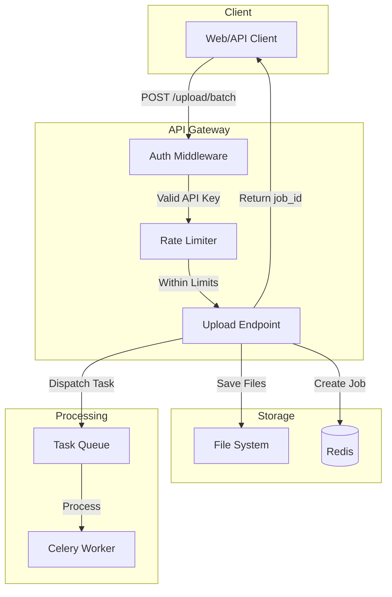
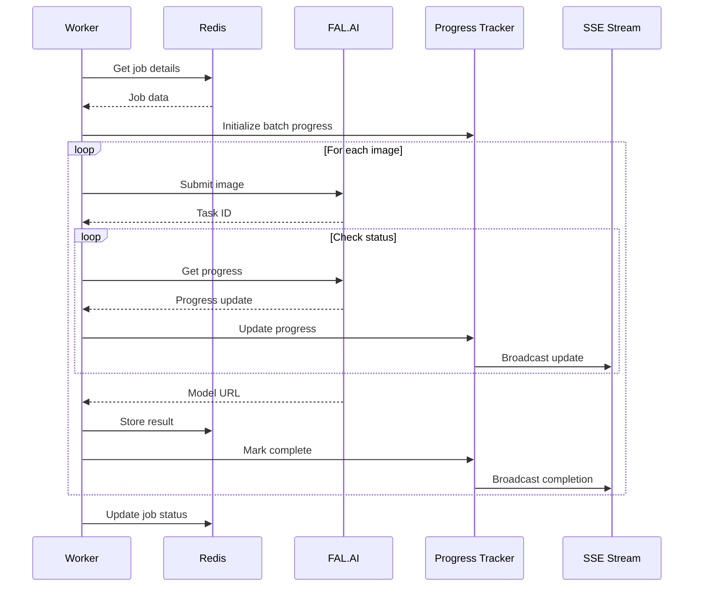
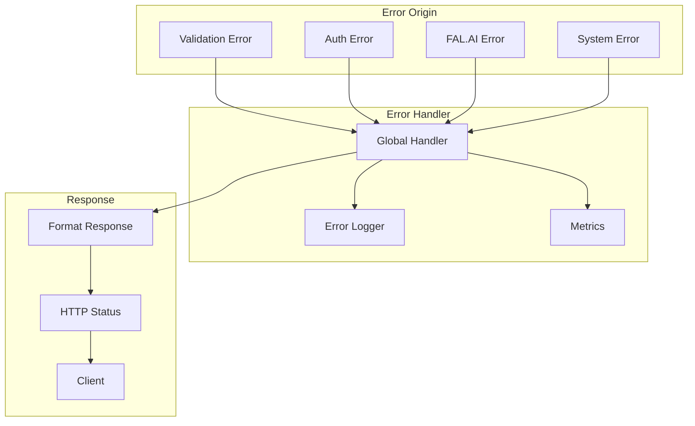

# Data Flow and Request Lifecycle

## Overview

This document describes how data flows through the Image2Model system, from initial upload to final 3D model delivery.

## Request Lifecycle

### 1. Image Upload Flow



**Detailed Steps:**

1. **Client Request**
   ```http
   POST /api/v1/upload/batch
   Authorization: Bearer <api_key>
   Content-Type: multipart/form-data
   
   --boundary
   Content-Disposition: form-data; name="files"; filename="image1.jpg"
   Content-Type: image/jpeg
   
   <binary data>
   --boundary--
   ```

2. **Authentication**
   - Extract Bearer token
   - Validate API key
   - Set user context

3. **Rate Limiting**
   - Check request count
   - Apply rate limit rules
   - Return 429 if exceeded

4. **File Processing**
   ```python
   # Validate each file
   for file in files:
       validate_file_type(file)
       validate_file_size(file)
       generate_unique_id(file)
       save_to_disk(file)
   ```

5. **Job Creation**
   ```python
   job = {
       "job_id": "batch_20240315_123456_abc123",
       "api_key": api_key,
       "files": file_list,
       "status": "pending",
       "created_at": timestamp
   }
   redis.setex(f"job:{job_id}", ttl=86400, value=job)
   ```

6. **Task Dispatch**
   ```python
   celery_app.send_task(
       'tasks.process_batch',
       args=[job_id, files, settings],
       queue='batch_processing'
   )
   ```

### 2. Model Generation Flow



**Processing Details:**

1. **Batch Orchestration**
   ```python
   @celery_app.task
   def process_batch(job_id, files, settings):
       # Create chord for parallel processing
       header = group(
           generate_single_model.s(job_id, file)
           for file in files
       )
       callback = finalize_batch.s(job_id)
       chord(header)(callback)
   ```

2. **Individual File Processing**
   ```python
   @celery_app.task
   def generate_single_model(job_id, file_info):
       # Initialize FAL client
       client = FalAIClient(settings.FAL_KEY)
       
       # Generate model with progress tracking
       result = client.generate_model(
           image_url=file_info['url'],
           face_limit=file_info.get('face_limit', 50000),
           progress_callback=lambda p: update_progress(job_id, file_info['id'], p)
       )
       
       # Store result
       job_store.store_result(job_id, file_info['id'], result)
   ```

3. **Progress Updates**
   ```python
   def update_progress(job_id, file_id, progress):
       # Update Redis
       progress_tracker.update(job_id, file_id, progress)
       
       # Publish SSE event
       event = {
           "type": "progress",
           "job_id": job_id,
           "file_id": file_id,
           "progress": progress
       }
       redis.publish(f"progress:{job_id}", json.dumps(event))
   ```

### 3. Status Monitoring Flow

```mermaid
graph LR
    subgraph "Client"
        SSE_CLIENT[SSE Client]
        POLL_CLIENT[Polling Client]
    end
    
    subgraph "API"
        STATUS_EP[Status Endpoint]
        SSE_EP[SSE Endpoint]
    end
    
    subgraph "Data Source"
        REDIS[(Redis)]
        PUBSUB[Redis Pub/Sub]
    end
    
    POLL_CLIENT -->|GET /status/{id}| STATUS_EP
    STATUS_EP -->|Query| REDIS
    REDIS -->|Job Data| STATUS_EP
    STATUS_EP -->|JSON Response| POLL_CLIENT
    
    SSE_CLIENT -->|GET /status/stream/{id}| SSE_EP
    SSE_EP -->|Subscribe| PUBSUB
    PUBSUB -->|Events| SSE_EP
    SSE_EP -->|SSE Stream| SSE_CLIENT
```

**SSE Event Types:**

```javascript
// Progress update
data: {"type": "progress", "job_id": "...", "file_id": "...", "progress": 50}

// Log message
data: {"type": "log", "job_id": "...", "file_id": "...", "message": "Processing texture..."}

// Completion
data: {"type": "completed", "job_id": "...", "file_id": "...", "model_url": "..."}

// Error
data: {"type": "error", "job_id": "...", "file_id": "...", "error": "..."}
```

### 4. Download Flow

```mermaid
graph TB
    subgraph "Request"
        CLIENT[Client Request]
    end
    
    subgraph "Validation"
        AUTH[Authenticate]
        OWNER[Verify Ownership]
        CHECK[Check Status]
    end
    
    subgraph "Retrieval"
        REDIS[(Redis)]
        FAL[FAL.AI CDN]
        LOCAL[Local Storage]
    end
    
    subgraph "Response"
        REDIRECT[302 Redirect]
        STREAM[File Stream]
    end
    
    CLIENT -->|GET /download/{job}/{file}| AUTH
    AUTH --> OWNER
    OWNER --> CHECK
    CHECK --> REDIS
    REDIS -->|Has URL| REDIRECT
    REDIS -->|No URL| LOCAL
    REDIRECT --> FAL
    LOCAL --> STREAM
```

## Data Storage Patterns

### 1. Redis Key Structure

```
# Job metadata
job:{job_id} → {
    "status": "processing",
    "files": [...],
    "created_at": "...",
    "api_key": "..."
}

# File results
job:{job_id}:file:{file_id} → {
    "status": "completed",
    "model_url": "https://...",
    "task_id": "...",
    "completed_at": "..."
}

# Progress tracking
progress:{job_id}:{file_id} → 75

# Session ownership
session:{job_id} → "api_key_hash"

# Rate limiting
rate_limit:{api_key}:minute → 45
rate_limit:{api_key}:hour → 850
```

### 2. File System Structure

```
/app/
├── uploads/
│   └── {job_id}/
│       ├── {file_id}_original.jpg
│       └── metadata.json
├── results/
│   └── {job_id}/
│       └── {file_id}_model.glb
└── logs/
    ├── app.log
    ├── celery.log
    └── archived/
```

## Data Transformation Pipeline

### 1. Input Validation

```python
def validate_upload(files: List[UploadFile]) -> List[ValidatedFile]:
    validated = []
    for file in files:
        # Type validation
        if not file.content_type.startswith('image/'):
            raise ValidationError("Invalid file type")
        
        # Size validation
        if file.size > MAX_FILE_SIZE:
            raise FileTooLargeError(file.size)
        
        # Extension validation
        ext = Path(file.filename).suffix.lower()
        if ext not in ALLOWED_EXTENSIONS:
            raise ValidationError(f"Extension {ext} not allowed")
        
        validated.append(ValidatedFile(
            original_name=file.filename,
            content_type=file.content_type,
            size=file.size,
            file_id=generate_file_id()
        ))
    
    return validated
```

### 2. Progress Aggregation

```python
def calculate_batch_progress(job_id: str) -> float:
    """Calculate overall batch progress"""
    files = redis.hgetall(f"progress:{job_id}")
    if not files:
        return 0.0
    
    total_progress = sum(float(p) for p in files.values())
    return total_progress / len(files)
```

### 3. Result Aggregation

```python
def aggregate_batch_results(job_id: str) -> BatchResult:
    """Aggregate individual file results"""
    job_data = redis.get(f"job:{job_id}")
    results = []
    
    for file in job_data['files']:
        file_result = redis.get(f"job:{job_id}:file:{file['id']}")
        results.append(file_result)
    
    return BatchResult(
        job_id=job_id,
        total_files=len(job_data['files']),
        completed=len([r for r in results if r['status'] == 'completed']),
        failed=len([r for r in results if r['status'] == 'failed']),
        results=results
    )
```

## Error Handling Flow

### Error Propagation



### Error Recovery

```python
@celery_app.task(
    bind=True,
    autoretry_for=(NetworkError, RateLimitError),
    retry_kwargs={'max_retries': 3, 'countdown': 60}
)
def generate_model_with_retry(self, job_id, file_info):
    try:
        return generate_model(job_id, file_info)
    except FalAPIError as e:
        if e.is_permanent():
            # Don't retry permanent errors
            raise self.Abort()
        raise  # Trigger retry
```

## Performance Considerations

### 1. Batch Processing Optimization

```python
# Process files in optimal batch sizes
BATCH_SIZE = 10

def optimal_batch_processing(files):
    for i in range(0, len(files), BATCH_SIZE):
        batch = files[i:i + BATCH_SIZE]
        process_batch.delay(batch)
```

### 2. Connection Pooling

```python
# Redis connection pool
redis_pool = ConnectionPool(
    host=settings.REDIS_HOST,
    port=settings.REDIS_PORT,
    max_connections=50,
    socket_keepalive=True,
    socket_keepalive_options={
        1: 1,  # TCP_KEEPIDLE
        2: 60, # TCP_KEEPINTVL  
        3: 3,  # TCP_KEEPCNT
    }
)
```

### 3. Stream Processing

```python
async def stream_large_file(file_path: Path):
    """Stream large files efficiently"""
    CHUNK_SIZE = 1024 * 1024  # 1MB chunks
    
    async with aiofiles.open(file_path, 'rb') as f:
        while chunk := await f.read(CHUNK_SIZE):
            yield chunk
```

## Data Consistency

### 1. Atomic Operations

```python
def atomic_progress_update(job_id: str, file_id: str, progress: int):
    """Atomically update progress with constraints"""
    key = f"progress:{job_id}:{file_id}"
    
    # Use Lua script for atomic operation
    lua_script = """
    local current = redis.call('GET', KEYS[1])
    if not current or tonumber(ARGV[1]) > tonumber(current) then
        redis.call('SET', KEYS[1], ARGV[1])
        return ARGV[1]
    end
    return current
    """
    
    return redis.eval(lua_script, 1, key, progress)
```

### 2. Transaction Management

```python
def transactional_job_update(job_id: str, updates: dict):
    """Update job with transaction"""
    pipe = redis.pipeline()
    
    # Watch for concurrent modifications
    pipe.watch(f"job:{job_id}")
    
    # Get current state
    current = pipe.get(f"job:{job_id}")
    
    # Apply updates
    pipe.multi()
    updated = {**current, **updates}
    pipe.set(f"job:{job_id}", updated)
    
    # Execute transaction
    pipe.execute()
```