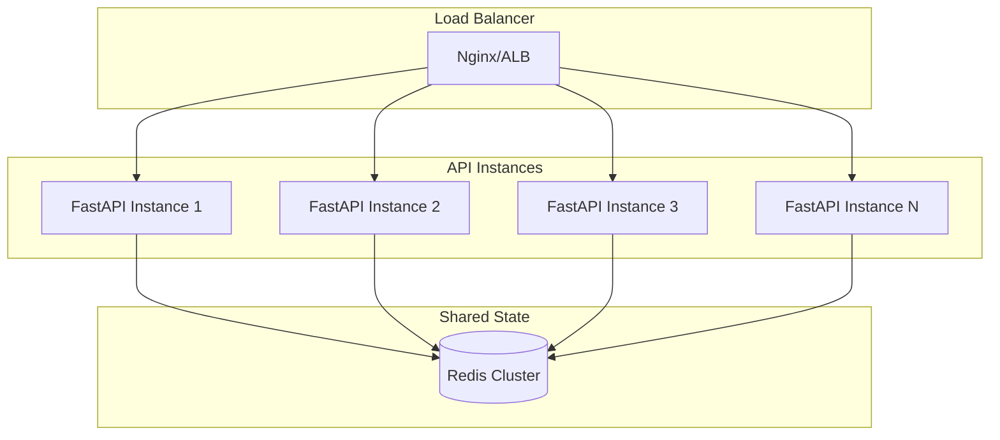
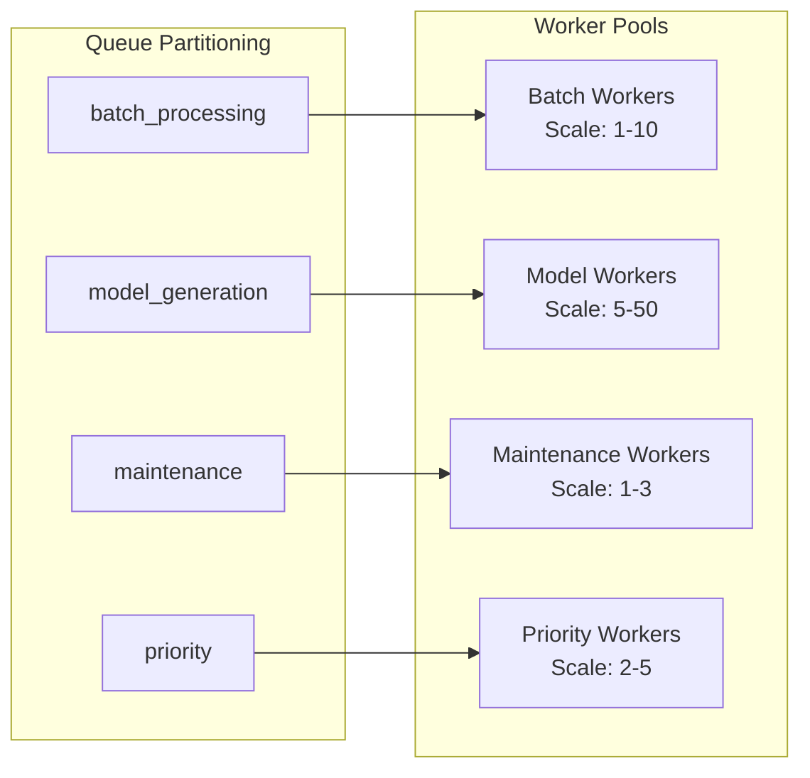
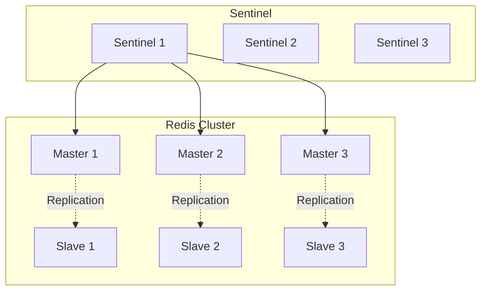

# Scalability and Performance Architecture

## Overview

This document outlines the scalability strategies and performance optimizations implemented in the Image2Model backend to handle increasing load and maintain responsiveness.

## Scalability Principles

### 1. Horizontal Scaling
- Stateless API servers
- Distributed task processing
- Shared state in Redis
- Load balancing across instances

### 2. Vertical Scaling
- Resource optimization
- Memory-efficient processing
- CPU utilization strategies
- I/O optimization

### 3. Elastic Scaling
- Auto-scaling policies
- Dynamic worker allocation
- Queue-based load management
- Resource monitoring

## Component Scaling Strategies

### API Server Scaling



**Kubernetes Deployment:**
```yaml
apiVersion: apps/v1
kind: Deployment
metadata:
  name: image2model-api
spec:
  replicas: 3
  selector:
    matchLabels:
      app: image2model-api
  template:
    spec:
      containers:
      - name: api
        image: image2model/api:latest
        resources:
          requests:
            memory: "512Mi"
            cpu: "500m"
          limits:
            memory: "1Gi"
            cpu: "1000m"
        livenessProbe:
          httpGet:
            path: /api/v1/health
          periodSeconds: 10
        readinessProbe:
          httpGet:
            path: /api/v1/health/ready
          periodSeconds: 5
```

**Auto-scaling Configuration:**
```yaml
apiVersion: autoscaling/v2
kind: HorizontalPodAutoscaler
metadata:
  name: image2model-api-hpa
spec:
  scaleTargetRef:
    apiVersion: apps/v1
    kind: Deployment
    name: image2model-api
  minReplicas: 3
  maxReplicas: 20
  metrics:
  - type: Resource
    resource:
      name: cpu
      target:
        type: Utilization
        averageUtilization: 70
  - type: Resource
    resource:
      name: memory
      target:
        type: Utilization
        averageUtilization: 80
```

### Worker Scaling



**Celery Worker Configuration:**
```python
# Autoscaling configuration
CELERY_WORKER_AUTOSCALER = 'celery.worker.autoscale.Autoscaler'
CELERY_WORKER_AUTOSCALE_MAX = 10
CELERY_WORKER_AUTOSCALE_MIN = 2

# Per-queue worker configuration
WORKER_CONFIGS = {
    'batch_processing': {
        'concurrency': 4,
        'max_tasks_per_child': 50,
        'prefetch_multiplier': 1
    },
    'model_generation': {
        'concurrency': 8,
        'max_tasks_per_child': 100,
        'prefetch_multiplier': 2
    },
    'maintenance': {
        'concurrency': 2,
        'max_tasks_per_child': 1000,
        'prefetch_multiplier': 4
    }
}
```

**Dynamic Worker Scaling:**
```python
def scale_workers_based_on_queue_length():
    """Scale workers based on queue depth"""
    for queue_name, config in WORKER_CONFIGS.items():
        queue_length = get_queue_length(queue_name)
        
        if queue_length > 1000:
            scale_workers(queue_name, config['max'])
        elif queue_length > 500:
            scale_workers(queue_name, config['desired'])
        else:
            scale_workers(queue_name, config['min'])
```

### Redis Scaling



**Redis Cluster Configuration:**
```python
# Redis cluster configuration
REDIS_CLUSTER_NODES = [
    {"host": "redis-1", "port": 6379},
    {"host": "redis-2", "port": 6379},
    {"host": "redis-3", "port": 6379}
]

# Connection pool with cluster support
redis_cluster = RedisCluster(
    startup_nodes=REDIS_CLUSTER_NODES,
    decode_responses=True,
    skip_full_coverage_check=True,
    max_connections_per_node=50
)
```

## Performance Optimization Strategies

### 1. Caching Layer

```python
from functools import lru_cache
from aiocache import Cache
from aiocache.serializers import JsonSerializer

# In-memory caching for frequently accessed data
@lru_cache(maxsize=1000)
def get_job_metadata(job_id: str):
    return redis.get(f"job:{job_id}")

# Distributed caching with Redis
cache = Cache(Cache.REDIS)
cache.serializer = JsonSerializer()

@cached(ttl=300, cache=cache, key_builder=lambda f, *args: f"model:{args[0]}")
async def get_model_info(model_id: str):
    """Cache model information for 5 minutes"""
    return await fetch_model_from_fal(model_id)
```

### 2. Connection Pooling

```python
# HTTP connection pooling for FAL.AI
import aiohttp

class ConnectionManager:
    def __init__(self):
        self.connector = aiohttp.TCPConnector(
            limit=100,  # Total connection limit
            limit_per_host=30,  # Per-host limit
            ttl_dns_cache=300,  # DNS cache TTL
            enable_cleanup_closed=True
        )
        self.session = None
    
    async def get_session(self) -> aiohttp.ClientSession:
        if not self.session:
            timeout = aiohttp.ClientTimeout(
                total=300,
                connect=10,
                sock_connect=10,
                sock_read=60
            )
            self.session = aiohttp.ClientSession(
                connector=self.connector,
                timeout=timeout
            )
        return self.session
```

### 3. Request Batching

```python
from asyncio import Queue, gather
from typing import List, Tuple

class BatchProcessor:
    def __init__(self, batch_size: int = 10, wait_time: float = 0.1):
        self.batch_size = batch_size
        self.wait_time = wait_time
        self.queue: Queue[Tuple[str, dict]] = Queue()
        self.processing = False
    
    async def add_request(self, request_id: str, data: dict):
        await self.queue.put((request_id, data))
        if not self.processing:
            asyncio.create_task(self._process_batch())
    
    async def _process_batch(self):
        self.processing = True
        batch = []
        
        # Collect batch
        while len(batch) < self.batch_size:
            try:
                item = await asyncio.wait_for(
                    self.queue.get(), 
                    timeout=self.wait_time
                )
                batch.append(item)
            except asyncio.TimeoutError:
                break
        
        if batch:
            # Process batch in parallel
            results = await self._process_items(batch)
            # Distribute results
            for (request_id, _), result in zip(batch, results):
                await self._deliver_result(request_id, result)
        
        self.processing = False
```

### 4. Redis Query Optimization

```python
# Current Redis optimization strategies
import redis.asyncio as redis
from typing import List, Dict

class OptimizedRedisQueries:
    def __init__(self, redis_client: redis.Redis):
        self.redis = redis_client
    
    async def batch_get_jobs(self, job_ids: List[str]) -> Dict[str, dict]:
        """Efficiently fetch multiple jobs"""
        pipe = self.redis.pipeline()
        for job_id in job_ids:
            pipe.get(f"job:{job_id}")
        
        results = await pipe.execute()
        return {
            job_id: json.loads(result) if result else None
            for job_id, result in zip(job_ids, results)
        }
    
    async def bulk_update_progress(self, updates: List[tuple]):
        """Bulk progress updates for efficiency"""
        pipe = self.redis.pipeline()
        for job_id, file_id, progress in updates:
            key = f"progress:{job_id}:{file_id}"
            pipe.set(key, progress, ex=86400)
        
        await pipe.execute()

# Note: PostgreSQL configured but not actively used in current MVP
```

## Load Testing and Capacity Planning

### Load Testing Configuration

```python
# Locust test configuration
from locust import HttpUser, task, between

class Image2ModelUser(HttpUser):
    wait_time = between(1, 3)
    
    @task(1)
    def health_check(self):
        self.client.get("/api/v1/health")
    
    @task(5)
    def upload_single(self):
        with open("test_image.jpg", "rb") as f:
            self.client.post(
                "/api/v1/upload/batch",
                files={"files": f},
                headers={"Authorization": f"Bearer {self.api_key}"}
            )
    
    @task(3)
    def check_status(self):
        job_id = self.get_random_job_id()
        self.client.get(
            f"/api/v1/status/{job_id}",
            headers={"Authorization": f"Bearer {self.api_key}"}
        )
```

### Capacity Metrics

```python
# System capacity monitoring
class CapacityMonitor:
    def __init__(self):
        self.metrics = {
            'requests_per_second': Gauge('rps', 'Requests per second'),
            'active_connections': Gauge('connections', 'Active connections'),
            'queue_depth': Gauge('queue_depth', 'Task queue depth'),
            'worker_utilization': Gauge('worker_util', 'Worker utilization %')
        }
    
    async def calculate_capacity(self):
        """Calculate current system capacity"""
        return {
            'max_rps': self.get_max_rps(),
            'max_concurrent_jobs': self.get_max_concurrent_jobs(),
            'average_job_duration': self.get_avg_job_duration(),
            'theoretical_throughput': self.calculate_throughput()
        }
```

## Bottleneck Analysis

### Common Bottlenecks

1. **FAL.AI Rate Limits**
   - Solution: Request queuing and batching
   - Monitoring: Track FAL.AI response times

2. **Redis Memory**
   - Solution: TTL optimization, data compression, key expiration policies
   - Monitoring: Memory usage alerts, key count tracking
   - Current: Single Redis instance, future: Redis cluster for scaling

3. **Disk I/O**
   - Solution: SSD storage, async I/O
   - Monitoring: Disk latency metrics

4. **Network Bandwidth**
   - Solution: CDN for downloads, compression
   - Monitoring: Network throughput

### Performance Monitoring

```python
# Performance tracking decorator
def track_performance(metric_name: str):
    def decorator(func):
        @wraps(func)
        async def wrapper(*args, **kwargs):
            start_time = time.time()
            try:
                result = await func(*args, **kwargs)
                status = "success"
            except Exception as e:
                status = "error"
                raise
            finally:
                duration = time.time() - start_time
                performance_histogram.labels(
                    operation=metric_name,
                    status=status
                ).observe(duration)
            return result
        return wrapper
    return decorator

# Usage
@track_performance("model_generation")
async def generate_model(image_path: str):
    # Model generation logic
    pass
```

## Future Scalability Enhancements

### 1. Edge Computing
```yaml
# Edge node configuration
edge_nodes:
  - region: us-east-1
    capacity: 100
    specialization: image_processing
  - region: eu-west-1
    capacity: 50
    specialization: model_generation
```

### 2. Serverless Functions
```python
# AWS Lambda for image preprocessing
def lambda_handler(event, context):
    """Serverless image preprocessing"""
    image_data = base64.b64decode(event['image'])
    processed = preprocess_image(image_data)
    return {
        'statusCode': 200,
        'body': base64.b64encode(processed).decode()
    }
```

### 3. GPU Acceleration
```python
# GPU worker configuration
GPU_WORKER_CONFIG = {
    'device': 'cuda:0',
    'batch_size': 32,
    'memory_fraction': 0.8,
    'allow_growth': True
}
```

### 4. Content Delivery Network
```python
# CDN configuration for model delivery
CDN_CONFIG = {
    'provider': 'cloudflare',
    'regions': ['us', 'eu', 'asia'],
    'cache_ttl': 3600,
    'compression': True
}
```

## Scaling Checklist

### Before Scaling
- [ ] Identify bottlenecks through monitoring
- [ ] Optimize existing code and queries
- [ ] Review caching strategies
- [ ] Analyze traffic patterns

### During Scaling
- [ ] Monitor resource utilization
- [ ] Track error rates
- [ ] Verify load distribution
- [ ] Test failover mechanisms

### After Scaling
- [ ] Validate performance improvements
- [ ] Update capacity documentation
- [ ] Review cost implications
- [ ] Plan next scaling phase