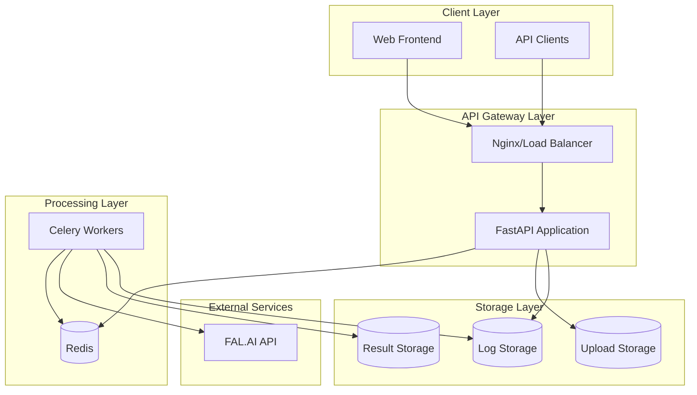
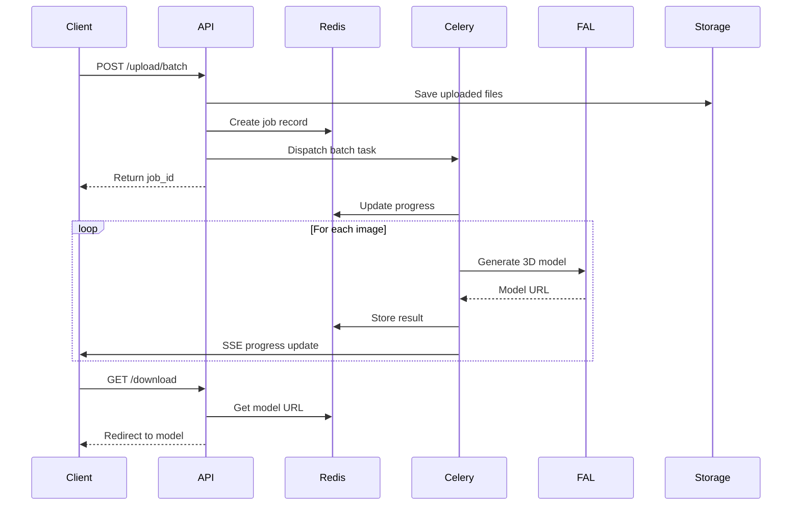
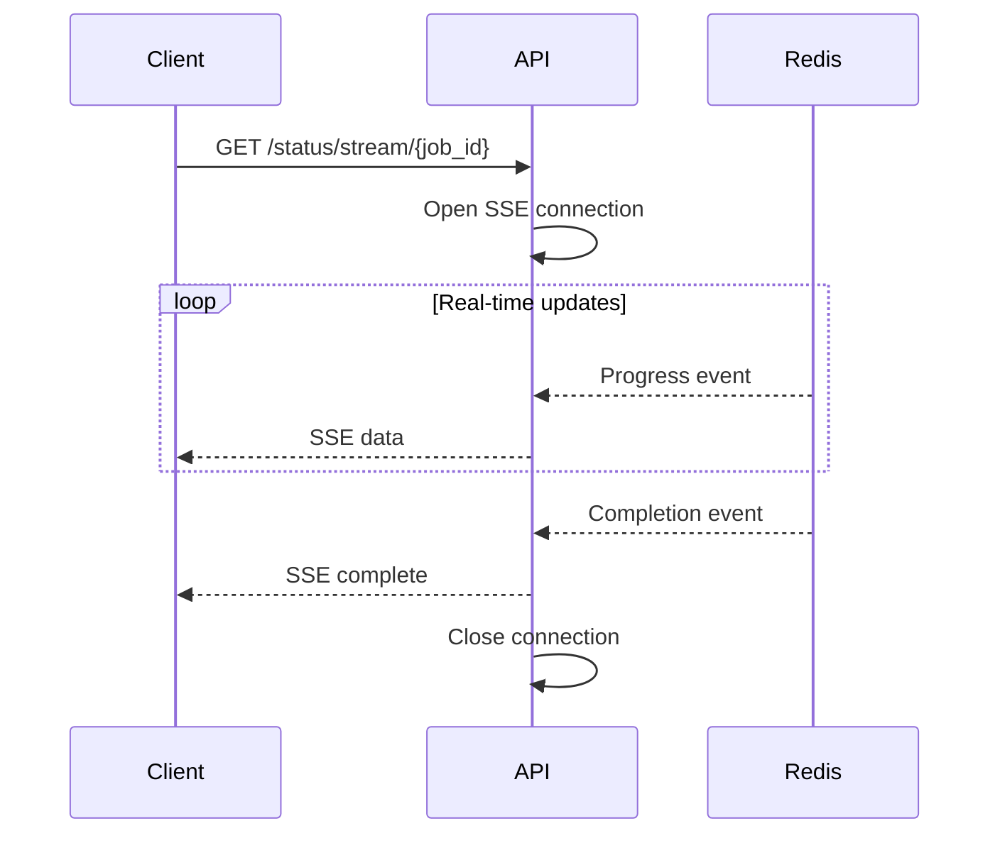

# System Design Overview

## Architecture Overview

The Image2Model backend implements a scalable, event-driven architecture designed for processing 2D images into 3D models using the FAL.AI Tripo3D service.



## Core Architecture Principles

### 1. Asynchronous Processing
- **FastAPI** for high-performance async HTTP handling
- **Celery** for distributed task processing
- **Redis** for message broker and result backend
- Non-blocking I/O for maximum throughput

### 2. Microservices-Inspired Design
- Clear separation of concerns
- Independent scaling of components
- Service boundaries defined by functionality
- Loose coupling through message passing

### 3. Event-Driven Architecture
- Task events trigger processing workflows
- Real-time updates via Server-Sent Events (SSE)
- Progress tracking through Redis pub/sub
- Reactive system design

### 4. Fault Tolerance
- Automatic retry mechanisms with exponential backoff
- Graceful degradation on FAL.AI failures
- Comprehensive error handling and logging
- Task retry policies for transient failures

## System Components

### API Gateway (FastAPI)

**Responsibilities:**
- HTTP request handling
- Authentication and authorization
- Request validation
- Response formatting
- Static file serving

**Key Features:**
- Automatic OpenAPI documentation
- Request/response validation with Pydantic
- Dependency injection system
- Built-in async support

### Message Queue (Redis)

**Responsibilities:**
- Task queue management
- Result storage
- Progress tracking
- Session management
- Distributed locks

**Configuration:**
```python
# Redis connection pool
redis_pool = ConnectionPool(
    host='redis',
    port=6379,
    max_connections=10,
    decode_responses=True
)
```

### Task Processor (Celery)

**Responsibilities:**
- Asynchronous task execution
- Parallel batch processing
- FAL.AI API integration
- Progress reporting

**Worker Configuration:**
```python
# Optimized for parallel processing
worker_prefetch_multiplier = 1
worker_max_tasks_per_child = 50
task_acks_on_failure_or_timeout = True
```

### External Integration (FAL.AI)

**Integration Pattern:**
```python
# Resilient API client
class FalAIClient:
    retry_strategy = ExponentialBackoff(
        max_retries=3,
        base_delay=1,
        max_delay=60
    )
    timeout_config = {
        'initial': 300,  # 5 minutes
        'max': 1800      # 30 minutes
    }
```

## Request Flow

### 1. Image Upload Flow



### 2. Status Monitoring Flow



## Data Flow Architecture

### Upload Pipeline
1. **Multipart Upload** → FastAPI
2. **File Validation** → Size, format, count checks
3. **Storage** → Local filesystem (future: S3)
4. **Job Creation** → Redis with TTL
5. **Task Dispatch** → Celery queue

### Processing Pipeline
1. **Task Reception** → Celery worker
2. **Parallel Execution** → Chord pattern for batches
3. **FAL.AI Integration** → HTTP API calls
4. **Progress Updates** → Redis pub/sub
5. **Result Storage** → URL in Redis

### Download Pipeline
1. **Authentication** → API key validation
2. **Ownership Check** → Session verification
3. **Result Retrieval** → Redis lookup
4. **URL Redirect** → Direct FAL.AI access

## Scalability Design

### Horizontal Scaling

**API Servers:**
```yaml
# Multiple FastAPI instances
replicas: 3
load_balancer: round_robin
health_check: /api/v1/health/ready
```

**Worker Scaling:**
```yaml
# Celery worker autoscaling
autoscale: 10,3  # max 10, min 3
concurrency: 4   # processes per worker
```

### Vertical Scaling

**Resource Allocation:**
- API: CPU-optimized (2 cores, 4GB RAM)
- Workers: Balanced (4 cores, 8GB RAM)
- Redis: Memory-optimized (2 cores, 16GB RAM)

### Queue Partitioning

```python
# Task routing for load distribution
task_routes = {
    'tasks.process_batch': {'queue': 'batch_processing'},
    'tasks.generate_model': {'queue': 'model_generation'},
    'tasks.cleanup': {'queue': 'maintenance'}
}
```

## High Availability

### Redundancy
- Multiple API instances behind load balancer
- Redis Sentinel for failover (future)
- Worker pool across availability zones
- Backup task queues

### Health Monitoring
```python
# Kubernetes probes
@router.get("/health/ready")
async def readiness_probe():
    checks = {
        "redis": check_redis_connection(),
        "fal_api": check_fal_api_health(),
        "disk_space": check_disk_space()
    }
    return {"status": "ready", "checks": checks}
```

### Disaster Recovery
- Redis persistence with AOF
- Regular backups of job data
- Idempotent task design
- Task replay capability

## Performance Optimization

### Caching Strategy
```python
# Future implementation
@cache(ttl=300)  # 5 minute cache
async def get_model_metadata(model_id: str):
    return await fetch_from_fal(model_id)
```

### Connection Pooling
- Redis: 10 connections per process
- HTTP: Keep-alive connections for FAL.AI
- PostgreSQL: Not currently used (configured for future implementation)

### Resource Limits
```python
# Prevent resource exhaustion
LIMITS = {
    "max_upload_size": 10 * 1024 * 1024,  # 10MB
    "max_files_per_batch": 25,
    "max_concurrent_tasks": 100,
    "task_timeout": 1800  # 30 minutes
}
```

## Security Architecture

### Defense in Depth
1. **API Gateway**: Rate limiting, CORS
2. **Authentication**: Bearer token validation
3. **Authorization**: Role-based access
4. **Input Validation**: Type checking, sanitization
5. **File Security**: Path traversal prevention

### Network Security
```yaml
# Network isolation
networks:
  frontend:
    internal: false
  backend:
    internal: true
  data:
    internal: true
```

## Monitoring Architecture

### Metrics Collection
```python
# Prometheus metrics (basic implementation)
http_requests_total = Counter(
    'http_requests_total',
    'Total HTTP requests',
    ['method', 'endpoint', 'status']
)

task_duration = Histogram(
    'task_duration_seconds',
    'Task execution time',
    ['task_name', 'status']
)

# Note: Grafana dashboards not yet configured
```

### Logging Pipeline
```
Application → Structured Logs → Log Files → Log Aggregation → Analysis
```

### Distributed Tracing (Planned)
```python
# Future: OpenTelemetry integration
# Currently using structured logging for observability

import structlog
logger = structlog.get_logger()

async def process_image(image_id: str):
    logger.info("Starting image processing", image_id=image_id)
    # Processing logic with detailed logging
    logger.info("Completed image processing", image_id=image_id)
```

## Future Architecture Enhancements

### 1. Database Integration
- Currently using Redis for all data storage
- PostgreSQL configured but not actively used in MVP
- Future: Migrate job metadata to PostgreSQL for complex queries
- Relationship mapping and advanced analytics capabilities

### 2. S3 Storage
- Cloud-native file storage
- CDN integration
- Lifecycle policies

### 3. Service Mesh
- Istio/Linkerd integration
- Advanced traffic management
- Service-to-service security

### 4. Event Streaming
- Kafka for event bus
- Event sourcing patterns
- Real-time analytics