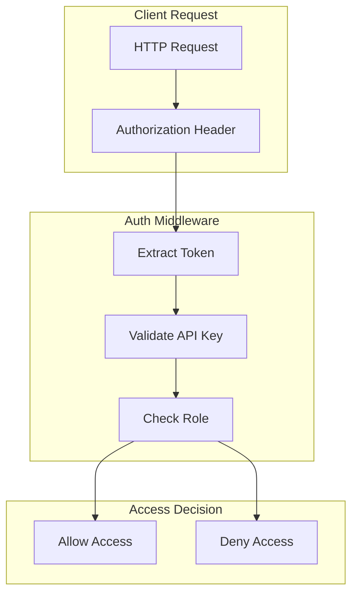
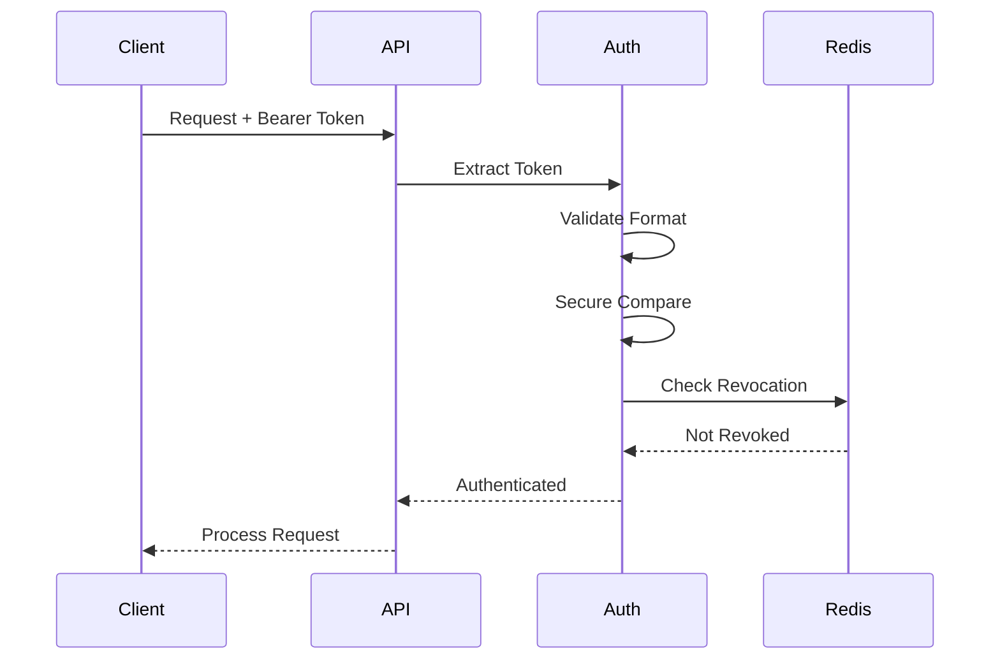

# Authentication and Authorization

## Overview

The Image2Model backend implements a secure authentication and authorization system using API keys with role-based access control.

## Authentication Architecture



## Authentication Methods

### Bearer Token Authentication

**Implementation:**
```python
from fastapi import Depends, HTTPException, status
from fastapi.security import HTTPBearer, HTTPAuthorizationCredentials

security = HTTPBearer()

async def verify_api_key(
    credentials: HTTPAuthorizationCredentials = Depends(security)
) -> str:
    """Verify regular API key"""
    if not credentials:
        raise HTTPException(
            status_code=status.HTTP_401_UNAUTHORIZED,
            detail="Authentication required"
        )
    
    api_key = credentials.credentials
    
    # Development mode bypass
    if not settings.API_KEY:
        return "dev_user"
    
    # Secure comparison to prevent timing attacks
    if not secure_compare(api_key, settings.API_KEY):
        raise HTTPException(
            status_code=status.HTTP_403_FORBIDDEN,
            detail="Invalid API key"
        )
    
    return api_key
```

### Secure String Comparison

```python
import hmac

def secure_compare(a: str, b: str) -> bool:
    """Constant-time string comparison to prevent timing attacks"""
    return hmac.compare_digest(a.encode(), b.encode())
```

## Authorization Levels

### 1. Regular User Access

**Permissions:**
- Upload images
- Check job status
- Download own models
- View own logs

**Implementation:**
```python
RequireAuth = Depends(verify_api_key)

@router.post("/upload/batch", dependencies=[RequireAuth])
async def upload_batch(
    files: List[UploadFile],
    api_key: str = RequireAuth
):
    # User can upload files
    pass
```

### 2. Admin Access

**Permissions:**
- All regular user permissions
- System monitoring
- Log access
- Cleanup operations
- Configuration changes

**Implementation:**
```python
async def verify_admin_api_key(
    credentials: HTTPAuthorizationCredentials = Depends(security)
) -> str:
    """Verify admin API key"""
    api_key = credentials.credentials
    
    if not settings.ADMIN_API_KEY:
        raise HTTPException(
            status_code=status.HTTP_501_NOT_IMPLEMENTED,
            detail="Admin functionality not configured"
        )
    
    if not secure_compare(api_key, settings.ADMIN_API_KEY):
        raise HTTPException(
            status_code=status.HTTP_403_FORBIDDEN,
            detail="Admin access required"
        )
    
    return api_key

RequireAdminAuth = Depends(verify_admin_api_key)
```

## Session Management

### Job Ownership Tracking

```python
class SessionStore:
    """Track job ownership for access control"""
    
    def __init__(self, redis_client):
        self.redis = redis_client
        self.ttl = 86400  # 24 hours
    
    async def create_session(self, job_id: str, api_key: str):
        """Associate job with API key"""
        # Hash the API key for storage
        key_hash = hashlib.sha256(api_key.encode()).hexdigest()
        
        session_key = f"session:{job_id}"
        await self.redis.setex(session_key, self.ttl, key_hash)
        
        # Also track user's jobs
        user_jobs_key = f"user_jobs:{key_hash}"
        await self.redis.sadd(user_jobs_key, job_id)
        await self.redis.expire(user_jobs_key, self.ttl)
    
    async def verify_ownership(self, job_id: str, api_key: str) -> bool:
        """Verify API key owns the job"""
        key_hash = hashlib.sha256(api_key.encode()).hexdigest()
        stored_hash = await self.redis.get(f"session:{job_id}")
        
        return stored_hash == key_hash
    
    async def get_user_jobs(self, api_key: str) -> List[str]:
        """Get all jobs for a user"""
        key_hash = hashlib.sha256(api_key.encode()).hexdigest()
        return await self.redis.smembers(f"user_jobs:{key_hash}")
```

### Optional Authentication

```python
async def get_optional_api_key(
    authorization: Optional[str] = Header(None)
) -> Optional[str]:
    """Extract API key if provided, but don't require it"""
    if not authorization:
        return None
    
    if not authorization.startswith("Bearer "):
        return None
    
    api_key = authorization[7:]  # Remove "Bearer " prefix
    
    # Validate if provided
    if settings.API_KEY and not secure_compare(api_key, settings.API_KEY):
        raise HTTPException(
            status_code=status.HTTP_403_FORBIDDEN,
            detail="Invalid API key"
        )
    
    return api_key
```

## Security Headers

### CORS Configuration

```python
from fastapi.middleware.cors import CORSMiddleware

# Production CORS
app.add_middleware(
    CORSMiddleware,
    allow_origins=settings.ALLOWED_ORIGINS,
    allow_credentials=True,
    allow_methods=["GET", "POST"],
    allow_headers=["Authorization", "Content-Type"],
    expose_headers=["X-Request-ID", "X-RateLimit-*"]
)
```

### Security Headers Middleware

```python
@app.middleware("http")
async def add_security_headers(request: Request, call_next):
    response = await call_next(request)
    
    # Security headers
    response.headers["X-Content-Type-Options"] = "nosniff"
    response.headers["X-Frame-Options"] = "DENY"
    response.headers["X-XSS-Protection"] = "1; mode=block"
    response.headers["Strict-Transport-Security"] = "max-age=31536000; includeSubDomains"
    response.headers["Referrer-Policy"] = "strict-origin-when-cross-origin"
    response.headers["Permissions-Policy"] = "geolocation=(), microphone=(), camera=()"
    
    # Remove sensitive headers
    response.headers.pop("X-Powered-By", None)
    response.headers.pop("Server", None)
    
    return response
```

## API Key Management

### Key Generation

```python
import secrets
import string

def generate_api_key(prefix: str = "im2m", length: int = 32) -> str:
    """Generate a secure API key"""
    alphabet = string.ascii_letters + string.digits
    key = ''.join(secrets.choice(alphabet) for _ in range(length))
    return f"{prefix}_{key}"

# Example output: im2m_Kj8nF3pQ2wE5rT7yU1iO4aS6dG9hL0
```

### Key Rotation

```python
class APIKeyRotation:
    """Handle API key rotation with grace period"""
    
    def __init__(self, redis_client):
        self.redis = redis_client
        self.grace_period = 3600  # 1 hour
    
    async def rotate_key(self, old_key: str, new_key: str):
        """Rotate API key with grace period"""
        # Mark old key as rotating
        await self.redis.setex(
            f"rotating:{old_key}",
            self.grace_period,
            new_key
        )
        
        # Activate new key
        await self.redis.set(f"active:{new_key}", "1")
    
    async def validate_key(self, key: str) -> bool:
        """Validate key including rotating keys"""
        # Check if key is active
        if await self.redis.get(f"active:{key}"):
            return True
        
        # Check if key is rotating
        new_key = await self.redis.get(f"rotating:{key}")
        if new_key:
            # Log rotation usage
            logger.warning(f"Rotating key used: {key[:8]}...")
            return True
        
        return False
```

## Authentication Flow

### 1. Request Authentication



### 2. Job Access Control

```python
async def check_job_access(
    job_id: str,
    api_key: str = Depends(verify_api_key)
):
    """Verify user has access to job"""
    if not await session_store.verify_ownership(job_id, api_key):
        raise HTTPException(
            status_code=status.HTTP_403_FORBIDDEN,
            detail="Access denied to this job"
        )
    return job_id

# Usage
@router.get("/download/{job_id}/{file_id}/model")
async def download_model(
    file_id: str,
    job_id: str = Depends(check_job_access)
):
    # User has access to this job
    pass
```

## Security Best Practices

### 1. API Key Storage

```python
# Environment variable loading
class Settings(BaseSettings):
    API_KEY: Optional[str] = Field(None, env="API_KEY")
    ADMIN_API_KEY: Optional[str] = Field(None, env="ADMIN_API_KEY")
    
    @validator("API_KEY", "ADMIN_API_KEY")
    def validate_key_strength(cls, v):
        if v and len(v) < 32:
            raise ValueError("API key must be at least 32 characters")
        return v
```

### 2. Rate Limiting by API Key

```python
from slowapi import Limiter

def get_api_key_from_request(request: Request) -> str:
    """Extract API key for rate limiting"""
    auth = request.headers.get("Authorization", "")
    if auth.startswith("Bearer "):
        # Hash the key for privacy
        key = auth[7:]
        return hashlib.sha256(key.encode()).hexdigest()[:16]
    return get_remote_address(request)

limiter = Limiter(key_func=get_api_key_from_request)
```

### 3. Audit Logging

```python
async def log_authentication(
    request: Request,
    api_key: str,
    success: bool,
    reason: Optional[str] = None
):
    """Log authentication attempts"""
    audit_log = {
        "timestamp": datetime.utcnow().isoformat(),
        "event": "authentication",
        "success": success,
        "api_key_hash": hashlib.sha256(api_key.encode()).hexdigest()[:8],
        "ip_address": request.client.host,
        "user_agent": request.headers.get("User-Agent"),
        "endpoint": str(request.url.path),
        "reason": reason
    }
    
    logger.info("Authentication attempt", extra=audit_log)
    
    # Track failed attempts
    if not success:
        await track_failed_auth(api_key, request.client.host)
```

### 4. Brute Force Protection

```python
async def track_failed_auth(api_key: str, ip_address: str):
    """Track failed authentication attempts"""
    key = f"failed_auth:{ip_address}"
    
    # Increment counter
    count = await redis.incr(key)
    
    # Set expiration on first failure
    if count == 1:
        await redis.expire(key, 3600)  # 1 hour window
    
    # Block after threshold
    if count > 10:
        await redis.setex(f"blocked:{ip_address}", 3600, "1")
        logger.warning(f"IP blocked due to failed auth: {ip_address}")
```

## Future Enhancements

### 1. JWT Implementation

```python
# Future JWT support
from jose import jwt, JWTError

def create_access_token(data: dict, expires_delta: timedelta = None):
    to_encode = data.copy()
    expire = datetime.utcnow() + (expires_delta or timedelta(minutes=15))
    to_encode.update({"exp": expire})
    
    encoded_jwt = jwt.encode(
        to_encode, 
        settings.JWT_SECRET_KEY, 
        algorithm="HS256"
    )
    return encoded_jwt
```

### 2. OAuth2 Integration

```python
# Future OAuth2 support
oauth2_scheme = OAuth2PasswordBearer(tokenUrl="token")

async def get_current_user(token: str = Depends(oauth2_scheme)):
    credentials_exception = HTTPException(
        status_code=status.HTTP_401_UNAUTHORIZED,
        detail="Could not validate credentials",
        headers={"WWW-Authenticate": "Bearer"},
    )
    
    try:
        payload = jwt.decode(
            token, 
            settings.JWT_SECRET_KEY, 
            algorithms=["HS256"]
        )
        username: str = payload.get("sub")
        if username is None:
            raise credentials_exception
    except JWTError:
        raise credentials_exception
    
    return username
```

### 3. Multi-Factor Authentication

```python
# Future MFA support
class MFAHandler:
    async def send_otp(self, user_id: str, channel: str = "email"):
        """Send one-time password"""
        otp = ''.join(random.choices(string.digits, k=6))
        
        # Store OTP with expiration
        await redis.setex(f"otp:{user_id}", 300, otp)
        
        # Send via preferred channel
        if channel == "email":
            await send_email_otp(user_id, otp)
        elif channel == "sms":
            await send_sms_otp(user_id, otp)
    
    async def verify_otp(self, user_id: str, otp: str) -> bool:
        """Verify OTP"""
        stored_otp = await redis.get(f"otp:{user_id}")
        if stored_otp and secure_compare(otp, stored_otp):
            await redis.delete(f"otp:{user_id}")
            return True
        return False
```