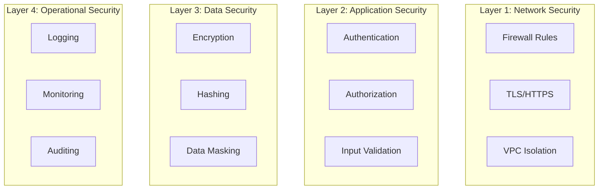

# Security Best Practices

## Overview

This document outlines the security best practices implemented in the Image2Model backend and provides guidelines for maintaining a secure system.

## Defense in Depth Strategy



## Input Validation and Sanitization

### File Upload Security

```python
import magic
from pathlib import Path
import hashlib

class SecureFileHandler:
    ALLOWED_MIME_TYPES = {
        'image/jpeg': ['.jpg', '.jpeg'],
        'image/png': ['.png'],
    }
    MAX_FILE_SIZE = 10 * 1024 * 1024  # 10MB
    
    @staticmethod
    def validate_file(file: UploadFile) -> None:
        """Comprehensive file validation"""
        # 1. Check file size
        if file.size > SecureFileHandler.MAX_FILE_SIZE:
            raise FileTooLargeError(f"File exceeds {SecureFileHandler.MAX_FILE_SIZE} bytes")
        
        # 2. Read file content for validation
        content = file.file.read()
        file.file.seek(0)  # Reset file pointer
        
        # 3. Validate MIME type using magic bytes
        mime_type = magic.from_buffer(content, mime=True)
        if mime_type not in SecureFileHandler.ALLOWED_MIME_TYPES:
            raise InvalidFileTypeError(f"File type {mime_type} not allowed")
        
        # 4. Validate file extension
        file_ext = Path(file.filename).suffix.lower()
        if file_ext not in SecureFileHandler.ALLOWED_MIME_TYPES[mime_type]:
            raise InvalidFileExtensionError(f"Extension {file_ext} doesn't match MIME type")
        
        # 5. Check for malicious content
        if SecureFileHandler._contains_malicious_content(content):
            raise MaliciousFileError("File contains potentially malicious content")
    
    @staticmethod
    def _contains_malicious_content(content: bytes) -> bool:
        """Check for common attack patterns"""
        # Check for embedded scripts
        patterns = [
            b'<script',
            b'javascript:',
            b'onerror=',
            b'onclick=',
            b'<?php',
            b'<%'
        ]
        
        content_lower = content.lower()
        return any(pattern in content_lower for pattern in patterns)
    
    @staticmethod
    def generate_safe_filename(original_filename: str) -> str:
        """Generate safe filename preventing directory traversal"""
        # Remove path components
        basename = Path(original_filename).name
        
        # Remove special characters
        safe_name = "".join(c for c in basename if c.isalnum() or c in ".-_")
        
        # Add timestamp and hash for uniqueness
        timestamp = datetime.utcnow().strftime("%Y%m%d_%H%M%S")
        file_hash = hashlib.sha256(safe_name.encode()).hexdigest()[:8]
        
        name, ext = os.path.splitext(safe_name)
        return f"{timestamp}_{name}_{file_hash}{ext}"
```

### Path Traversal Prevention

```python
import os
from pathlib import Path

class SecurePathHandler:
    @staticmethod
    def validate_path(base_path: Path, requested_path: str) -> Path:
        """Validate path to prevent directory traversal"""
        # Resolve to absolute path
        base = base_path.resolve()
        requested = (base / requested_path).resolve()
        
        # Ensure requested path is within base path
        try:
            requested.relative_to(base)
        except ValueError:
            raise SecurityError(f"Path traversal attempt detected: {requested_path}")
        
        # Additional checks
        if any(part.startswith('.') for part in requested.parts):
            raise SecurityError("Hidden files/directories not allowed")
        
        return requested
    
    @staticmethod
    def validate_job_id(job_id: str) -> bool:
        """Validate job ID format"""
        # Only allow alphanumeric, underscore, and hyphen
        pattern = re.compile(r'^[a-zA-Z0-9_-]+$')
        
        if not pattern.match(job_id):
            raise ValidationError(f"Invalid job ID format: {job_id}")
        
        # Check length
        if len(job_id) > 64:
            raise ValidationError("Job ID too long")
        
        return True
```

## API Security Measures

### Request Rate Limiting

```python
from slowapi import Limiter
from slowapi.util import get_remote_address
import redis

class AdvancedRateLimiter:
    def __init__(self, redis_client):
        self.redis = redis_client
        self.limiter = Limiter(
            key_func=self._get_rate_limit_key,
            storage_uri=f"redis://{settings.REDIS_HOST}:{settings.REDIS_PORT}"
        )
    
    def _get_rate_limit_key(self, request: Request) -> str:
        """Get rate limit key with multiple strategies"""
        # 1. Try API key first
        auth = request.headers.get("Authorization", "")
        if auth.startswith("Bearer "):
            api_key = auth[7:]
            return f"rl:key:{hashlib.sha256(api_key.encode()).hexdigest()[:16]}"
        
        # 2. Fall back to IP address
        ip = get_remote_address(request)
        
        # 3. Consider X-Forwarded-For for proxies
        forwarded_for = request.headers.get("X-Forwarded-For")
        if forwarded_for:
            ip = forwarded_for.split(",")[0].strip()
        
        return f"rl:ip:{ip}"
    
    async def check_rate_limit(self, key: str, limit: int, window: int) -> bool:
        """Check if request should be rate limited"""
        current = await self.redis.incr(key)
        
        if current == 1:
            await self.redis.expire(key, window)
        
        if current > limit:
            # Log rate limit violation
            logger.warning(f"Rate limit exceeded for {key}")
            return False
        
        return True
```

### CSRF Protection

```python
from fastapi import Form, HTTPException
import secrets

class CSRFProtection:
    def __init__(self):
        self.token_length = 32
    
    def generate_token(self) -> str:
        """Generate CSRF token"""
        return secrets.token_urlsafe(self.token_length)
    
    async def validate_token(self, 
                           session_token: str, 
                           submitted_token: str) -> bool:
        """Validate CSRF token"""
        if not session_token or not submitted_token:
            raise HTTPException(
                status_code=400,
                detail="CSRF token missing"
            )
        
        if not hmac.compare_digest(session_token, submitted_token):
            raise HTTPException(
                status_code=403,
                detail="CSRF token invalid"
            )
        
        return True

# Usage in forms
@router.post("/admin/action")
async def admin_action(
    csrf_token: str = Form(...),
    session: dict = Depends(get_session)
):
    await csrf_protection.validate_token(
        session.get("csrf_token"),
        csrf_token
    )
    # Process action
```

## Data Protection

### Encryption at Rest

```python
from cryptography.fernet import Fernet
import base64

class DataEncryption:
    def __init__(self, key: Optional[str] = None):
        if key:
            self.cipher = Fernet(key.encode())
        else:
            # Generate new key
            self.cipher = Fernet(Fernet.generate_key())
    
    def encrypt_file(self, file_path: Path) -> Path:
        """Encrypt file at rest"""
        with open(file_path, 'rb') as f:
            plaintext = f.read()
        
        encrypted = self.cipher.encrypt(plaintext)
        
        encrypted_path = file_path.with_suffix('.enc')
        with open(encrypted_path, 'wb') as f:
            f.write(encrypted)
        
        # Securely delete original
        self._secure_delete(file_path)
        
        return encrypted_path
    
    def decrypt_file(self, encrypted_path: Path) -> bytes:
        """Decrypt file for processing"""
        with open(encrypted_path, 'rb') as f:
            encrypted = f.read()
        
        return self.cipher.decrypt(encrypted)
    
    @staticmethod
    def _secure_delete(file_path: Path):
        """Securely overwrite and delete file"""
        file_size = file_path.stat().st_size
        
        with open(file_path, 'ba+', buffering=0) as f:
            # Overwrite with random data
            f.write(os.urandom(file_size))
            f.flush()
            os.fsync(f.fileno())
        
        # Remove file
        file_path.unlink()
```

### Sensitive Data Handling

```python
class SensitiveDataHandler:
    @staticmethod
    def mask_api_key(api_key: str) -> str:
        """Mask API key for logging"""
        if len(api_key) <= 8:
            return "***"
        return f"{api_key[:4]}...{api_key[-4:]}"
    
    @staticmethod
    def mask_email(email: str) -> str:
        """Mask email address"""
        parts = email.split('@')
        if len(parts) != 2:
            return "***"
        
        username = parts[0]
        domain = parts[1]
        
        if len(username) <= 2:
            masked_username = "*" * len(username)
        else:
            masked_username = f"{username[0]}{'*' * (len(username)-2)}{username[-1]}"
        
        return f"{masked_username}@{domain}"
    
    @staticmethod
    def sanitize_log_data(data: dict) -> dict:
        """Remove sensitive data from logs"""
        sensitive_keys = {
            'api_key', 'password', 'token', 'secret',
            'authorization', 'cookie', 'session'
        }
        
        sanitized = {}
        for key, value in data.items():
            if any(sensitive in key.lower() for sensitive in sensitive_keys):
                sanitized[key] = "***REDACTED***"
            elif isinstance(value, dict):
                sanitized[key] = SensitiveDataHandler.sanitize_log_data(value)
            else:
                sanitized[key] = value
        
        return sanitized
```

## Network Security

### TLS Configuration

```python
# Nginx configuration for TLS
"""
server {
    listen 443 ssl http2;
    server_name api.image2model.com;
    
    # Modern TLS configuration
    ssl_protocols TLSv1.2 TLSv1.3;
    ssl_ciphers ECDHE-ECDSA-AES128-GCM-SHA256:ECDHE-RSA-AES128-GCM-SHA256:ECDHE-ECDSA-AES256-GCM-SHA384:ECDHE-RSA-AES256-GCM-SHA384;
    ssl_prefer_server_ciphers off;
    
    # OCSP stapling
    ssl_stapling on;
    ssl_stapling_verify on;
    
    # Security headers
    add_header Strict-Transport-Security "max-age=63072000" always;
    add_header X-Content-Type-Options "nosniff" always;
    add_header X-Frame-Options "DENY" always;
}
"""
```

### IP Whitelisting

```python
class IPWhitelist:
    def __init__(self, allowed_ips: List[str]):
        self.allowed_ips = set(allowed_ips)
        self.allowed_networks = []
        
        for ip in allowed_ips:
            if '/' in ip:  # CIDR notation
                self.allowed_networks.append(ipaddress.ip_network(ip))
    
    def is_allowed(self, ip: str) -> bool:
        """Check if IP is whitelisted"""
        # Direct IP match
        if ip in self.allowed_ips:
            return True
        
        # Network match
        ip_addr = ipaddress.ip_address(ip)
        for network in self.allowed_networks:
            if ip_addr in network:
                return True
        
        return False

# Middleware for admin endpoints
@app.middleware("http")
async def ip_whitelist_middleware(request: Request, call_next):
    if request.url.path.startswith("/api/v1/admin"):
        client_ip = request.client.host
        
        if not ip_whitelist.is_allowed(client_ip):
            return JSONResponse(
                status_code=403,
                content={"detail": "Access denied"}
            )
    
    return await call_next(request)
```

## Logging and Monitoring

### Security Event Logging

```python
import structlog

# Configure structured logging for security events
security_logger = structlog.get_logger("security")

class SecurityEventLogger:
    @staticmethod
    async def log_auth_attempt(
        request: Request,
        success: bool,
        user_id: Optional[str] = None,
        reason: Optional[str] = None
    ):
        """Log authentication attempts"""
        event = {
            "event_type": "auth_attempt",
            "timestamp": datetime.utcnow().isoformat(),
            "ip_address": request.client.host,
            "user_agent": request.headers.get("User-Agent"),
            "endpoint": str(request.url.path),
            "method": request.method,
            "success": success,
            "user_id": user_id,
            "reason": reason
        }
        
        if success:
            security_logger.info("Authentication successful", **event)
        else:
            security_logger.warning("Authentication failed", **event)
        
        # Alert on suspicious patterns
        await SecurityEventLogger._check_suspicious_activity(
            request.client.host
        )
    
    @staticmethod
    async def _check_suspicious_activity(ip: str):
        """Check for suspicious patterns"""
        # Count recent failures
        key = f"auth_failures:{ip}"
        failures = await redis.incr(key)
        
        if failures == 1:
            await redis.expire(key, 3600)  # 1 hour window
        
        # Alert thresholds
        if failures > 10:
            security_logger.error(
                "Potential brute force attack",
                ip_address=ip,
                failures=failures
            )
```

### Intrusion Detection

```python
class IntrusionDetector:
    def __init__(self):
        self.patterns = [
            # SQL Injection patterns
            re.compile(r"(\b(SELECT|INSERT|UPDATE|DELETE|DROP|UNION)\b)", re.I),
            # XSS patterns
            re.compile(r"<script[^>]*>.*?</script>", re.I),
            # Path traversal
            re.compile(r"\.\./|\.\.\\"),
            # Command injection
            re.compile(r"[;&|]|\$\(.*\)"),
        ]
    
    def check_request(self, request: Request) -> List[str]:
        """Check request for malicious patterns"""
        threats = []
        
        # Check URL parameters
        for key, value in request.query_params.items():
            for pattern in self.patterns:
                if pattern.search(str(value)):
                    threats.append(f"Suspicious pattern in query param {key}")
        
        # Check headers
        suspicious_headers = ['X-Forwarded-Host', 'X-Original-URL']
        for header in suspicious_headers:
            if header in request.headers:
                threats.append(f"Suspicious header: {header}")
        
        return threats
```

## Incident Response

### Automated Response

```python
class IncidentResponse:
    async def respond_to_attack(self, attack_type: str, source_ip: str):
        """Automated incident response"""
        # 1. Block the source
        await self.block_ip(source_ip)
        
        # 2. Alert administrators
        await self.send_alert(attack_type, source_ip)
        
        # 3. Preserve evidence
        await self.capture_evidence(attack_type, source_ip)
        
        # 4. Initiate defensive measures
        await self.enable_enhanced_monitoring()
    
    async def block_ip(self, ip: str, duration: int = 3600):
        """Temporarily block IP"""
        await redis.setex(f"blocked:{ip}", duration, "1")
        logger.warning(f"IP blocked: {ip} for {duration} seconds")
    
    async def capture_evidence(self, attack_type: str, source_ip: str):
        """Capture evidence for analysis"""
        evidence = {
            "timestamp": datetime.utcnow().isoformat(),
            "attack_type": attack_type,
            "source_ip": source_ip,
            "recent_requests": await self.get_recent_requests(source_ip)
        }
        
        # Store evidence
        evidence_file = f"evidence_{datetime.utcnow().strftime('%Y%m%d_%H%M%S')}.json"
        with open(f"/secure/evidence/{evidence_file}", 'w') as f:
            json.dump(evidence, f, indent=2)
```

## Security Checklist

### Development
- [ ] Input validation on all user inputs
- [ ] Output encoding to prevent XSS
- [ ] Parameterized queries (when using SQL)
- [ ] Secure random number generation
- [ ] No hardcoded secrets
- [ ] Dependency scanning

### Deployment
- [ ] TLS/HTTPS enabled
- [ ] Security headers configured
- [ ] Firewall rules in place
- [ ] Intrusion detection active
- [ ] Log monitoring enabled
- [ ] Backup encryption

### Operations
- [ ] Regular security updates
- [ ] API key rotation
- [ ] Security audit logs
- [ ] Incident response plan
- [ ] Penetration testing
- [ ] Compliance checks