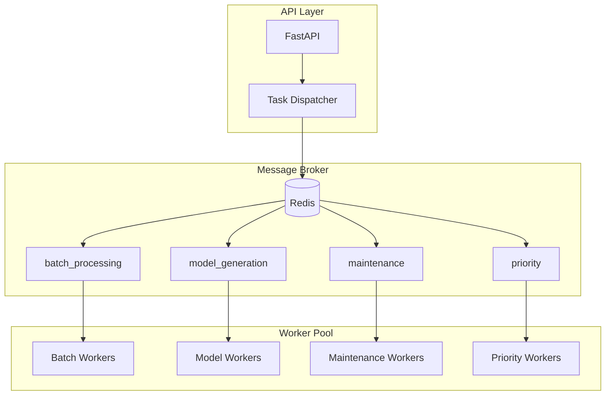

# Background Tasks and Celery Architecture

## Overview

The Image2Model backend uses Celery for distributed task processing, enabling asynchronous 3D model generation and system maintenance tasks. This document accurately reflects the current implementation as validated against the actual codebase.

## Task Architecture



## Celery Configuration

### Application Setup

The Celery application is configured in `app/core/celery_app.py`:

```python
from celery import Celery
from celery.signals import task_prerun, task_postrun, task_failure, task_retry, worker_ready
from celery.schedules import crontab
from app.core.config import settings
from app.core.logging_config import setup_logging, set_correlation_id, get_task_logger

# Create Celery application
celery_app = Celery(
    "ai_3d_generator",
    broker=settings.CELERY_BROKER_URL,
    backend=settings.CELERY_RESULT_BACKEND,
    include=["app.workers.tasks", "app.workers.cleanup"]
)

# Configure Celery
celery_app.conf.update(
    # Serialization settings
    task_serializer="json",
    accept_content=["json"],
    result_serializer="json",
    
    # Timezone settings
    timezone="UTC",
    enable_utc=True,
    
    # Task tracking and state
    task_track_started=True,
    task_send_sent_event=True,
    
    # Task time limits (30 minutes hard, 25 minutes soft)
    task_time_limit=30 * 60,  # 30 minutes
    task_soft_time_limit=25 * 60,  # 25 minutes
    
    # Result expiration
    result_expires=3600,  # 1 hour
    
    # Worker settings optimized for parallel processing
    worker_prefetch_multiplier=1,  # Disable prefetching for fair distribution
    worker_max_tasks_per_child=50,  # Restart workers more frequently to avoid memory leaks
    task_acks_on_failure_or_timeout=True,  # Acknowledge failed tasks
    
    # Task routing
    task_routes={
        'app.workers.tasks.process_batch': {'queue': 'batch_processing'},
        'app.workers.tasks.process_file_in_batch': {'queue': 'model_generation'},
        'app.workers.tasks.generate_3d_model_task': {'queue': 'model_generation'},
        'app.workers.cleanup.cleanup_old_files': {'queue': 'maintenance'},
        'app.workers.cleanup.get_disk_usage': {'queue': 'maintenance'},
        'app.workers.cleanup.cleanup_job_files': {'queue': 'maintenance'},
        'app.workers.tasks.health_check_task': {'queue': 'priority'},
    },
    
    # Beat schedule for periodic tasks
    beat_schedule={
        'cleanup-old-files': {
            'task': 'app.workers.cleanup.cleanup_old_files',
            'schedule': crontab(hour=2, minute=0),  # Run daily at 2 AM
        },
        'disk-usage-monitoring': {
            'task': 'app.workers.cleanup.get_disk_usage',
            'schedule': crontab(minute=0),  # Run hourly
        },
    },
    
    # Error handling
    task_reject_on_worker_lost=True,
    task_acks_late=True,
    
    # Connection pool settings for Redis
    broker_pool_limit=10,
    result_backend_pool_limit=10,
    broker_connection_retry_on_startup=True,
    
    # Monitoring
    worker_send_task_events=True,
    task_send_events=True,
)
```

### Signal Handlers

The implementation includes basic signal handlers for logging and task lifecycle management:

```python
@worker_ready.connect
def setup_worker_logging(sender=None, **kwargs):
    """Set up logging when worker starts."""
    setup_logging()
    logger = get_task_logger('worker', 'startup')
    logger.info(f"Worker ready: {sender}")

@task_prerun.connect
def task_prerun_handler(sender=None, task_id=None, task=None, args=None, kwargs=None, **kwds):
    """Handle task start - set up logging context."""
    correlation_id = set_correlation_id()
    logger = get_task_logger(task.name, task_id)
    logger.info(f"Starting task {task.name} with ID {task_id} (correlation: {correlation_id})")

@task_postrun.connect
def task_postrun_handler(sender=None, task_id=None, task=None, args=None, kwargs=None, 
                        retval=None, state=None, **kwds):
    """Handle task completion."""
    logger = get_task_logger(task.name, task_id)
    logger.info(f"Task {task.name} completed with state: {state}")

@task_failure.connect
def task_failure_handler(sender=None, task_id=None, exception=None, traceback=None, einfo=None, **kwds):
    """Handle task failures with detailed logging."""
    logger = get_task_logger(sender.name if sender else 'unknown', task_id)
    logger.error(
        f"Task {sender.name if sender else 'unknown'} failed with exception: {exception}",
        exc_info=einfo if einfo else True,
        extra={
            'task_id': task_id,
            'exception_type': type(exception).__name__ if exception else 'Unknown',
            'exception_message': str(exception) if exception else 'No message',
            'traceback': traceback
        }
    )

@task_retry.connect
def task_retry_handler(sender=None, task_id=None, reason=None, einfo=None, **kwds):
    """Handle task retries."""
    logger = get_task_logger(sender.name if sender else 'unknown', task_id)
    logger.warning(f"Task {sender.name if sender else 'unknown'} retry: {reason}")
```

## Task Definitions

### Core Tasks (Implemented)

The following tasks are currently implemented in the system:

#### Model Generation Tasks (`app/workers/tasks.py`)

```python
@celery_app.task(bind=True)
def generate_3d_model_task(self, file_id: str, file_path: str, job_id: str, quality: str = "medium", texture_enabled: bool = True):
    """
    Background task to generate 3D model from image using FAL.AI Tripo3D.
    
    Args:
        file_id: Unique file identifier
        file_path: Path to the input image file
        job_id: Unique job identifier
        quality: Quality setting (low, medium, high)
        texture_enabled: Whether to enable texture generation
        
    Returns:
        Dict with job results
    """
    # Implementation handles progress tracking, FAL.AI integration,
    # job store updates, and comprehensive error handling
```

```python
@celery_app.task(bind=True)
def process_file_in_batch(self, file_path: str, job_id: str, face_limit: Optional[int] = None, 
                         file_index: int = 0, total_files: int = 1):
    """
    Process a single file as part of a batch operation.
    Designed to run in parallel with other files from the same batch.
    """
    # Implementation uses FAL.AI client with progress tracking
```

```python
@celery_app.task(bind=True, autoretry_for=(Exception,), retry_kwargs={'max_retries': 3, 'countdown': 60})
def process_batch(self, job_id: str, file_paths: List[str], face_limit: Optional[int] = None):
    """
    Enhanced batch processing task that processes files in parallel across multiple workers.
    Uses Celery's chord primitive for parallel execution with callback.
    """
    # Implementation creates parallel tasks and uses chord for coordination
```

```python
@celery_app.task(bind=True)
def finalize_batch_results(self, results: List[Dict[str, Any]], job_id: str, total_files: int, 
                          face_limit: Optional[int] = None):
    """
    Callback task to finalize batch processing results after all files are processed.
    Called by the chord after all parallel file processing tasks complete.
    """
    # Implementation aggregates results and stores them in job store
```

#### Maintenance Tasks (`app/workers/cleanup.py`)

```python
@celery_app.task
def cleanup_old_files(hours: int = 24) -> Dict[str, Any]:
    """
    Remove files older than specified hours from upload and output directories.
    Scheduled to run daily at 2 AM via Celery Beat.
    """
    # Implementation includes comprehensive file cleanup with size tracking
```

```python
@celery_app.task
def get_disk_usage() -> Dict[str, Any]:
    """
    Get disk usage statistics for upload and output directories.
    Scheduled to run hourly via Celery Beat.
    """
    # Implementation provides detailed disk usage metrics
```

```python
@celery_app.task
def cleanup_job_files(job_id: str) -> Dict[str, Any]:
    """
    Remove files for a specific job ID from all directories.
    Can be called on-demand for immediate cleanup.
    """
    # Implementation removes job-specific files and directories
```

#### Health Check Tasks

```python
@celery_app.task
def health_check_task():
    """
    Simple health check task for monitoring worker status.
    Routes to priority queue for immediate execution.
    """
    return {"status": "healthy", "worker": "image2model-worker"}
```

### Advanced Task with Retry Logic

```python
@celery_app.task(bind=True, max_retries=5)
def process_single_image_with_retry(self, file_path: str, face_limit: Optional[int] = None):
    """
    Enhanced task with comprehensive retry logic including:
    - Exponential backoff for rate limits
    - Progressive timeout handling
    - Error type categorization
    - Circuit breaker patterns
    """
    # Implementation includes sophisticated retry strategies
```

## Queue Configuration

The system uses four main queues:

1. **batch_processing** - High-level batch coordination tasks
2. **model_generation** - Individual file processing tasks
3. **maintenance** - Cleanup and monitoring tasks
4. **priority** - Health checks and urgent tasks

## Periodic Tasks (Celery Beat)

- **cleanup-old-files**: Runs daily at 2 AM
- **disk-usage-monitoring**: Runs hourly

## Worker Features

### Current Implementation
- Basic signal handlers with structured logging
- Progress tracking via Redis and Celery state
- Comprehensive error handling with custom exceptions
- Integration with FAL.AI client
- Job store management for result persistence

### Missing Features (Not Implemented)
- Worker profiles and custom configuration
- Prometheus metrics integration in signal handlers
- Custom worker steps and bootstrap
- Flower dashboard configuration
- Emergency cleanup and alerting tasks
- Complex monitoring and alerting system

## FAL.AI Integration

Tasks integrate with the FAL.AI client using synchronous wrappers:

```python
from app.workers.fal_client import FalAIClient

fal_client = FalAIClient()
result = fal_client.process_single_image_sync(
    file_path=file_path,
    face_limit=face_limit,
    texture_enabled=texture_enabled,
    progress_callback=progress_callback,
    job_id=job_id
)
```

## Progress Tracking

The system uses a Redis-based progress tracker:

```python
from app.core.progress_tracker import progress_tracker

progress_tracker.update_file_progress(
    job_id=job_id,
    file_path=file_path,
    status="processing",
    progress=progress_percent
)
```

## Error Handling

Tasks use custom exception types from `app.core.exceptions`:

- `ProcessingException` - General processing errors
- `FALAPIException` - FAL.AI specific errors
- `NetworkException` - Network-related errors
- `RateLimitException` - Rate limiting errors

## Best Practices

### 1. Task Design
- Tasks are idempotent where possible
- Use job IDs for tracking and deduplication
- Handle partial failures gracefully
- Comprehensive logging with correlation IDs

### 2. Error Handling
- Automatic retries with exponential backoff
- Error categorization for appropriate handling
- Failed task acknowledgment to prevent reprocessing

### 3. Performance
- Worker prefetch disabled for fair distribution
- Memory limits per child process
- Regular worker restarts to prevent memory leaks

### 4. Reliability
- Late acknowledgment for critical tasks
- Connection retry on startup
- Task state tracking and progress reporting

## Troubleshooting

### Common Commands

```bash
# Check worker status
celery -A app.core.celery_app inspect active

# Check registered tasks
celery -A app.core.celery_app inspect registered

# Monitor events in real-time
celery -A app.core.celery_app events

# Purge all queues (development only)
celery -A app.core.celery_app purge
```

### Health Monitoring

Workers can be monitored via:
- Health check task execution
- Redis connection status
- Task completion rates
- Error logging and tracking

## Deployment

Workers are typically started with:

```bash
celery -A app.core.celery_app worker --loglevel=info --concurrency=4
```

Beat scheduler for periodic tasks:

```bash
celery -A app.core.celery_app beat --loglevel=info
```