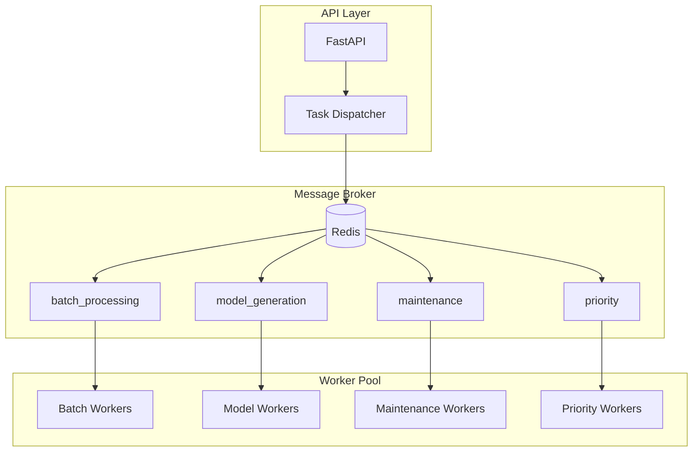

# Background Tasks and Celery Architecture

## Overview

The Image2Model backend uses Celery for distributed task processing, enabling asynchronous 3D model generation and system maintenance tasks. This document covers the task architecture, worker configuration, and best practices.

## Task Architecture



## Celery Configuration

### Application Setup

```python
from celery import Celery
from celery.signals import (
    task_prerun, task_postrun, task_failure,
    task_retry, worker_ready, worker_shutting_down
)
from app.core.config import settings
import logging

# Create Celery application
celery_app = Celery('image2model')

# Configure Celery
celery_app.conf.update(
    # Broker settings
    broker_url=f'redis://{settings.REDIS_HOST}:{settings.REDIS_PORT}/0',
    result_backend=f'redis://{settings.REDIS_HOST}:{settings.REDIS_PORT}/0',
    
    # Task settings
    task_serializer='json',
    accept_content=['json'],
    result_serializer='json',
    timezone='UTC',
    enable_utc=True,
    
    # Worker settings
    worker_prefetch_multiplier=1,  # Fair task distribution
    worker_max_tasks_per_child=50,  # Prevent memory leaks
    worker_disable_rate_limits=False,
    
    # Task execution settings
    task_acks_late=True,
    task_reject_on_worker_lost=True,
    task_acks_on_failure_or_timeout=True,
    
    # Time limits
    task_soft_time_limit=1500,  # 25 minutes
    task_time_limit=1800,  # 30 minutes
    
    # Result backend settings
    result_expires=3600,  # 1 hour
    result_persistent=True,
    
    # Task routing
    task_routes={
        'tasks.process_batch': {'queue': 'batch_processing'},
        'tasks.generate_single_model': {'queue': 'model_generation'},
        'tasks.cleanup_old_files': {'queue': 'maintenance'},
        'tasks.health_check': {'queue': 'priority'}
    },
    
    # Beat schedule for periodic tasks
    beat_schedule={
        'cleanup-old-files': {
            'task': 'tasks.cleanup_old_files',
            'schedule': 3600.0,  # Every hour
            'options': {'queue': 'maintenance'}
        },
        'system-health-check': {
            'task': 'tasks.system_health_check',
            'schedule': 600.0,  # Every 10 minutes
            'options': {'queue': 'priority'}
        }
    }
)
```

### Signal Handlers

```python
@task_prerun.connect
def task_prerun_handler(sender=None, task_id=None, task=None, **kwargs):
    """Log task start"""
    logger.info(
        "Task starting",
        task_name=task.name,
        task_id=task_id,
        args=kwargs.get('args'),
        kwargs=kwargs.get('kwargs')
    )
    
    # Set task start time for metrics
    task.request.start_time = time.time()

@task_postrun.connect
def task_postrun_handler(sender=None, task_id=None, task=None, **kwargs):
    """Log task completion and collect metrics"""
    duration = time.time() - getattr(task.request, 'start_time', time.time())
    
    logger.info(
        "Task completed",
        task_name=task.name,
        task_id=task_id,
        duration=duration,
        retval=kwargs.get('retval')
    )
    
    # Update metrics
    task_duration.labels(
        task_name=task.name,
        status='success'
    ).observe(duration)

@task_failure.connect
def task_failure_handler(sender=None, task_id=None, exception=None, **kwargs):
    """Handle task failures"""
    logger.error(
        "Task failed",
        task_name=sender.name,
        task_id=task_id,
        exception=str(exception),
        traceback=kwargs.get('traceback')
    )
    
    # Update failure metrics
    task_failures.labels(
        task_name=sender.name,
        exception_type=type(exception).__name__
    ).inc()

@task_retry.connect
def task_retry_handler(sender=None, task_id=None, reason=None, **kwargs):
    """Log task retries"""
    logger.warning(
        "Task retry",
        task_name=sender.name,
        task_id=task_id,
        reason=str(reason),
        retry_count=kwargs.get('request').retries
    )
```

## Task Definitions

### Batch Processing Tasks

```python
from celery import group, chord
from typing import List, Dict
import asyncio

@celery_app.task(
    bind=True,
    name='tasks.process_batch',
    max_retries=3,
    default_retry_delay=60
)
def process_batch(
    self,
    job_id: str,
    files: List[Dict],
    settings: Dict
) -> Dict:
    """Orchestrate batch processing using Celery chord"""
    
    try:
        logger.info(f"Starting batch processing for job {job_id}")
        
        # Initialize progress tracking
        progress_tracker = ProgressTracker(redis_client, job_id)
        progress_tracker.initialize_batch(len(files))
        
        # Create tasks for each file
        file_tasks = []
        for file_info in files:
            task = generate_single_model.s(
                job_id=job_id,
                file_info=file_info,
                settings=settings
            )
            file_tasks.append(task)
        
        # Use chord for parallel processing with callback
        callback = finalize_batch.s(job_id=job_id)
        job = chord(file_tasks)(callback)
        
        return {
            "status": "processing",
            "job_id": job_id,
            "chord_id": job.id,
            "total_files": len(files)
        }
        
    except Exception as exc:
        logger.error(f"Batch processing failed: {exc}")
        self.retry(exc=exc)

@celery_app.task(
    bind=True,
    name='tasks.generate_single_model',
    max_retries=3,
    autoretry_for=(NetworkError, FALAPIException),
    retry_backoff=True,
    retry_backoff_max=600
)
def generate_single_model(
    self,
    job_id: str,
    file_info: Dict,
    settings: Dict
) -> Dict:
    """Generate 3D model for a single image"""
    
    file_id = file_info['file_id']
    
    try:
        # Update progress
        progress_tracker = ProgressTracker(redis_client, job_id)
        progress_tracker.update_file_status(file_id, "processing")
        
        # Initialize FAL client
        fal_client = FalAIClient(settings['fal_api_key'])
        
        # Create progress callback
        def progress_callback(update):
            # Run async function in sync context
            asyncio.run(
                progress_tracker.update_progress(file_id, update)
            )
        
        # Generate model
        result = asyncio.run(
            fal_client.generate_model(
                image_url=file_info['url'],
                face_limit=settings.get('face_limit', 50000),
                progress_callback=progress_callback
            )
        )
        
        # Store result
        job_store.store_result(job_id, file_id, {
            "status": "completed",
            "model_url": result.model_url,
            "task_id": result.task_id,
            "processing_time": result.processing_time,
            "completed_at": datetime.utcnow().isoformat()
        })
        
        # Update progress
        progress_tracker.update_file_status(file_id, "completed")
        
        return {
            "file_id": file_id,
            "status": "completed",
            "model_url": result.model_url
        }
        
    except RateLimitException as exc:
        # Retry with delay from rate limit
        raise self.retry(
            exc=exc,
            countdown=exc.retry_after or 60
        )
        
    except AuthenticationException:
        # Don't retry auth errors
        progress_tracker.update_file_status(file_id, "failed")
        raise
        
    except Exception as exc:
        logger.error(f"Model generation failed for {file_id}: {exc}")
        progress_tracker.update_file_status(file_id, "failed")
        raise self.retry(exc=exc)

@celery_app.task(name='tasks.finalize_batch')
def finalize_batch(results: List[Dict], job_id: str) -> Dict:
    """Finalize batch processing after all files complete"""
    
    logger.info(f"Finalizing batch {job_id}")
    
    # Count successes and failures
    completed = sum(1 for r in results if r and r.get('status') == 'completed')
    failed = len(results) - completed
    
    # Update job status
    job_data = {
        "status": "completed",
        "completed_at": datetime.utcnow().isoformat(),
        "total_files": len(results),
        "completed_files": completed,
        "failed_files": failed
    }
    
    redis_client.setex(
        f"job:{job_id}:status",
        86400,  # 24 hours
        json.dumps(job_data)
    )
    
    # Send completion notification
    notification = {
        "type": "batch_completed",
        "job_id": job_id,
        "completed": completed,
        "failed": failed
    }
    
    redis_client.publish(
        f"progress:{job_id}",
        json.dumps(notification)
    )
    
    return job_data
```

### Maintenance Tasks

```python
@celery_app.task(name='tasks.cleanup_old_files')
def cleanup_old_files(older_than_hours: int = 24) -> Dict:
    """Clean up old uploaded files and results"""
    
    logger.info(f"Starting cleanup of files older than {older_than_hours} hours")
    
    cleanup_stats = {
        "files_deleted": 0,
        "space_freed_mb": 0,
        "redis_keys_deleted": 0
    }
    
    cutoff_time = datetime.utcnow() - timedelta(hours=older_than_hours)
    
    # Clean upload directory
    upload_dir = Path(settings.UPLOAD_DIR)
    for job_dir in upload_dir.iterdir():
        if job_dir.is_dir():
            # Check directory age
            mtime = datetime.fromtimestamp(job_dir.stat().st_mtime)
            
            if mtime < cutoff_time:
                # Calculate size before deletion
                dir_size = sum(f.stat().st_size for f in job_dir.rglob('*') if f.is_file())
                
                # Delete directory
                shutil.rmtree(job_dir)
                
                cleanup_stats["files_deleted"] += 1
                cleanup_stats["space_freed_mb"] += dir_size / (1024 * 1024)
    
    # Clean Redis keys
    pattern = "job:*"
    cursor = 0
    
    while True:
        cursor, keys = redis_client.scan(cursor, match=pattern, count=100)
        
        for key in keys:
            # Check key age using TTL
            ttl = redis_client.ttl(key)
            
            if ttl == -1:  # No expiration set
                # Get creation time from key data
                data = redis_client.get(key)
                if data:
                    try:
                        job_data = json.loads(data)
                        created = datetime.fromisoformat(job_data.get('created_at'))
                        
                        if created < cutoff_time:
                            redis_client.delete(key)
                            cleanup_stats["redis_keys_deleted"] += 1
                    except:
                        pass
        
        if cursor == 0:
            break
    
    logger.info(f"Cleanup completed: {cleanup_stats}")
    
    # Update metrics
    cleanup_files_total.inc(cleanup_stats["files_deleted"])
    cleanup_space_freed.inc(cleanup_stats["space_freed_mb"])
    
    return cleanup_stats

@celery_app.task(name='tasks.system_health_check')
def system_health_check() -> Dict:
    """Check system health and resources"""
    
    health_status = {
        "timestamp": datetime.utcnow().isoformat(),
        "status": "healthy",
        "checks": {}
    }
    
    # Check disk space
    disk_usage = psutil.disk_usage('/')
    health_status["checks"]["disk"] = {
        "used_percent": disk_usage.percent,
        "free_gb": disk_usage.free / (1024**3),
        "status": "ok" if disk_usage.percent < 90 else "warning"
    }
    
    # Check memory
    memory = psutil.virtual_memory()
    health_status["checks"]["memory"] = {
        "used_percent": memory.percent,
        "available_gb": memory.available / (1024**3),
        "status": "ok" if memory.percent < 85 else "warning"
    }
    
    # Check Redis
    try:
        redis_client.ping()
        redis_info = redis_client.info()
        health_status["checks"]["redis"] = {
            "connected": True,
            "used_memory_mb": redis_info['used_memory'] / (1024**2),
            "connected_clients": redis_info['connected_clients'],
            "status": "ok"
        }
    except Exception as e:
        health_status["checks"]["redis"] = {
            "connected": False,
            "error": str(e),
            "status": "error"
        }
        health_status["status"] = "degraded"
    
    # Check worker status
    active_tasks = celery_app.control.inspect().active()
    if active_tasks:
        total_active = sum(len(tasks) for tasks in active_tasks.values())
        health_status["checks"]["workers"] = {
            "active_workers": len(active_tasks),
            "active_tasks": total_active,
            "status": "ok"
        }
    else:
        health_status["checks"]["workers"] = {
            "status": "error",
            "message": "No active workers"
        }
        health_status["status"] = "critical"
    
    # Overall status
    if any(check.get('status') == 'error' for check in health_status["checks"].values()):
        health_status["status"] = "critical"
    elif any(check.get('status') == 'warning' for check in health_status["checks"].values()):
        health_status["status"] = "degraded"
    
    # Alert if critical
    if health_status["status"] == "critical":
        send_alert.delay(
            level="critical",
            message="System health check failed",
            details=health_status
        )
    
    return health_status
```

### Priority Tasks

```python
@celery_app.task(
    name='tasks.send_alert',
    queue='priority',
    priority=10  # High priority
)
def send_alert(level: str, message: str, details: Dict) -> None:
    """Send critical alerts"""
    
    alert_data = {
        "timestamp": datetime.utcnow().isoformat(),
        "level": level,
        "message": message,
        "details": details
    }
    
    # Log alert
    if level == "critical":
        logger.critical(message, extra=alert_data)
    elif level == "warning":
        logger.warning(message, extra=alert_data)
    else:
        logger.info(message, extra=alert_data)
    
    # Send to monitoring system
    # In production, integrate with PagerDuty, Slack, etc.
    if settings.ALERT_WEBHOOK_URL:
        requests.post(
            settings.ALERT_WEBHOOK_URL,
            json=alert_data,
            timeout=10
        )

@celery_app.task(
    name='tasks.emergency_cleanup',
    queue='priority',
    priority=10
)
def emergency_cleanup() -> Dict:
    """Emergency cleanup when disk space critical"""
    
    logger.warning("Starting emergency cleanup")
    
    # More aggressive cleanup
    return cleanup_old_files(older_than_hours=1)
```

## Worker Management

### Worker Configuration

```python
# worker_config.py
from celery import bootsteps
from celery.worker import WorkController

class WorkerConfig:
    """Worker-specific configuration"""
    
    WORKER_PROFILES = {
        'batch': {
            'concurrency': 4,
            'prefetch_multiplier': 1,
            'max_tasks_per_child': 50,
            'task_events': True,
            'queues': ['batch_processing']
        },
        'model': {
            'concurrency': 8,
            'prefetch_multiplier': 2,
            'max_tasks_per_child': 100,
            'task_events': True,
            'queues': ['model_generation']
        },
        'maintenance': {
            'concurrency': 2,
            'prefetch_multiplier': 4,
            'max_tasks_per_child': 1000,
            'task_events': True,
            'queues': ['maintenance']
        },
        'priority': {
            'concurrency': 2,
            'prefetch_multiplier': 1,
            'max_tasks_per_child': 100,
            'task_events': True,
            'queues': ['priority']
        }
    }
    
    @classmethod
    def get_worker_config(cls, profile: str) -> dict:
        """Get configuration for worker profile"""
        return cls.WORKER_PROFILES.get(profile, cls.WORKER_PROFILES['model'])

class CustomWorkerStep(bootsteps.StartStopStep):
    """Custom worker initialization"""
    
    def __init__(self, worker: WorkController, **options):
        logger.info(f"Initializing worker: {worker.hostname}")
        
        # Set process title
        import setproctitle
        setproctitle.setproctitle(f"celery:worker:{worker.hostname}")
    
    def start(self, worker: WorkController):
        """Worker startup tasks"""
        logger.info(f"Worker {worker.hostname} started")
        
        # Initialize connections
        worker.app.redis_pool = ConnectionPool(
            host=settings.REDIS_HOST,
            port=settings.REDIS_PORT,
            max_connections=10
        )
    
    def stop(self, worker: WorkController):
        """Worker shutdown tasks"""
        logger.info(f"Worker {worker.hostname} shutting down")
        
        # Cleanup connections
        if hasattr(worker.app, 'redis_pool'):
            worker.app.redis_pool.disconnect()

# Register custom step
celery_app.steps['worker'].add(CustomWorkerStep)
```

### Worker Deployment

```python
# start_worker.py
import sys
import os
from celery import current_app
from app.core.celery_app import celery_app
from app.workers.worker_config import WorkerConfig

def start_worker(profile: str = 'model'):
    """Start Celery worker with profile"""
    
    # Get worker configuration
    config = WorkerConfig.get_worker_config(profile)
    
    # Build worker command
    argv = [
        'worker',
        '--loglevel=info',
        f'--concurrency={config["concurrency"]}',
        f'--prefetch-multiplier={config["prefetch_multiplier"]}',
        f'--max-tasks-per-child={config["max_tasks_per_child"]}',
        '--without-gossip',
        '--without-mingle',
        '--without-heartbeat',
        f'--hostname={profile}@%h',
    ]
    
    # Add queues
    for queue in config['queues']:
        argv.extend(['-Q', queue])
    
    # Enable events if configured
    if config.get('task_events'):
        argv.append('-E')
    
    # Start worker
    celery_app.worker_main(argv)

if __name__ == '__main__':
    profile = sys.argv[1] if len(sys.argv) > 1 else 'model'
    start_worker(profile)
```

## Monitoring and Management

### Flower Dashboard

```yaml
# docker-compose.yml
services:
  flower:
    image: mher/flower:latest
    environment:
      - CELERY_BROKER_URL=redis://redis:6379/0
      - FLOWER_PORT=5555
      - FLOWER_BASIC_AUTH=admin:${FLOWER_PASSWORD}
    ports:
      - "5555:5555"
    depends_on:
      - redis
    command: flower --broker=redis://redis:6379/0 --port=5555
```

### Monitoring Metrics

```python
from celery import Task
from prometheus_client import Counter, Histogram, Gauge

# Task metrics
task_counter = Counter(
    'celery_tasks_total',
    'Total number of tasks processed',
    ['task_name', 'status']
)

task_duration = Histogram(
    'celery_task_duration_seconds',
    'Task execution duration',
    ['task_name', 'status'],
    buckets=[1, 5, 10, 30, 60, 120, 300, 600]
)

active_tasks = Gauge(
    'celery_active_tasks',
    'Number of active tasks',
    ['queue']
)

queue_length = Gauge(
    'celery_queue_length',
    'Number of tasks in queue',
    ['queue']
)

class MonitoredTask(Task):
    """Base task class with monitoring"""
    
    def __call__(self, *args, **kwargs):
        """Execute task with monitoring"""
        
        start_time = time.time()
        queue_name = self.request.delivery_info.get('routing_key', 'default')
        
        # Increment active tasks
        active_tasks.labels(queue=queue_name).inc()
        
        try:
            result = super().__call__(*args, **kwargs)
            status = 'success'
            return result
            
        except Exception as exc:
            status = 'failure'
            raise
            
        finally:
            # Record metrics
            duration = time.time() - start_time
            task_counter.labels(
                task_name=self.name,
                status=status
            ).inc()
            
            task_duration.labels(
                task_name=self.name,
                status=status
            ).observe(duration)
            
            # Decrement active tasks
            active_tasks.labels(queue=queue_name).dec()

# Set as base task
celery_app.Task = MonitoredTask
```

## Best Practices

### 1. Task Design
- Keep tasks idempotent
- Use task IDs for deduplication
- Handle partial failures gracefully
- Log comprehensively

### 2. Error Handling
- Use automatic retries wisely
- Implement exponential backoff
- Don't retry permanent failures
- Log all failures with context

### 3. Performance
- Use appropriate concurrency settings
- Batch operations when possible
- Monitor task duration
- Optimize memory usage

### 4. Reliability
- Set appropriate timeouts
- Use acks_late for critical tasks
- Implement health checks
- Monitor queue lengths

### 5. Scaling
- Use queue routing effectively
- Scale workers independently
- Monitor resource usage
- Implement autoscaling

## Troubleshooting

### Common Issues

1. **Tasks Not Processing**
   ```bash
   # Check worker status
   celery -A app.core.celery_app inspect active
   
   # Check registered tasks
   celery -A app.core.celery_app inspect registered
   
   # Check queue lengths
   celery -A app.core.celery_app inspect reserved
   ```

2. **Memory Leaks**
   - Reduce max_tasks_per_child
   - Monitor worker memory usage
   - Check for circular references

3. **Task Timeouts**
   - Increase time limits for long tasks
   - Break large tasks into smaller ones
   - Use progress reporting

4. **Lost Tasks**
   - Enable task_acks_late
   - Use persistent result backend
   - Implement task tracking

### Debug Commands

```bash
# Purge all queues
celery -A app.core.celery_app purge

# Start worker with debug logging
celery -A app.core.celery_app worker --loglevel=DEBUG

# Monitor events in real-time
celery -A app.core.celery_app events

# Check worker pool stats
celery -A app.core.celery_app inspect stats
```