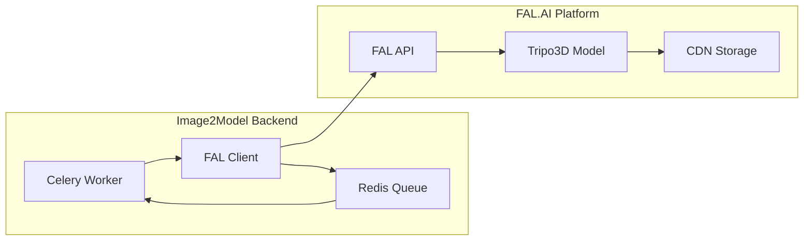

# FAL.AI Integration Guide

## Overview

The Image2Model backend integrates with FAL.AI's Tripo3D service to convert 2D images into 3D models. This document details the integration architecture, implementation, and best practices.

## Integration Architecture



## FAL.AI Client Implementation

### Core Client Class

```python
import asyncio
from typing import Optional, Callable, Dict
import aiohttp
import fal
from dataclasses import dataclass
from app.core.exceptions import (
    FALAPIException, 
    ProcessingException,
    RateLimitException,
    AuthenticationException
)

@dataclass
class ModelResult:
    """Result from FAL.AI model generation"""
    model_url: str
    task_id: str
    processing_time: float
    metadata: Dict

class FalAIClient:
    """Robust FAL.AI integration client"""
    
    def __init__(self, api_key: str):
        self.api_key = api_key
        self.model_endpoint = "tripo3d/tripo/v2.5/image-to-3d"
        
        # Configure FAL client
        fal.api_key = api_key
        
        # Retry configuration
        self.max_retries = 3
        self.retry_delay = 1  # seconds
        self.max_retry_delay = 60  # seconds
        
        # Timeout configuration
        self.initial_timeout = 300  # 5 minutes
        self.max_timeout = 1800  # 30 minutes
    
    async def generate_model(
        self,
        image_url: str,
        face_limit: int = 50000,
        progress_callback: Optional[Callable[[int], None]] = None
    ) -> ModelResult:
        """Generate 3D model from image with comprehensive error handling"""
        
        start_time = asyncio.get_event_loop().time()
        
        # Prepare request payload
        payload = {
            "image_url": image_url,
            "face_limit": face_limit,
            "render_mode": "default",
            "foreground_ratio": 1.0,
            "texture_resolution": 1024
        }
        
        # Submit to FAL.AI with retries
        result = await self._submit_with_retry(payload, progress_callback)
        
        processing_time = asyncio.get_event_loop().time() - start_time
        
        return ModelResult(
            model_url=result.get("model_url"),
            task_id=result.get("task_id"),
            processing_time=processing_time,
            metadata=result.get("metadata", {})
        )
    
    async def _submit_with_retry(
        self,
        payload: Dict,
        progress_callback: Optional[Callable[[int], None]]
    ) -> Dict:
        """Submit request with exponential backoff retry"""
        
        last_exception = None
        retry_delay = self.retry_delay
        
        for attempt in range(self.max_retries):
            try:
                # Submit to FAL.AI
                handle = await asyncio.to_thread(
                    fal.apps.submit,
                    self.model_endpoint,
                    arguments=payload
                )
                
                # Wait for result with progress tracking
                result = await self._wait_for_result(handle, progress_callback)
                
                return result
                
            except AuthenticationException:
                # Don't retry auth errors
                raise
                
            except RateLimitException as e:
                # Use server-provided retry delay if available
                retry_delay = min(
                    e.retry_after or retry_delay * 2,
                    self.max_retry_delay
                )
                logger.warning(
                    f"Rate limited, retrying after {retry_delay}s",
                    attempt=attempt
                )
                
            except (NetworkError, ProcessingException) as e:
                last_exception = e
                retry_delay = min(retry_delay * 2, self.max_retry_delay)
                logger.warning(
                    f"Request failed, retrying after {retry_delay}s",
                    error=str(e),
                    attempt=attempt
                )
            
            if attempt < self.max_retries - 1:
                await asyncio.sleep(retry_delay)
        
        # All retries exhausted
        raise ProcessingException(
            f"Failed after {self.max_retries} attempts: {last_exception}"
        )
    
    async def _wait_for_result(
        self,
        handle,
        progress_callback: Optional[Callable[[int], None]]
    ) -> Dict:
        """Wait for FAL.AI result with progress tracking"""
        
        timeout = self.initial_timeout
        last_progress = 0
        
        while True:
            try:
                # Check status
                status = await asyncio.to_thread(handle.status)
                
                if status.get("status") == "COMPLETED":
                    return await asyncio.to_thread(handle.get)
                
                elif status.get("status") == "FAILED":
                    error_msg = status.get("error", "Unknown error")
                    raise ProcessingException(f"FAL.AI processing failed: {error_msg}")
                
                # Update progress
                progress = status.get("progress", 0)
                if progress > last_progress and progress_callback:
                    await asyncio.to_thread(progress_callback, progress)
                    last_progress = progress
                
                # Check for logs
                logs = status.get("logs", [])
                for log in logs:
                    if progress_callback:
                        # Send log as progress update
                        await asyncio.to_thread(
                            progress_callback,
                            {"type": "log", "message": log}
                        )
                
                # Wait before next check
                await asyncio.sleep(2)
                
            except asyncio.TimeoutError:
                # Increase timeout for long-running tasks
                timeout = min(timeout * 1.5, self.max_timeout)
                logger.warning(f"Timeout increased to {timeout}s")
```

### Error Handling

```python
class FALErrorHandler:
    """Handle FAL.AI specific errors"""
    
    @staticmethod
    def parse_fal_error(error: Exception) -> Exception:
        """Parse FAL.AI errors into appropriate exceptions"""
        
        error_str = str(error).lower()
        
        # Authentication errors
        if "authentication" in error_str or "api key" in error_str:
            return AuthenticationException("Invalid FAL.AI API key")
        
        # Rate limiting
        if "rate limit" in error_str or "too many requests" in error_str:
            # Extract retry-after if available
            retry_after = FALErrorHandler._extract_retry_after(error_str)
            return RateLimitException(
                "FAL.AI rate limit exceeded",
                retry_after=retry_after
            )
        
        # Model errors
        if "model" in error_str or "processing" in error_str:
            return ProcessingException(f"Model generation failed: {error}")
        
        # Network errors
        if "timeout" in error_str or "connection" in error_str:
            return NetworkError(f"Network error: {error}")
        
        # Generic FAL API error
        return FALAPIException(f"FAL.AI error: {error}")
    
    @staticmethod
    def _extract_retry_after(error_str: str) -> Optional[int]:
        """Extract retry-after value from error message"""
        import re
        
        # Look for patterns like "retry after 60 seconds"
        match = re.search(r'retry after (\d+)', error_str)
        if match:
            return int(match.group(1))
        
        return None
```

## Progress Tracking

### Real-time Progress Updates

```python
class FALProgressTracker:
    """Track and report FAL.AI processing progress"""
    
    def __init__(self, redis_client, job_id: str, file_id: str):
        self.redis = redis_client
        self.job_id = job_id
        self.file_id = file_id
        self.last_progress = 0
        self.log_cache = set()  # Prevent duplicate logs
    
    async def update_progress(self, update: Union[int, Dict]):
        """Process progress update from FAL.AI"""
        
        if isinstance(update, int):
            # Simple progress percentage
            await self._update_percentage(update)
        
        elif isinstance(update, dict):
            # Complex update with logs
            if update.get("type") == "log":
                await self._process_log(update.get("message"))
            else:
                progress = update.get("progress", 0)
                await self._update_percentage(progress)
    
    async def _update_percentage(self, progress: int):
        """Update progress percentage with monotonic guarantee"""
        
        # Ensure monotonic progress
        if progress <= self.last_progress:
            return
        
        self.last_progress = progress
        
        # Update Redis
        progress_key = f"progress:{self.job_id}:{self.file_id}"
        await self.redis.set(progress_key, progress)
        
        # Publish SSE event
        event = {
            "type": "progress",
            "job_id": self.job_id,
            "file_id": self.file_id,
            "progress": progress
        }
        
        await self.redis.publish(
            f"progress:{self.job_id}",
            json.dumps(event)
        )
    
    async def _process_log(self, message: str):
        """Process and deduplicate log messages"""
        
        # Deduplicate logs
        log_hash = hashlib.md5(message.encode()).hexdigest()
        if log_hash in self.log_cache:
            return
        
        self.log_cache.add(log_hash)
        
        # Parse FAL.AI log messages
        user_message = self._parse_fal_log(message)
        
        # Publish log event
        event = {
            "type": "log",
            "job_id": self.job_id,
            "file_id": self.file_id,
            "message": user_message
        }
        
        await self.redis.publish(
            f"progress:{self.job_id}",
            json.dumps(event)
        )
    
    def _parse_fal_log(self, fal_message: str) -> str:
        """Convert FAL.AI technical logs to user-friendly messages"""
        
        message_map = {
            "Initializing model": "Starting 3D model generation...",
            "Processing image": "Analyzing your image...",
            "Generating mesh": "Creating 3D geometry...",
            "Applying textures": "Adding textures to model...",
            "Optimizing geometry": "Optimizing 3D model...",
            "Finalizing output": "Completing model generation...",
            "Upload complete": "Model ready for download!"
        }
        
        # Check for known patterns
        for pattern, user_msg in message_map.items():
            if pattern.lower() in fal_message.lower():
                return user_msg
        
        # Default: return cleaned version
        return fal_message.strip()
```

## Configuration and Settings

### Environment Configuration

```python
from pydantic import BaseSettings, Field, validator

class FALSettings(BaseSettings):
    """FAL.AI specific settings"""
    
    FAL_KEY: str = Field(..., env="FAL_KEY")
    FAL_MODEL_ENDPOINT: str = Field(
        default="tripo3d/tripo/v2.5/image-to-3d",
        env="FAL_MODEL_ENDPOINT"
    )
    FAL_TIMEOUT: int = Field(default=300, env="FAL_TIMEOUT")
    FAL_MAX_RETRIES: int = Field(default=3, env="FAL_MAX_RETRIES")
    FAL_FACE_LIMIT: int = Field(default=50000, env="FAL_FACE_LIMIT")
    FAL_TEXTURE_RESOLUTION: int = Field(default=1024, env="FAL_TEXTURE_RESOLUTION")
    
    @validator("FAL_KEY")
    def validate_api_key(cls, v):
        if not v or len(v) < 10:
            raise ValueError("Invalid FAL API key")
        return v
    
    @validator("FAL_FACE_LIMIT")
    def validate_face_limit(cls, v):
        if v < 1000 or v > 100000:
            raise ValueError("Face limit must be between 1000 and 100000")
        return v
    
    class Config:
        env_file = ".env"
```

### Model Parameters

```python
class ModelGenerationParams:
    """Parameters for 3D model generation"""
    
    QUALITY_PRESETS = {
        "draft": {
            "face_limit": 10000,
            "texture_resolution": 512,
            "render_mode": "fast"
        },
        "standard": {
            "face_limit": 50000,
            "texture_resolution": 1024,
            "render_mode": "default"
        },
        "high": {
            "face_limit": 100000,
            "texture_resolution": 2048,
            "render_mode": "quality"
        }
    }
    
    @classmethod
    def get_params(cls, quality: str = "standard") -> dict:
        """Get parameters for quality preset"""
        return cls.QUALITY_PRESETS.get(quality, cls.QUALITY_PRESETS["standard"])
```

## Monitoring and Metrics

### FAL.AI Metrics Collection

```python
from prometheus_client import Counter, Histogram, Gauge

class FALMetrics:
    """Collect metrics for FAL.AI integration"""
    
    # Request metrics
    fal_requests_total = Counter(
        'fal_requests_total',
        'Total FAL.AI API requests',
        ['status', 'endpoint']
    )
    
    # Latency metrics
    fal_request_duration = Histogram(
        'fal_request_duration_seconds',
        'FAL.AI request duration',
        ['endpoint'],
        buckets=[1, 5, 10, 30, 60, 120, 300, 600]
    )
    
    # Error metrics
    fal_errors_total = Counter(
        'fal_errors_total',
        'Total FAL.AI errors',
        ['error_type']
    )
    
    # Rate limit metrics
    fal_rate_limit_hits = Counter(
        'fal_rate_limit_hits_total',
        'FAL.AI rate limit hits'
    )
    
    # Cost tracking
    fal_api_credits_used = Counter(
        'fal_api_credits_used_total',
        'FAL.AI API credits consumed'
    )
    
    @classmethod
    def record_request(cls, endpoint: str, duration: float, status: str):
        """Record API request metrics"""
        cls.fal_requests_total.labels(
            status=status,
            endpoint=endpoint
        ).inc()
        
        cls.fal_request_duration.labels(
            endpoint=endpoint
        ).observe(duration)
    
    @classmethod
    def record_error(cls, error_type: str):
        """Record error metrics"""
        cls.fal_errors_total.labels(error_type=error_type).inc()
        
        if error_type == "rate_limit":
            cls.fal_rate_limit_hits.inc()
```

## Testing and Mocking

### FAL.AI Mock Client

```python
class MockFalAIClient:
    """Mock FAL.AI client for testing"""
    
    def __init__(self, api_key: str):
        self.api_key = api_key
        self.delay = 2  # Simulate processing time
        self.should_fail = False
        self.failure_type = None
    
    async def generate_model(
        self,
        image_url: str,
        face_limit: int = 50000,
        progress_callback: Optional[Callable[[int], None]] = None
    ) -> ModelResult:
        """Simulate model generation"""
        
        if self.should_fail:
            await self._simulate_failure()
        
        # Simulate progress updates
        for progress in [10, 30, 50, 70, 90, 100]:
            if progress_callback:
                await progress_callback(progress)
            await asyncio.sleep(self.delay / 6)
        
        # Return mock result
        return ModelResult(
            model_url="https://mock.fal.ai/models/test_model.glb",
            task_id="mock_task_123",
            processing_time=self.delay,
            metadata={"mock": True}
        )
    
    async def _simulate_failure(self):
        """Simulate various failure scenarios"""
        if self.failure_type == "rate_limit":
            raise RateLimitException("Mock rate limit", retry_after=60)
        elif self.failure_type == "auth":
            raise AuthenticationException("Mock auth failure")
        elif self.failure_type == "processing":
            raise ProcessingException("Mock processing failure")
        else:
            raise FALAPIException("Mock generic failure")

# Usage in tests
@pytest.fixture
def mock_fal_client(monkeypatch):
    """Fixture for mocked FAL client"""
    client = MockFalAIClient("test_key")
    monkeypatch.setattr("app.workers.fal_client.FalAIClient", lambda x: client)
    return client
```

## Best Practices

### 1. API Key Management
- Store API keys in environment variables
- Rotate keys regularly
- Monitor key usage

### 2. Error Recovery
- Implement exponential backoff
- Handle rate limits gracefully
- Log all errors for debugging

### 3. Progress Tracking
- Provide real-time updates
- Deduplicate log messages
- Ensure monotonic progress

### 4. Performance Optimization
- Cache results when possible
- Batch requests efficiently
- Monitor API latency

### 5. Cost Management
- Track API credit usage
- Implement usage quotas
- Alert on unusual consumption

## Troubleshooting

### Common Issues

1. **Authentication Failures**
   - Verify API key is correct
   - Check key permissions
   - Ensure key is not expired

2. **Rate Limiting**
   - Implement request queuing
   - Use exponential backoff
   - Consider upgrading API plan

3. **Timeout Errors**
   - Increase timeout values
   - Check image size/complexity
   - Monitor FAL.AI status page

4. **Model Generation Failures**
   - Validate input images
   - Check face limit settings
   - Review error messages

### Debug Logging

```python
# Enable debug logging for FAL.AI
import logging

logging.getLogger("fal").setLevel(logging.DEBUG)
logging.getLogger("app.workers.fal_client").setLevel(logging.DEBUG)
```