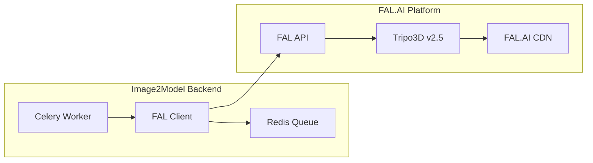

# FAL.AI Integration Guide

## Overview

The Image2Model backend integrates with FAL.AI's Tripo3D service to convert 2D images into 3D models. This implementation uses FAL.AI's `fal.subscribe` API for real-time processing and returns direct URLs to FAL.AI hosted files without local downloads.

## Integration Architecture



## FAL.AI Client Implementation

The actual implementation provides a simple, pragmatic wrapper around the FAL.AI API with essential features for 3D model generation.

### Core Client Class

```python
import os
import logging
import time
from typing import Dict, Any, Optional
import fal_client as fal
from app.core.config import settings

class FalAIClient:
    """
    FAL.AI client wrapper for 3D model generation.
    
    Uses fal_client library with fal.subscribe for real-time processing
    and returns direct URLs to FAL.AI hosted files.
    """
    
    def __init__(self):
        """Initialize the FAL.AI client with credentials."""
        self._setup_authentication()
        self.model_endpoint = "tripo3d/tripo/v2.5/image-to-3d"
        self.max_retries = 3
        self.base_timeout = 300  # 5 minutes
        self.max_wait_time = 1800  # 30 minutes max
        
        # Progress tracking state - simple deduplication
        self._processed_log_timestamps = set()  # Track processed logs
        self._last_progress = {}  # Track progress per file to ensure monotonic updates
        
    def _setup_authentication(self) -> None:
        """Set up FAL.AI authentication using API key from settings."""
        try:
            if settings.FAL_API_KEY and settings.FAL_API_KEY != "your-fal-api-key-here":
                # Set the FAL_KEY environment variable which fal_client uses
                os.environ["FAL_KEY"] = settings.FAL_API_KEY
                logger.info("FAL.AI API key configured successfully")
            else:
                logger.error("FAL.AI API key not found or not set in settings")
                raise FalAIAuthenticationError("FAL.AI API key not properly configured")
        except Exception as e:
            logger.error(f"Failed to configure FAL.AI credentials: {str(e)}")
            raise FalAIAuthenticationError(f"Authentication setup failed: {str(e)}")
    
    async def process_single_image(
        self, 
        file_path: str, 
        face_limit: Optional[int] = None,
        texture_enabled: bool = True,
        progress_callback: Optional[callable] = None,
        job_id: Optional[str] = None
    ) -> Dict[str, Any]:
        """
        Process a single image to generate a 3D model using FAL.AI.
        
        Args:
            file_path: Path to the input image file
            face_limit: Optional face limit parameter for the model
            texture_enabled: Whether to enable texture generation (standard or no)
            progress_callback: Optional callback function for progress updates
            job_id: Optional job ID for tracking
            
        Returns:
            Dictionary containing processing result with FAL.AI URLs
        """
        # Upload the local file to FAL.AI and get a URL
        file_url = fal.upload_file(file_path)
        
        # Prepare input data for FAL.AI API
        input_data = {
            "image_url": file_url,
            "texture": "standard" if texture_enabled else "no",
            "texture_alignment": "original_image",
            "orientation": "default"
        }
        
        # Add face_limit if specified (forces GLB output)
        if face_limit is not None and face_limit > 0:
            input_data["face_limit"] = face_limit
        
        # Submit job using fal.subscribe for real-time execution
        result = fal.subscribe(
            self.model_endpoint,
            arguments=input_data,
            with_logs=True,
            on_queue_update=lambda update: self._handle_queue_update(
                update, progress_callback, file_id=job_id or file_path
            ) if progress_callback else None
        )
        
        # Process and return the result with direct URLs
        return self._process_result(result, file_path, progress_callback, job_id)
```

### Error Handling

The client implements a simple exception hierarchy and retry logic with exponential backoff:

```python
# Custom exception hierarchy for FAL.AI errors
class FalAIError(Exception):
    """Base exception for FAL.AI related errors."""
    pass

class FalAIAuthenticationError(FalAIError):
    """Raised when authentication with FAL.AI fails."""
    pass

class FalAIRateLimitError(FalAIError):
    """Raised when FAL.AI rate limit is exceeded."""
    pass

class FalAITimeoutError(FalAIError):
    """Raised when FAL.AI request times out."""
    pass

class FalAIAPIError(FalAIError):
    """Raised when FAL.AI API returns an error response."""
    pass

class FalAIDownloadError(FalAIError):
    """Raised when downloading the generated model fails."""
    pass

def _handle_fal_error(self, error: Exception, attempt: int) -> bool:
    """
    Handle FAL.AI errors and determine if retry is appropriate.
    
    Args:
        error: The exception that occurred
        attempt: Current attempt number
        
    Returns:
        True if retry should be attempted, False otherwise
    """
    error_message = str(error).lower()
    
    # Authentication errors - don't retry
    if "auth" in error_message or "unauthorized" in error_message or "forbidden" in error_message:
        raise FalAIAuthenticationError(f"Authentication failed: {str(error)}")
    
    # Rate limiting - retry with backoff
    if "rate limit" in error_message or "too many requests" in error_message or "429" in error_message:
        if attempt < self.max_retries:
            logger.warning(f"Rate limited, waiting before retry attempt {attempt + 1}")
            return True
        else:
            raise FalAIRateLimitError(f"Rate limit exceeded after {self.max_retries} attempts")
    
    # Timeout errors - retry
    if "timeout" in error_message or "timed out" in error_message:
        if attempt < self.max_retries:
            logger.warning(f"Timeout occurred, retrying attempt {attempt + 1}")
            return True
        else:
            raise FalAITimeoutError(f"Request timed out after {self.max_retries} attempts")
    
    # Server errors (5xx) - retry
    if any(code in error_message for code in ["500", "502", "503", "504"]):
        if attempt < self.max_retries:
            logger.warning(f"Server error occurred, retrying attempt {attempt + 1}")
            return True
        else:
            raise FalAIAPIError(f"Server error after {self.max_retries} attempts: {str(error)}")
    
    # Client errors (4xx except rate limiting) - don't retry
    if any(code in error_message for code in ["400", "401", "403", "404"]):
        raise FalAIAPIError(f"Client error (not retryable): {str(error)}")
    
    # Unknown errors - retry once
    if attempt < 1:
        logger.warning(f"Unknown error occurred, retrying once: {str(error)}")
        return True
    else:
        raise FalAIAPIError(f"Unknown error after retry: {str(error)}")

def _exponential_backoff(self, attempt: int) -> float:
    """Calculate exponential backoff delay."""
    base_delay = 1.0  # 1 second base delay
    max_delay = 60.0  # 60 seconds max delay
    delay = min(base_delay * (2 ** attempt), max_delay)
    return delay
```

## Progress Tracking

### Real-time Progress Updates

The FAL.AI client uses `fal.subscribe` with `on_queue_update` callback for real-time progress tracking. The implementation focuses on deduplication and monotonic progress to ensure a smooth user experience:

```python
def _handle_queue_update(self, update, progress_callback, file_id=None):
    """Handle FAL.AI queue updates and forward progress with deduplication."""
    try:
        import fal_client
        logger.info(f"FAL.AI queue update received: {type(update).__name__}")
        
        if isinstance(update, fal_client.InProgress):
            # Extract progress information and forward to callback
            if hasattr(update, 'logs') and update.logs:
                logger.info(f"Processing {len(update.logs)} log entries")
                for log in update.logs:
                    # Check if we've already processed this log entry
                    log_timestamp = log.get('timestamp') or log.get('logged_at')
                    if log_timestamp and log_timestamp in self._processed_log_timestamps:
                        logger.debug(f"Skipping duplicate log entry: {log_timestamp}")
                        continue
                    
                    # Mark as processed
                    if log_timestamp:
                        self._processed_log_timestamps.add(log_timestamp)
                    
                    logger.info(f"FAL.AI log entry: {log}")
                    if progress_callback and 'message' in log:
                        raw_message = log['message']
                        
                        # Convert FAL.AI progress to user-friendly message
                        progress_percent = 0  # Default to 0 instead of arbitrary values
                        user_message = "Processing..."  # Default user-friendly message
                        
                        if 'upload' in raw_message.lower():
                            progress_percent = 5  # Small progress for upload
                            user_message = "Uploading to FAL.AI..."
                        elif 'generating' in raw_message.lower() or 'processing' in raw_message.lower():
                            progress_percent = 10  # Small default if no percentage found
                            user_message = "Generating 3D model..."
                        elif 'download' in raw_message.lower() or 'saving' in raw_message.lower():
                            progress_percent = 95  # Near complete
                            user_message = "Finalizing model..."
                        elif 'progress:' in raw_message.lower():
                            # Try to extract percentage from FAL.AI progress message
                            import re
                            percent_match = re.search(r'(\d+)%', raw_message)
                            if percent_match:
                                try:
                                    # Use raw FAL.AI progress without scaling
                                    fal_percent = int(percent_match.group(1))
                                    progress_percent = fal_percent  # Use raw percentage
                                    user_message = f"Processing 3D model... {fal_percent}%"
                                except:
                                    pass
                        
                        # Ensure monotonic progress (never decrease)
                        last_progress = self._last_progress.get(file_id, 0)
                        if progress_percent < last_progress:
                            logger.debug(f"Skipping progress update {progress_percent}% < {last_progress}%")
                            continue
                        
                        # Update last progress
                        self._last_progress[file_id] = progress_percent
                        
                        logger.info(f"Sending progress update: {user_message} ({progress_percent}%)")
                        progress_callback(user_message, progress_percent)
            elif progress_callback:
                # Only send default if we haven't sent any progress yet
                if file_id not in self._last_progress or self._last_progress[file_id] == 0:
                    progress_callback("Generating 3D model...", 10)
                    self._last_progress[file_id] = 10
                    
    except Exception as e:
        logger.warning(f"Failed to handle queue update: {str(e)}")
```

### Progress Features

- **Deduplication**: Tracks processed log timestamps to avoid duplicate progress updates
- **Monotonic Progress**: Ensures progress never decreases during processing
- **User-Friendly Messages**: Converts FAL.AI's raw progress messages to readable text
- **Percentage Extraction**: Attempts to extract actual percentages from FAL.AI logs
- **Fallback Handling**: Provides default progress when no specific information is available

## Configuration and Settings

### Environment Configuration

The FAL.AI client uses a simple configuration approach with the core application settings:

```python
# In app/core/config.py
class Settings(BaseSettings):
    # FAL.AI Configuration
    FAL_API_KEY: str = Field("your-fal-api-key-here", env="FAL_API_KEY")
    
    class Config:
        env_file = ".env"

# Authentication setup in client
def _setup_authentication(self) -> None:
    """Set up FAL.AI authentication using API key from settings."""
    try:
        if settings.FAL_API_KEY and settings.FAL_API_KEY != "your-fal-api-key-here":
            # Set the FAL_KEY environment variable which fal_client uses
            os.environ["FAL_KEY"] = settings.FAL_API_KEY
            logger.info("FAL.AI API key configured successfully")
        else:
            logger.error("FAL.AI API key not found or not set in settings")
            raise FalAIAuthenticationError("FAL.AI API key not properly configured")
    except Exception as e:
        logger.error(f"Failed to configure FAL.AI credentials: {str(e)}")
        raise FalAIAuthenticationError(f"Authentication setup failed: {str(e)}")
```

### Model Parameters

The implementation uses direct parameter passing to the FAL.AI API. There are no quality presets - parameters are passed directly:

```python
# Input data preparation
input_data = {
    "image_url": file_url,  # Uploaded file URL
    "texture": "standard" if texture_enabled else "no",  # Texture generation setting
    "texture_alignment": "original_image",  # Fixed alignment setting
    "orientation": "default"  # Fixed orientation setting
}

# Add face_limit if specified (forces GLB output)
if face_limit is not None and face_limit > 0:
    input_data["face_limit"] = face_limit
```

### Available Parameters

- **texture**: Controls texture generation (`"standard"` or `"no"`)
- **texture_alignment**: How texture is aligned (`"original_image"`)
- **orientation**: Model orientation (`"default"`)
- **face_limit**: Optional polygon count limit (forces GLB format when set)

### Celery Integration

The client provides a synchronous wrapper for Celery compatibility, since Celery tasks cannot directly use async functions:

```python
def process_single_image_sync(
    self, 
    file_path: str, 
    face_limit: Optional[int] = None,
    texture_enabled: bool = True,
    progress_callback: Optional[callable] = None,
    job_id: Optional[str] = None
) -> Dict[str, Any]:
    """
    Synchronous wrapper for process_single_image to use in Celery tasks.
    
    This avoids the coroutine serialization issues when using async functions
    in Celery tasks.
    """
    import asyncio
    
    # Create a new event loop for this thread if needed
    try:
        loop = asyncio.get_event_loop()
    except RuntimeError:
        loop = asyncio.new_event_loop()
        asyncio.set_event_loop(loop)
    
    # Run the async function in the event loop
    return loop.run_until_complete(
        self.process_single_image(
            file_path=file_path,
            face_limit=face_limit,
            texture_enabled=texture_enabled,
            progress_callback=progress_callback,
            job_id=job_id
        )
    )
```

**Note**: This pattern is necessary because:
- FAL.AI client uses async internally
- Celery tasks must be synchronous
- The wrapper creates a new event loop for each task execution

## Result Processing

### Direct URL Approach

The implementation returns direct FAL.AI URLs without downloading files locally. This approach is more efficient and avoids local storage management:

```python
def _process_result(self, result: Dict[str, Any], file_path: str, progress_callback: Optional[callable] = None, job_id: Optional[str] = None) -> Dict[str, Any]:
    """
    Process the FAL.AI API result and return direct URLs without downloading.
    
    Args:
        result: FAL.AI API response
        file_path: Original input file path
        progress_callback: Optional callback function for progress updates
        job_id: Job ID for tracking
        
    Returns:
        Processed result dictionary with FAL.AI URLs
    """
    try:
        # Extract model URL from result according to FAL.AI Tripo3D documentation
        # Response format: {"model_mesh": {"url": "...", "file_size": ..., "content_type": "..."}, "rendered_image": {...}, "task_id": "..."}
        model_mesh = result.get('model_mesh')
        rendered_image = result.get('rendered_image')
        task_id = result.get('task_id')
        
        if not model_mesh or not model_mesh.get('url'):
            logger.error(f"No model_mesh or model URL found in FAL.AI response: {result}")
            return {
                'status': 'failed',
                'input': file_path,
                'error': 'No model_mesh.url in API response'
            }
        
        model_url = model_mesh['url']
        model_file_size = model_mesh.get('file_size', 0)
        model_content_type = model_mesh.get('content_type', 'application/octet-stream')
        
        # Generate filename for display purposes
        if model_mesh.get('file_name'):
            output_filename = model_mesh['file_name']
        else:
            base_name = os.path.splitext(os.path.basename(file_path))[0]
            output_filename = f"{base_name}.glb"
        
        # Prepare result with direct FAL.AI URLs
        result_data = {
            'status': 'success',
            'input': file_path,
            'output': None,  # No local file path since we're not downloading
            'download_url': model_url,  # Direct FAL.AI URL for download
            'model_format': 'glb',
            'model_url': model_url,  # Original FAL.AI URL
            'file_size': model_file_size,  # FAL.AI reported file size
            'content_type': model_content_type,  # FAL.AI reported content type
            'output_directory': None,  # No local directory
            'original_file_size': model_file_size,  # FAL.AI response file size
            'original_content_type': model_content_type,  # FAL.AI response content type
            'task_id': task_id,  # FAL.AI task ID
            'filename': output_filename  # For display purposes
        }
        
        # Add rendered image information if available
        if rendered_image and rendered_image.get('url'):
            result_data['rendered_image'] = {
                'url': rendered_image['url'],
                'file_size': rendered_image.get('file_size', 0),
                'content_type': rendered_image.get('content_type', 'image/webp')
            }
        
        return result_data
        
    except Exception as e:
        logger.error(f"Failed to process FAL.AI result: {str(e)}")
        return {
            'status': 'failed',
            'input': file_path,
            'error': f'Result processing failed: {str(e)}',
            'error_type': 'processing_error'
        }
```

### Result Structure

The processed result contains:

**Success Response**:
- `status`: "success"
- `download_url`: Direct FAL.AI URL for model download
- `model_url`: Same as download_url (backward compatibility)
- `file_size`: File size in bytes from FAL.AI
- `content_type`: MIME type (typically "application/octet-stream")
- `task_id`: FAL.AI task identifier
- `filename`: Generated filename for display
- `rendered_image`: Optional preview image data

**Error Response**:
- `status`: "failed"
- `error`: Error description
- `error_type`: Error category (e.g., "processing_error")

## Monitoring and Logging

### Basic Logging with Timing

The implementation uses structured logging with timing information for monitoring purposes:

```python
# Track timing for monitoring
submit_start_time = time.time()

try:
    # FAL.AI API call
    result = fal.subscribe(...)
    
    # Log success metrics with structured data
    submit_duration_ms = (time.time() - submit_start_time) * 1000
    logger.info(
        f"FAL.AI job completed successfully in {submit_duration_ms:.2f}ms",
        extra={
            "model_endpoint": self.model_endpoint,
            "image_path": file_path,
            "face_limit": face_limit,
            "result_keys": list(result.keys()) if isinstance(result, dict) else None,
            "duration_ms": submit_duration_ms
        }
    )
    
except Exception as e:
    # Log failure metrics with structured data
    submit_duration_ms = (time.time() - submit_start_time) * 1000
    logger.error(
        f"FAL.AI job failed after {submit_duration_ms:.2f}ms: {str(e)}",
        extra={
            "model_endpoint": self.model_endpoint,
            "image_path": file_path,
            "error": str(e),
            "duration_ms": submit_duration_ms
        }
    )
    raise
```

### Logged Metrics

The implementation tracks basic metrics through structured logging:

- **Duration**: Processing time in milliseconds
- **Endpoint**: FAL.AI model endpoint used
- **Parameters**: Input parameters (face_limit, texture settings)
- **Results**: Success/failure status and result keys
- **Errors**: Exception details and error types

**Note**: The implementation does not include Prometheus metrics or advanced monitoring systems. All monitoring is done through the standard Python logging framework.

## Best Practices

### 1. API Key Management
- Store API keys in environment variables only
- Use placeholder values in configuration files
- Validate key presence before API calls

### 2. Error Recovery
- Use exponential backoff with max delays
- Handle rate limits with retry logic
- Distinguish between retryable and non-retryable errors
- Log all errors with structured data

### 3. Progress Tracking
- Implement deduplication to avoid duplicate updates
- Ensure monotonic progress (never decrease)
- Provide user-friendly messages
- Use callback patterns for real-time updates

### 4. Sync/Async Patterns
- Use async methods for FAL.AI API calls
- Provide sync wrappers for Celery compatibility
- Create new event loops in worker threads

### 5. Result Management
- Return direct FAL.AI URLs (no local downloads)
- Include metadata (file size, content type)
- Handle missing model_mesh gracefully

## Troubleshooting

### Common Issues

1. **Authentication Failures**
   - Verify `FAL_API_KEY` is set in environment
   - Check that key is not the placeholder value
   - Ensure `FAL_KEY` environment variable is set by client

2. **Rate Limiting**
   - Look for "rate limit" or "429" in error messages
   - Client implements automatic retry with exponential backoff
   - Check FAL.AI account usage limits

3. **Timeout Errors**
   - Increase `base_timeout` and `max_wait_time` values
   - Check image size/complexity
   - Monitor FAL.AI service status

4. **Model Generation Failures**
   - Verify input images are valid format
   - Check `model_mesh` presence in API response
   - Review structured logging for error details

5. **Progress Issues**
   - Check that progress_callback is callable
   - Look for duplicate log timestamp warnings
   - Verify monotonic progress enforcement

### Debug Logging

Enable debug logging for detailed troubleshooting:

```python
# Enable debug logging for FAL.AI integration
import logging

logging.getLogger("fal_client").setLevel(logging.DEBUG)
logging.getLogger("app.workers.fal_client").setLevel(logging.DEBUG)

# For queue update debugging
logging.getLogger("app.workers.fal_client").addHandler(
    logging.StreamHandler()
)
```

### Error Patterns

Common error patterns and their meanings:

- **"No model_mesh.url in API response"**: FAL.AI returned unexpected response format
- **"Authentication failed"**: API key issues or invalid credentials
- **"Rate limit exceeded"**: Too many requests, implement backoff
- **"Request timed out"**: Network or processing timeout
- **"Failed to handle queue update"**: Progress tracking error (non-fatal)

## Implementation Summary

The FAL.AI integration provides a simple, effective wrapper around the FAL.AI Tripo3D service with these key characteristics:

### Architecture Highlights

- **Direct URL Approach**: No local file downloads, returns FAL.AI URLs directly
- **Sync/Async Compatibility**: Async core with sync wrapper for Celery
- **Real-time Progress**: Uses `fal.subscribe` with queue update callbacks
- **Simple Error Handling**: Custom exception hierarchy with retry logic
- **Structured Logging**: Basic monitoring through Python logging

### API Usage Pattern

```python
# Global client instance
fal_client = FalAIClient()

# Celery task usage
result = fal_client.process_single_image_sync(
    file_path="/path/to/image.jpg",
    face_limit=50000,
    texture_enabled=True,
    progress_callback=progress_function,
    job_id="task_123"
)

# Result contains direct FAL.AI URLs
model_url = result['download_url']
```

### Key Benefits

- **Simplicity**: Straightforward implementation without complex abstractions
- **Efficiency**: No local storage management or file transfers
- **Reliability**: Built-in retry logic and error handling
- **Monitoring**: Structured logging for debugging and monitoring
- **Compatibility**: Works with existing Celery task infrastructure

This implementation prioritizes practical functionality over architectural sophistication, making it maintainable and appropriate for the current system requirements.