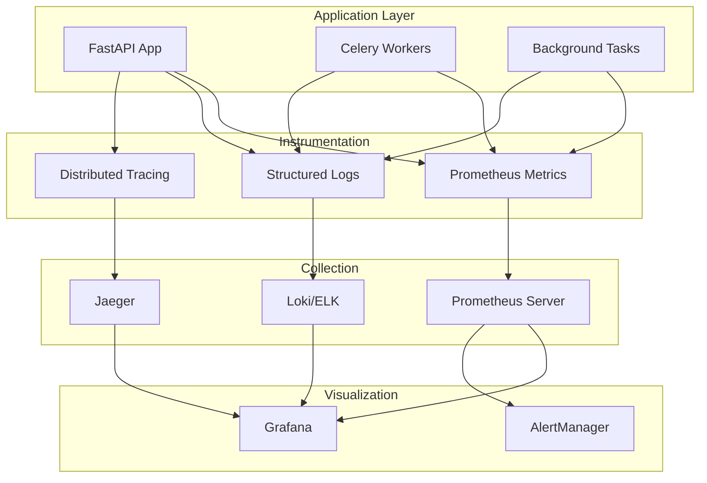

# Monitoring, Logging, and Observability

## Overview

The Image2Model backend implements comprehensive monitoring, logging, and observability features to ensure system reliability, performance tracking, and efficient troubleshooting.

## Architecture Overview



## Structured Logging

### Logging Configuration

```python
import logging
import json
from pythonjsonlogger import jsonlogger
from logging.handlers import RotatingFileHandler, TimedRotatingFileHandler
import sys
from datetime import datetime

class CustomJsonFormatter(jsonlogger.JsonFormatter):
    """Custom JSON formatter with additional fields"""
    
    def add_fields(self, log_record, record, message_dict):
        super().add_fields(log_record, record, message_dict)
        
        # Add custom fields
        log_record['timestamp'] = datetime.utcnow().isoformat()
        log_record['level'] = record.levelname
        log_record['logger'] = record.name
        
        # Add correlation ID if available
        if hasattr(record, 'correlation_id'):
            log_record['correlation_id'] = record.correlation_id
        
        # Add user context if available
        if hasattr(record, 'user_id'):
            log_record['user_id'] = record.user_id
        
        # Add request context
        if hasattr(record, 'request_id'):
            log_record['request_id'] = record.request_id
            log_record['method'] = getattr(record, 'method', None)
            log_record['path'] = getattr(record, 'path', None)
            log_record['status_code'] = getattr(record, 'status_code', None)

def setup_logging(app_name: str = "image2model"):
    """Configure structured logging for the application"""
    
    # Create formatters
    json_formatter = CustomJsonFormatter(
        '%(timestamp)s %(level)s %(name)s %(message)s'
    )
    
    console_formatter = logging.Formatter(
        '%(asctime)s - %(name)s - %(levelname)s - %(message)s'
    )
    
    # Root logger configuration
    root_logger = logging.getLogger()
    root_logger.setLevel(logging.INFO)
    
    # Console handler (human-readable for development)
    if settings.ENVIRONMENT == "development":
        console_handler = logging.StreamHandler(sys.stdout)
        console_handler.setFormatter(console_formatter)
        root_logger.addHandler(console_handler)
    
    # JSON file handler for production
    json_file_handler = RotatingFileHandler(
        f'logs/{app_name}.json',
        maxBytes=50 * 1024 * 1024,  # 50MB
        backupCount=10
    )
    json_file_handler.setFormatter(json_formatter)
    root_logger.addHandler(json_file_handler)
    
    # Error log file
    error_handler = RotatingFileHandler(
        f'logs/{app_name}_errors.log',
        maxBytes=10 * 1024 * 1024,  # 10MB
        backupCount=5
    )
    error_handler.setLevel(logging.ERROR)
    error_handler.setFormatter(json_formatter)
    root_logger.addHandler(error_handler)
    
    # Configure third-party loggers
    logging.getLogger("uvicorn").setLevel(logging.WARNING)
    logging.getLogger("fastapi").setLevel(logging.INFO)
    
    return root_logger
```

### Context-Aware Logging

```python
import contextvars
from typing import Optional

# Context variables for request tracking
request_id_var: contextvars.ContextVar[Optional[str]] = contextvars.ContextVar(
    'request_id', default=None
)
user_id_var: contextvars.ContextVar[Optional[str]] = contextvars.ContextVar(
    'user_id', default=None
)

class ContextLogger:
    """Logger that automatically includes context information"""
    
    def __init__(self, name: str):
        self.logger = logging.getLogger(name)
    
    def _log(self, level: int, msg: str, *args, **kwargs):
        """Log with context information"""
        extra = kwargs.get('extra', {})
        
        # Add context variables
        request_id = request_id_var.get()
        if request_id:
            extra['request_id'] = request_id
        
        user_id = user_id_var.get()
        if user_id:
            extra['user_id'] = user_id
        
        kwargs['extra'] = extra
        self.logger.log(level, msg, *args, **kwargs)
    
    def debug(self, msg: str, *args, **kwargs):
        self._log(logging.DEBUG, msg, *args, **kwargs)
    
    def info(self, msg: str, *args, **kwargs):
        self._log(logging.INFO, msg, *args, **kwargs)
    
    def warning(self, msg: str, *args, **kwargs):
        self._log(logging.WARNING, msg, *args, **kwargs)
    
    def error(self, msg: str, *args, **kwargs):
        self._log(logging.ERROR, msg, *args, **kwargs)
    
    def critical(self, msg: str, *args, **kwargs):
        self._log(logging.CRITICAL, msg, *args, **kwargs)

# Usage
logger = ContextLogger(__name__)
```

## Metrics Collection

### Prometheus Metrics

```python
from prometheus_client import (
    Counter, Histogram, Gauge, Summary, Info,
    CollectorRegistry, generate_latest, CONTENT_TYPE_LATEST
)
from prometheus_client.core import CollectorRegistry
import psutil
import time

# Create custom registry
registry = CollectorRegistry()

# HTTP Metrics
http_requests_total = Counter(
    'http_requests_total',
    'Total HTTP requests',
    ['method', 'endpoint', 'status'],
    registry=registry
)

http_request_duration = Histogram(
    'http_request_duration_seconds',
    'HTTP request latency',
    ['method', 'endpoint'],
    registry=registry,
    buckets=[.005, .01, .025, .05, .075, .1, .25, .5, .75, 1.0, 2.5, 5.0, 7.5, 10.0]
)

http_requests_in_progress = Gauge(
    'http_requests_in_progress',
    'HTTP requests currently being processed',
    ['method', 'endpoint'],
    registry=registry
)

# Business Metrics
models_generated_total = Counter(
    'models_generated_total',
    'Total 3D models generated',
    ['status'],
    registry=registry
)

model_generation_duration = Histogram(
    'model_generation_duration_seconds',
    'Time to generate 3D model',
    registry=registry,
    buckets=[10, 30, 60, 120, 300, 600, 900, 1800]
)

batch_processing_duration = Histogram(
    'batch_processing_duration_seconds',
    'Time to process entire batch',
    ['batch_size'],
    registry=registry
)

# Task Metrics
celery_tasks_total = Counter(
    'celery_tasks_total',
    'Total Celery tasks',
    ['task_name', 'status'],
    registry=registry
)

celery_task_duration = Histogram(
    'celery_task_duration_seconds',
    'Celery task execution time',
    ['task_name'],
    registry=registry
)

celery_queue_length = Gauge(
    'celery_queue_length',
    'Number of tasks in queue',
    ['queue_name'],
    registry=registry
)

# System Metrics
system_info = Info(
    'system_info',
    'System information',
    registry=registry
)

cpu_usage_percent = Gauge(
    'cpu_usage_percent',
    'CPU usage percentage',
    registry=registry
)

memory_usage_percent = Gauge(
    'memory_usage_percent',
    'Memory usage percentage',
    registry=registry
)

disk_usage_percent = Gauge(
    'disk_usage_percent',
    'Disk usage percentage',
    ['mount_point'],
    registry=registry
)

# FAL.AI Metrics
fal_api_calls_total = Counter(
    'fal_api_calls_total',
    'Total FAL.AI API calls',
    ['endpoint', 'status'],
    registry=registry
)

fal_api_duration = Histogram(
    'fal_api_duration_seconds',
    'FAL.AI API call duration',
    ['endpoint'],
    registry=registry
)

fal_rate_limits = Counter(
    'fal_rate_limits_total',
    'FAL.AI rate limit hits',
    registry=registry
)
```

### Metrics Middleware

```python
from fastapi import Request, Response
from starlette.middleware.base import BaseHTTPMiddleware
import time

class MetricsMiddleware(BaseHTTPMiddleware):
    """Middleware to collect HTTP metrics"""
    
    async def dispatch(self, request: Request, call_next):
        # Skip metrics endpoint to avoid recursion
        if request.url.path == "/metrics":
            return await call_next(request)
        
        # Extract labels
        method = request.method
        endpoint = self._get_endpoint_pattern(request)
        
        # Track in-progress requests
        http_requests_in_progress.labels(
            method=method,
            endpoint=endpoint
        ).inc()
        
        # Time the request
        start_time = time.time()
        
        try:
            response = await call_next(request)
            status = response.status_code
            
        except Exception as e:
            status = 500
            raise
            
        finally:
            # Record metrics
            duration = time.time() - start_time
            
            http_requests_total.labels(
                method=method,
                endpoint=endpoint,
                status=status
            ).inc()
            
            http_request_duration.labels(
                method=method,
                endpoint=endpoint
            ).observe(duration)
            
            http_requests_in_progress.labels(
                method=method,
                endpoint=endpoint
            ).dec()
        
        return response
    
    def _get_endpoint_pattern(self, request: Request) -> str:
        """Extract endpoint pattern for metrics labels"""
        # Get the matched route
        for route in request.app.routes:
            match, _ = route.matches(request.scope)
            if match:
                return route.path
        
        return "unknown"
```

### System Metrics Collector

```python
import asyncio
import psutil
from typing import Dict

class SystemMetricsCollector:
    """Collect system-level metrics"""
    
    def __init__(self, interval: int = 60):
        self.interval = interval
        self.running = False
    
    async def start(self):
        """Start collecting system metrics"""
        self.running = True
        
        # Set system info once
        system_info.info({
            'platform': platform.system(),
            'platform_release': platform.release(),
            'platform_version': platform.version(),
            'architecture': platform.machine(),
            'hostname': socket.gethostname(),
            'python_version': platform.python_version(),
        })
        
        while self.running:
            try:
                await self.collect_metrics()
                await asyncio.sleep(self.interval)
            except Exception as e:
                logger.error(f"Error collecting system metrics: {e}")
                await asyncio.sleep(self.interval)
    
    async def collect_metrics(self):
        """Collect current system metrics"""
        
        # CPU metrics
        cpu_percent = psutil.cpu_percent(interval=1)
        cpu_usage_percent.set(cpu_percent)
        
        # Memory metrics
        memory = psutil.virtual_memory()
        memory_usage_percent.set(memory.percent)
        
        # Disk metrics
        for partition in psutil.disk_partitions():
            if partition.fstype:
                try:
                    usage = psutil.disk_usage(partition.mountpoint)
                    disk_usage_percent.labels(
                        mount_point=partition.mountpoint
                    ).set(usage.percent)
                except PermissionError:
                    continue
        
        # Process-specific metrics
        process = psutil.Process()
        process_memory_mb = process.memory_info().rss / 1024 / 1024
        process_cpu_percent = process.cpu_percent(interval=1)
        
        # Network metrics (optional)
        net_io = psutil.net_io_counters()
        
        logger.debug(
            "System metrics collected",
            extra={
                "cpu_percent": cpu_percent,
                "memory_percent": memory.percent,
                "process_memory_mb": process_memory_mb,
                "process_cpu_percent": process_cpu_percent
            }
        )
    
    async def stop(self):
        """Stop collecting metrics"""
        self.running = False
```

## Monitoring Middleware

### Comprehensive Monitoring Middleware

```python
from fastapi import Request, Response
from starlette.middleware.base import BaseHTTPMiddleware
import time
import uuid

class MonitoringMiddleware(BaseHTTPMiddleware):
    """Comprehensive monitoring middleware"""
    
    async def dispatch(self, request: Request, call_next):
        # Generate request ID
        request_id = str(uuid.uuid4())
        request_id_var.set(request_id)
        
        # Extract user ID from auth
        user_id = self._extract_user_id(request)
        if user_id:
            user_id_var.set(user_id)
        
        # Log request start
        logger.info(
            "Request started",
            extra={
                "request_id": request_id,
                "method": request.method,
                "path": request.url.path,
                "query_params": str(request.query_params),
                "user_id": user_id,
                "client_host": request.client.host if request.client else None,
                "user_agent": request.headers.get("user-agent")
            }
        )
        
        # Track request timing
        start_time = time.time()
        
        try:
            # Process request
            response = await call_next(request)
            
            # Calculate duration
            duration = time.time() - start_time
            
            # Log request completion
            logger.info(
                "Request completed",
                extra={
                    "request_id": request_id,
                    "method": request.method,
                    "path": request.url.path,
                    "status_code": response.status_code,
                    "duration": duration,
                    "user_id": user_id
                }
            )
            
            # Add headers
            response.headers["X-Request-ID"] = request_id
            response.headers["X-Process-Time"] = str(duration)
            
            return response
            
        except Exception as e:
            duration = time.time() - start_time
            
            # Log error
            logger.error(
                "Request failed",
                extra={
                    "request_id": request_id,
                    "method": request.method,
                    "path": request.url.path,
                    "error": str(e),
                    "error_type": type(e).__name__,
                    "duration": duration,
                    "user_id": user_id
                },
                exc_info=True
            )
            
            raise
        
        finally:
            # Clear context
            request_id_var.set(None)
            user_id_var.set(None)
    
    def _extract_user_id(self, request: Request) -> Optional[str]:
        """Extract user ID from request"""
        # Extract from API key
        auth_header = request.headers.get("authorization", "")
        if auth_header.startswith("Bearer "):
            api_key = auth_header[7:]
            # Hash API key for privacy
            return hashlib.sha256(api_key.encode()).hexdigest()[:16]
        
        return None
```

## Log Management

### Log Rotation and Archival

```python
import os
import gzip
import shutil
from pathlib import Path
from datetime import datetime, timedelta

class LogManager:
    """Manage log files, rotation, and archival"""
    
    def __init__(
        self,
        log_dir: Path = Path("logs"),
        max_age_days: int = 30,
        max_size_mb: int = 100
    ):
        self.log_dir = log_dir
        self.max_age_days = max_age_days
        self.max_size_mb = max_size_mb
    
    async def rotate_logs(self):
        """Rotate logs based on size and age"""
        
        for log_file in self.log_dir.glob("*.log"):
            # Check size
            size_mb = log_file.stat().st_size / (1024 * 1024)
            
            if size_mb > self.max_size_mb:
                await self._rotate_file(log_file)
        
        # Archive old logs
        await self.archive_old_logs()
    
    async def _rotate_file(self, log_file: Path):
        """Rotate a single log file"""
        
        timestamp = datetime.now().strftime("%Y%m%d_%H%M%S")
        rotated_name = f"{log_file.stem}_{timestamp}{log_file.suffix}"
        rotated_path = log_file.parent / rotated_name
        
        # Move current log
        shutil.move(str(log_file), str(rotated_path))
        
        # Create new empty log file
        log_file.touch()
        
        # Compress rotated file
        await self._compress_file(rotated_path)
        
        logger.info(f"Rotated log file: {log_file} -> {rotated_name}")
    
    async def _compress_file(self, file_path: Path):
        """Compress log file using gzip"""
        
        compressed_path = file_path.with_suffix(file_path.suffix + '.gz')
        
        with open(file_path, 'rb') as f_in:
            with gzip.open(compressed_path, 'wb') as f_out:
                shutil.copyfileobj(f_in, f_out)
        
        # Remove original
        file_path.unlink()
        
        logger.info(f"Compressed log file: {file_path} -> {compressed_path}")
    
    async def archive_old_logs(self):
        """Archive logs older than max_age_days"""
        
        cutoff_date = datetime.now() - timedelta(days=self.max_age_days)
        archive_dir = self.log_dir / "archive"
        archive_dir.mkdir(exist_ok=True)
        
        for log_file in self.log_dir.glob("*.log.gz"):
            # Check file age
            mtime = datetime.fromtimestamp(log_file.stat().st_mtime)
            
            if mtime < cutoff_date:
                # Move to archive
                archive_path = archive_dir / log_file.name
                shutil.move(str(log_file), str(archive_path))
                
                logger.info(f"Archived old log: {log_file}")
    
    async def cleanup_archives(self):
        """Remove very old archived logs"""
        
        archive_dir = self.log_dir / "archive"
        if not archive_dir.exists():
            return
        
        # Remove archives older than 1 year
        cutoff_date = datetime.now() - timedelta(days=365)
        
        for archive_file in archive_dir.glob("*.gz"):
            mtime = datetime.fromtimestamp(archive_file.stat().st_mtime)
            
            if mtime < cutoff_date:
                archive_file.unlink()
                logger.info(f"Deleted old archive: {archive_file}")
```

### Log Analysis

```python
import json
from collections import defaultdict, Counter
from typing import List, Dict, Iterator

class LogAnalyzer:
    """Analyze log files for patterns and insights"""
    
    def __init__(self, log_path: Path):
        self.log_path = log_path
    
    def parse_json_logs(self) -> Iterator[Dict]:
        """Parse JSON log entries"""
        
        with open(self.log_path, 'r') as f:
            for line in f:
                try:
                    yield json.loads(line.strip())
                except json.JSONDecodeError:
                    continue
    
    def analyze_errors(self) -> Dict:
        """Analyze error patterns"""
        
        errors = defaultdict(list)
        error_counts = Counter()
        
        for entry in self.parse_json_logs():
            if entry.get('level') in ['ERROR', 'CRITICAL']:
                error_type = entry.get('error_type', 'Unknown')
                error_counts[error_type] += 1
                
                errors[error_type].append({
                    'timestamp': entry.get('timestamp'),
                    'message': entry.get('message'),
                    'request_id': entry.get('request_id'),
                    'user_id': entry.get('user_id')
                })
        
        return {
            'error_counts': dict(error_counts),
            'top_errors': error_counts.most_common(10),
            'error_timeline': self._create_timeline(errors)
        }
    
    def analyze_performance(self) -> Dict:
        """Analyze performance metrics"""
        
        durations = defaultdict(list)
        slow_requests = []
        
        for entry in self.parse_json_logs():
            if 'duration' in entry and entry.get('message') == 'Request completed':
                endpoint = entry.get('path', 'unknown')
                duration = entry['duration']
                
                durations[endpoint].append(duration)
                
                # Track slow requests (>5 seconds)
                if duration > 5.0:
                    slow_requests.append({
                        'request_id': entry.get('request_id'),
                        'endpoint': endpoint,
                        'duration': duration,
                        'timestamp': entry.get('timestamp')
                    })
        
        # Calculate statistics
        stats = {}
        for endpoint, times in durations.items():
            if times:
                stats[endpoint] = {
                    'count': len(times),
                    'avg': sum(times) / len(times),
                    'min': min(times),
                    'max': max(times),
                    'p50': self._percentile(times, 50),
                    'p95': self._percentile(times, 95),
                    'p99': self._percentile(times, 99)
                }
        
        return {
            'endpoint_stats': stats,
            'slow_requests': sorted(slow_requests, key=lambda x: x['duration'], reverse=True)[:20]
        }
    
    def _percentile(self, values: List[float], percentile: int) -> float:
        """Calculate percentile"""
        sorted_values = sorted(values)
        index = int(len(sorted_values) * percentile / 100)
        return sorted_values[min(index, len(sorted_values) - 1)]
    
    def _create_timeline(self, errors: Dict[str, List]) -> List[Dict]:
        """Create error timeline"""
        timeline = []
        
        for error_type, instances in errors.items():
            for instance in instances:
                timeline.append({
                    'timestamp': instance['timestamp'],
                    'error_type': error_type,
                    'request_id': instance.get('request_id')
                })
        
        return sorted(timeline, key=lambda x: x['timestamp'])
    
    def generate_daily_summary(self) -> Dict:
        """Generate daily log summary"""
        
        summary = {
            'date': datetime.now().strftime('%Y-%m-%d'),
            'total_requests': 0,
            'successful_requests': 0,
            'failed_requests': 0,
            'unique_users': set(),
            'endpoints': Counter(),
            'status_codes': Counter(),
            'errors': self.analyze_errors(),
            'performance': self.analyze_performance()
        }
        
        for entry in self.parse_json_logs():
            if entry.get('message') == 'Request completed':
                summary['total_requests'] += 1
                
                status_code = entry.get('status_code', 0)
                summary['status_codes'][status_code] += 1
                
                if 200 <= status_code < 400:
                    summary['successful_requests'] += 1
                else:
                    summary['failed_requests'] += 1
                
                endpoint = entry.get('path', 'unknown')
                summary['endpoints'][endpoint] += 1
                
                user_id = entry.get('user_id')
                if user_id:
                    summary['unique_users'].add(user_id)
        
        summary['unique_users'] = len(summary['unique_users'])
        summary['endpoints'] = dict(summary['endpoints'].most_common(20))
        summary['status_codes'] = dict(summary['status_codes'])
        
        return summary
```

## Alerting

### Alert Manager

```python
from enum import Enum
from typing import Optional, Dict, List
import aiohttp

class AlertLevel(Enum):
    INFO = "info"
    WARNING = "warning"
    ERROR = "error"
    CRITICAL = "critical"

class AlertChannel(Enum):
    LOG = "log"
    WEBHOOK = "webhook"
    EMAIL = "email"
    SLACK = "slack"

class AlertManager:
    """Manage alerts and notifications"""
    
    def __init__(self, config: Dict):
        self.config = config
        self.alert_history = []
    
    async def send_alert(
        self,
        level: AlertLevel,
        title: str,
        message: str,
        details: Optional[Dict] = None,
        channels: Optional[List[AlertChannel]] = None
    ):
        """Send alert through configured channels"""
        
        alert = {
            "timestamp": datetime.utcnow().isoformat(),
            "level": level.value,
            "title": title,
            "message": message,
            "details": details or {}
        }
        
        # Store in history
        self.alert_history.append(alert)
        
        # Determine channels
        if channels is None:
            channels = self._get_channels_for_level(level)
        
        # Send through each channel
        for channel in channels:
            try:
                await self._send_to_channel(channel, alert)
            except Exception as e:
                logger.error(f"Failed to send alert via {channel}: {e}")
    
    def _get_channels_for_level(self, level: AlertLevel) -> List[AlertChannel]:
        """Determine which channels to use based on alert level"""
        
        if level == AlertLevel.CRITICAL:
            return [AlertChannel.LOG, AlertChannel.WEBHOOK, AlertChannel.SLACK]
        elif level == AlertLevel.ERROR:
            return [AlertChannel.LOG, AlertChannel.WEBHOOK]
        elif level == AlertLevel.WARNING:
            return [AlertChannel.LOG]
        else:
            return [AlertChannel.LOG]
    
    async def _send_to_channel(self, channel: AlertChannel, alert: Dict):
        """Send alert to specific channel"""
        
        if channel == AlertChannel.LOG:
            await self._send_to_log(alert)
        elif channel == AlertChannel.WEBHOOK:
            await self._send_to_webhook(alert)
        elif channel == AlertChannel.SLACK:
            await self._send_to_slack(alert)
        elif channel == AlertChannel.EMAIL:
            await self._send_to_email(alert)
    
    async def _send_to_log(self, alert: Dict):
        """Log the alert"""
        level = alert['level']
        message = f"{alert['title']}: {alert['message']}"
        
        if level == 'critical':
            logger.critical(message, extra=alert)
        elif level == 'error':
            logger.error(message, extra=alert)
        elif level == 'warning':
            logger.warning(message, extra=alert)
        else:
            logger.info(message, extra=alert)
    
    async def _send_to_webhook(self, alert: Dict):
        """Send alert to webhook"""
        webhook_url = self.config.get('webhook_url')
        if not webhook_url:
            return
        
        async with aiohttp.ClientSession() as session:
            await session.post(
                webhook_url,
                json=alert,
                timeout=aiohttp.ClientTimeout(total=10)
            )
    
    async def _send_to_slack(self, alert: Dict):
        """Send alert to Slack"""
        slack_webhook = self.config.get('slack_webhook')
        if not slack_webhook:
            return
        
        # Format for Slack
        color = {
            'critical': '#FF0000',
            'error': '#FF6600',
            'warning': '#FFCC00',
            'info': '#0099FF'
        }.get(alert['level'], '#808080')
        
        slack_message = {
            "attachments": [{
                "color": color,
                "title": alert['title'],
                "text": alert['message'],
                "fields": [
                    {
                        "title": key,
                        "value": str(value),
                        "short": True
                    }
                    for key, value in alert['details'].items()
                ],
                "footer": "Image2Model Alert",
                "ts": int(datetime.utcnow().timestamp())
            }]
        }
        
        async with aiohttp.ClientSession() as session:
            await session.post(
                slack_webhook,
                json=slack_message,
                timeout=aiohttp.ClientTimeout(total=10)
            )
```

### Alert Rules

```python
class AlertRule:
    """Define alert conditions"""
    
    def __init__(
        self,
        name: str,
        condition: Callable[[], bool],
        level: AlertLevel,
        message: str,
        cooldown: int = 300  # 5 minutes
    ):
        self.name = name
        self.condition = condition
        self.level = level
        self.message = message
        self.cooldown = cooldown
        self.last_triggered = None
    
    async def check(self) -> bool:
        """Check if alert should be triggered"""
        
        # Check cooldown
        if self.last_triggered:
            elapsed = (datetime.utcnow() - self.last_triggered).total_seconds()
            if elapsed < self.cooldown:
                return False
        
        # Check condition
        if await self.condition():
            self.last_triggered = datetime.utcnow()
            return True
        
        return False

class AlertRuleEngine:
    """Engine to evaluate alert rules"""
    
    def __init__(self, alert_manager: AlertManager):
        self.alert_manager = alert_manager
        self.rules = []
        self._setup_default_rules()
    
    def _setup_default_rules(self):
        """Setup default alert rules"""
        
        # High error rate
        self.rules.append(AlertRule(
            name="high_error_rate",
            condition=lambda: self._check_error_rate() > 0.1,  # >10% errors
            level=AlertLevel.ERROR,
            message="High error rate detected"
        ))
        
        # Disk space
        self.rules.append(AlertRule(
            name="low_disk_space",
            condition=lambda: self._check_disk_space() < 10,  # <10% free
            level=AlertLevel.WARNING,
            message="Low disk space"
        ))
        
        # Memory usage
        self.rules.append(AlertRule(
            name="high_memory_usage",
            condition=lambda: self._check_memory_usage() > 90,  # >90% used
            level=AlertLevel.WARNING,
            message="High memory usage"
        ))
        
        # FAL.AI rate limits
        self.rules.append(AlertRule(
            name="fal_rate_limit",
            condition=lambda: self._check_fal_rate_limits() > 5,  # >5 in last hour
            level=AlertLevel.WARNING,
            message="FAL.AI rate limits being hit frequently"
        ))
    
    async def evaluate_rules(self):
        """Evaluate all alert rules"""
        
        for rule in self.rules:
            try:
                if await rule.check():
                    await self.alert_manager.send_alert(
                        level=rule.level,
                        title=f"Alert: {rule.name}",
                        message=rule.message,
                        details={
                            "rule": rule.name,
                            "timestamp": datetime.utcnow().isoformat()
                        }
                    )
            except Exception as e:
                logger.error(f"Error evaluating rule {rule.name}: {e}")
```

## Grafana Dashboards

### Dashboard Configuration

```json
{
  "dashboard": {
    "title": "Image2Model Backend Monitoring",
    "panels": [
      {
        "title": "Request Rate",
        "targets": [{
          "expr": "rate(http_requests_total[5m])",
          "legendFormat": "{{method}} {{endpoint}}"
        }]
      },
      {
        "title": "Request Duration",
        "targets": [{
          "expr": "histogram_quantile(0.95, rate(http_request_duration_seconds_bucket[5m]))",
          "legendFormat": "p95 {{endpoint}}"
        }]
      },
      {
        "title": "Error Rate",
        "targets": [{
          "expr": "rate(http_requests_total{status=~\"5..\"}[5m])",
          "legendFormat": "5xx errors"
        }]
      },
      {
        "title": "Model Generation Time",
        "targets": [{
          "expr": "histogram_quantile(0.95, rate(model_generation_duration_seconds_bucket[5m]))",
          "legendFormat": "p95 generation time"
        }]
      },
      {
        "title": "Celery Queue Length",
        "targets": [{
          "expr": "celery_queue_length",
          "legendFormat": "{{queue_name}}"
        }]
      },
      {
        "title": "System Resources",
        "targets": [
          {
            "expr": "cpu_usage_percent",
            "legendFormat": "CPU %"
          },
          {
            "expr": "memory_usage_percent",
            "legendFormat": "Memory %"
          }
        ]
      }
    ]
  }
}
```

## Best Practices

### 1. Logging Guidelines
- Use structured logging (JSON)
- Include correlation IDs
- Log at appropriate levels
- Avoid logging sensitive data
- Use context variables

### 2. Metrics Guidelines
- Use meaningful metric names
- Include relevant labels
- Avoid high cardinality
- Set appropriate buckets
- Document metric meanings

### 3. Monitoring Strategy
- Monitor business metrics
- Track SLIs/SLOs
- Set up proactive alerts
- Regular dashboard review
- Incident post-mortems

### 4. Performance Impact
- Minimize logging overhead
- Use sampling for traces
- Batch metric updates
- Async log shipping
- Regular cleanup

### 5. Security
- Sanitize sensitive data
- Secure metric endpoints
- Encrypt logs at rest
- Access control for dashboards
- Audit log access