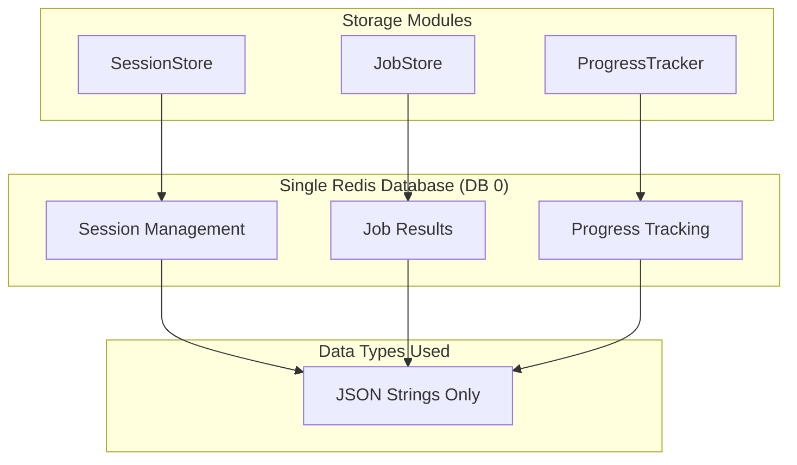

# Redis Usage and Data Structures

## Overview

Redis serves as a simple storage backend for the Image2Model application, providing session management, job result storage, and progress tracking. The implementation follows a pragmatic approach using basic Redis operations with JSON string storage and TTL-based cleanup.

## Redis Architecture



## Connection Management

### Simple Redis Configuration

The application uses a straightforward Redis connection pattern without connection pooling or management layers:

```python
import redis
import os

def get_redis_client():
    """Get Redis client with basic configuration"""
    redis_url = os.getenv('REDIS_URL', 'redis://localhost:6379/0')
    return redis.from_url(redis_url, decode_responses=True)
```

Each module creates its own Redis client as needed. No connection pooling, Redis Sentinel, or high availability features are implemented.

## Key Naming Patterns

The application uses simple key prefixes for organization:

- `job_owner:{job_id}` - Session ownership tracking
- `batch_owner:{batch_id}` - Batch ownership tracking  
- `job_result:{job_id}` - FAL.AI job results
- `job_metadata:{job_id}` - Job metadata
- `progress:{job_id}` - File processing progress

## Storage Modules

### 1. SessionStore - Job Ownership Tracking

```python
import redis
import json
from typing import Optional

class SessionStore:
    """Track job ownership using API keys"""
    
    def __init__(self):
        self.redis_client = redis.from_url(
            os.getenv('REDIS_URL', 'redis://localhost:6379/0'),
            decode_responses=True
        )
        self.ttl = 86400  # 24 hours
    
    def set_job_owner(self, job_id: str, api_key: str) -> None:
        """Associate job with API key"""
        key = f"job_owner:{job_id}"
        self.redis_client.setex(key, self.ttl, api_key)
    
    def get_job_owner(self, job_id: str) -> Optional[str]:
        """Get API key that owns this job"""
        key = f"job_owner:{job_id}"
        return self.redis_client.get(key)
    
    def set_batch_owner(self, batch_id: str, api_key: str) -> None:
        """Associate batch with API key"""
        key = f"batch_owner:{batch_id}"
        self.redis_client.setex(key, self.ttl, api_key)
    
    def get_batch_owner(self, batch_id: str) -> Optional[str]:
        """Get API key that owns this batch"""
        key = f"batch_owner:{batch_id}"
        return self.redis_client.get(key)
```

### 2. JobStore - Result Storage

```python
import redis
import json
from typing import Optional, Dict, Any

class JobStore:
    """Store FAL.AI job results"""
    
    def __init__(self):
        self.redis_client = redis.from_url(
            os.getenv('REDIS_URL', 'redis://localhost:6379/0'),
            decode_responses=True
        )
        self.ttl = 86400  # 24 hours
    
    def store_job_result(self, job_id: str, result: Dict[str, Any]) -> None:
        """Store job result as JSON string"""
        key = f"job_result:{job_id}"
        self.redis_client.setex(key, self.ttl, json.dumps(result))
    
    def get_job_result(self, job_id: str) -> Optional[Dict[str, Any]]:
        """Retrieve job result"""
        key = f"job_result:{job_id}"
        result = self.redis_client.get(key)
        return json.loads(result) if result else None
    
    def store_job_metadata(self, job_id: str, metadata: Dict[str, Any]) -> None:
        """Store job metadata"""
        key = f"job_metadata:{job_id}"
        self.redis_client.setex(key, self.ttl, json.dumps(metadata))
    
    def get_job_metadata(self, job_id: str) -> Optional[Dict[str, Any]]:
        """Retrieve job metadata"""
        key = f"job_metadata:{job_id}"
        metadata = self.redis_client.get(key)
        return json.loads(metadata) if metadata else None
    
    def delete_job_data(self, job_id: str) -> None:
        """Delete all job-related data"""
        keys = [
            f"job_result:{job_id}",
            f"job_metadata:{job_id}"
        ]
        self.redis_client.delete(*keys)
```

### 3. ProgressTracker - File Processing Progress

```python
import redis
import json
from typing import Optional, Dict, Any

class ProgressTracker:
    """Track file processing progress for batch operations"""
    
    def __init__(self):
        self.redis_client = redis.from_url(
            os.getenv('REDIS_URL', 'redis://localhost:6379/0'),
            decode_responses=True
        )
        self.ttl = 3600  # 1 hour
    
    def initialize_progress(self, job_id: str, total_files: int) -> None:
        """Initialize progress tracking for a job"""
        progress_data = {
            'total_files': total_files,
            'processed_files': 0,
            'failed_files': 0,
            'status': 'processing',
            'created_at': datetime.utcnow().isoformat()
        }
        
        key = f"progress:{job_id}"
        self.redis_client.setex(key, self.ttl, json.dumps(progress_data))
    
    def update_progress(
        self, 
        job_id: str, 
        processed_files: int, 
        failed_files: int = 0,
        status: str = 'processing'
    ) -> None:
        """Update progress for a job"""
        key = f"progress:{job_id}"
        existing = self.redis_client.get(key)
        
        if existing:
            progress_data = json.loads(existing)
            progress_data.update({
                'processed_files': processed_files,
                'failed_files': failed_files,
                'status': status,
                'updated_at': datetime.utcnow().isoformat()
            })
            
            self.redis_client.setex(key, self.ttl, json.dumps(progress_data))
    
    def get_progress(self, job_id: str) -> Optional[Dict[str, Any]]:
        """Get current progress for a job"""
        key = f"progress:{job_id}"
        result = self.redis_client.get(key)
        return json.loads(result) if result else None
    
    def delete_progress(self, job_id: str) -> None:
        """Delete progress data"""
        key = f"progress:{job_id}"
        self.redis_client.delete(key)
```

## Redis Operations Used

The implementation uses only basic Redis operations:

- `GET` - Retrieve values
- `SET` - Store values  
- `SETEX` - Store values with TTL
- `DELETE` - Remove keys
- `TTL` - Check key expiration

## Data Storage Pattern

All data is stored as **JSON strings** with the following pattern:

```python
# Example: Store job result
data = {
    'job_id': 'abc123',
    'status': 'completed',
    'result': {...},
    'timestamp': '2023-12-01T10:00:00Z'
}

redis_client.setex(f"job_result:{job_id}", 86400, json.dumps(data))
```

## TTL Management

All keys use Time To Live (TTL) for automatic cleanup:

- **SessionStore**: 24 hours (86400 seconds)
- **JobStore**: 24 hours (86400 seconds)  
- **ProgressTracker**: 1 hour (3600 seconds)

This eliminates the need for manual cleanup tasks.

## Integration Points

### Celery Task Queue
Celery uses Redis for task queue management (separate from application data):
- Celery manages its own Redis keys
- No custom integration with application modules

### Rate Limiting  
Rate limiting is handled by SlowAPI middleware, not Redis-based rate limiting.

## Architecture Decisions

### Why Simple Implementation?

1. **Appropriate Scale**: Current application needs don't require advanced Redis features
2. **Maintainability**: Simple code is easier to understand and debug
3. **Reliability**: Fewer components mean fewer potential failure points
4. **Performance**: Basic operations are sufficient for current load

### Trade-offs Made

**Simplified Approach:**
- ✅ Easy to understand and maintain
- ✅ Fast to implement and debug
- ✅ Appropriate for current scale
- ❌ Limited advanced features
- ❌ Manual scaling if needs grow

**Enterprise Approach (Not Implemented):**
- ❌ Complex to maintain
- ❌ Over-engineered for current needs
- ❌ Higher development time
- ✅ Advanced features available
- ✅ Better for large scale

## Best Practices Followed

### 1. TTL on All Keys
Every key has an expiration time to prevent memory leaks and ensure automatic cleanup.

### 2. JSON String Storage
Consistent serialization format makes debugging and data inspection easier.

### 3. Simple Key Patterns
Predictable key naming makes data location and management straightforward.

### 4. Single Database
Avoids complexity of multiple database management while meeting current needs.

### 5. Error Handling
Basic error handling for Redis connection failures and data parsing errors.

## Future Considerations

If the application grows and requires advanced features:

1. **Connection Pooling**: For higher concurrency
2. **Multiple Databases**: For better data organization
3. **Pub/Sub**: For real-time progress updates
4. **Lua Scripts**: For atomic complex operations
5. **Redis Streams**: For event logging
6. **Distributed Locking**: For concurrent job processing

Currently, these features are not needed and would add unnecessary complexity.