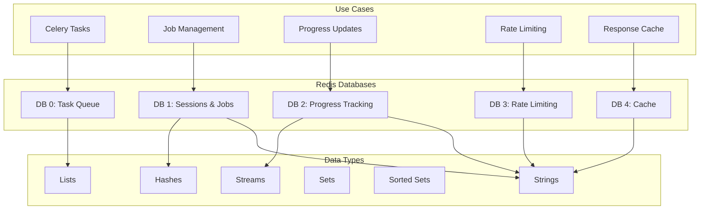

# Redis Usage and Data Structures

## Overview

Redis serves as the central data store for the Image2Model backend, handling session management, job tracking, task queuing, progress updates, and caching. This document details the Redis patterns and data structures used throughout the system.

## Redis Architecture



## Connection Management

### Redis Client Configuration

```python
import redis
from redis import ConnectionPool, Redis
from redis.sentinel import Sentinel
from typing import Optional
import ssl

class RedisManager:
    """Manage Redis connections with pooling and failover"""
    
    def __init__(self, settings):
        self.settings = settings
        self.pools = {}
        self._setup_pools()
    
    def _setup_pools(self):
        """Setup connection pools for each database"""
        
        # Common pool configuration
        pool_config = {
            'host': self.settings.REDIS_HOST,
            'port': self.settings.REDIS_PORT,
            'password': self.settings.REDIS_PASSWORD,
            'socket_keepalive': True,
            'socket_keepalive_options': {
                1: 1,   # TCP_KEEPIDLE
                2: 60,  # TCP_KEEPINTVL
                3: 3,   # TCP_KEEPCNT
            },
            'health_check_interval': 30,
            'max_connections': 50,
            'retry_on_timeout': True,
            'socket_connect_timeout': 5,
            'socket_timeout': 5,
        }
        
        # Create pools for each database
        for db_num in range(5):
            self.pools[db_num] = ConnectionPool(
                db=db_num,
                **pool_config
            )
    
    def get_client(self, db: int = 0) -> Redis:
        """Get Redis client for specific database"""
        return Redis(connection_pool=self.pools[db])
    
    def get_celery_client(self) -> Redis:
        """Get client for Celery (DB 0)"""
        return self.get_client(0)
    
    def get_job_client(self) -> Redis:
        """Get client for jobs and sessions (DB 1)"""
        return self.get_client(1)
    
    def get_progress_client(self) -> Redis:
        """Get client for progress tracking (DB 2)"""
        return self.get_client(2)
    
    def get_rate_limit_client(self) -> Redis:
        """Get client for rate limiting (DB 3)"""
        return self.get_client(3)
    
    def get_cache_client(self) -> Redis:
        """Get client for caching (DB 4)"""
        return self.get_client(4)

# Singleton instance
redis_manager = RedisManager(settings)
```

### High Availability Setup

```python
class RedisSentinelManager:
    """Redis Sentinel for high availability"""
    
    def __init__(self, sentinels: list, service_name: str = 'mymaster'):
        self.sentinel = Sentinel(
            sentinels,
            socket_timeout=0.5,
            socket_connect_timeout=0.5
        )
        self.service_name = service_name
    
    def get_master_client(self, db: int = 0) -> Redis:
        """Get master Redis client"""
        return self.sentinel.master_for(
            self.service_name,
            socket_timeout=0.5,
            db=db,
            decode_responses=True
        )
    
    def get_slave_client(self, db: int = 0) -> Redis:
        """Get slave Redis client for read operations"""
        return self.sentinel.slave_for(
            self.service_name,
            socket_timeout=0.5,
            db=db,
            decode_responses=True
        )
```

## Key Naming Conventions

### Key Structure

```python
class RedisKeys:
    """Centralized key management"""
    
    # Job keys
    JOB_DATA = "job:{job_id}"                          # Hash: job metadata
    JOB_STATUS = "job:{job_id}:status"                 # String: job status
    JOB_FILES = "job:{job_id}:files"                   # List: file IDs
    JOB_RESULT = "job:{job_id}:file:{file_id}"         # String: file result
    
    # Session keys
    SESSION_OWNER = "session:{job_id}"                 # String: API key hash
    USER_JOBS = "user_jobs:{api_key_hash}"            # Set: job IDs
    
    # Progress keys
    PROGRESS_FILE = "progress:{job_id}:{file_id}"      # String: progress %
    PROGRESS_STREAM = "stream:progress:{job_id}"       # Stream: progress events
    
    # Rate limiting keys
    RATE_LIMIT_KEY = "rl:key:{api_key_hash}"          # String: request count
    RATE_LIMIT_IP = "rl:ip:{ip_address}"              # String: request count
    
    # Cache keys
    CACHE_MODEL = "cache:model:{model_id}"             # String: model data
    CACHE_STATUS = "cache:status:{job_id}"             # String: status response
    
    # Lock keys
    LOCK_JOB = "lock:job:{job_id}"                    # String: distributed lock
    LOCK_FILE = "lock:file:{file_id}"                 # String: processing lock
    
    # Metrics keys
    METRIC_COUNTER = "metric:{metric_name}:count"      # String: counter
    METRIC_GAUGE = "metric:{metric_name}:value"        # String: gauge value
    
    @staticmethod
    def format_key(template: str, **kwargs) -> str:
        """Format key with parameters"""
        return template.format(**kwargs)
```

## Data Structures

### Job Management

```python
class JobStore:
    """Store and retrieve job data"""
    
    def __init__(self, redis_client: Redis):
        self.redis = redis_client
        self.ttl = 86400  # 24 hours
    
    async def create_job(self, job_id: str, api_key: str, files: List[Dict]) -> None:
        """Create new job with metadata"""
        
        job_data = {
            'job_id': job_id,
            'api_key_hash': hashlib.sha256(api_key.encode()).hexdigest(),
            'status': 'pending',
            'total_files': len(files),
            'completed_files': 0,
            'failed_files': 0,
            'created_at': datetime.utcnow().isoformat(),
            'updated_at': datetime.utcnow().isoformat()
        }
        
        # Use pipeline for atomic operations
        pipe = self.redis.pipeline()
        
        # Store job data as hash
        job_key = RedisKeys.format_key(RedisKeys.JOB_DATA, job_id=job_id)
        pipe.hset(job_key, mapping=job_data)
        pipe.expire(job_key, self.ttl)
        
        # Store file list
        files_key = RedisKeys.format_key(RedisKeys.JOB_FILES, job_id=job_id)
        for file in files:
            pipe.rpush(files_key, json.dumps(file))
        pipe.expire(files_key, self.ttl)
        
        # Create session
        session_key = RedisKeys.format_key(RedisKeys.SESSION_OWNER, job_id=job_id)
        pipe.setex(session_key, self.ttl, job_data['api_key_hash'])
        
        # Add to user's job list
        user_jobs_key = RedisKeys.format_key(
            RedisKeys.USER_JOBS, 
            api_key_hash=job_data['api_key_hash']
        )
        pipe.sadd(user_jobs_key, job_id)
        pipe.expire(user_jobs_key, self.ttl)
        
        # Execute pipeline
        await pipe.execute()
    
    async def get_job(self, job_id: str) -> Optional[Dict]:
        """Retrieve job data"""
        
        job_key = RedisKeys.format_key(RedisKeys.JOB_DATA, job_id=job_id)
        job_data = await self.redis.hgetall(job_key)
        
        if not job_data:
            return None
        
        # Get file list
        files_key = RedisKeys.format_key(RedisKeys.JOB_FILES, job_id=job_id)
        files = await self.redis.lrange(files_key, 0, -1)
        
        job_data['files'] = [json.loads(f) for f in files]
        
        return job_data
    
    async def update_job_status(
        self,
        job_id: str,
        status: str,
        increment_completed: bool = False,
        increment_failed: bool = False
    ) -> None:
        """Update job status atomically"""
        
        job_key = RedisKeys.format_key(RedisKeys.JOB_DATA, job_id=job_id)
        
        pipe = self.redis.pipeline()
        pipe.hset(job_key, 'status', status)
        pipe.hset(job_key, 'updated_at', datetime.utcnow().isoformat())
        
        if increment_completed:
            pipe.hincrby(job_key, 'completed_files', 1)
        
        if increment_failed:
            pipe.hincrby(job_key, 'failed_files', 1)
        
        await pipe.execute()
```

### Progress Tracking

```python
class ProgressTracker:
    """Track progress for batch operations"""
    
    def __init__(self, redis_client: Redis):
        self.redis = redis_client
    
    async def initialize_batch(self, job_id: str, file_count: int) -> None:
        """Initialize progress tracking for batch"""
        
        # Create progress entries for each file
        pipe = self.redis.pipeline()
        
        for i in range(file_count):
            progress_key = RedisKeys.format_key(
                RedisKeys.PROGRESS_FILE,
                job_id=job_id,
                file_id=f"file_{i:03d}"
            )
            pipe.setex(progress_key, 86400, "0")
        
        await pipe.execute()
    
    async def update_progress(
        self,
        job_id: str,
        file_id: str,
        progress: int,
        message: Optional[str] = None
    ) -> None:
        """Update progress for a file"""
        
        # Update progress percentage
        progress_key = RedisKeys.format_key(
            RedisKeys.PROGRESS_FILE,
            job_id=job_id,
            file_id=file_id
        )
        await self.redis.set(progress_key, str(progress))
        
        # Add to progress stream
        stream_key = RedisKeys.format_key(
            RedisKeys.PROGRESS_STREAM,
            job_id=job_id
        )
        
        event_data = {
            'file_id': file_id,
            'progress': progress,
            'timestamp': datetime.utcnow().isoformat()
        }
        
        if message:
            event_data['message'] = message
        
        # Add to stream with automatic ID
        await self.redis.xadd(
            stream_key,
            event_data,
            maxlen=1000  # Keep last 1000 events
        )
    
    async def get_batch_progress(self, job_id: str) -> Dict[str, int]:
        """Get progress for all files in batch"""
        
        # Use pattern matching to get all progress keys
        pattern = f"progress:{job_id}:*"
        
        progress = {}
        cursor = 0
        
        while True:
            cursor, keys = await self.redis.scan(
                cursor,
                match=pattern,
                count=100
            )
            
            if keys:
                # Get values for all keys
                values = await self.redis.mget(keys)
                
                for key, value in zip(keys, values):
                    file_id = key.split(':')[-1]
                    progress[file_id] = int(value or 0)
            
            if cursor == 0:
                break
        
        return progress
    
    async def stream_progress(
        self,
        job_id: str,
        last_id: str = '$'
    ) -> List[Dict]:
        """Stream progress events"""
        
        stream_key = RedisKeys.format_key(
            RedisKeys.PROGRESS_STREAM,
            job_id=job_id
        )
        
        # Read from stream
        events = await self.redis.xread(
            {stream_key: last_id},
            count=100,
            block=5000  # Block for 5 seconds
        )
        
        results = []
        for stream_name, messages in events:
            for message_id, data in messages:
                results.append({
                    'id': message_id,
                    'data': data
                })
        
        return results
```

### Rate Limiting

```python
class RateLimiter:
    """Redis-based rate limiting"""
    
    def __init__(self, redis_client: Redis):
        self.redis = redis_client
    
    async def check_rate_limit(
        self,
        key: str,
        limit: int,
        window: int
    ) -> Tuple[bool, Dict[str, int]]:
        """Check if request should be rate limited"""
        
        # Use Lua script for atomic operation
        lua_script = """
        local key = KEYS[1]
        local limit = tonumber(ARGV[1])
        local window = tonumber(ARGV[2])
        local current_time = tonumber(ARGV[3])
        
        -- Get current count
        local current = redis.call('GET', key)
        current = tonumber(current) or 0
        
        -- Check if we should reset
        local ttl = redis.call('TTL', key)
        
        if ttl == -2 or ttl == -1 then
            -- Key doesn't exist or no expiry
            current = 0
        end
        
        -- Increment counter
        current = current + 1
        
        -- Check limit
        if current > limit then
            return {0, current, ttl}  -- Denied
        end
        
        -- Update counter
        if current == 1 then
            -- First request in window
            redis.call('SET', key, current)
            redis.call('EXPIRE', key, window)
            ttl = window
        else
            -- Increment existing
            redis.call('SET', key, current)
        end
        
        return {1, current, ttl}  -- Allowed
        """
        
        # Execute script
        result = await self.redis.eval(
            lua_script,
            1,  # Number of keys
            key,  # KEYS[1]
            limit,  # ARGV[1]
            window,  # ARGV[2]
            int(time.time())  # ARGV[3]
        )
        
        allowed = bool(result[0])
        current = result[1]
        ttl = result[2] if result[2] > 0 else window
        
        info = {
            'limit': limit,
            'remaining': max(0, limit - current),
            'reset': int(time.time()) + ttl
        }
        
        return allowed, info
    
    async def get_rate_limit_status(self, key: str, limit: int) -> Dict[str, int]:
        """Get current rate limit status without incrementing"""
        
        current = await self.redis.get(key)
        ttl = await self.redis.ttl(key)
        
        current = int(current or 0)
        ttl = ttl if ttl > 0 else 0
        
        return {
            'limit': limit,
            'current': current,
            'remaining': max(0, limit - current),
            'reset': int(time.time()) + ttl if ttl > 0 else 0
        }
```

### Distributed Locking

```python
import uuid
from contextlib import asynccontextmanager

class RedisLock:
    """Distributed locking using Redis"""
    
    def __init__(self, redis_client: Redis):
        self.redis = redis_client
    
    @asynccontextmanager
    async def acquire_lock(
        self,
        resource: str,
        timeout: int = 10,
        blocking: bool = True,
        blocking_timeout: int = 30
    ):
        """Acquire distributed lock"""
        
        lock_key = f"lock:{resource}"
        identifier = str(uuid.uuid4())
        
        acquired = False
        start_time = time.time()
        
        while True:
            # Try to acquire lock
            acquired = await self.redis.set(
                lock_key,
                identifier,
                nx=True,  # Only set if not exists
                ex=timeout  # Expiration time
            )
            
            if acquired:
                break
            
            if not blocking:
                raise LockAcquisitionError(f"Could not acquire lock for {resource}")
            
            # Check timeout
            if time.time() - start_time > blocking_timeout:
                raise LockAcquisitionError(f"Timeout acquiring lock for {resource}")
            
            # Wait before retry
            await asyncio.sleep(0.1)
        
        try:
            yield identifier
        finally:
            # Release lock only if we still own it
            lua_script = """
            if redis.call("get", KEYS[1]) == ARGV[1] then
                return redis.call("del", KEYS[1])
            else
                return 0
            end
            """
            
            await self.redis.eval(
                lua_script,
                1,
                lock_key,
                identifier
            )
    
    async def extend_lock(
        self,
        resource: str,
        identifier: str,
        additional_time: int
    ) -> bool:
        """Extend lock expiration"""
        
        lock_key = f"lock:{resource}"
        
        # Lua script to extend only if we own the lock
        lua_script = """
        if redis.call("get", KEYS[1]) == ARGV[1] then
            return redis.call("expire", KEYS[1], ARGV[2])
        else
            return 0
        end
        """
        
        result = await self.redis.eval(
            lua_script,
            1,
            lock_key,
            identifier,
            additional_time
        )
        
        return bool(result)
```

### Caching

```python
class RedisCache:
    """Redis-based caching with patterns"""
    
    def __init__(self, redis_client: Redis):
        self.redis = redis_client
    
    async def get_or_set(
        self,
        key: str,
        factory: Callable,
        ttl: int = 300,
        refresh_on_hit: bool = False
    ) -> Any:
        """Get from cache or compute and set"""
        
        # Try to get from cache
        cached = await self.redis.get(key)
        
        if cached is not None:
            # Deserialize
            value = json.loads(cached)
            
            # Refresh TTL if requested
            if refresh_on_hit:
                await self.redis.expire(key, ttl)
            
            return value
        
        # Compute value
        value = await factory()
        
        # Cache it
        await self.redis.setex(
            key,
            ttl,
            json.dumps(value)
        )
        
        return value
    
    async def invalidate_pattern(self, pattern: str) -> int:
        """Invalidate all keys matching pattern"""
        
        count = 0
        cursor = 0
        
        while True:
            cursor, keys = await self.redis.scan(
                cursor,
                match=pattern,
                count=100
            )
            
            if keys:
                await self.redis.delete(*keys)
                count += len(keys)
            
            if cursor == 0:
                break
        
        return count
    
    async def cache_with_tags(
        self,
        key: str,
        value: Any,
        ttl: int,
        tags: List[str]
    ) -> None:
        """Cache with tag-based invalidation"""
        
        # Store value
        await self.redis.setex(key, ttl, json.dumps(value))
        
        # Store tags
        for tag in tags:
            tag_key = f"tag:{tag}"
            await self.redis.sadd(tag_key, key)
            await self.redis.expire(tag_key, ttl)
    
    async def invalidate_tag(self, tag: str) -> int:
        """Invalidate all keys with tag"""
        
        tag_key = f"tag:{tag}"
        keys = await self.redis.smembers(tag_key)
        
        if keys:
            await self.redis.delete(*keys)
            await self.redis.delete(tag_key)
            return len(keys)
        
        return 0
```

## Pub/Sub Patterns

### Event Publishing

```python
class EventPublisher:
    """Publish events through Redis pub/sub"""
    
    def __init__(self, redis_client: Redis):
        self.redis = redis_client
    
    async def publish_job_event(
        self,
        job_id: str,
        event_type: str,
        data: Dict
    ) -> None:
        """Publish job-related event"""
        
        channel = f"job:{job_id}:events"
        
        event = {
            'type': event_type,
            'job_id': job_id,
            'timestamp': datetime.utcnow().isoformat(),
            'data': data
        }
        
        await self.redis.publish(
            channel,
            json.dumps(event)
        )
    
    async def publish_progress_event(
        self,
        job_id: str,
        file_id: str,
        progress: int,
        message: Optional[str] = None
    ) -> None:
        """Publish progress update"""
        
        channel = f"progress:{job_id}"
        
        event = {
            'type': 'progress',
            'job_id': job_id,
            'file_id': file_id,
            'progress': progress,
            'timestamp': datetime.utcnow().isoformat()
        }
        
        if message:
            event['message'] = message
        
        await self.redis.publish(
            channel,
            json.dumps(event)
        )

class EventSubscriber:
    """Subscribe to Redis events"""
    
    def __init__(self, redis_client: Redis):
        self.redis = redis_client
        self.pubsub = self.redis.pubsub()
    
    async def subscribe_to_job(
        self,
        job_id: str,
        callback: Callable[[Dict], None]
    ) -> None:
        """Subscribe to job events"""
        
        channel = f"job:{job_id}:events"
        await self.pubsub.subscribe(channel)
        
        try:
            async for message in self.pubsub.listen():
                if message['type'] == 'message':
                    event = json.loads(message['data'])
                    await callback(event)
        finally:
            await self.pubsub.unsubscribe(channel)
```

## Monitoring and Maintenance

### Redis Health Check

```python
class RedisHealthCheck:
    """Monitor Redis health and performance"""
    
    def __init__(self, redis_client: Redis):
        self.redis = redis_client
    
    async def check_health(self) -> Dict:
        """Comprehensive health check"""
        
        health = {
            'status': 'healthy',
            'timestamp': datetime.utcnow().isoformat(),
            'checks': {}
        }
        
        # Ping test
        try:
            start = time.time()
            await self.redis.ping()
            ping_time = (time.time() - start) * 1000
            
            health['checks']['ping'] = {
                'status': 'ok',
                'response_time_ms': ping_time
            }
        except Exception as e:
            health['checks']['ping'] = {
                'status': 'error',
                'error': str(e)
            }
            health['status'] = 'unhealthy'
        
        # Get info
        try:
            info = await self.redis.info()
            
            health['checks']['memory'] = {
                'used_memory_mb': info['used_memory'] / (1024 * 1024),
                'used_memory_peak_mb': info['used_memory_peak'] / (1024 * 1024),
                'used_memory_rss_mb': info['used_memory_rss'] / (1024 * 1024),
                'mem_fragmentation_ratio': info['mem_fragmentation_ratio']
            }
            
            health['checks']['clients'] = {
                'connected_clients': info['connected_clients'],
                'blocked_clients': info['blocked_clients']
            }
            
            health['checks']['persistence'] = {
                'rdb_last_save_time': info.get('rdb_last_save_time'),
                'aof_enabled': info.get('aof_enabled', 0) == 1
            }
            
            health['checks']['replication'] = {
                'role': info['role'],
                'connected_slaves': info.get('connected_slaves', 0)
            }
            
        except Exception as e:
            health['checks']['info'] = {
                'status': 'error',
                'error': str(e)
            }
            health['status'] = 'degraded'
        
        return health
    
    async def get_slow_queries(self, num: int = 10) -> List[Dict]:
        """Get slow query log"""
        
        slow_log = await self.redis.slowlog_get(num)
        
        queries = []
        for entry in slow_log:
            queries.append({
                'id': entry['id'],
                'start_time': entry['start_time'],
                'duration_microseconds': entry['duration'],
                'command': ' '.join(entry['command'][:3]) + '...' if len(entry['command']) > 3 else ' '.join(entry['command'])
            })
        
        return queries
```

### Cleanup Tasks

```python
class RedisCleanup:
    """Clean up expired data"""
    
    def __init__(self, redis_client: Redis):
        self.redis = redis_client
    
    async def cleanup_expired_keys(self) -> Dict[str, int]:
        """Clean up expired keys by pattern"""
        
        patterns = [
            'job:*',
            'session:*',
            'progress:*',
            'cache:*'
        ]
        
        stats = {}
        
        for pattern in patterns:
            count = await self._cleanup_pattern(pattern)
            stats[pattern] = count
        
        return stats
    
    async def _cleanup_pattern(self, pattern: str) -> int:
        """Clean up keys matching pattern"""
        
        count = 0
        cursor = 0
        
        while True:
            cursor, keys = await self.redis.scan(
                cursor,
                match=pattern,
                count=100
            )
            
            for key in keys:
                # Check if key has TTL
                ttl = await self.redis.ttl(key)
                
                if ttl == -1:  # No expiration
                    # Check age from key data
                    data = await self.redis.get(key)
                    if data and self._is_expired(data):
                        await self.redis.delete(key)
                        count += 1
            
            if cursor == 0:
                break
        
        return count
    
    def _is_expired(self, data: str, max_age_hours: int = 48) -> bool:
        """Check if data is expired based on timestamp"""
        
        try:
            parsed = json.loads(data)
            created_at = parsed.get('created_at')
            
            if created_at:
                created = datetime.fromisoformat(created_at)
                age = datetime.utcnow() - created
                return age.total_seconds() > max_age_hours * 3600
        except:
            pass
        
        return False
```

## Best Practices

### 1. Connection Management
- Use connection pooling
- Set appropriate timeouts
- Handle connection failures
- Monitor connection count

### 2. Key Design
- Use consistent naming
- Include TTL for all keys
- Avoid key collisions
- Use namespacing

### 3. Data Expiration
- Set TTL on all keys
- Use EXPIRE for updates
- Monitor memory usage
- Regular cleanup tasks

### 4. Performance
- Use pipelining for bulk operations
- Avoid large values
- Use appropriate data structures
- Monitor slow queries

### 5. High Availability
- Use Redis Sentinel
- Implement retry logic
- Handle failover gracefully
- Regular backups