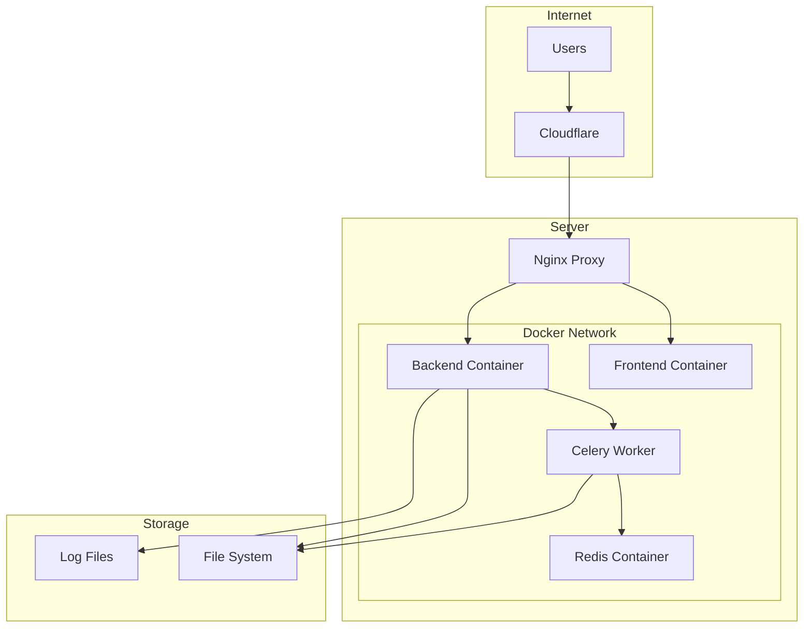

# Deployment Documentation

> **Last Updated**: 2025-01-11  
> **Status**: Planned  
> **Version**: 0.1

Complete guide for deploying the image2model application to production.

## 📋 In This Section

### Docker

- **[Docker Setup](./docker/docker-setup.md)** *(coming soon)* - Container configuration
- **[Compose Files](./docker/compose-files.md)** *(coming soon)* - docker-compose variants
- **[Nginx Config](./docker/nginx-config.md)** *(coming soon)* - Reverse proxy setup

### Infrastructure

- **[Server Requirements](./infrastructure/server-requirements.md)** *(coming soon)* - Hardware and OS specs
- **[SSL Setup](./infrastructure/ssl-setup.md)** *(coming soon)* - HTTPS configuration
- **[Monitoring](./infrastructure/monitoring.md)** *(coming soon)* - Logging and metrics

### CI/CD

- **[Deployment Process](./ci-cd/deployment-process.md)** *(coming soon)* - Deploy scripts
- **[GitHub Actions](./ci-cd/github-actions.md)** *(coming soon)* - Automated pipelines

## 🎯 Quick Overview

### Deployment Stack

- **Containers**: Docker & Docker Compose
- **Proxy**: Nginx reverse proxy
- **Process Manager**: Systemd/Supervisor
- **SSL**: Let's Encrypt with Certbot
- **Monitoring**: Application logs + metrics

### Architecture



## 🚀 Deployment Options

### Option 1: Single Server (Recommended for MVP)

Simple deployment on a single VPS:

```bash
# Clone repository
git clone https://github.com/your-org/image2model
cd image2model

# Configure environment
cp .env.example .env
# Edit .env with production values

# Deploy with Docker Compose
docker-compose -f docker-compose.prod.yml up -d
```

### Option 2: Kubernetes (Future)

For scale and high availability:
- Multiple worker nodes
- Load balancing
- Auto-scaling
- Rolling updates

### Option 3: Serverless (Partial)

Hybrid approach:
- Frontend on Vercel/Netlify
- Backend on traditional server
- Workers on cloud functions

## 📊 Server Requirements

### Minimum Specifications

| Component | Minimum | Recommended |
|-----------|---------|-------------|
| CPU | 2 cores | 4+ cores |
| RAM | 4 GB | 8+ GB |
| Storage | 50 GB SSD | 100+ GB SSD |
| Network | 100 Mbps | 1 Gbps |
| OS | Ubuntu 22.04 | Ubuntu 22.04 |

### Software Requirements

- Docker 24.0+
- Docker Compose 2.20+
- Nginx 1.24+
- Python 3.11+
- Node.js 18+
- Redis 7.0+

## 🔧 Configuration

### Environment Variables

```bash
# Production .env
NODE_ENV=production
API_KEY=your-secure-api-key
FAL_AI_KEY=your-fal-api-key
REDIS_URL=redis://redis:6379
FRONTEND_URL=https://yourdomain.com
BACKEND_URL=https://api.yourdomain.com
```

### Docker Compose Production

```yaml
version: '3.8'

services:
  frontend:
    build: ./frontend-svelte
    environment:
      - NODE_ENV=production
    restart: unless-stopped
    
  backend:
    build: ./backend
    environment:
      - API_KEY=${API_KEY}
    restart: unless-stopped
    
  worker:
    build: ./backend
    command: celery worker
    restart: unless-stopped
    
  redis:
    image: redis:7-alpine
    restart: unless-stopped
```

## 🔐 Security Considerations

### SSL/TLS

- Use Let's Encrypt for free SSL certificates
- Configure automatic renewal
- Enforce HTTPS redirect
- Enable HSTS headers

### Firewall Rules

```bash
# Allow SSH
ufw allow 22/tcp

# Allow HTTP/HTTPS
ufw allow 80/tcp
ufw allow 443/tcp

# Enable firewall
ufw enable
```

### API Security

- Rotate API keys regularly
- Use environment variables
- Implement rate limiting
- Monitor for abuse

## 📡 Monitoring

### Application Logs

- Frontend logs: `/var/log/image2model/frontend/`
- Backend logs: `/var/log/image2model/backend/`
- Worker logs: `/var/log/image2model/worker/`

### Health Checks

```bash
# Frontend health
curl https://yourdomain.com/health

# Backend health
curl https://api.yourdomain.com/health

# Worker health
celery -A app.core.celery_app inspect ping
```

### Metrics to Monitor

- Request rate and latency
- Error rates
- Queue length
- Disk usage
- Memory usage
- CPU usage

## 🔄 Deployment Process

### 1. Pre-deployment Checklist

- [ ] All tests passing
- [ ] Environment variables set
- [ ] Backup existing data
- [ ] DNS configured
- [ ] SSL certificates ready

### 2. Deployment Steps

```bash
# 1. Pull latest code
git pull origin main

# 2. Build containers
docker-compose -f docker-compose.prod.yml build

# 3. Run migrations (if any)
docker-compose -f docker-compose.prod.yml run backend python manage.py migrate

# 4. Deploy
docker-compose -f docker-compose.prod.yml up -d

# 5. Verify
docker-compose -f docker-compose.prod.yml ps
```

### 3. Post-deployment

- Verify all services running
- Test critical user flows
- Monitor error logs
- Check performance metrics

## 🔥 Rollback Procedure

If issues arise:

```bash
# 1. Stop current deployment
docker-compose -f docker-compose.prod.yml down

# 2. Checkout previous version
git checkout <previous-tag>

# 3. Rebuild and deploy
docker-compose -f docker-compose.prod.yml up -d --build
```

## 📝 Maintenance

### Regular Tasks

- **Daily**: Check logs for errors
- **Weekly**: Review metrics and performance
- **Monthly**: Update dependencies
- **Quarterly**: Security audit

### Backup Strategy

```bash
# Backup uploads and results
tar -czf backup-$(date +%Y%m%d).tar.gz uploads/ results/

# Backup Redis data
redis-cli --rdb /backup/dump.rdb

# Store backups offsite
aws s3 cp backup-*.tar.gz s3://your-backup-bucket/
```

## 🔗 Resources

### Scripts

- [Deploy Script](../../deployment/deploy-mvp.sh)
- [SSL Setup](../../deployment/SSL-SETUP.md)
- [CI/CD Pipeline](../../deployment/cicd-deploy.sh)

### External Resources

- [Docker Documentation](https://docs.docker.com/)
- [Nginx Documentation](https://nginx.org/en/docs/)
- [Let's Encrypt](https://letsencrypt.org/)

## 🐛 Troubleshooting

### Common Issues

- **502 Bad Gateway**: Check backend container status
- **SSL errors**: Verify certificate configuration
- **High memory usage**: Review worker concurrency
- **Disk full**: Clean up old files and logs

### Debug Commands

```bash
# Check container logs
docker-compose logs -f backend

# Enter container shell
docker-compose exec backend bash

# Monitor resource usage
docker stats

# Check disk space
df -h
```

---

**Next Steps**: Start with [Server Requirements](./infrastructure/server-requirements.md) or review [Docker Setup](./docker/docker-setup.md).

*This documentation is planned for development. Check back for updates!*