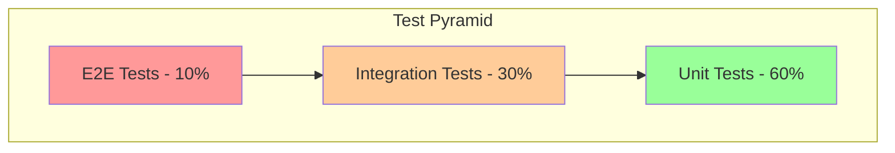

# Testing Documentation

> **Last Updated**: 2025-01-11  
> **Status**: Planned  
> **Version**: 0.1

Comprehensive testing guide for the image2model application.

## 📋 In This Section

### Frontend Testing

- **[Unit Tests](./frontend-testing/unit-tests.md)** *(coming soon)* - Component testing with Vitest
- **[E2E Tests](./frontend-testing/e2e-tests.md)** *(coming soon)* - End-to-end with Playwright
- **[Visual Testing](./frontend-testing/visual-testing.md)** *(coming soon)* - Component screenshots

### Backend Testing

- **[API Tests](./backend-testing/api-tests.md)** *(coming soon)* - Endpoint testing
- **[Integration Tests](./backend-testing/integration-tests.md)** *(coming soon)* - Service integration
- **[Load Tests](./backend-testing/load-tests.md)** *(coming soon)* - Performance testing

### Test Data

- **[Fixtures](./test-data/fixtures.md)** *(coming soon)* - Test data management
- **[Mocking](./test-data/mocking.md)** *(coming soon)* - Mock strategies

## 🎯 Testing Philosophy

### Core Principles

1. **Test Pyramid**: More unit tests, fewer E2E tests
2. **Fast Feedback**: Quick test execution
3. **Reliable Tests**: No flaky tests
4. **Maintainable**: Easy to update
5. **Comprehensive**: Cover critical paths

### Testing Strategy



## 🚀 Quick Start

### Frontend Testing

```bash
# Navigate to frontend
cd frontend-svelte

# Run unit tests
npm test

# Run unit tests in watch mode
npm run test:watch

# Run E2E tests
npm run test:e2e

# Run E2E tests with UI
npm run test:e2e:ui
```

### Backend Testing

```bash
# Navigate to backend
cd backend

# Run all tests
pytest

# Run with coverage
pytest --cov=app

# Run specific test file
pytest tests/unit/test_api.py

# Run integration tests only
pytest tests/integration/
```

## 📊 Test Coverage

### Current Coverage Goals

| Component | Target | Current |
|-----------|--------|---------|
| Frontend Components | 80% | - |
| Frontend Services | 90% | - |
| Backend API | 90% | - |
| Backend Services | 85% | - |
| E2E Critical Paths | 100% | - |

### Coverage Reports

- Frontend: `coverage/index.html`
- Backend: `htmlcov/index.html`

## 🧪 Testing Tools

### Frontend Stack

- **Unit Testing**: Vitest
- **Component Testing**: Testing Library
- **E2E Testing**: Playwright
- **Coverage**: c8
- **Mocking**: MSW (Mock Service Worker)

### Backend Stack

- **Unit Testing**: pytest
- **API Testing**: FastAPI TestClient
- **Mocking**: unittest.mock
- **Coverage**: pytest-cov
- **Load Testing**: Locust

## 🔧 Test Structure

### Frontend Tests

```
tests/
├── unit/
│   ├── components/     # Component tests
│   ├── services/       # Service tests
│   └── stores/         # Store tests
├── e2e/
│   ├── workflows/      # User flows
│   └── pages/          # Page objects
└── fixtures/
    ├── images/         # Test images
    └── data/           # Mock data
```

### Backend Tests

```
tests/
├── unit/
│   ├── api/           # Endpoint tests
│   ├── services/      # Service tests
│   └── workers/       # Task tests
├── integration/
│   ├── workflows/     # Full flows
│   └── external/      # External APIs
├── load/
│   └── scenarios/     # Load scenarios
└── fixtures/
    └── data.py        # Test data
```

## 🎯 What to Test

### Frontend Components

```javascript
// Component behavior
test('Button emits click event', async () => {
  const { getByRole } = render(Button, {
    props: { label: 'Click me' }
  });
  
  const button = getByRole('button');
  await fireEvent.click(button);
  
  expect(mockHandler).toHaveBeenCalled();
});

// Component rendering
test('Button renders with correct variant', () => {
  const { container } = render(Button, {
    props: { variant: 'primary' }
  });
  
  expect(container.querySelector('.btn-primary')).toBeTruthy();
});
```

### Backend APIs

```python
# Endpoint behavior
def test_upload_endpoint(client, test_image):
    response = client.post(
        "/api/v1/upload/",
        files={"files": test_image}
    )
    assert response.status_code == 200
    assert "task_id" in response.json()

# Error handling
def test_upload_invalid_file(client):
    response = client.post(
        "/api/v1/upload/",
        files={"files": ("test.txt", b"text", "text/plain")}
    )
    assert response.status_code == 400
```

## 🔄 E2E Test Scenarios

### Critical User Flows

1. **Upload Flow**
   - Select images
   - Configure options
   - Submit upload
   - Verify redirect

2. **Processing Flow**
   - Monitor progress
   - Handle errors
   - Complete successfully

3. **Download Flow**
   - View results
   - Download files
   - Verify integrity

### E2E Best Practices

- Use page objects pattern
- Implement retry logic
- Take screenshots on failure
- Run in multiple browsers
- Test mobile viewports

## 🎨 Visual Testing

### Component Screenshots

```javascript
test('Button visual regression', async ({ page }) => {
  await page.goto('/dev/components/buttons');
  await expect(page).toHaveScreenshot('buttons.png');
});
```

### Full Page Screenshots

```javascript
test('Upload page appearance', async ({ page }) => {
  await page.goto('/upload');
  await expect(page).toHaveScreenshot('upload-page.png', {
    fullPage: true
  });
});
```

## 🔍 Debugging Tests

### Frontend Debugging

```javascript
// Add debug output
test('Component state', () => {
  const { debug } = render(Component);
  debug(); // Prints DOM
});

// Playwright debugging
await page.pause(); // Pauses execution
```

### Backend Debugging

```python
# Use pytest debugging
def test_with_debugging(client):
    import pdb; pdb.set_trace()
    # Test code here

# Print debug info
def test_with_print(client, capsys):
    print("Debug info")
    # Captured in test output
```

## 📈 Performance Testing

### Load Test Scenarios

```python
# Locust example
class UserBehavior(TaskSet):
    @task
    def upload_images(self):
        self.client.post("/api/v1/upload/", 
                        files=[("files", open("test.jpg", "rb"))])
    
    @task
    def check_status(self):
        self.client.get("/api/v1/status/tasks/123")
```

### Performance Metrics

- Response times
- Throughput (req/sec)
- Error rates
- Resource usage

## 🔗 Test Resources

### Documentation

- [Vitest Guide](https://vitest.dev/guide/)
- [Playwright Docs](https://playwright.dev/docs/intro)
- [Pytest Documentation](https://docs.pytest.org/)

### Internal Guides

- [Writing Good Tests](./best-practices.md)
- [Test Data Management](./test-data/fixtures.md)
- [CI/CD Integration](../04-deployment/ci-cd/)

## 💡 Best Practices

### General Testing

1. **Test behavior, not implementation**
2. **Keep tests focused and small**
3. **Use descriptive test names**
4. **Avoid test interdependencies**
5. **Mock external dependencies**

### Maintenance

- Regular test review
- Update tests with code changes
- Remove obsolete tests
- Refactor test utilities
- Monitor test execution time

## 🐛 Troubleshooting

### Common Issues

- **Flaky tests**: Add waits or retries
- **Slow tests**: Mock heavy operations
- **False positives**: Check assertions
- **Environment issues**: Use fixtures

### Getting Help

- Check test output carefully
- Review similar passing tests
- Use debugging tools
- Ask in development channel

---

**Next Steps**: Start with [Unit Tests](./frontend-testing/unit-tests.md) or explore [E2E Testing](./frontend-testing/e2e-tests.md).

*This documentation is planned for development. Check back for updates!*