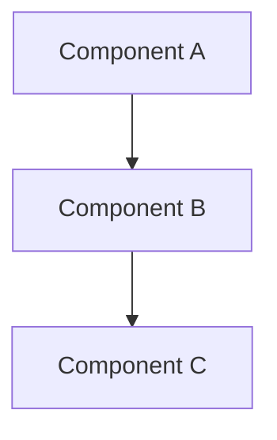
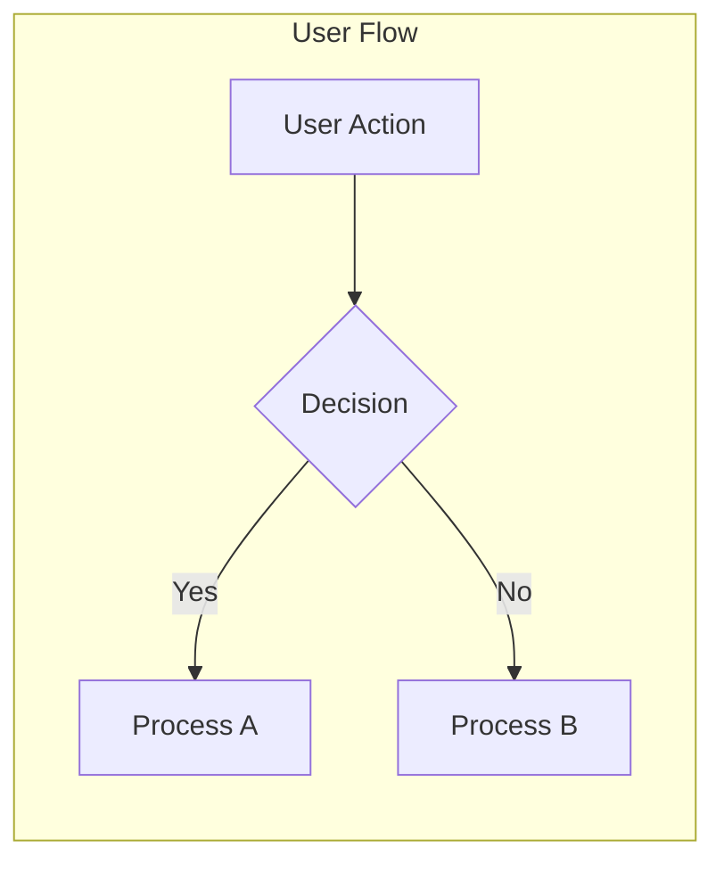
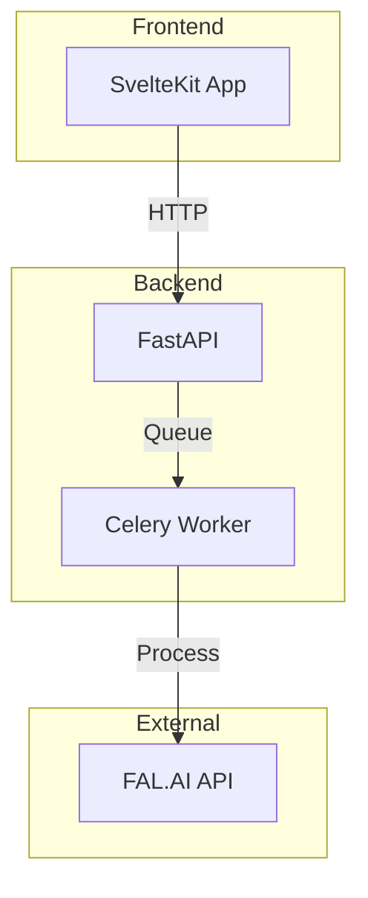

# Documentation Framework Guide

Welcome to the image2model documentation framework. This guide establishes standards and patterns for creating consistent, high-quality documentation across the entire project.

## 📋 Table of Contents

1. [Documentation Philosophy](#documentation-philosophy)
2. [Document Structure Template](#document-structure-template)
3. [Writing Guidelines](#writing-guidelines)
4. [Code Example Standards](#code-example-standards)
5. [Visual Documentation](#visual-documentation)
6. [File Naming Conventions](#file-naming-conventions)
7. [Maintenance Guidelines](#maintenance-guidelines)
8. [Documentation Types](#documentation-types)

## Documentation Philosophy

Our documentation serves multiple audiences:
- **New developers** joining the project
- **AI agents** understanding the codebase
- **DevOps engineers** deploying the application
- **Frontend/backend specialists** working on specific areas

### Core Principles

1. **Clarity Over Brevity**: Be thorough in explanations
2. **Examples First**: Show, don't just tell
3. **Visual When Possible**: Use diagrams and flowcharts
4. **Practical Focus**: Include real-world scenarios
5. **Consistent Structure**: Follow templates religiously

## Document Structure Template

Every documentation file should follow this structure:

```markdown
# [Component/Feature Name]

> **Last Updated**: YYYY-MM-DD  
> **Status**: Draft | Review | Complete  
> **Version**: X.X

## Overview

Brief description (2-3 sentences) explaining:
- What this component/feature does
- Why it exists
- Who should read this document

## Table of Contents

- [Key Concepts](#key-concepts)
- [Architecture](#architecture)
- [Implementation](#implementation)
- [Usage Examples](#usage-examples)
- [API Reference](#api-reference)
- [Best Practices](#best-practices)
- [Troubleshooting](#troubleshooting)
- [Related Documentation](#related-documentation)

## Key Concepts

Define important terms and concepts. Use a definition list:

**Concept Name**: Clear, concise definition that a newcomer would understand.

**Another Concept**: Another clear definition with context.

## Architecture

### System Design

Include visual diagram using Mermaid:



### File Structure

Show the relevant file structure:

```
component-name/
├── index.js
├── styles.css
├── components/
│   ├── SubComponent.js
│   └── AnotherComponent.js
└── utils/
    └── helpers.js
```

## Implementation

### Technical Details

Explain how the component works internally. Break into logical subsections.

### Configuration

Show all configuration options:

| Option | Type | Default | Description |
|--------|------|---------|-------------|
| `option1` | string | `"default"` | What this option does |
| `option2` | number | `100` | Another option explanation |

## Usage Examples

### Basic Usage

```javascript
// File: src/example.js
import { Component } from './components';

// Basic implementation
const example = new Component({
  option1: "value",
  option2: 200
});
```

### Advanced Usage

```javascript
// File: src/advanced-example.js
// Show more complex scenarios
```

## API Reference

### Methods

#### `methodName(param1, param2)`

**Description**: What this method does

**Parameters**:
- `param1` (Type): Description
- `param2` (Type): Optional. Description

**Returns**: Type - What it returns

**Example**:
```javascript
const result = component.methodName("value", 123);
```

## Best Practices

### ✅ DO

- Clear bullet points of recommended practices
- Include rationale for each recommendation

### ❌ DON'T

- Common mistakes to avoid
- Anti-patterns with explanations

## Troubleshooting

### Common Issues

#### Issue: Error message or symptom

**Cause**: Why this happens

**Solution**:
```bash
# Command or code to fix
```

## Related Documentation

- [Related Component](./related-component.md) - How it connects
- [Parent Architecture](../architecture/overview.md) - Broader context
- [API Guide](../api/endpoints.md) - Implementation details
```

## Writing Guidelines

### 1. Language and Tone

- **Professional but Approachable**: Write as if explaining to a smart colleague
- **Active Voice**: "The component processes data" not "Data is processed by the component"
- **Present Tense**: "The API returns" not "The API will return"
- **Second Person**: "You can configure" not "One can configure" or "Users can configure"

### 2. Content Structure

- **Start Broad, Get Specific**: Overview → Architecture → Details → Examples
- **One Concept Per Section**: Don't mix unrelated topics
- **Progressive Disclosure**: Basic usage before advanced scenarios
- **Cross-Reference**: Link to related docs liberally

### 3. Technical Accuracy

- **Test All Code Examples**: Ensure they actually work
- **Version Specificity**: Note version requirements
- **Platform Awareness**: Mention OS-specific details
- **Dependency Clarity**: List all prerequisites

## Code Example Standards

### 1. Formatting Rules

```javascript
// ✅ GOOD: Clear file path and purpose
// File: src/components/Button.svelte
// Purpose: Demonstrates button component usage

import Button from '$lib/components/Button.svelte';

// Clear variable names
const handleClick = () => {
  console.log('Button clicked');
};

// ❌ BAD: No context, poor naming
import B from './B';
const h = () => console.log('x');
```

### 2. Example Categories

#### Minimal Example
Show the absolute minimum code needed:

```javascript
// Simplest possible usage
<Button>Click me</Button>
```

#### Realistic Example
Show common real-world usage:

```javascript
// Common implementation with options
<Button 
  variant="primary"
  size="large"
  onClick={handleSubmit}
  disabled={isLoading}
>
  {isLoading ? 'Submitting...' : 'Submit Form'}
</Button>
```

#### Complete Example
Show all features for reference:

```javascript
// All available props demonstrated
<Button
  variant="primary"
  size="large"
  fullWidth={true}
  icon="arrow-right"
  iconPosition="end"
  onClick={handleClick}
  onFocus={handleFocus}
  className="custom-class"
  disabled={false}
  loading={false}
  type="submit"
  ariaLabel="Submit the form"
>
  Submit
</Button>
```

### 3. Error Examples

Always show both correct and incorrect usage:

```javascript
// ❌ WRONG: Common mistake
const data = await api.getData();  // Missing error handling

// ✅ CORRECT: Proper implementation
try {
  const data = await api.getData();
  // Process data
} catch (error) {
  console.error('Failed to fetch data:', error);
  // Handle error appropriately
}
```

## Visual Documentation

### 1. Diagrams

Use Mermaid for all diagrams:



### 2. Screenshots

When including screenshots:
- Use PNG format
- Annotate with arrows/boxes
- Keep file sizes reasonable
- Store in `docs/assets/images/`
- Use descriptive filenames: `upload-page-error-state.png`

### 3. Architecture Diagrams

For system architecture:



## File Naming Conventions

### 1. Documentation Files

- **Use kebab-case**: `component-name.md`
- **Be descriptive**: `button-component.md` not `button.md`
- **Group related docs**: `api-upload-endpoints.md`, `api-download-endpoints.md`

### 2. Asset Files

- **Images**: `{section}-{component}-{description}.{ext}`
  - Example: `frontend-button-variants.png`
- **Diagrams**: `{section}-{name}-diagram.{ext}`
  - Example: `backend-architecture-diagram.svg`

### 3. Directory Structure

```
docs/
├── 01-getting-started/        # Numbered sections
├── 02-frontend/              # Clear categorization
│   ├── components/           # Logical grouping
│   │   ├── README.md        # Section overview
│   │   └── button.md        # Individual docs
│   └── architecture/
└── assets/                   # Shared resources
    ├── images/
    └── diagrams/
```

## Maintenance Guidelines

### 1. Version Control

Each document should track:

```markdown
> **Last Updated**: 2025-07-11  
> **Status**: Complete  
> **Version**: 1.2  
> **Changelog**:
> - 1.2 (2025-07-11): Added error handling section
> - 1.1 (2025-07-05): Updated API examples
> - 1.0 (2024-07-01): Initial documentation
```

### 2. Review Schedule

- **Quarterly Reviews**: Check accuracy against codebase
- **On Change**: Update docs with code changes
- **Status Tracking**: Mark as "Needs Update" when stale

### 3. Documentation Debt

Track documentation debt in docs:

```markdown
> ⚠️ **Documentation Debt**:
> - Missing examples for advanced usage
> - Needs performance considerations section
> - Screenshots outdated (last updated: 2024-07-01)
```

## Documentation Types

### 1. Conceptual Documentation

**Purpose**: Explain the "why" and "what"

**Structure**:
- Introduction to concepts
- Problem being solved
- Solution approach
- Architecture overview

**Example**: Architecture overviews, design decisions

### 2. Procedural Documentation

**Purpose**: Explain the "how"

**Structure**:
1. Prerequisites
2. Step-by-step instructions
3. Expected outcomes
4. Troubleshooting

**Example**: Setup guides, deployment procedures

### 3. Reference Documentation

**Purpose**: Quick lookup of facts

**Structure**:
- API endpoints
- Configuration options
- Method signatures
- Parameter descriptions

**Example**: API reference, component props

### 4. Tutorial Documentation

**Purpose**: Learning by doing

**Structure**:
1. Learning objectives
2. Prerequisites
3. Guided steps with explanations
4. Exercises
5. Solutions

**Example**: "Build your first 3D model", "Creating custom components"

## Quality Checklist

Before publishing documentation, verify:

- [ ] Follows the standard template
- [ ] All code examples tested and working
- [ ] Includes both good and bad examples
- [ ] Has visual aids where helpful
- [ ] Cross-references related docs
- [ ] Reviewed for spelling/grammar
- [ ] Version and date information current
- [ ] File naming follows conventions
- [ ] Located in correct directory

## Getting Help

If you need assistance with documentation:

1. Check existing docs for examples
2. Review this framework guide
3. Ask in the development channel
4. Submit a PR for review

Remember: Good documentation is an investment that pays dividends in reduced support time and faster onboarding.

---

*This framework is a living document. Suggestions for improvements are welcome via pull requests.*