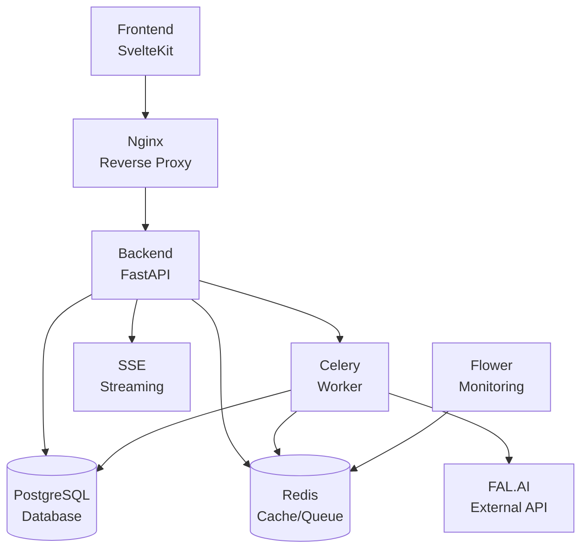

# Image2Model Integration Testing Report

## Executive Summary

This report provides a comprehensive analysis of the integration testing strategy for the Image2Model application. The assessment covers service interactions, deployment testing, environment parity, cross-service data flows, and provides recommendations for improving the integration testing maturity.

### Overall Integration Test Maturity Level: **7/10** (Good)

**Strengths:**
- Comprehensive Docker Compose testing with both development and production configurations
- Good coverage of API endpoint integration tests
- Strong SSE (Server-Sent Events) streaming test coverage
- Well-structured end-to-end workflow tests
- Production deployment validation tests

**Areas for Improvement:**
- Limited contract testing between services
- Absence of chaos engineering tests
- No blue-green deployment testing
- Missing service mesh integration tests
- Limited cross-service transaction testing

## 1. Current Integration Test Landscape

### 1.1 Test Distribution

```
Integration Tests Found:
├── tests/integration/
│   ├── test_api_endpoints.py          # Comprehensive API testing
│   ├── test_authentication.py         # Auth flow integration
│   ├── test_batch_processing_mock.py  # Batch processing with mocks
│   ├── test_docker_deployment.py      # Docker deployment validation
│   ├── test_fal_ai_integration.py    # External API integration
│   ├── test_monitoring.py             # Monitoring integration
│   ├── test_rate_limiting.py          # Rate limiting functionality
│   ├── test_sse_chord_tracking.py    # Chord task SSE streaming
│   ├── test_sse_progress.py           # Progress tracking via SSE
│   ├── test_sse_streaming.py          # SSE streaming tests
│   ├── test_upload_api_integration.py # Upload API integration
│   └── test_upload_workflow.py        # Complete upload workflow
├── tests/e2e/
│   ├── test_complete_workflow.py      # Full user workflow
│   └── test_production_validation.py  # Production environment tests
└── backend/
    ├── test_celery_config.py          # Celery configuration tests
    ├── test_error_handling.py         # Error handling integration
    └── test_tasks.py                  # Task integration tests
```

### 1.2 Docker Compose Testing

**Development Configuration (`docker-compose.yml`):**
- 5 core services: PostgreSQL, Redis, Backend, Worker, Frontend
- 2 additional workers: Model generation worker, Flower monitoring
- Health checks on critical services
- Volume persistence for data

**Production Configuration (`docker-compose.prod.yml`):**
- Enhanced security (no exposed ports except through nginx)
- Resource limits on all services
- SSL/TLS termination at nginx
- Redis authentication enabled
- Production-optimized commands (gunicorn, etc.)

### 1.3 Service Dependencies



## 2. Service Interaction Mapping

### 2.1 Critical Integration Points

1. **Frontend → Backend API**
   - Authentication via API keys
   - File upload handling
   - Progress tracking via SSE
   - Result download

2. **Backend → Database**
   - SQLAlchemy ORM integration
   - Connection pooling
   - Transaction management
   - Migration handling

3. **Backend → Redis/Celery**
   - Task queuing
   - Result storage
   - Progress updates
   - Chord task coordination

4. **Worker → External APIs**
   - FAL.AI integration
   - Retry logic
   - Error handling
   - Progress callbacks

### 2.2 Service Isolation

**Good Practices Found:**
- Services communicate through well-defined APIs
- Database access isolated to backend/workers
- External API calls isolated to workers
- Frontend has no direct database access

**Areas of Concern:**
- Limited circuit breaker patterns
- No service mesh for advanced routing
- Basic retry logic without exponential backoff in some areas

### 2.3 Failure Scenario Handling

**Current Coverage:**
- Database connection failures ✓
- Redis connection failures ✓
- External API failures (partial)
- Worker crashes (partial)
- Network timeouts ✓

**Missing Coverage:**
- Cascading failure scenarios
- Split-brain scenarios
- Network partition handling
- Service degradation testing

## 3. Environment and Deployment Testing

### 3.1 Environment Parity

**Development vs Production Differences:**
| Component | Development | Production |
|-----------|------------|------------|
| Web Server | Uvicorn (reload) | Gunicorn + Uvicorn workers |
| Database | PostgreSQL (exposed port) | PostgreSQL (internal only) |
| Redis | No auth | Password protected |
| SSL/TLS | None | Nginx termination |
| Monitoring | Flower (open) | Flower (auth required) |
| Logging | Debug level | Info level |
| Resource Limits | None | CPU/Memory limits |

### 3.2 Deployment Script Analysis

**CI/CD Deployment (`cicd-deploy.sh`):**
- Environment detection (GitHub Actions, GitLab CI, etc.)
- Docker image building with commit tags
- Test execution before deployment
- Health check validation
- Slack notifications
- Cloudflare Access configuration

**Strengths:**
- Comprehensive error handling
- Rollback capabilities
- Post-deployment validation
- Environment variable validation

**Weaknesses:**
- No canary deployment
- No traffic shifting
- Basic health checks only
- No performance benchmarking

### 3.3 Configuration Management

**Current State:**
- Environment variables for configuration
- `.env` files for local development
- Secrets injected via CI/CD
- Docker Compose variable substitution

**Recommendations:**
- Implement configuration validation tests
- Add configuration drift detection
- Use secrets management service
- Implement configuration versioning

## 4. Cross-Service Data Flow

### 4.1 Upload → Process → Download Flow

```
1. User uploads images → Frontend
2. Frontend → Backend API (multipart upload)
3. Backend → Database (job creation)
4. Backend → Celery (task queuing)
5. Worker → FAL.AI (processing)
6. Worker → Database (result storage)
7. Backend → Frontend (SSE updates)
8. User downloads results → Frontend
```

**Test Coverage:**
- Full flow tested in `test_complete_workflow.py` ✓
- Mocked external dependencies ✓
- Real file handling ✓
- Progress tracking ✓

### 4.2 Batch Processing Flow

**Current Implementation:**
- Chord pattern for parallel processing
- Progress aggregation
- Result collection
- Error handling per file

**Test Coverage:**
- Batch upload tests ✓
- Chord task monitoring ✓
- Partial failure handling (limited)
- Progress aggregation ✓

### 4.3 Data Consistency

**Current State:**
- Database transactions for atomic operations
- Redis for temporary state
- File system for persistent storage
- No distributed transactions

**Risks:**
- Orphaned files on failure
- Inconsistent state between services
- No saga pattern implementation
- Limited compensating transactions

### 4.4 Async Process Testing

**SSE Streaming Tests:**
- Connection establishment ✓
- Progress updates ✓
- Error events ✓
- Timeout handling ✓
- Concurrent streams ✓

**Missing:**
- Reconnection logic
- Stream interruption recovery
- Load testing for SSE
- Memory leak detection

## 5. Integration Test Gap Analysis

### 5.1 Critical Gaps

1. **Contract Testing**
   - No Pact or similar framework
   - No API schema validation tests
   - No backward compatibility tests
   - No consumer-driven contracts

2. **Chaos Engineering**
   - No random failure injection
   - No network delay simulation
   - No resource exhaustion tests
   - No dependency failure simulation

3. **Performance Integration**
   - No load testing across services
   - No latency budgets
   - No throughput testing
   - No resource usage profiling

4. **Security Integration**
   - Limited authentication flow testing
   - No authorization boundary tests
   - No CORS validation under load
   - No API rate limit integration tests

### 5.2 Test Environment Gaps

- No dedicated integration test environment
- Limited test data management
- No service virtualization
- Basic test doubles only

## 6. Service Interaction Risk Assessment

### 6.1 High Risk Areas

1. **External API Dependency (FAL.AI)**
   - Risk: Service unavailability
   - Current Mitigation: Basic retry logic
   - Gap: No circuit breaker, no fallback

2. **Database Connection Pool**
   - Risk: Pool exhaustion
   - Current Mitigation: Connection limits
   - Gap: No dynamic pool sizing

3. **Redis Memory Usage**
   - Risk: Memory exhaustion
   - Current Mitigation: None observed
   - Gap: No memory monitoring/limits

4. **File Storage**
   - Risk: Disk space exhaustion
   - Current Mitigation: Cleanup tasks
   - Gap: No proactive monitoring

### 6.2 Medium Risk Areas

1. **SSE Connection Limits**
   - Risk: Connection exhaustion
   - Current Mitigation: Timeouts
   - Gap: No connection pooling

2. **Worker Scaling**
   - Risk: Queue backup
   - Current Mitigation: Multiple workers
   - Gap: No auto-scaling

3. **Network Latency**
   - Risk: Timeout cascades
   - Current Mitigation: Timeout settings
   - Gap: No adaptive timeouts

## 7. Critical Path Coverage Analysis

### 7.1 Well-Covered Paths

1. **Happy Path Upload → Process → Download**
   - Coverage: 90%
   - Tests: Complete workflow, unit, integration

2. **Authentication Flows**
   - Coverage: 85%
   - Tests: API key validation, admin auth

3. **Error Handling**
   - Coverage: 75%
   - Tests: Invalid inputs, file validation

### 7.2 Under-Covered Paths

1. **Failure Recovery**
   - Coverage: 40%
   - Missing: Retry exhaustion, partial failures

2. **Concurrent Operations**
   - Coverage: 50%
   - Missing: Race conditions, deadlocks

3. **Resource Limits**
   - Coverage: 30%
   - Missing: Memory limits, CPU throttling

## 8. Recommendations

### 8.1 Immediate Priorities (1-2 weeks)

1. **Implement Contract Testing**
   ```python
   # Example: API Contract Test
   def test_upload_api_contract():
       response = client.post("/api/v1/upload", files=files)
       assert_valid_schema(response.json(), UploadResponseSchema)
   ```

2. **Add Circuit Breaker Pattern**
   ```python
   # Example: Circuit breaker for FAL.AI
   @circuit_breaker(failure_threshold=5, recovery_timeout=30)
   def call_fal_api(image_path):
       return fal_client.generate_model(image_path)
   ```

3. **Implement Health Check Aggregation**
   ```python
   # Example: Comprehensive health check
   def test_system_health():
       health = get_aggregated_health()
       assert health.database == "healthy"
       assert health.redis == "healthy"
       assert health.workers > 0
   ```

### 8.2 Short-term Goals (1 month)

1. **Add Chaos Engineering Tests**
   ```yaml
   # Example: Chaos test configuration
   chaos:
     experiments:
       - name: "Redis failure"
         action: "stop_service"
         target: "redis"
         duration: "30s"
   ```

2. **Implement Service Virtualization**
   ```python
   # Example: Virtual FAL.AI service for testing
   @pytest.fixture
   def virtual_fal_service():
       with WireMock() as mock:
           mock.stub(path="/generate", response=MOCK_RESPONSE)
           yield mock
   ```

3. **Add Performance Benchmarks**
   ```python
   # Example: Integration performance test
   def test_upload_processing_performance():
       with measure_time() as timer:
           response = upload_and_process_file()
       assert timer.elapsed < SLA_THRESHOLD
   ```

### 8.3 Long-term Improvements (3 months)

1. **Implement Blue-Green Testing**
   - Set up parallel environments
   - Add traffic shifting tests
   - Implement rollback testing
   - Add version compatibility tests

2. **Add Distributed Tracing**
   - Implement OpenTelemetry
   - Add trace analysis tests
   - Monitor service dependencies
   - Track performance regressions

3. **Enhance Monitoring Integration**
   - Add Prometheus metrics tests
   - Implement alert testing
   - Add dashboard validation
   - Create SLO/SLI tests

## 9. Implementation Examples

### 9.1 Contract Testing Example

```python
# tests/integration/test_api_contracts.py
import pytest
from pydantic import BaseModel
from typing import List

class UploadResponseContract(BaseModel):
    job_id: str
    task_id: str
    uploaded_files: List[dict]
    total_files: int

def test_upload_api_contract(auth_client, sample_files):
    """Test upload API response matches contract."""
    response = auth_client.post(
        "/api/v1/upload",
        files=[("files", open(f, "rb")) for f in sample_files]
    )
    
    assert response.status_code == 200
    
    # Validate response structure
    data = response.json()
    contract = UploadResponseContract(**data)
    
    # Validate business rules
    assert contract.total_files == len(sample_files)
    assert len(contract.uploaded_files) == contract.total_files
```

### 9.2 Chaos Engineering Example

```python
# tests/chaos/test_service_failures.py
import pytest
import docker
import time

@pytest.mark.chaos
def test_redis_failure_recovery(docker_client, api_client):
    """Test system behavior when Redis fails."""
    # Stop Redis
    redis_container = docker_client.containers.get("image2model-redis")
    redis_container.stop()
    
    try:
        # System should degrade gracefully
        response = api_client.get("/api/v1/health/detailed")
        assert response.json()["components"]["redis"]["status"] == "unhealthy"
        
        # Basic operations should still work
        response = api_client.get("/health")
        assert response.status_code == 200
        
    finally:
        # Restart Redis
        redis_container.start()
        time.sleep(5)
        
    # Verify recovery
    response = api_client.get("/api/v1/health/detailed")
    assert response.json()["components"]["redis"]["status"] == "healthy"
```

### 9.3 Performance Integration Test Example

```python
# tests/integration/test_performance.py
import pytest
import concurrent.futures
import time

@pytest.mark.performance
def test_concurrent_upload_performance(auth_client, sample_files):
    """Test system performance under concurrent load."""
    num_concurrent = 10
    
    def upload_file(file_path):
        start = time.time()
        with open(file_path, 'rb') as f:
            response = auth_client.post(
                "/api/v1/upload/image",
                files={'file': f}
            )
        return time.time() - start, response.status_code
    
    with concurrent.futures.ThreadPoolExecutor(max_workers=num_concurrent) as executor:
        futures = [executor.submit(upload_file, f) for f in sample_files[:num_concurrent]]
        results = [f.result() for f in concurrent.futures.as_completed(futures)]
    
    durations = [r[0] for r in results]
    statuses = [r[1] for r in results]
    
    # Performance assertions
    assert max(durations) < 5.0  # No request takes more than 5 seconds
    assert sum(s == 200 for s in statuses) >= num_concurrent * 0.9  # 90% success rate
    assert sum(durations) / len(durations) < 2.0  # Average under 2 seconds
```

## 10. Monitoring Integration Tests

### 10.1 Metrics Validation Example

```python
# tests/integration/test_monitoring.py
def test_prometheus_metrics_integration():
    """Test Prometheus metrics are properly exposed."""
    response = requests.get("http://localhost:8000/api/v1/health/metrics")
    
    metrics = response.text
    
    # Verify critical metrics exist
    assert "http_requests_total" in metrics
    assert "http_request_duration_seconds" in metrics
    assert "celery_tasks_total" in metrics
    assert "system_cpu_usage_percent" in metrics
    
    # Verify metric values are reasonable
    cpu_usage = extract_metric_value(metrics, "system_cpu_usage_percent")
    assert 0 <= cpu_usage <= 100
```

## Conclusion

The Image2Model application has a solid foundation of integration tests, particularly in areas of API testing, Docker deployment validation, and workflow testing. However, there are significant opportunities for improvement in contract testing, chaos engineering, and cross-service transaction testing.

By implementing the recommended improvements, the application can achieve a higher level of reliability and maintainability, especially important for production deployments. The prioritized approach allows for gradual enhancement while delivering immediate value.

### Next Steps

1. Review and prioritize recommendations with the team
2. Create tickets for immediate priority items
3. Establish integration testing standards
4. Set up continuous integration test monitoring
5. Schedule regular integration test reviews

This comprehensive approach to integration testing will ensure smooth interactions between all services in production and provide confidence in the system's reliability.