# Image2Model Data Flow Documentation

This document provides a comprehensive overview of the data flow from user upload to file download in the Image2Model application.

## Overview

The Image2Model application follows a multi-step process:
1. **Upload Phase**: User uploads images through the web interface
2. **Processing Phase**: Backend processes images through FAL.AI to generate 3D models
3. **Results Phase**: User downloads generated 3D model files

## Complete Data Flow Diagram

```mermaid
flowchart TB
    subgraph "Frontend Pages"
        Upload["/upload page"]
        Processing["/processing page"]
        Results["Results view (in processing page)"]
    end

    subgraph "Frontend API Service"
        API["api.js service"]
        SSE["EventSource (SSE)"]
    end

    subgraph "Backend API Endpoints"
        UploadAPI["POST /api/v1/upload/"]
        UploadImageAPI["POST /api/v1/upload/image"]
        StatusSSE["GET /api/v1/status/tasks/{task_id}/stream"]
        StatusAPI["GET /api/v1/status/tasks/{task_id}"]
        JobProgress["GET /api/v1/status/jobs/{job_id}/progress"]
        ListFiles["GET /api/v1/download/{job_id}/all"]
        DownloadFile["GET /api/v1/download/{job_id}/{filename}"]
        DirectDownload["GET /api/v1/download/direct/{filename}"]
    end

    subgraph "Backend Services"
        Celery["Celery Worker"]
        Redis["Redis (Task Queue)"]
        JobStore["Job Store (Redis)"]
        FileSystem["File System"]
        FAL["FAL.AI Tripo3D API"]
    end

    subgraph "Error Handling"
        FileValidation["File Validation Error"]
        ProcessingError["Processing Error"]
        NetworkError["Network Error"]
        AuthError["Auth Error"]
    end

    %% Upload Flow
    Upload -->|"1. Select files + face limit"| API
    API -->|"2. FormData with files[]"| UploadAPI
    API -->|"2a. Single file upload"| UploadImageAPI
    
    UploadAPI -->|"3. Validate files"| FileValidation
    FileValidation -->|"Invalid"| Upload
    FileValidation -->|"Valid"| FileSystem
    
    UploadAPI -->|"4. Create Celery task"| Celery
    Celery -->|"5. Queue task"| Redis
    
    UploadAPI -->|"6. Return task_id, job_id"| API
    API -->|"7. Navigate with taskId"| Processing

    %% Processing Flow
    Processing -->|"8. Create SSE connection"| SSE
    SSE -->|"9. Subscribe to updates"| StatusSSE
    
    StatusSSE -->|"10. Poll task status"| Redis
    Redis -->|"11. Task state updates"| StatusSSE
    
    Celery -->|"12. Process images"| FAL
    FAL -->|"13. Generate 3D models"| FAL
    FAL -->|"14. Return model URLs"| Celery
    
    Celery -->|"15. Update progress"| Redis
    Celery -->|"16. Store results"| JobStore
    
    StatusSSE -->|"17. Stream progress events"| SSE
    SSE -->|"18. Update UI progress"| Processing
    
    %% Completion & Results Flow
    StatusSSE -->|"19. task_completed event"| SSE
    SSE -->|"20. Trigger completion"| Processing
    Processing -->|"21. Fetch files"| API
    API -->|"22. GET request"| ListFiles
    
    ListFiles -->|"23. Check JobStore"| JobStore
    JobStore -->|"24. Return FAL.AI URLs"| ListFiles
    ListFiles -->|"24a. Fallback to filesystem"| FileSystem
    
    ListFiles -->|"25. Return file list"| API
    API -->|"26. Display results"| Results
    
    %% Download Flow
    Results -->|"27. Click download"| API
    API -->|"28. Direct FAL.AI URL"| FAL
    API -->|"28a. Local download"| DownloadFile
    DownloadFile --> FileSystem
    
    %% Error Flows
    Celery -->|"Task failure"| ProcessingError
    ProcessingError --> Redis
    StatusSSE -->|"task_failed event"| SSE
    SSE -->|"Show error"| Processing
    
    FAL -->|"API error"| NetworkError
    NetworkError --> Celery
    
    UploadAPI -->|"Auth check"| AuthError
    AuthError -->|"403 Forbidden"| Upload

    %% Styling
    classDef frontend fill:#e3f2fd,stroke:#1976d2,stroke-width:2px
    classDef backend fill:#fff3e0,stroke:#f57c00,stroke-width:2px
    classDef external fill:#f3e5f5,stroke:#7b1fa2,stroke-width:2px
    classDef error fill:#ffebee,stroke:#c62828,stroke-width:2px
    classDef storage fill:#e8f5e9,stroke:#388e3c,stroke-width:2px
    
    class Upload,Processing,Results,API,SSE frontend
    class UploadAPI,UploadImageAPI,StatusSSE,StatusAPI,JobProgress,ListFiles,DownloadFile,DirectDownload,Celery backend
    class FAL external
    class FileValidation,ProcessingError,NetworkError,AuthError error
    class Redis,JobStore,FileSystem storage
```

## Detailed Flow Description

### 1. Upload Phase

**Page**: `/upload`
- User selects image files (JPG, PNG)
- Sets face limit parameter (affects model detail)
- Frontend validates file types and sizes
- Submits files via `POST /api/v1/upload/`

**Backend Processing**:
- Validates files server-side
- Saves files to temporary storage
- Creates Celery task for batch processing
- Returns `task_id` and `job_id`

### 2. Processing Phase

**Page**: `/processing?taskId={task_id}`
- Establishes SSE connection to `/api/v1/status/tasks/{task_id}/stream`
- Receives real-time progress updates
- Shows individual file processing status

**Backend Processing**:
- Celery worker processes each file
- Uploads to FAL.AI Tripo3D API
- Monitors generation progress
- Stores results in Redis job store

### 3. Results Phase

**Page**: Processing page transitions to results view
- Fetches completed files via `GET /api/v1/download/{job_id}/all`
- Displays generated 3D models with previews
- Provides download links

**Download Options**:
- Direct FAL.AI URLs (external)
- Local file downloads (fallback)

## API Endpoints

### Upload Endpoints
- `POST /api/v1/upload/` - Batch upload (up to 25 files)
- `POST /api/v1/upload/image` - Single file upload

### Status Endpoints
- `GET /api/v1/status/tasks/{task_id}/stream` - SSE stream for real-time updates
- `GET /api/v1/status/tasks/{task_id}` - One-time status check
- `GET /api/v1/status/jobs/{job_id}/progress` - Job-level progress

### Download Endpoints
- `GET /api/v1/download/{job_id}/all` - List all files for a job
- `GET /api/v1/download/{job_id}/{filename}` - Download specific file
- `GET /api/v1/download/direct/{filename}` - Direct file download

## Error Handling

### Upload Errors
- File validation errors (type, size)
- Authentication/authorization errors
- Server capacity errors

### Processing Errors
- FAL.AI API errors
- Network timeouts
- Task failures

### Download Errors
- File not found
- Access denied
- Expired URLs

## State Management

### Session Storage
- Stores file names during upload
- Preserves context between pages

### Server State
- Redis: Task queue and progress tracking
- Job Store: Completed job results
- File System: Temporary file storage

## Security Considerations

- API key authentication required
- File validation and sanitization
- Path traversal protection
- CORS headers for SSE
- Secure file downloads with proper headers

## Performance Optimizations

- Batch processing for multiple files
- SSE for efficient real-time updates
- Direct FAL.AI URLs avoid proxy overhead
- Redis caching for job results
- Progress tracking with minimal overhead